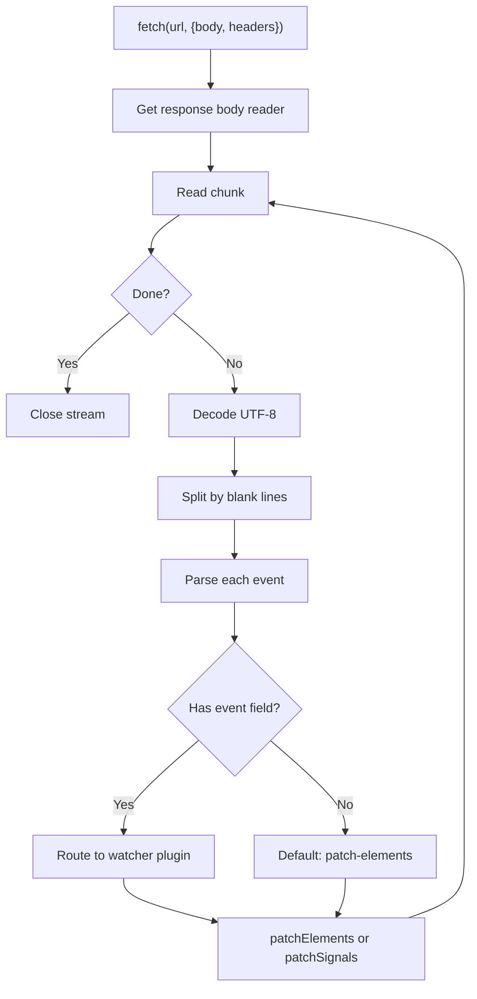

# Datastar -- SSE Streaming from Server to Client

Datastar uses Server-Sent Events (SSE) as its server-to-client communication channel. SSE is a simple HTTP-based protocol for pushing text data to the browser. Unlike WebSockets, SSE is unidirectional (server → client), automatically reconnects on disconnect, and works through proxies and firewalls without special configuration.

**Aha:** Datastar implements its own SSE client — not the browser's `EventSource` API — because `EventSource` only supports GET requests, can't send custom headers or request bodies, and can't control credentials mode. The custom implementation wraps `fetch()` and parses the `text/event-stream` response manually. This enables POST requests with signal data in the body, custom authentication headers, and fine-grained retry control.

Source: `datastar/library/src/plugins/actions/fetch.ts` — `fetchEventSource()`
Source: `datastar-rust/src/lib.rs` — `DatastarEvent` struct
Source: `datastar.http.zig/src/datastar.zig` — Zig SSE server

## SSE Protocol

SSE is a line-oriented text format with four field types:

```
event: datastar-patch-elements
data: <div id="result">Hello World</div>
id: msg-123
retry: 3000

```

- `event:` — Event type (routed to the appropriate watcher plugin)
- `data:` — Payload (can span multiple lines, each prefixed with `data:`)
- `id:` — Last-Event-ID for reconnection
- `retry:` — Reconnection delay in milliseconds
- Blank line — Delimits one event from the next

## Client-Side SSE Parser



The parser accumulates incoming bytes into a buffer and splits on double-newlines (`\n\n`). Each event block is parsed into its constituent fields:

```typescript
function parseSSE(text: string): SSEEvent[] {
  const events: SSEEvent[] = []
  let current: Partial<SSEEvent> = {}
  for (const line of text.split('\n')) {
    if (line === '') {
      if (Object.keys(current).length > 0) {
        events.push(current as SSEEvent)
        current = {}
      }
      continue
    }
    const [field, ...valueParts] = line.split(': ')
    current[field] = valueParts.join(': ')  // Handle "data: with: colons"
  }
  return events
}
```

## Retry and Reconnection

The fetch plugin implements exponential backoff retry:

```typescript
async function fetchWithRetry(url: string, options: FetchOptions, maxRetries = 10) {
  let delay = 1000  // Start at 1 second
  for (let i = 0; i < maxRetries; i++) {
    try {
      const response = await fetch(url, options)
      if (response.ok) return response
    } catch (e) {
      await sleep(delay)
      delay = Math.min(delay * 2, 30_000)  // Cap at 30s
    }
  }
  throw new Error('Max retries exceeded')
}
```

The actual constants are `retryMaxCount = 10` and `retryMaxWait = 30_000` (30 seconds cap). The server's `retry:` field can override the default backoff duration.

## Server-Side Event Generation (Rust)

Source: `datastar-rust/src/lib.rs`

```rust
pub struct DatastarEvent {
    pub event: EventType,    // PatchElements | PatchSignals
    pub id: Option<String>,  // SSE ID for replay
    pub retry: Duration,     // SSE retry duration
    pub data: Vec<String>,   // Data lines (one per "data:" prefix)
}
```

Framework integrations implement `Into<Response>`:

```rust
// Axum integration
impl IntoResponse for DatastarEvent {
    fn into_response(self) -> Response {
        let body = self.to_sse_string();
        (
            StatusCode::OK,
            [
                (CONTENT_TYPE, "text/event-stream"),
                (CACHE_CONTROL, "no-cache"),
                (CONNECTION, "keep-alive"),
            ],
            body,
        )
    }
}
```

### Event Types

| Event Type | Server Method | Client Handler | Purpose |
|------------|--------------|----------------|---------|
| `PatchElements` | `sse.patch_elements(html)` | `patchElements` | Update DOM with new HTML |
| `PatchSignals` | `sse.patch_signals(json)` | `patchSignals` | Update signal state |

`ExecuteScript` is NOT an `EventType` variant. It is a separate struct that internally converts to a `DatastarEvent` with `EventType::PatchElements`, emitting JavaScript wrapped in HTML:

```rust
// datastar-rust/src/execute_script.rs
pub struct ExecuteScript {
    pub js: String,
    pub id: Option<String>,
    pub retry: Duration,
}

impl ExecuteScript {
    pub fn to_event(self) -> DatastarEvent {
        let wrapped_html = format!("<script>{}</script>", self.js);
        DatastarEvent {
            event: EventType::PatchElements,
            id: self.id,
            retry: self.retry,
            data: vec![wrapped_html],
        }
    }
}
```

**Aha:** This design choice means the client doesn't need a special handler for script execution. The JavaScript arrives as an HTML `<script>` tag, which the DOM morph algorithm handles through its normal element-insertion path. The browser's own script parser handles execution.

### Element Patch Modes

```rust
pub enum ElementPatchMode {
    Outer,     // Replace entire element
    Inner,     // Replace element's children
    Remove,    // Remove element
    Replace,   // Replace with new element
    Prepend,   // Add before first child
    Append,    // Add after last child
    Before,    // Add before element in parent
    After,     // Add after element in parent
}
```

The mode is encoded in the SSE event and tells the client's morph algorithm how to apply the HTML.

## Server-Side Event Generation (Zig)

Source: `datastar.http.zig/src/datastar.zig`

The Zig implementation uses a buffered writer with two modes:

```zig
pub const Mode = enum { batch, sync };
```

- `batch` — Accumulates events in a buffer, sends all at response end. Good for short-lived requests.
- `sync` — Uses chunked transfer encoding, flushes after each event. Good for long-lived streaming connections.

```zig
pub fn patchElements(self: *SSE, html: []const u8, mode: PatchMode) !void {
    try self.writer.print("event: datastar-patch-elements\n", .{});
    try self.writer.print("data: mode={s}\n", .{@tagName(mode)});
    try self.writer.print("data: {s}\n\n", .{html});
    if (self.mode == .sync) try self.writer.flush();
}
```

## Signal Filtering

The client controls which signals are sent to the server via the `signals` option:

```html
<div @fetch({
  url: '/api/search',
  signals: {
    include: ['$query', '$filters.*'],
    exclude: ['$temp.*']
  }
})></div>
```

Only matching signals are serialized into the request body. This prevents sending large or sensitive data (like file contents or internal state) to the server.

## Custom Events for Loading Indicators

The fetch plugin dispatches `CustomEvent` objects on the document:

```typescript
document.dispatchEvent(new CustomEvent('datastar-fetch:start', {
  detail: { url, method, element }
}))
document.dispatchEvent(new CustomEvent('datastar-fetch:end', {
  detail: { url, method, element }
}))
```

The `indicator` attribute plugin listens to these events to show/hide loading spinners:

```html
<button data-on:click="@fetch({url: '/save'})" data-indicator>
  <span data-text="$indicator.label">Save</span>
  <div data-show="$indicator.loading" class="spinner"></div>
</button>
```

## Replicating in Rust

For a Rust server, the SSE stream is typically implemented as an async iterator:

```rust
use axum::response::sse::{Event, Sse};
use futures::stream::Stream;

async fn stream_handler() -> Sse<impl Stream<Item = Result<Event, Infallible>>> {
    let stream = async_stream::stream! {
        yield Ok(Event::default()
            .event("datastar-patch-elements")
            .data("<div id='result'>Hello</div>"));
        yield Ok(Event::default()
            .event("datastar-patch-signals")
            .data(r#"{"set": {"count": 5}}"#));
    };
    Sse::new(stream).keep_alive(
        axum::response::sse::KeepAlive::new()
            .interval(Duration::from_secs(15))
            .text("ping")
    )
}
```

For a client-side WASM implementation, you'd use `web_sys::EventSource` for simple GET-based streams or `window.fetch_with_stream()` for POST-based streams with manual SSE parsing.

See [Plugin System](03-plugin-system.md) for how SSE events trigger watcher plugins.
See [Cross-Stream Store](06-cross-stream-store.md) for how events are stored server-side.
See [Rust Equivalents](09-rust-equivalents.md) for complete server implementations.
