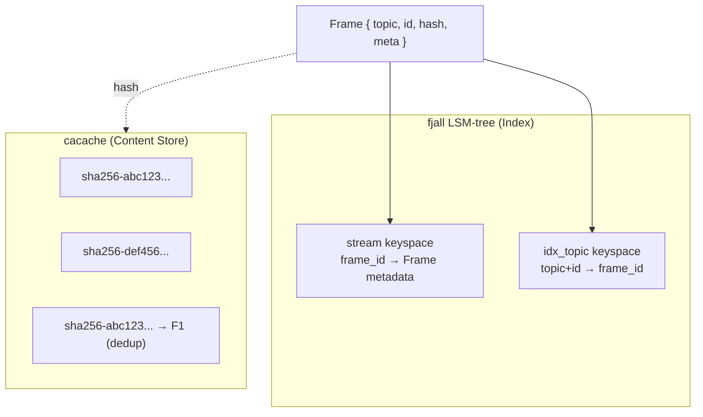

# Datastar Ecosystem -- Cross-Stream Event Store

Cross-stream (xs) is a local-first, append-only event streaming store. It provides a topic-based event log where frames are indexed by time-sorted IDs and stored in a content-addressable file system. The architecture combines an LSM-tree database for fast indexing with cacache for payload deduplication.

**Aha:** Cross-stream separates indexing from storage. The fjall LSM-tree stores lightweight Frame metadata (topic, ID, hash reference, TTL) for fast queries, while the actual payload lives in cacache — a content-addressable store keyed by SRI hash. This means identical payloads are stored exactly once, and the index can be rebuilt from the content store if corrupted. The Frame structure is just a pointer with metadata.

Source: `xs/src/store/mod.rs` — store implementation
Source: `xs/src/frame.rs` — Frame structure

## Frame Structure

```rust
// frame.rs
pub struct Frame {
    pub topic: String,                    // e.g., "user.messages", "yoke.turns"
    pub id: Scru128Id,                    // Sortable time-based ID
    pub hash: Option<ssri::Integrity>,    // CAS hash for payload
    pub meta: Option<serde_json::Value>,  // Arbitrary metadata
    pub ttl: Option<TTL>,                 // Retention policy
}
```

Each frame is an event in a topic. Topics use dot-separated hierarchical names (e.g., `user.messages`, `yoke.turns.agent1`) supporting wildcard queries.

## Scru128 IDs

Source: Scru128 crate — 128-bit sortable IDs

```
┌─────────────────┬──────────────────┬──────────────┐
│ Timestamp       │ Counter          │ Entropy      │
│ 48 bits (ms)    │ 32+32 bits       │ 32 bits      │
└─────────────────┴──────────────────┴──────────────┘
```

- **Timestamp**: Milliseconds since Unix epoch. Lexicographically sortable.
- **Counter**: Increments within the same millisecond. Handles high-throughput scenarios where multiple frames arrive in the same ms.
- **Entropy**: Random bytes for uniqueness across distributed systems.

**Aha:** Scru128 IDs are designed so that string comparison matches temporal comparison. `frame_a.id < frame_b.id` is equivalent to `frame_a.timestamp < frame_b.timestamp`. This means the LSM-tree's lexicographic key ordering automatically provides temporal ordering — no secondary index needed.

## Storage Architecture



### fjall Keyspaces

| Keyspace | Key | Value | Purpose |
|----------|-----|-------|---------|
| `stream` | Frame ID (Scru128) | Serialized Frame (JSON) | Primary frame storage |
| `idx_topic` | `{topic}\0{Scru128}` | Frame ID | Topic-based range queries |

### Content-Addressable Storage (cacache)

Source: `cacache` crate — npm's cacache ported to Rust

- Content stored by SRI (Subresource Integrity) hash
- Default: SHA-256, format `sha256-<base64>`
- Supports SHA-512 and other algorithms
- Automatic deduplication: identical content shares one file
- Integrity verification on read: hash the content, compare with key

```rust
// Writing content
let hash = cacache::write_sync(&cache_path, Some("sha-256"), payload)?;
frame.hash = Some(hash);

// Reading content with verification
let content = cacache::read_sync(&cache_path, &frame.hash.unwrap())?;
// Hash is verified automatically — if content is corrupted, read fails
```

## TTL System

```rust
pub enum TTL {
    #[default]
    Forever,          // Event kept indefinitely (the default)
    Ephemeral,        // Not persisted; only active subscribers see it
    Time(Duration),   // Auto-expire after duration
    Last(u32),        // Keep only last N frames per topic
}
```

A background GC worker scans for expired frames and removes them:
- `Forever`: Frame is kept forever (default behavior for most topics)
- `Ephemeral`: Frames are never written to disk — only in-memory active subscribers receive them
- `Time`: Frames older than their TTL are deleted
- `Last`: Only the N most recent frames per topic are kept

**Aha:** The `Last(u32)` TTL is perfect for "recent activity" topics. A topic `yoke.turns` with `TTL::Last(50)` automatically keeps only the last 50 turns, preventing unbounded growth for frequently-written topics.

## Read API

### Streaming (Async Channel)

```rust
use xs::store::{ReadOptions, FollowOption};

let options = ReadOptions::builder()
    .topic("user.*".to_string())        // Wildcard topic matching
    .follow(FollowOption::WithHeartbeat(Duration::from_secs(30)))  // Live tail with heartbeat
    .after(scru128_id)                  // Start after this ID
    .limit(100)                         // Max frames to return
    .build();

let mut channel = store.read(options).await?;
while let Some(frame) = channel.recv().await {
    // Process frame
}
```

### Synchronous Iterator

```rust
let options = ReadOptions::builder()
    .topic("yoke.turns")
    .last(10)  // Last 10 frames
    .build();

for frame in store.read_sync(options) {
    // Process frame
}
```

### Query Options

| Option | Purpose |
|--------|---------|
| `topic` | Filter by topic (supports `*` wildcards) |
| `after` | Start after this Scru128 ID |
| `from` | Start from this Scru128 ID (inclusive) |
| `limit` | Maximum number of frames |
| `last` | Return last N frames (reverse scan) |
| `follow` | `FollowOption::Off/On/WithHeartbeat(Duration)` |
| `new` | Only return frames appended after this read starts |

## HTTP API

Source: `xs/src/api.rs`

Serves over Unix domain socket or TCP with RESTful endpoints:

| Method | Path | Description |
|--------|------|-------------|
| POST | `/frames` | Append a new frame |
| GET | `/frames` | Read frames (query params: topic, after, limit, follow) |
| GET | `/frames/{id}` | Get a specific frame |
| POST | `/cas` | Write content to CAS |
| GET | `/cas/{hash}` | Read content from CAS |

## Processors

Cross-stream supports three types of reactive processors:

| Type | Purpose | Example |
|------|---------|---------|
| **Actor** | Reactive handlers on topics | "When a frame arrives on `yoke.turns`, invoke the LLM" |
| **Service** | Long-running services | "Serve the web UI on port 8080" |
| **Action** | One-shot actions | "Export the last 100 frames to JSON" |

Processors are defined as Nushell scripts stored in cross-stream topics, enabling hot-reload — updating the script topic immediately updates the processor behavior.

## Replicating in Rust

If building a similar system from scratch:

```rust
// Minimal event store
struct EventStore {
    index: Keyspace,         // fjall keyspace for frame metadata
    topic_index: Keyspace,   // fjall keyspace for topic indexing
    cache: Cache,            // cacache for payloads
}

impl EventStore {
    async fn append(&self, topic: &str, payload: &[u8]) -> Result<Frame> {
        let hash = cacache::write(&self.cache, Some("sha-256"), payload).await?;
        let frame = Frame {
            topic: topic.to_string(),
            id: Scru128Id::new(),
            hash: Some(hash),
            meta: None,
            ttl: None,
        };
        self.index.insert(&frame.id, serde_json::to_vec(&frame)?);
        self.topic_index.insert(&format!("{topic}\0{}", frame.id), frame.id.to_bytes());
        Ok(frame)
    }
}
```

**Key design decisions:**
- Use Scru128 or similar sortable IDs for temporal ordering
- Separate index from payload storage (CAS) for deduplication
- Support wildcard topic matching with prefix-based indexing
- Implement TTL with a background GC worker (not lazy deletion)

See [Yoke Agent](07-yoke-agent.md) for how cross-stream feeds the agent loop.
See [HTTP-NU](08-http-nu.md) for how Nushell handlers query cross-stream.
See [Rust Equivalents](09-rust-equivalents.md) for complete Rust implementations.
