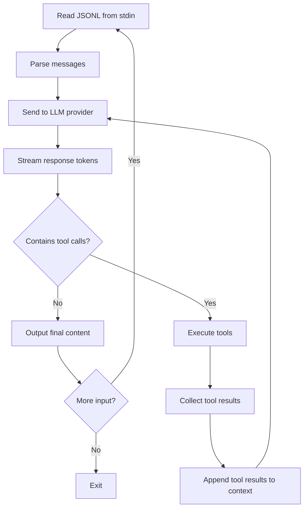
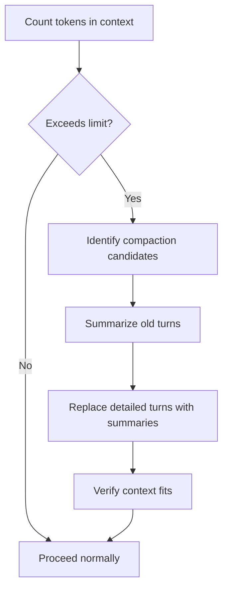

# Datastar Ecosystem -- Yoke Agent Harness

Yoke is a headless LLM agent CLI tool. It reads JSONL from stdin and writes JSONL to stdout. Each input line is a context message; each output line is either a context line (round-trippable) or an observation line (streaming delta from the LLM).

**Aha:** Yoke treats the agent loop as a unix pipe. The JSONL protocol means the agent can be composed with any unix tool: `cat conversation.jsonl | yoke | tee output.jsonl`. The agent has no persistent state on disk beyond the session file — each invocation is a single turn. This makes it trivially testable, replayable, and composable with shell pipelines.

Source: `yoke/` — headless agent CLI
Source: `yoagent-1/` — agent loop library

## JSONL Protocol

### Input Format

Each line is a JSON object with a `role` field:

```json
{"role": "system", "content": "You are a helpful assistant."}
{"role": "user", "content": "What is the weather in Tokyo?"}
{"role": "assistant", "content": "Let me check...", "tool_calls": [...]}
{"role": "tool", "tool_call_id": "call_abc", "content": "Sunny, 25°C"}
```

### Output Format

Two kinds of output lines:

```json
// Context line (round-trippable — can be fed back as input)
{"role": "assistant", "content": "The weather in Tokyo is ", "stream": true}
{"role": "assistant", "content": "sunny, 25°C.", "stream": true}

// Observation line (informational, not round-trippable)
{"observation": "tool_start", "tool": "bash", "input": "echo hello"}
{"observation": "tool_end", "tool": "bash", "output": "hello\n", "exit_code": 0}
{"observation": "turn_start", "model": "claude-sonnet-4-6"}
{"observation": "turn_end", "stop_reason": "end_turn"}
```

**Aha:** The separation between context lines and observation lines is deliberate. Context lines can be collected and fed back as the conversation history for the next turn. Observation lines are metadata about the agent's behavior — useful for logging and debugging but not part of the LLM's context.

## Agent Loop



Source: `yoagent-1/src/agent.rs` — agent loop implementation

## Multi-Provider Support

Yoke supports multiple LLM providers through a unified API:

| Provider | API Protocol | Models |
|----------|-------------|--------|
| Anthropic | Messages API | Claude Opus, Sonnet, Haiku |
| OpenAI | Completions / Responses | GPT-4, o1, o3 |
| OpenAI-compatible | Compatible endpoint | Ollama, vLLM, etc. |
| OpenAI Responses | Responses API | Structured response models |
| Azure OpenAI | Azure-hosted OpenAI | GPT-4 on Azure |
| Bedrock | AWS Bedrock API | Claude, Llama on AWS |
| Google | Google AI Studio | Gemini models |
| Google Vertex | GCP Vertex AI | Gemini on GCP |
| Mock | Testing stub | Development/testing |

Source: `yoagent-1/src/provider/mod.rs` — provider registry

The provider is selected via environment variable or CLI flag. All providers are normalized to the same message format internally.

## Tool System

Built-in tools (registered via `default_tools()`):

| Tool | Purpose | Implementation |
|------|---------|---------------|
| `bash` | Execute shell commands | `std::process::Command` with timeout |
| `read_file` | Read file contents | File I/O with path validation |
| `write_file` | Write file contents | File I/O with directory creation |
| `edit_file` | Apply edits to files | String replacement with line ranges |
| `list_files` | List directory contents | `std::fs::read_dir` |
| `search` | Search files (grep/ripgrep) | Ripgrep integration |

Tools are defined as Rust structs implementing a trait:

```rust
trait Tool {
    fn name(&self) -> &str;
    fn description(&self) -> &str;
    fn parameters(&self) -> serde_json::Value;  // JSON Schema
    fn execute(&self, input: serde_json::Value) -> BoxFuture<Result<ToolResult>>;
}
```

**Aha:** Tools execute with a timeout and their stdout/stderr is captured. The agent doesn't hang indefinitely on a slow tool. If a tool times out, the agent receives an error and can decide to retry, skip, or report the failure.

## Event Streaming

The agent emits events through a channel for observers:

```rust
// yoagent-1/src/types.rs
pub enum AgentEvent {
    AgentStart,
    AgentEnd { messages: Vec<AgentMessage> },
    TurnStart,
    TurnEnd { message: AgentMessage, tool_results: Vec<Message> },
    MessageStart { message: AgentMessage },
    MessageUpdate { message: AgentMessage, delta: StreamDelta },
    MessageEnd { message: AgentMessage },
    ToolExecutionStart { tool_call_id: String, tool_name: String, args: Value },
    ToolExecutionUpdate { tool_call_id: String, tool_name: String, partial_result: ToolResult },
    ToolExecutionEnd { tool_call_id: String, tool_name: String, result: ToolResult, is_error: bool },
    ProgressMessage { tool_call_id: String, tool_name: String, text: String },
    InputRejected { reason: String },
}
```

**Aha:** The event model distinguishes between the agent lifecycle (`AgentStart`/`AgentEnd`), turn boundaries (`TurnStart`/`TurnEnd`), individual message streaming (`MessageStart`/`Update`/`End`), and tool execution phases (`ToolExecutionStart`/`Update`/`End`). The 12-variant enum provides granular observability — the Web UI can show "tool is running" with partial results, not just "tool started" and "tool finished."

Source: `yoagent-1/src/types.rs:390-435` — `AgentEvent` enum definition

These events are used by:
- The Web UI (http-nu + Datastar) for real-time display
- Session persistence for replay
- Token counting and cost tracking

## Session Persistence and Replay

Sessions are stored as JSONL files on disk:

```
~/.config/yoke/sessions/<session-id>.jsonl
```

Each line is a JSON object — either an input message, a context line, or an observation. To replay a session, simply `cat` the file back into yoke.

## AgentSkills

Yoke supports AgentSkills — predefined skill sets that can be loaded:

```bash
yoke --skill python --skill react
```

Skills inject additional system prompt content and tool definitions. They are stored as markdown files with YAML frontmatter.

## Context Overflow Detection

The agent detects when the conversation exceeds the model's context window and triggers compaction:



Compaction preserves the most recent turns and the system prompt while summarizing older conversation. The compaction strategy is configurable.

## Sub-Agents

The agent can spawn sub-agents for delegated tasks:

```json
{"tool_call": "sub_agent", "input": {"prompt": "Analyze this code for bugs", "skill": "python"}}
```

Sub-agents run in their own process with their own context window. Results are returned as tool results to the parent agent.

## Replicating in Rust

The JSONL protocol makes yoke straightforward to replicate:

```rust
use serde::{Deserialize, Serialize};
use tokio::io::{AsyncBufReadExt, AsyncWriteExt, BufReader};

#[derive(Deserialize)]
enum Role { System, User, Assistant, Tool }

#[derive(Deserialize)]
struct Message {
    role: Role,
    content: String,
    tool_calls: Option<Vec<ToolCall>>,
}

#[derive(Serialize)]
enum Output {
    Context { role: String, content: String, stream: bool },
    Observation { observation: String, tool: Option<String> },
}

async fn run_agent(messages: Vec<Message>) -> Result<()> {
    let client = AnthropicClient::new();
    let mut stream = client.create_message_stream(&messages).await?;

    while let Some(delta) = stream.next().await {
        let output = Output::Context {
            role: "assistant".to_string(),
            content: delta.text,
            stream: true,
        };
        println!("{}", serde_json::to_string(&output)?);
    }

    Ok(())
}
```

For the CLI wrapper:

```rust
#[tokio::main]
async fn main() -> Result<()> {
    let stdin = tokio::io::stdin();
    let reader = BufReader::new(stdin);
    let mut lines = reader.lines();

    let mut messages = Vec::new();
    while let Some(line) = lines.next_line().await? {
        let msg: Message = serde_json::from_str(&line)?;
        messages.push(msg);
    }

    run_agent(messages).await
}
```

See [Cross-Stream Store](06-cross-stream-store.md) for how events feed into yoke.
See [HTTP-NU](08-http-nu.md) for how yoke's web UI works.
See [Rust Equivalents](09-rust-equivalents.md) for complete agent implementations.
