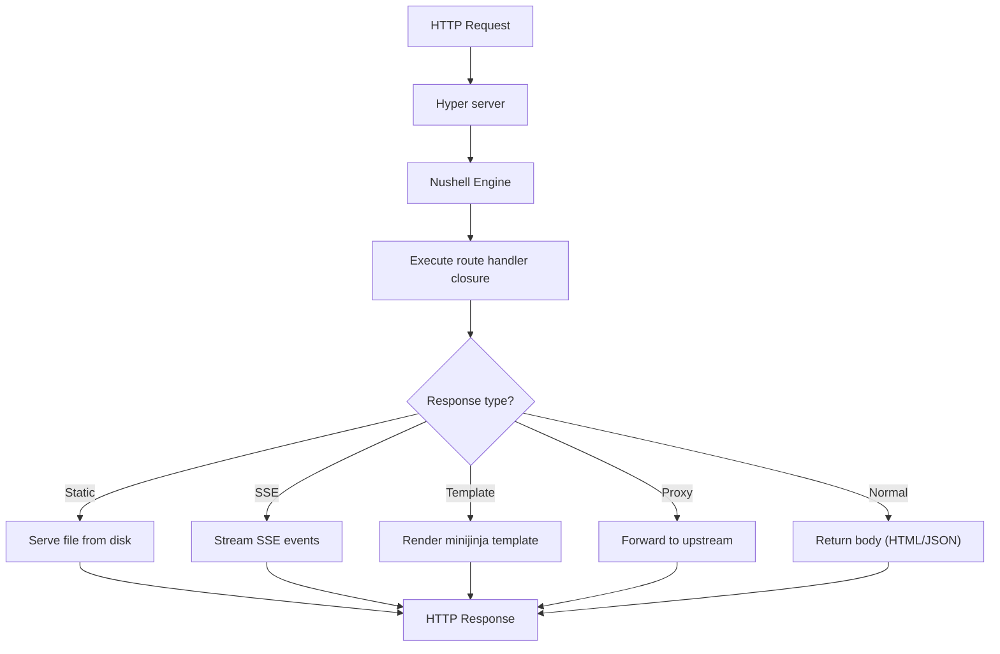

# Datastar Ecosystem -- HTTP-NU Server

http-nu is a Nushell-scriptable HTTP server. Route handlers are Nushell closures — each HTTP request becomes a Nushell pipeline that produces a response. It embeds the full Nushell engine and registers custom commands for static serving, reverse proxying, SSE streaming, template rendering, and cross-stream integration.

**Aha:** http-nu doesn't compile routes to binary code. Every request goes through the Nushell interpreter. This means you can hot-reload route handlers by updating a Nushell script in the cross-stream store — no server restart needed. The tradeoff is ~1-5ms interpretation overhead per request, which is negligible for UI-serving applications but significant for high-throughput APIs.

Source: `http-nu/src/engine.rs` — Nushell engine setup
Source: `http-nu/src/handler.rs` — HTTP request handling
Source: `http-nu/src/store.rs` — Topic-backed handlers

## Architecture



## Custom Nushell Commands

http-nu extends Nushell with domain-specific commands:

| Command | Purpose | Example |
|---------|---------|---------|
| `.static` | Serve static files | `.static "public/"` |
| `to sse` | Convert pipeline output to SSE (note: no leading dot, space in name) | `... \| to sse` |
| `.reverse-proxy` | Proxy to upstream | `.reverse-proxy "http://localhost:3000"` |
| `.mj` | Render minijinja template | `.mj "templates/home.html" $ctx` |
| `.mj compile` | Compile a template into the engine | `.mj compile $tpl_str` |
| `.mj render` | Render a compiled template | `.mj render "home" $ctx` |
| `.highlight` | Syntax highlight code | `.highlight "rust" $code` |
| `.highlight theme` | Set syntax highlighting theme | `.highlight theme "dracula"` |
| `.highlight lang` | Register a syntax language | `.highlight lang "mylang" $grammar` |
| `.md` | Render markdown to HTML | `.md $content` |
| `print` | Print response body (bare command, no leading dot) | `print $html` |
| `.cat` | Read from cross-stream topic | `.cat "yoke.turns" \| last 10` |
| `.append` | Append to cross-stream topic | `.append "chat.messages" $msg` |
| `.cas` | Content-addressable storage ops | `.cas get sha256-abc...` |
| `.last` | Get last N frames from topic | `.last "events" 5` |
| `.get` | Get specific frame by ID | `.get "events" $id` |
| `.remove` | Remove frame from topic | `.remove "events" $id` |
| `.scru128` | Generate Scru128 IDs | `.scru128` |

**Aha:** The naming is intentional. `to sse` follows Nushell's `to json`, `to csv` convention for format conversion — it has no leading dot and uses a space. `print` is a bare command without a dot, matching Nushell's core output semantics. All other custom commands use the `.prefix` convention to namespace them as http-nu-specific extensions.

## Embedded Datastar Bundle

Source: `http-nu/src/handler.rs`

The server embeds the Datastar JavaScript bundle and serves it at `/datastar@1.0.1.js`:

```rust
// Built-in route: serves Datastar JS bundle
if path == "/datastar@1.0.1.js" {
    // Serve brotli-compressed embedded bundle
    let compressed = BrotliStream::compress(INCLUDED_DATASTAR_JS);
    return Response::builder()
        .header("Content-Type", "application/javascript")
        .header("Content-Encoding", "br")
        .body(compressed);
}
```

This means Datastar clients load the framework from the same server that serves the application — no CDN dependency.

## Route Handler Model

Routes are defined as Nushell closures stored in cross-stream topics:

```nushell
# Handler stored in cross-stream topic "handlers.home"
{|req|
    let $query = ($req | get query? | default {})
    let $results = (.cat "search.index" | where url == $query.q)
    .mj "templates/search.html" { results: $results }
}
```

The handler receives a request record and returns a response. Hot-reload works by watching the cross-stream topic for handler updates and recompiling the Nushell engine state.

## Response Types

```rust
enum ResponseType {
    Normal { body: String, content_type: String },
    Static { path: PathBuf },
    SSE { stream: SseStream },
    Proxy { upstream: Url },
}
```

### SSE Response

The `to sse` command converts pipeline output to SSE events:

```nushell
{|req|
    generate {|_|
        let $frame = (.cat "events" | last 1)
        { event: "datastar-patch-elements", data: $frame.payload }
    } | to sse
}
```

This creates a long-lived SSE connection that pushes new events as they arrive in the cross-stream topic.

## Request Body Streaming

Source: `http-nu/src/handler.rs`

For large request bodies (file uploads, large JSON payloads), the body is streamed into the Nushell pipeline:

```rust
// Request body becomes a Nushell value
let body_value = read_body_stream(request).await?;
pipeline.add_input(Value::Binary { val: body_value, span });
```

## Compression

Response bodies are compressed with brotli:

```rust
struct BrotliStream {
    encoder: BrotliEncoder,
}
```

Brotli provides better compression ratios than gzip for text content (HTML, JSON, JavaScript). The Datastar bundle itself is pre-compressed at build time and embedded as brotli bytes.

## VFS Modules

http-nu supports virtual filesystem modules backed by cross-stream:

```nushell
# Nushell modules stored in cross-stream topics
use std "handlers/utils"  # Resolves to topic "vfs.std.handlers.utils"
```

This enables a module system where code lives in the event store rather than on disk, supporting hot-reload at the module level.

## Replicating in Rust

A Rust-native equivalent would use a routing framework with dynamic handlers:

```rust
use axum::{Router, routing::get, extract::State, response::IntoResponse};

#[derive(Clone)]
struct AppState {
    store: EventStore,
    templates: TemplateEngine,
}

async fn home_handler(
    State(state): State<AppState>,
    Query(params): Query<HashMap<String, String>>,
) -> impl IntoResponse {
    let results = state.store.read("search.index", &params).await?;
    let html = state.templates.render("home", &results)?;
    (StatusCode::OK, [(CONTENT_TYPE, "text/html")], html)
}

let app = Router::new()
    .route("/", get(home_handler))
    .route("/datastar.js", get(serve_datastar_bundle))
    .with_state(AppState { store, templates });
```

The key difference: in Rust, routes are compiled into the binary. Hot-reload would require dynamic script loading (e.g., via `libloading` for native code or embedding a scripting language like Rhai).

See [Cross-Stream Store](06-cross-stream-store.md) for how handlers are stored.
See [SSE Streaming](05-sse-streaming.md) for how SSE responses work.
See [Rust Equivalents](09-rust-equivalents.md) for complete server patterns.
