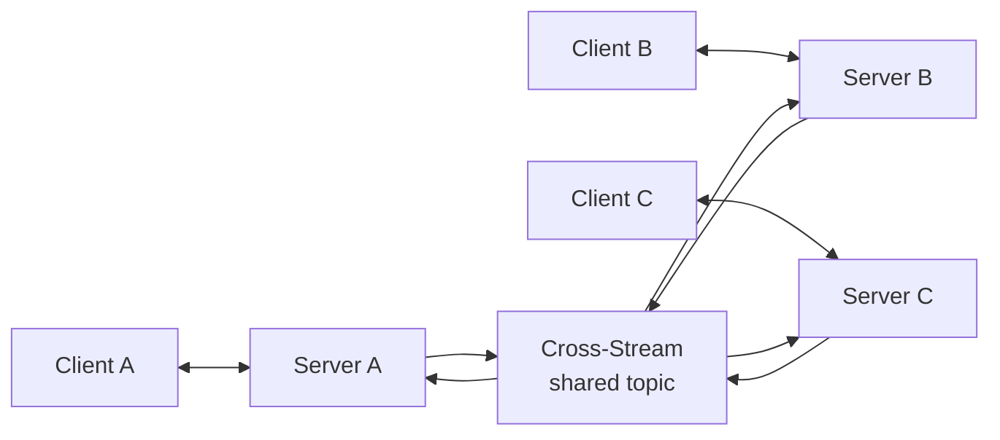

# Datastar Ecosystem -- Production Patterns

This document covers what it takes to run the Datastar ecosystem in production: reliability, observability, scaling, security, and operational concerns.

**Aha:** Datastar's zero-build-step philosophy is great for development but requires careful consideration in production. The Datastar JS bundle is served inline — you need to pin the version, add SRI hashes for integrity checks, and consider caching strategy. The SSE connections are long-lived — you need connection limits, heartbeat timeouts, and graceful degradation when connections drop.

## Reliability

### SSE Connection Management

Long-lived SSE connections consume server resources. Production systems need:

```rust
// Connection limit per client
struct ConnectionTracker {
    connections: DashMap<SocketAddr, usize>,
    max_per_client: usize,
}

impl ConnectionTracker {
    fn can_connect(&self, addr: &SocketAddr) -> bool {
        self.connections.get(addr)
            .map(|c| *c < self.max_per_client)
            .unwrap_or(true)
    }
}
```

- **Heartbeat**: Send `ping` events every 15-30 seconds to detect dead connections
- **Timeout**: Close connections idle for >60 seconds
- **Reconnection**: Client uses exponential backoff with jitter (`delay = base * 2^retry + random(0, 1000ms)`)
- **Idempotency**: SSE events include an `id` field — clients that reconnect with `Last-Event-ID` header should resume from that point

### Event Store Durability

Cross-stream uses fjall (LSM-tree) which is crash-safe by default. Additional safeguards:

```rust
// PersistMode for durability vs performance tradeoff
enum PersistMode {
    Immediate,   // fsync after every write (safe, slow)
    Batch,       // fsync every N writes or every T seconds
    Lazy,        // OS flush (fast, risk of data loss on crash)
}
```

- **Immediate**: Use for financial/audit data
- **Batch**: Default for most workloads — fsync every 100ms or 1000 writes
- **Lazy**: Acceptable for ephemeral/derived data

### Agent Tool Sandboxing

Yoke's `bash` and `nu` tools execute arbitrary commands. Production sandboxing:

| Measure | Implementation | Effectiveness |
|---------|---------------|---------------|
| Timeout | `tokio::time::timeout(Duration, cmd)` | Prevents hangs |
| Memory limit | `cgroups` or container memory limit | Prevents OOM |
| Network isolation | Container without network namespace | Prevents exfiltration |
| Filesystem isolation | Chroot or container with read-only root | Prevents data access |
| Capability dropping | `prctl(PR_SET_NO_NEW_PRIVS)` | Prevents privilege escalation |

## Observability

### Metrics

Key metrics to expose:

| Metric | Type | Labels | Purpose |
|--------|------|--------|---------|
| `datastar_sse_connections` | Gauge | `endpoint` | Active SSE connection count |
| `datastar_sse_duration_seconds` | Histogram | `endpoint` | SSE connection duration |
| `xs_frames_appended_total` | Counter | `topic` | Frames written per topic |
| `xs_frame_read_latency_seconds` | Histogram | `topic` | Read latency distribution |
| `agent_turn_duration_seconds` | Histogram | `model`, `tool` | Agent turn latency |
| `agent_tokens_total` | Counter | `model` | Token usage for cost tracking |
| `agent_tool_calls_total` | Counter | `tool`, `status` | Tool call success/failure rate |

### Tracing

Each SSE event should carry a trace ID:

```rust
struct TracedDatastarEvent {
    event: DatastarEvent,
    trace_id: String,        // OpenTelemetry trace ID
    span_id: String,         // Current span ID
    parent_span_id: String,  // Parent span (request that generated this event)
}
```

The trace flows from HTTP request → Nushell handler → SSE event → client render. This connects server-side processing to client-side rendering.

### Logging

Structured logging with JSON output:

```json
{"timestamp": "2026-05-04T10:00:00Z", "level": "info", "message": "SSE connection established", "client": "192.168.1.1:8080", "endpoint": "/api/stream"}
{"timestamp": "2026-05-04T10:00:01Z", "level": "warn", "message": "Agent tool timeout", "tool": "bash", "timeout_ms": 30000}
```

## Scaling

### Horizontal Scaling

Datastar's SSE connections are stateful — each connection is tied to a specific server instance. Horizontal scaling requires:

1. **Sticky sessions**: Load balancer routes the same client to the same server
2. **Event distribution**: When an event is generated on server A, it must reach clients connected to server B. Use cross-stream topics as the distribution channel:



Each server:
1. Publishes events to the shared cross-stream topic
2. Subscribes to the topic for events published by other servers
3. Forwards subscribed events to its local SSE clients

### Connection Pooling

For high-throughput systems, pool SSE connections to the event store:

```rust
struct SseConnectionPool {
    connections: Vec<SseConnection>,
    max_size: usize,
}
```

## Security

### Signal Filtering

The `signals: { include, exclude }` mechanism prevents sensitive data from reaching the server. Production configuration:

```typescript
signals: {
  include: ['$search.*', '$form.*'],  // Only these signals
  exclude: ['$password', '$token', '$secret.*'],  // Never send these
}
```

### Content Security Policy

Datastar evaluates expressions as JavaScript `Function` objects. Production CSP:

```
Content-Security-Policy: script-src 'self' 'unsafe-eval'; connect-src 'self'
```

Note: `'unsafe-eval'` is required because Datastar uses `new Function()` for expression compilation. If this is unacceptable, pre-compile expressions at build time.

### SRI for Datastar Bundle

```html
<script src="/datastar@1.0.1.js"
  integrity="sha384-abcdef..."
  crossorigin="anonymous"></script>
```

The brotli-compressed bundle embedded in http-nu should have its SRI hash computed at build time and included in the HTML template.

## Error Handling

### Client-Side Errors

```typescript
document.addEventListener('datastar-fetch:error', (e) => {
  const { url, error, retryCount } = e.detail;
  // Show error UI, log to telemetry
});
```

### Server-Side Errors

Nushell handlers should return structured error responses:

```nushell
{|req|
    try {
        # handler logic
    } catch {
        { status: 500, body: (to-json {error: "Internal server error"}) }
    }
}
```

### Agent Errors

```rust
match tool.execute(input).await {
    Ok(result) => Ok(result),
    Err(ToolError::Timeout(d)) => {
        // Log timeout, return error to agent
        Ok(ToolResult::Error(format!("Tool timed out after {:?}", d)))
    }
    Err(ToolError::Permission(e)) => {
        // Log permission denied, don't expose details to agent
        Ok(ToolResult::Error("Permission denied".to_string()))
    }
}
```

See [SSE Streaming](05-sse-streaming.md) for SSE retry and reconnection.
See [Cross-Stream Store](06-cross-stream-store.md) for event store durability.
See [Rust Equivalents](09-rust-equivalents.md) for Rust implementation patterns.
