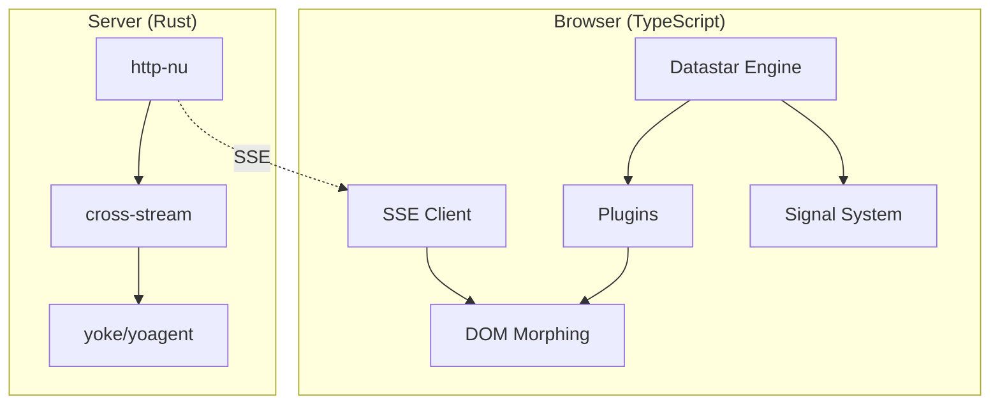

# Datastar Ecosystem -- WASM and Web Patterns

This document covers how the Datastar ecosystem interacts with WASM and the web platform, including what runs natively in the browser, what could be ported to WASM, and the tradeoffs involved.

**Aha:** The current Datastar ecosystem has no WASM components — it is pure TypeScript in the browser and Rust on the server. However, several components are natural candidates for WASM porting: the signal system's expression compiler (genRx), the DOM morphing algorithm's tree diffing, and the agent loop's tool execution sandbox. WASM would bring type safety and performance to the client side while maintaining the zero-build-step philosophy if the WASM module is served alongside the JS bundle.

## Current Web Architecture



## Components Suitable for WASM

### 1. Expression Compiler (genRx)

Currently uses `new Function()` to compile attribute expressions:

```typescript
// Current: eval-based
const fn = new Function('return $["count"]() + 1');
```

WASM alternative using a Rust expression parser and evaluator:

```rust
// WASM: parsed and evaluated expression
#[wasm_bindgen]
pub fn evaluate_expression(expr: &str, state: &JsValue) -> JsValue {
    let ast = parse(expr).unwrap();
    let ctx = ExpressionContext::from_js(state);
    let result = ast.evaluate(&ctx).unwrap();
    result.to_js()
}
```

**Benefits:**
- No `unsafe-eval` CSP requirement
- Type-safe expression evaluation
- Better error messages with source locations
- Sandboxed execution (WASM can't access DOM or network)

**Tradeoffs:**
- Larger initial download (WASM binary ~50-200KB)
- Expression syntax may differ from JavaScript
- Need to maintain Rust and TypeScript parsers in sync

### 2. DOM Morphing Algorithm

Currently operates on web-sys DOM directly. A WASM version would operate on a virtual DOM representation:

```rust
#[wasm_bindgen]
pub struct MorphResult {
    ops: Vec<DomOp>,
}

#[wasm_bindgen]
pub fn compute_morph(old_html: &str, new_html: &str) -> MorphResult {
    let old = parse_html(old_html);
    let new = parse_html(new_html);
    let ops = morph(&old, &new);
    MorphResult { ops }
}

impl MorphResult {
    fn apply(&self, element: &web_sys::Element) {
        for op in &self.ops {
            op.apply(element);
        }
    }
}
```

**Benefits:**
- Faster diff computation for large trees
- Deterministic behavior across browsers
- Testable without a browser

**Tradeoffs:**
- HTML parsing overhead
- Additional serialization between WASM and JS
- Web-sys DOM operations are still needed for final application

### 3. Signal Store

A WASM signal store would provide reactive state management:

```rust
#[wasm_bindgen]
pub struct SignalStore {
    signals: HashMap<String, JsValue>,
    subscribers: HashMap<String, Vec<js_sys::Function>>,
}

#[wasm_bindgen]
impl SignalStore {
    pub fn new() -> Self { Self::default() }

    pub fn get(&self, name: &str) -> Option<JsValue> {
        self.signals.get(name).cloned()
    }

    pub fn set(&mut self, name: &str, value: JsValue) {
        if let Some(old) = self.signals.insert(name.to_string(), value.clone()) {
            if old != value {
                if let Some(subs) = self.subscribers.get(name) {
                    for sub in subs {
                        sub.call0(&JsValue::NULL).unwrap();
                    }
                }
            }
        }
    }

    pub fn on_change(&mut self, name: &str, callback: js_sys::Function) {
        self.subscribers.entry(name.to_string())
            .or_default().push(callback);
    }
}
```

## WASM Build Configuration

```toml
# Cargo.toml
[lib]
crate-type = ["cdylib", "rlib"]

[dependencies]
wasm-bindgen = "0.2"
wasm-bindgen-futures = "0.4"
web-sys = { version = "0.3", features = ["Element", "Document"] }
js-sys = "0.3"
console_error_panic_hook = "0.1"
```

Build with:
```bash
wasm-pack build --target web
```

## WASM Loading in Browser

```typescript
// Load WASM module alongside Datastar
const wasm = await import('./datastar_wasm_bg.wasm');
await init(wasm);

// Use WASM-compiled expression compiler
const result = wasm.evaluate_expression('$count + 1', state);
```

## Web-Specific Considerations

### Memory Management

WASM has its own linear memory. Data passed between JS and WASM must be copied or use shared memory:

```rust
// Efficient: pass string reference (no copy for small strings)
#[wasm_bindgen]
pub fn parse_expression(expr: &str) -> Result<Expression, String> {
    // ...
}

// For large data: use shared ArrayBuffer
#[wasm_bindgen]
pub fn morph_buffers(old: &[u8], new: &[u8]) -> Vec<u8> {
    // ...
}
```

### Threading

WASM threading requires `SharedArrayBuffer` and specific HTTP headers:

```
Cross-Origin-Opener-Policy: same-origin
Cross-Origin-Embedder-Credential: require
```

These headers are not always available (e.g., behind some CDNs). The current Datastar implementation avoids threading entirely — all work happens on the main thread.

### Service Workers

A service worker could cache the Datastar bundle and pre-fetch SSE data:

```javascript
// Service worker
self.addEventListener('fetch', (event) => {
  if (event.request.url.endsWith('/datastar@1.0.1.js')) {
    event.respondWith(caches.match('datastar-bundle'));
  }
});
```

### Web Components

Datastar's plugin architecture could be exposed as Web Components:

```html
<datastar-app>
  <template data-effect="console.log($count())">
    <span data-text="$count">0</span>
    <button data-on:click="count(count() + 1)">Increment</button>
  </template>
</datastar-app>
```

The Web Component would encapsulate the Datastar engine and provide a shadow DOM boundary.

See [Plugin System](03-plugin-system.md) for the current plugin architecture.
See [DOM Morphing](04-dom-morphing.md) for the morphing algorithm.
See [Rust Equivalents](09-rust-equivalents.md) for Rust implementation patterns.
