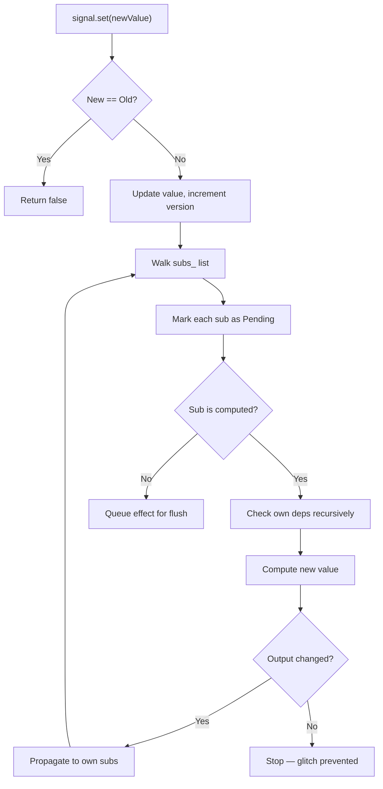
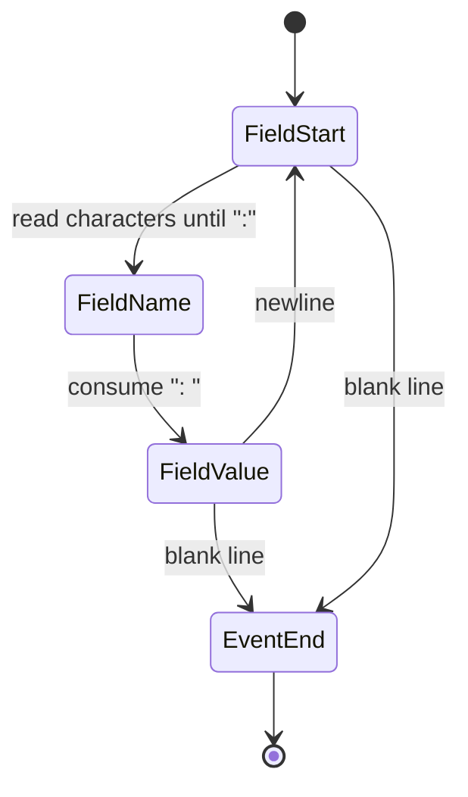
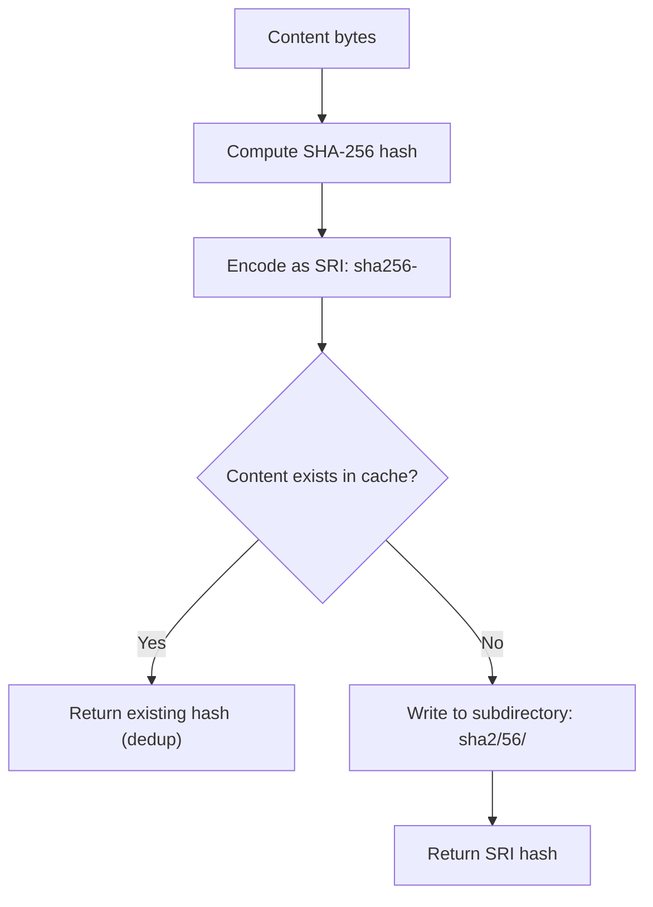
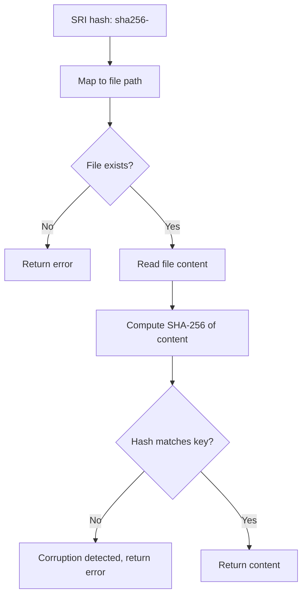

# Datastar Ecosystem -- Algorithms Deep Dive

This document provides a detailed analysis of the core algorithms used across the Datastar ecosystem: the reactive signal propagation, DOM morphing complexity, SSE parsing, Scru128 ID generation, and CAS content addressing.

**Aha:** The signal system's lazy propagation is the most performance-critical algorithm in Datastar. It achieves O(1) reads and O(d) effect recomputation (where d = number of direct dependencies) by maintaining a doubly-linked dependency graph and only propagating dirtiness when values actually change. The key insight is that not all dirty signals need recomputation — a computed signal that depends on a dirty upstream signal may still produce the same output value, in which case propagation stops. This is called "glitch freedom" and requires careful topological ordering.

## Signal Propagation Algorithm

### Push-Pull with Glitch Freedom



**Complexity analysis:**
- Write: O(d) where d = number of direct subscribers
- Read: O(1) — just return value
- Effect flush: O(d) per effect where d = number of dependencies
- Diamond dependency: O(n) where n = number of unique nodes affected (not O(n²))

The diamond case:
```
    A (effect)
   / \
  B   C (computed)
   \ /
    D (signal)
```

When D changes:
1. D marks B and C as Pending
2. B computes: output changed → marks A as Dirty
3. C computes: output unchanged → stops propagation (A already marked)
4. Effect A runs once

Without glitch freedom, A would be recomputed twice (once for B, once for C). With it, A runs once.

## DOM Morphing Algorithm

### Complexity

The morph algorithm operates on two trees: old and new.

| Scenario | Complexity | Explanation |
|----------|-----------|-------------|
| All elements have unique IDs | O(n) | Each element matched via pantry HashMap lookup |
| No elements have IDs | O(n) | Positional matching, single pass |
| Partial IDs, some elements move | O(n × d) | d = max tree depth for descendant ID search |
| Worst case (all IDs, all moved) | O(n × d) | Each element searched in old tree |

**Aha:** The morph algorithm's O(n × d) worst case is rare in practice because most web UIs have stable IDs for key elements (list items, form fields, containers). The pantry HashMap provides O(1) lookup for ID-matched elements, and the remaining elements are matched positionally in a single pass.

### Persistent Element Handling

```
Old DOM:                    New DOM:
div#root                    div#root
├── div#header              ├── span#message  (new)
└── p#message               └── div#header    (moved)
```

The pantry contains `{"header": <div#header>, "message": <p#message>}`.
Processing new children:
1. `<span#message>` — not in pantry (it's a `span`, pantry has `p#message`), insert new
2. `<div#header>` — found in pantry, morph (no change needed, same element)
3. After processing: pantry still has `{"message": <p#message>}` — remove it (it disappeared)

## SSE Parsing Algorithm

### State Machine



The parser is a simple state machine:

1. **FieldStart**: Read characters until `:` or newline
   - If `:`, transition to FieldName (captured the field name)
   - If newline, blank line → event end
   - If empty line, skip
2. **FieldValue**: Read until newline. Append to current field value (handles multi-line `data:` fields).
3. **EventEnd**: Parse accumulated fields into an event. Reset for next event.

**Complexity:** O(n) where n = number of bytes in the stream. Each byte is read once and processed in constant time.

## Scru128 ID Generation

### Algorithm

```
┌─────────────────┬──────────────────┬──────────────┐
│ Timestamp       │ Counter          │ Entropy      │
│ 48 bits (ms)    │ 32+32 bits       │ 32 bits      │
└─────────────────┴──────────────────┴──────────────┘
```

1. Get current time in milliseconds (48 bits)
2. If time == last_time, increment counter. Otherwise reset counter to 0.
3. Generate 32 random bits for entropy
4. Encode as 25-character alphanumeric string (base-36)

**Collision probability:** With 64 bits of counter + entropy, the birthday bound is ~2^32 IDs per millisecond before 50% collision probability. In practice, the counter handles up to 2^32 IDs/ms and entropy adds another 2^32 bits of uniqueness.

**Sorting guarantee:** Since the timestamp is the most significant component, string comparison of Scru128 IDs equals temporal comparison. `id_a < id_b` iff `timestamp_a < timestamp_b` or `(timestamp_a == timestamp_b && counter_a < counter_b)`.

## CAS (Content-Addressable Storage)

### Write Path



### Read Path with Verification



**Complexity:**
- Write: O(n) for hashing + O(n) for writing = O(n)
- Read: O(n) for reading + O(n) for verification = O(n)
- Dedup: O(1) — just check if file exists

**Aha:** The CAS design means content corruption is always detected. If a bit flips on disk, the SHA-256 of the corrupted content won't match the SRI key, and the read fails. This is stronger than a CRC checksum because the key itself is the hash — there's no separate metadata that could also be corrupted.

## Nushell Pipeline Execution

Source: `http-nu/src/engine.rs`

The Nushell engine executes route handlers as pipelines:

```
Request → Parse → Pipeline → Evaluate → Response
```

Each stage:
1. **Parse**: Convert Nushell source to AST
2. **Evaluate**: Walk AST, executing each command
3. **Pipeline**: Connect command outputs to inputs via channel

**Complexity:** O(n × m) where n = pipeline length, m = average command cost. Most commands are O(1) or O(k) where k = input size. The `.cat` command that reads from cross-stream is the most expensive at O(log N) for topic index lookup.

See [Reactive Signals](02-reactive-signals.md) for the signal system details.
See [DOM Morphing](04-dom-morphing.md) for the morph algorithm.
See [Cross-Stream Store](06-cross-stream-store.md) for the CAS implementation.
