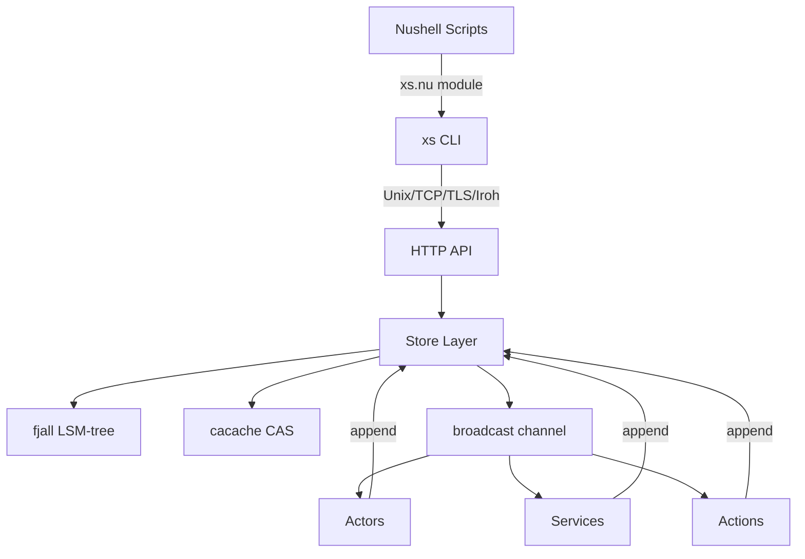

# xs (cross.stream) -- Overview

## What Is xs?

xs is a local-first event streaming store written in Rust. Think of it as a miniature Kafka for your local machine — an append-only log where every event is a **Frame** with a time-ordered ID, an optional content-addressed payload, and a hierarchical topic. Built for reactive scripting with Nushell, it powers the Datastar ecosystem's backend infrastructure.

## Core Concepts

### Frames

The atomic unit of data. Every frame has:
- A **SCRU128 ID** (128-bit, time-ordered, globally unique)
- A **topic** (hierarchical dot-separated string, e.g. `user.messages`)
- An optional **hash** pointing to content in the CAS (content-addressable store)
- Optional inline **meta** (JSON)
- An optional **TTL** (time-to-live policy)

### Content-Addressable Storage (CAS)

Large payloads live in CAS (using npm's `cacache` format). Frames reference content by SRI hash (`sha256-<base64>`). Identical content is deduplicated automatically.

### Processors

Three reactive patterns for handling events:
- **Actors** — Stateful reducers: accumulate state across frames, emit output
- **Services** — Long-running background processes with auto-restart and duplex communication
- **Actions** — Stateless request/response handlers

All processors are scripted in Nushell closures.

### Transport

API served over HTTP/1.1 on multiple transports:
- Unix domain socket (default, local)
- TCP (plain HTTP)
- TLS (rustls)
- Iroh (QUIC-based P2P via relay servers)

## Key Dependencies

| Crate | Version | Role |
|-------|---------|------|
| fjall | 3.0.1 | LSM-tree database for frame indexing |
| cacache | 13 | Content-addressable storage |
| scru128 | 3 | Time-ordered unique IDs |
| hyper | 1 | HTTP server/client |
| tokio | latest | Async runtime |
| iroh | 0.91.2 | QUIC P2P networking |
| nu-cli/command/protocol/engine/parser | 0.112.1 | Embedded Nushell |
| ssri | 9.2.0 | Subresource Integrity hashes |
| rustls/tokio-rustls | latest | TLS |
| clap | 4 | CLI parsing |

## System Boundaries

## Design Philosophy

1. **Append-only** — Never mutate, only append and expire. GC handles TTL enforcement.
2. **Content-addressed** — Deduplication for free. Hash-verified integrity.
3. **Script-first** — All business logic in Nushell closures. Rust handles the plumbing.
4. **Transport-agnostic** — Same HTTP API whether local (UDS), networked (TCP/TLS), or peer-to-peer (Iroh).
5. **Local-first** — Works offline. P2P sync optional.
