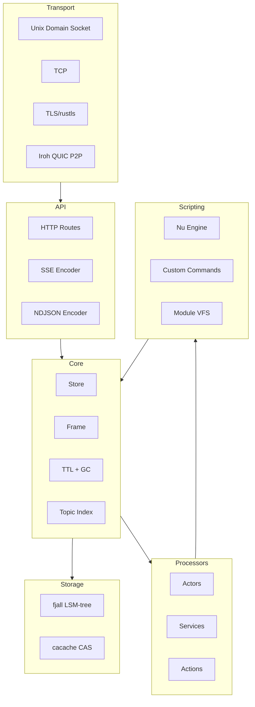
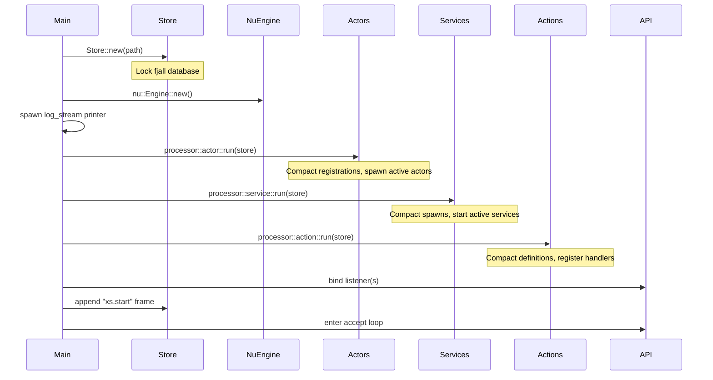

# xs -- Architecture

## Module Layout

**File**: `src/lib.rs`

```rust
pub mod api;        // HTTP route handlers
pub mod client;     // Client connection types and methods
pub mod error;      // Error types (boxed dyn Error)
pub mod listener;   // Transport abstraction (Unix/TCP/Iroh)
pub mod nu;         // Nushell engine, commands, VFS
pub mod processor;  // Actor/Service/Action processors
pub mod scru128;    // SCRU128 ID generation and manipulation
pub mod store;      // Core store: fjall + cacache + broadcast
pub mod trace;      // Custom tracing subscriber
```

## Layer Decomposition



## Dependency Graph (Cargo.toml)

```
cross-stream (xs)
├── Storage
│   ├── fjall 3.0.1 (LSM-tree: stream keyspace + topic index keyspace)
│   ├── cacache 13 (content-addressable storage)
│   └── ssri 9.2.0 (SRI hash generation/verification)
├── IDs
│   └── scru128 3 (time-ordered 128-bit IDs)
├── Networking
│   ├── hyper 1 (HTTP/1.1)
│   ├── http-body-util (body streaming)
│   ├── tokio (async runtime, full features)
│   ├── iroh 0.91.2 (QUIC P2P)
│   ├── rustls / tokio-rustls (TLS)
│   └── webpki-roots (root certificates)
├── Nushell (all 0.112.1)
│   ├── nu-cli
│   ├── nu-command
│   ├── nu-protocol
│   ├── nu-engine
│   └── nu-parser
├── Serialization
│   ├── serde / serde_json
│   └── base64 0.22
├── CLI
│   ├── clap 4 (argument parsing)
│   └── console (terminal styling)
├── Build
│   └── bon 2.3 (builder pattern derive)
└── Platform
    ├── nix 0.29 (Unix pipe detection)
    └── tokio-util (CancellationToken)
```

## Server Startup Sequence

**File**: `src/main.rs`



## Shutdown Sequence

1. SIGINT received (tokio signal handler)
2. Append `xs.stopping` frame to store
3. Wait up to 3 seconds for services to drain
4. Process exits

## Concurrency Model

- **Main thread**: tokio multi-thread runtime (accept loop, API handlers)
- **GC worker**: Dedicated OS thread (`std::thread::spawn`) processing GC tasks via unbounded mpsc channel
- **Actor workers**: Each actor gets a dedicated OS thread (via `EngineWorker`) because Nushell's `EngineState` is not `Send`
- **Service runners**: Each service runs its closure on a dedicated OS thread
- **Store access**: `Arc<Store>` shared across all tasks. The `append_lock` mutex serializes appends.
- **Live streaming**: `broadcast::channel` (capacity 100) fans out to all followers

## Key Architectural Decisions

1. **OS threads for Nushell** — Nushell's engine state isn't thread-safe. Each processor gets its own thread with an mpsc channel for work items.
2. **fjall for indexing, cacache for content** — Separation of concerns. Index is small (keys + empty values), content can be large. Different storage engines optimized for each.
3. **Append serialization** — Single mutex for all appends ensures SCRU128 monotonicity (IDs always increase within a store).
4. **Broadcast for live events** — tokio broadcast channel with capacity 100. Lagging receivers get `RecvError::Lagged` and catch up from the store.
5. **Historical + Live deduplication** — When following, subscribe to broadcast BEFORE reading historical data. After historical read completes, deduplicate frames seen in both by comparing IDs.
