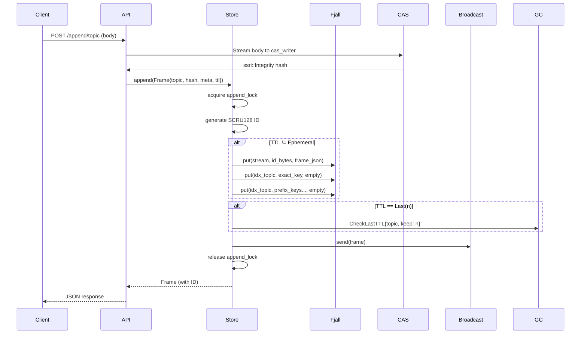
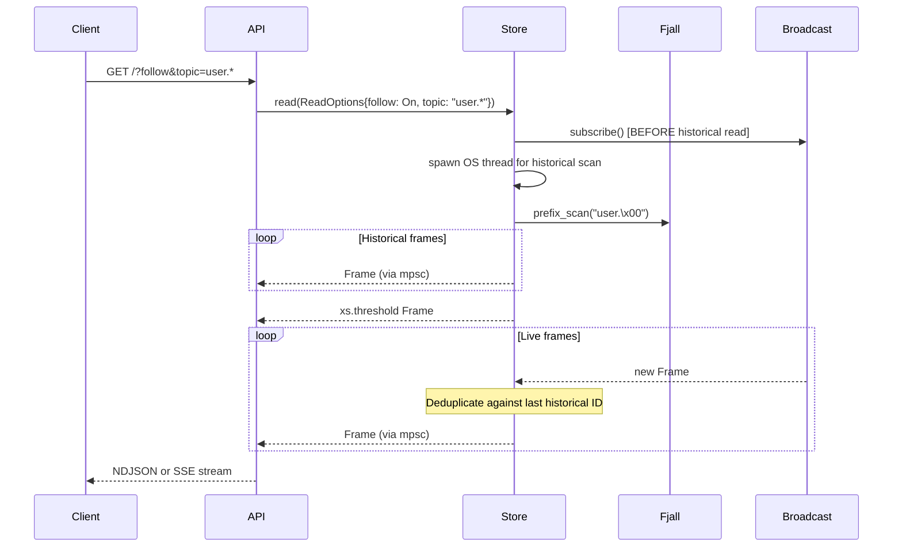

# xs -- Storage Engine

## On-Disk Layout

```
<store_path>/
├── fjall/           # LSM-tree database
│   ├── stream/      # Primary keyspace: frame_id -> Frame JSON
│   └── idx_topic/   # Topic index keyspace: topic\0frame_id -> empty
├── cacache/         # Content-addressable storage (npm format)
│   ├── content-v2/  # Actual content blobs (SRI hash paths)
│   └── index-v5/    # Metadata index
└── sock             # Unix domain socket for API
```

## fjall Database Configuration

**File**: `src/store/mod.rs`

```rust
let db = Database::builder(path.join("fjall"))
    .cache_size(32 * 1024 * 1024)  // 32 MiB block cache
    .worker_threads(1)              // Single compaction worker
    .open()?;

// After each write batch:
self.db.persist(PersistMode::SyncAll)?;
```

Key configuration choices:
- **32 MiB cache** — Keeps hot blocks in memory for read performance
- **1 worker thread** — Single compaction thread (local workload, not high-throughput server)
- **SyncAll persist** — Called after each write batch. Durability guarantee: every write is fsynced.

## Stream Keyspace (Primary)

Stores all non-ephemeral frames.

```rust
let stream_opts = || {
    KeyspaceCreateOptions::default()
        .max_memtable_size(8 * 1024 * 1024) // 8 MiB
        .data_block_size_policy(BlockSizePolicy::all(16 * 1024)) // 16 KiB blocks
        .data_block_hash_ratio_policy(HashRatioPolicy::all(8.0)) // Bloom filter
        .expect_point_read_hits(true)
};
let stream = db.keyspace("stream", stream_opts).unwrap();
```

- **Key**: 16 bytes — raw SCRU128 ID in big-endian byte representation
- **Value**: JSON-serialized `Frame` struct
- **Point read optimization**: `expect_point_read_hits(true)` tunes compaction for frequent point lookups
- **Hash ratio 8.0**: Aggressive bloom filter (high space usage, very low false positive rate)
- **16 KiB block size**: Larger blocks reduce index overhead for sequential scans

## Topic Index Keyspace

Enables efficient topic-based queries without scanning the full stream.

```rust
let idx_opts = || {
    KeyspaceCreateOptions::default()
        .max_memtable_size(8 * 1024 * 1024) // 8 MiB
        .data_block_size_policy(BlockSizePolicy::all(16 * 1024))
        .data_block_hash_ratio_policy(HashRatioPolicy::all(0.0)) // No bloom filter
        .expect_point_read_hits(true)
};
let idx_topic = db.keyspace("idx_topic", idx_opts).unwrap();
```

- **Key format**: `<topic_bytes>\x00<frame_id_16_bytes>`
- **Value**: Empty (`b""`) — existence-only index
- **Hash ratio 0.0**: No bloom filter. This keyspace is only used for prefix scans, never point reads.
- **NULL delimiter**: Topic names cannot contain `\x00`, so it safely separates topic from ID

### Hierarchical Index Entries (ADR 0001)

For a frame with topic `user.id1.messages` and ID `X`, three entries are written:

```
user.id1.messages\x00X   # Exact match
user.id1.\x00X           # Second-level prefix
user.\x00X               # First-level prefix
```

This enables:
- **Exact query** (`--topic user.id1.messages`): Prefix scan on `user.id1.messages\x00`
- **Wildcard query** (`--topic user.*`): Prefix scan on `user.\x00`
- **Deep wildcard** (`--topic user.id1.*`): Prefix scan on `user.id1.\x00`

## Content-Addressable Storage (CAS)

**File**: `src/store/mod.rs`

Uses the `cacache` crate — the same content-addressed cache format used by npm.

### Writing to CAS

```rust
pub async fn cas_writer(&self) -> cacache::Writer {
    cacache::WriteOpts::new()
        .open(self.path.join("cacache"))
        .await
        .unwrap()
}
```

The writer streams content and produces an `ssri::Integrity` hash on commit:
```rust
let writer = store.cas_writer().await;
// ... stream bytes to writer ...
let integrity = writer.commit().await?;
// integrity = "sha256-abc123..."
```

### Reading from CAS

```rust
pub async fn cas_reader(&self, hash: &ssri::Integrity) -> Result<cacache::Reader> {
    Ok(cacache::Reader::open(self.path.join("cacache"), hash).await?)
}
```

### Direct File Access

For local Unix socket connections, the CLI can read CAS directly from disk:
```rust
pub fn cas_path(&self, hash: &ssri::Integrity) -> PathBuf {
    cacache::content_path(self.path.join("cacache"), hash)
}
```

### Deduplication

Identical content hashes to the same SRI value. Multiple frames can reference the same CAS entry. This is automatic — no explicit dedup logic needed.

## GC Worker

**File**: `src/store/mod.rs`

A dedicated OS thread processes garbage collection:

```rust
enum GCTask {
    Remove(Scru128Id),
    CheckLastTTL { topic: String, keep: u32 },
    Drain(oneshot::Sender<()>),
}
```

### Remove

Deletes a frame from both the stream keyspace and all its topic index entries:
1. Read the frame to get its topic
2. Compute all index keys (exact + prefixes)
3. Delete from stream keyspace
4. Delete all index entries

### CheckLastTTL

Enforces `TTL::Last(n)` — keeps only the last N frames for a topic:
1. Iterate topic index in reverse (newest first)
2. Skip the first `keep` entries
3. Remove all older entries via `GCTask::Remove`

### TTL::Time Expiry

Expired `TTL::Time` frames are lazily detected during reads. When a read encounters an expired frame, it schedules a `GCTask::Remove` and skips the frame in results.

## Store API

```rust
impl Store {
    pub fn new(path: PathBuf) -> Result<Self, StoreError>
    pub async fn append(&self, frame: Frame) -> Frame
    pub fn read(&self, options: ReadOptions) -> mpsc::Receiver<Frame>
    pub fn get(&self, id: &Scru128Id) -> Option<Frame>
    pub fn last(&self, topic: Option<&str>, limit: usize) -> Vec<Frame>
    pub async fn cas_writer(&self) -> cacache::Writer
    pub async fn cas_reader(&self, hash: &ssri::Integrity) -> Result<cacache::Reader>
    pub fn cas_path(&self, hash: &ssri::Integrity) -> PathBuf
    pub fn remove(&self, id: &Scru128Id) -> Option<Frame>
    pub fn subscribe(&self) -> broadcast::Receiver<Frame>
}
```

## Write Path (Detailed)



## Read Path (Detailed)



## Locking

The store uses fjall's built-in file lock (`locked_file` in fjall). If another process already has the store open:

```rust
pub enum StoreError {
    Locked,
    Other(FjallError),
}
```

The CLI prints a user-friendly error and exits with code 1.
