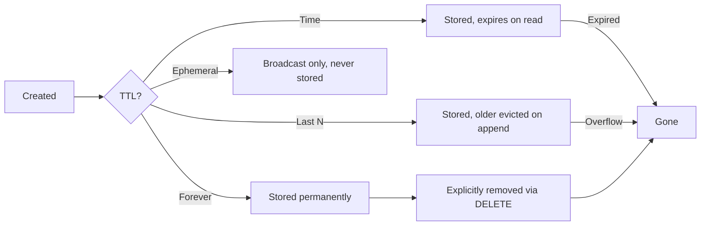

# xs -- Frame Model

## The Frame Struct

**File**: `src/store/mod.rs`

```rust
#[derive(PartialEq, Eq, Serialize, Deserialize, Clone, Default, bon::Builder)]
pub struct Frame {
    #[builder(start_fn, into)]
    pub topic: String,
    #[builder(default)]
    pub id: Scru128Id,
    pub hash: Option<ssri::Integrity>,
    pub meta: Option<serde_json::Value>,
    pub ttl: Option<TTL>,
}
```

Every event in xs is a Frame. It's the fundamental unit of data — analogous to a Kafka record or an event in an event sourcing system.

### Fields

| Field | Type | Purpose |
|-------|------|---------|
| `topic` | `String` | Hierarchical dot-separated event name |
| `id` | `Scru128Id` | 128-bit time-ordered unique identifier |
| `hash` | `Option<ssri::Integrity>` | SRI hash pointing to content in CAS |
| `meta` | `Option<serde_json::Value>` | Inline JSON metadata (small structured data) |
| `ttl` | `Option<TTL>` | Retention policy |

### When to Use hash vs meta (ADR 0004)

- **meta**: Small structured data (JSON records). Stays inline in the frame. Fast to read.
- **hash**: Large content (file contents, binary blobs, long text). Stored in CAS, referenced by hash.

Rule of thumb: if it's a JSON object/record, put it in `meta`. If it's a blob or large string, put it in CAS via `hash`.

## TTL (Time-To-Live)

**File**: `src/store/ttl.rs`

```rust
pub enum TTL {
    Forever,
    Ephemeral,
    Time(Duration),
    Last(u32),
}
```

### TTL Policies

| Variant | Behavior | Use Case |
|---------|----------|----------|
| `Forever` | Kept indefinitely (default if no TTL specified) | Permanent events, audit logs |
| `Ephemeral` | Never stored; only live subscribers see it | Transient notifications, heartbeats |
| `Time(duration)` | Expires after duration, lazily GC'd on read | Session data, cache entries |
| `Last(n)` | Only the most recent N frames for a topic are kept | Latest state, rolling windows |

### Serialization Formats

```
"forever"     -> TTL::Forever
"ephemeral"   -> TTL::Ephemeral
"time:5000"   -> TTL::Time(Duration::from_millis(5000))
"last:10"     -> TTL::Last(10)
```

### TTL::Last Enforcement

When a frame is appended with `TTL::Last(n)`:
1. The frame is stored normally
2. A `GCTask::CheckLastTTL { topic, keep: n }` is sent to the GC worker
3. GC worker scans the topic index in reverse, counts `keep` entries, removes the rest

### TTL::Time Enforcement

Lazy garbage collection:
1. Frame is stored with its TTL
2. On read, the frame's SCRU128 timestamp is checked against current time
3. If `current_time - frame_timestamp > duration`, the frame is skipped and a `GCTask::Remove` is scheduled
4. This means expired frames may briefly appear in prefix scans of the raw keyspace

## ReadOptions

**File**: `src/store/mod.rs`

```rust
#[derive(PartialEq, Deserialize, Clone, Debug, Default, bon::Builder)]
pub struct ReadOptions {
    pub follow: FollowOption,
    pub new: bool,
    pub after: Option<Scru128Id>,
    pub from: Option<Scru128Id>,
    pub limit: Option<usize>,
    pub last: Option<usize>,
    pub topic: Option<String>,
}
```

### Option Semantics

| Option | Default | Effect |
|--------|---------|--------|
| `follow` | `Off` | `On` streams indefinitely; `WithHeartbeat(d)` adds periodic `xs.pulse` frames |
| `new` | `false` | Skip all existing frames, only show new ones |
| `after` | `None` | Start after this ID (exclusive) — for resuming |
| `from` | `None` | Start from this ID (inclusive) |
| `limit` | `None` | Return at most N frames then stop |
| `last` | `None` | Return only the last N frames (reads in reverse) |
| `topic` | `None` | Filter by topic (exact or wildcard with `*`) |

### FollowOption

```rust
pub enum FollowOption {
    Off,
    On,
    WithHeartbeat(Duration),
}
```

- **Off** — One-shot: read historical data and stop
- **On** — Stream indefinitely: historical + live
- **WithHeartbeat(duration)** — Same as On, but inject `xs.pulse` frames at the given interval (for connection keepalive)

## Topic Validation

**Files**: ADR 0001, ADR 0002

### Rules

- **Allowed characters**: `a-z A-Z 0-9 _ - .`
- **Must start with**: `a-z A-Z _` (NOT digits — ADR 0002 reserves leading digits for argument disambiguation in `.last`)
- **Cannot**: be empty, end with `.`, contain `..`, contain `\x00`
- **Max length**: 255 bytes
- **Separator**: `.` (dot) is the hierarchy separator

### Topic Hierarchy

Topics form a tree via dot separation:
```
xs              # System namespace
xs.start        # Server started
xs.stopping     # Server shutting down
xs.pulse        # Heartbeat
user            # User namespace
user.messages   # Messages sub-topic
user.id1.messages # User-specific messages
```

### System Topics

| Topic | Purpose |
|-------|---------|
| `xs.start` | Emitted when server starts (meta: expose info) |
| `xs.stopping` | Emitted on graceful shutdown |
| `xs.pulse` | Heartbeat frames (ephemeral) |
| `xs.threshold` | Marks boundary between historical and live data |
| `<name>.register` | Actor registration |
| `<name>.unregister` | Actor deregistration |
| `<name>.spawn` | Service spawn |
| `<name>.terminate` | Service termination |
| `<name>.define` | Action definition |
| `<name>.call` | Action invocation |

## Frame Lifecycle



## Frame JSON Wire Format

Over the API, frames are serialized as JSON:

```json
{
  "id": "0123456789abcdefghijklmno",
  "topic": "user.messages",
  "hash": "sha256-abc123...",
  "meta": {"key": "value"},
  "ttl": "last:5"
}
```

Fields with `None` values are omitted from the JSON output. The `id` field is the 25-character base-36 SCRU128 string representation.
