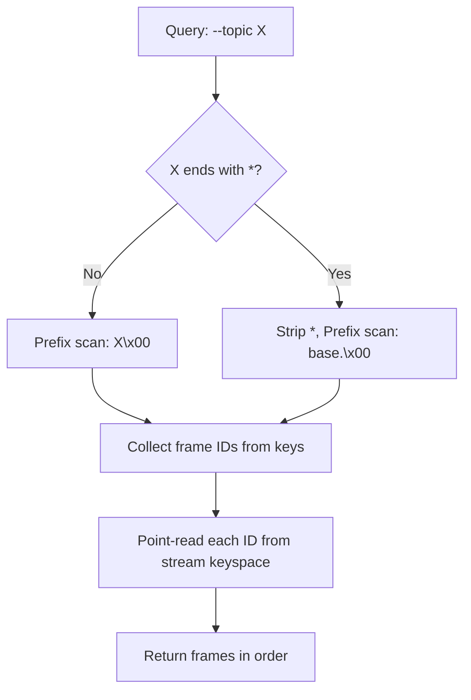

# xs -- Indexing Strategy

## Two-Keyspace Design

xs uses two fjall keyspaces to serve different access patterns:

| Keyspace | Key Format | Value | Optimized For |
|----------|-----------|-------|---------------|
| `stream` | 16-byte SCRU128 ID | JSON Frame | Point reads, full-stream scans |
| `idx_topic` | `topic\x00frame_id` | Empty | Prefix scans by topic |

## Primary Index: stream

The stream keyspace is the source of truth. Every non-ephemeral frame lives here.

### Key Encoding

SCRU128 IDs are stored as 16 raw bytes in big-endian order. This ensures:
- Byte-level lexicographic comparison = chronological ordering
- Range scans from any point = time-based queries
- Last N = reverse iteration from end

### Configuration Rationale

```rust
.expect_point_read_hits(true)  // Most reads are by ID
.hash_ratio_policy(8.0)        // Aggressive bloom filter
.data_block_size(16 * 1024)    // 16 KiB blocks for scan efficiency
```

- **Bloom filter (8.0 ratio)**: For every 1 byte of data, 8 bits of bloom filter. This means ~0.1% false positive rate — point reads almost never touch disk for non-existent keys.
- **16 KiB blocks**: Larger than default (4 KiB), better for sequential scans during catch-up reads.

## Topic Index: idx_topic

The topic index is a secondary index. It contains no frame data — only existence markers that point back to the primary stream.

### Key Format

```
<topic_bytes>\x00<frame_id_16_bytes>
```

The NULL byte (`\x00`) delimiter works because:
1. Topic names are validated to never contain NULL bytes
2. Frame IDs are raw bytes (may contain NULL, but they come after the delimiter)
3. Prefix scan on `topic\x00` returns all frame IDs for that topic

### Hierarchical Prefix Entries (ADR 0001)

This is the key insight that makes wildcard queries efficient.

For a frame with topic `user.id1.messages`:

```
Entry 1: user.id1.messages\x00<frame_id>    # Exact match
Entry 2: user.id1.\x00<frame_id>            # Level-2 prefix
Entry 3: user.\x00<frame_id>                # Level-1 prefix
```

The algorithm generates prefix entries by splitting on `.` and keeping trailing dots:

```rust
fn topic_prefixes(topic: &str) -> Vec<String> {
    let mut prefixes = vec![topic.to_string()]; // exact
    let parts: Vec<&str> = topic.split('.').collect();
    for i in 1..parts.len() {
        let prefix = parts[..i].join(".") + ".";
        prefixes.push(prefix);
    }
    prefixes
}
// "user.id1.messages" -> ["user.id1.messages", "user.id1.", "user."]
```

### Query Execution



**Exact query** (`--topic user.id1.messages`):
1. Prefix scan on `user.id1.messages\x00`
2. For each key, extract the trailing 16-byte frame ID
3. Point-read each frame from the stream keyspace

**Wildcard query** (`--topic user.*`):
1. Prefix scan on `user.\x00` (the trailing dot is the prefix entry)
2. This matches ALL frames under `user.` at any depth
3. For each key, extract frame ID, point-read from stream

### Why Not a Single Index?

The two-index approach (prefix entries + stream lookups) was chosen over alternatives:

1. **Single scan + filter**: Would require reading every frame in the stream to check topics. O(n) for topic queries.
2. **Embedded topic in stream key**: Would break chronological ordering. You'd need one keyspace per topic.
3. **Materialized views**: Would duplicate frame data. More storage, more write amplification.

The chosen approach: O(k) for topic queries where k = number of matching frames, regardless of total stream size. The cost is 2-3x write amplification in the topic index (one entry per hierarchy level).

## ADR 0002: No Leading Digits

Topics cannot start with digits. This enables the CLI to disambiguate:

```bash
xs last user.messages 5    # "5" is count, not topic
xs last 5                  # "5" is count for all topics
```

Without this rule, `xs last 5` would be ambiguous — is `5` a topic or a count?

## Full-Stream Iteration

When no topic filter is specified, xs iterates the stream keyspace directly:

```rust
fn iter_frames(&self) -> impl Iterator<Item = Frame> {
    self.stream
        .iter()
        .map(|kv| serde_json::from_slice(&kv.value).unwrap())
}
```

This is a simple LSM-tree range scan — very efficient for chronological replay.

## Reverse Iteration (--last N)

For `--last N` queries:

```rust
fn last_frames(&self, topic: Option<&str>, limit: usize) -> Vec<Frame> {
    match topic {
        None => {
            // Reverse scan of stream keyspace
            self.stream.iter().rev().take(limit).collect()
        }
        Some(t) => {
            // Reverse scan of topic index, then point-read
            self.idx_topic.prefix(format!("{}\x00", t))
                .iter().rev().take(limit)
                .map(|kv| self.get_by_key(&kv.key[..]))
                .collect()
        }
    }
}
```

fjall's LSM-tree supports efficient reverse iteration via `rev()`.

## Index Maintenance on Remove

When a frame is removed (DELETE or GC), all its index entries must be cleaned:

1. Read the frame to get its topic
2. Compute all prefix entries for that topic
3. Delete from stream: `stream.remove(id_bytes)`
4. Delete each index entry: `idx_topic.remove(prefix\x00id_bytes)` for each prefix

This is why remove goes through the GC worker — it's a multi-step operation that shouldn't block the append path.

## Performance Characteristics

| Operation | Complexity | Notes |
|-----------|-----------|-------|
| Append | O(log n) + O(d) | LSM put + d prefix index entries (d = topic depth) |
| Get by ID | O(1) amortized | Bloom filter + point read |
| Full scan | O(n) | Sequential LSM iteration |
| Topic query (exact) | O(k log n) | k = matching frames, each is a point read |
| Topic query (wildcard) | O(k log n) | Same as exact, but may match more frames |
| Last N | O(N log n) | Reverse scan + point reads |
| Remove | O(d log n) | d = topic depth (index entries to clean) |
