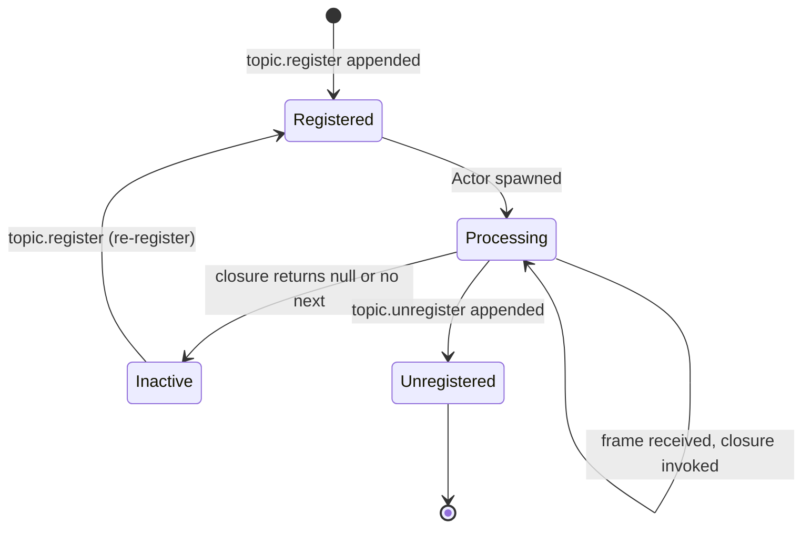
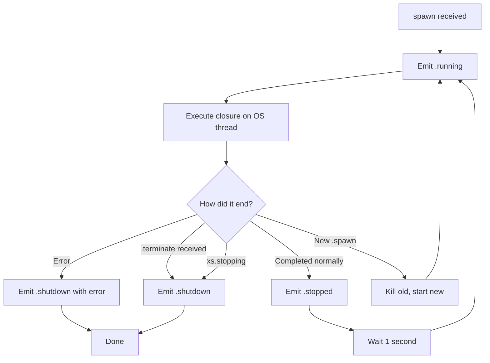
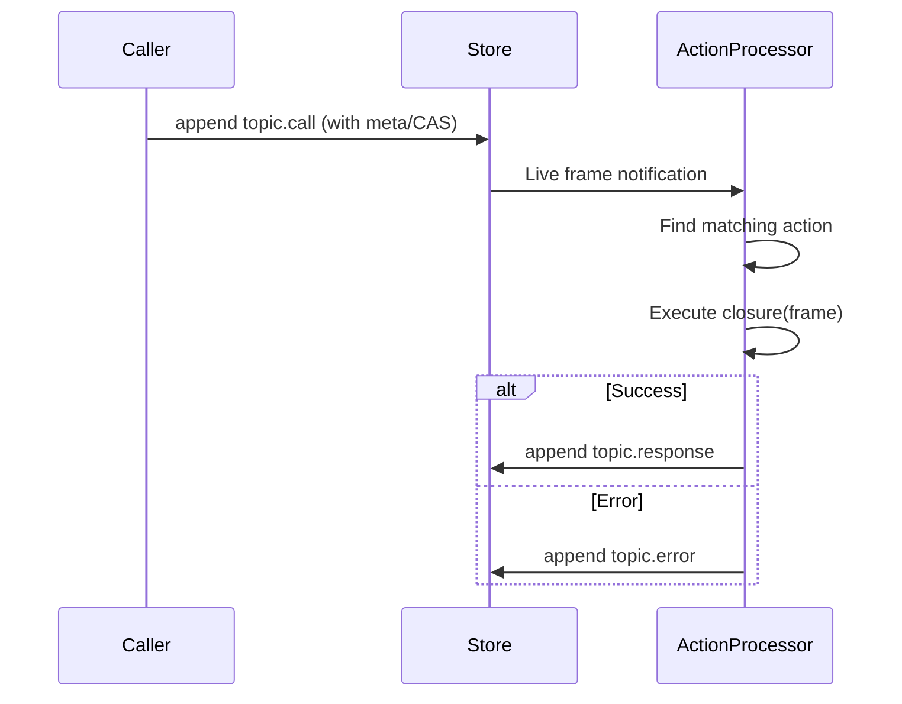

# xs -- Processor System

## Overview

Processors are reactive event handlers that run as part of the xs server. They subscribe to the event stream and execute Nushell closures in response. There are three types:

| Type | Pattern | State | Lifecycle |
|------|---------|-------|-----------|
| Actor | Event reducer | Yes (carried between invocations) | Register → process frames → unregister |
| Service | Long-running daemon | External | Spawn → run → terminate (auto-restarts) |
| Action | Request/response | No | Define → call → response |

All processors share a common **Lifecycle** enum for distinguishing historical replay from live events:

```rust
pub enum Lifecycle {
    Historical(Frame),  // Replayed from store on startup
    Threshold(Frame),   // Marks end of historical data
    Live(Frame),        // Real-time new frames
}
```

## ReturnOptions (Shared)

**File**: `src/processor/mod.rs`

All three processor types use ReturnOptions to configure their output:

```rust
pub struct ReturnOptions {
    pub suffix: Option<String>,   // Custom output topic suffix (default varies by type)
    pub target: Option<String>,   // "cas" = store output in CAS; default = store as meta
    pub ttl: Option<TTL>,         // TTL for output frames
}
```

## Actors

**Files**: `src/processor/actor/actor.rs`, `src/processor/actor/serve.rs`

### Concept

An Actor is a stateful event processor — a fold/reduce over the event stream. It carries state between invocations and emits output frames.

### Registration

Register an actor by appending a frame to `<topic>.register`:
```nushell
# The CAS content is a Nushell script that evaluates to a config record
{
    run: {|frame, state|
        # Process frame, return next state and optional output
        {out: "result", next: ($state + 1)}
    }
    start: "first"   # or "new" or {after: "<id>"}
    pulse: 5000      # optional heartbeat interval (ms)
    return_options: {suffix: "out", target: "cas", ttl: "last:10"}
}
```

### Actor Struct

```rust
pub struct Actor {
    pub id: Scru128Id,           // Registration frame ID
    pub topic: String,           // Base topic (without .register suffix)
    config: ActorConfig,         // Parsed from Nushell script
    engine_worker: Arc<EngineWorker>,  // Dedicated OS thread for Nushell
    output: Arc<Mutex<Vec<Frame>>>,    // Buffered output frames
}
```

### ActorConfig

```rust
struct ActorConfig {
    start: Start,                      // Where to begin processing
    pulse: Option<u64>,                // Heartbeat interval (ms)
    return_options: Option<ReturnOptions>,
}

enum Start {
    First,              // Process from the beginning of the stream
    New,                // Only process new (live) frames
    After(Scru128Id),   // Start after a specific frame
}
```

### Closure Return Protocol

The actor closure receives `(frame, state)` and must return one of:

| Return Value | Behavior |
|-------------|----------|
| `{out: value, next: state}` | Emit output, continue with new state |
| `{next: state}` | Continue without output |
| `{out: value}` | Emit output, then stop (no `next` = terminate) |
| `null` | Stop immediately |

### Output Emission

Output frames are appended to `<topic>.<suffix>` (default suffix: `"out"`):
- If `target: "cas"`: output value is serialized and stored in CAS, frame gets a `hash`
- If no target (default): output value becomes `frame.meta` (inline JSON)

### EngineWorker

Each actor gets a dedicated OS thread because Nushell's `EngineState` is not `Send`:

```rust
pub struct EngineWorker {
    tx: mpsc::Sender<WorkItem>,     // Send work to the thread
    handle: JoinHandle<()>,          // Thread handle
}

struct WorkItem {
    closure: Closure,
    args: Vec<Value>,
    pipeline_input: PipelineData,
    response: oneshot::Sender<Result<Value>>,
}
```

### Actor Serve Loop

**File**: `src/processor/actor/serve.rs`

On server startup:
1. Read all historical frames
2. Compact registration state: track `.register`, `.unregister`, `.inactive` frames
3. Determine which actors are currently active
4. For each active actor:
   - Parse its Nushell script from CAS
   - Create an EngineWorker
   - Spawn a task that feeds frames to the actor based on its `start` config
5. Subscribe to live events and route to active actors



## Services

**Files**: `src/processor/service/service.rs`, `src/processor/service/serve.rs`

### Concept

A Service is a long-running background process. It runs continuously, auto-restarts on completion, and supports duplex communication via send/recv frames.

### Spawning

Spawn a service by appending a frame to `<topic>.spawn`:
```nushell
{
    run: {||
        # Long-running service logic
        # Can use .cat --follow to subscribe to events
        # Can use .append to emit output
        loop {
            .cat --follow --topic "requests.*" | each {|frame|
                # process
                .append "responses" --meta {result: "done"}
            }
        }
    }
    duplex: true   # Enable send/recv communication
    return_options: {suffix: "recv"}
}
```

### Service Lifecycle Frames

| Frame Topic | When | Purpose |
|-------------|------|---------|
| `<topic>.spawn` | Manual | Registers/hot-reloads the service |
| `<topic>.running` | Auto | Emitted when service starts executing |
| `<topic>.stopped` | Auto | Emitted when closure completes (before restart) |
| `<topic>.shutdown` | Auto | Emitted on termination or error |
| `<topic>.terminate` | Manual | Signals service to stop |
| `<topic>.send` | Manual | Sends data to a duplex service |
| `<topic>.recv` | Auto | Output from the service |

### Service Task

```rust
pub struct Task {
    pub id: Scru128Id,                          // Spawn frame ID
    pub run_closure: Closure,                   // The Nushell closure
    pub return_options: Option<ReturnOptions>,  // Output config
    pub duplex: bool,                           // Enable send/recv
    pub engine: nu::Engine,                     // Dedicated engine instance
}
```

### Auto-Restart Loop



### Hot Reload

If a new `.spawn` frame appears while a service is running:
1. Cancel the current service task
2. Wait for it to finish (with timeout)
3. Start the new version

### Duplex Communication

When `duplex: true`:
- External code appends to `<topic>.send` with content
- The service closure can subscribe to `.send` frames via `.cat --follow --topic "<topic>.send"`
- Service outputs go to `<topic>.recv` (or custom suffix)

## Actions

**Files**: `src/processor/action/serve.rs`

### Concept

An Action is a stateless request/response handler. Define once, call many times.

### Defining

Define an action by appending to `<topic>.define`:
```nushell
{
    run: {|frame|
        # Process the request frame
        let input = $frame.meta
        # Return response
        {result: ($input.x + $input.y)}
    }
    return_options: {suffix: "response", ttl: "last:100"}
}
```

### Invoking

Call an action by appending to `<topic>.call`:
```bash
xs append $store topic.call --meta '{"x": 1, "y": 2}'
```

### Action Lifecycle Frames

| Frame Topic | When | Purpose |
|-------------|------|---------|
| `<topic>.define` | Manual | Registers the action handler |
| `<topic>.ready` | Auto | Emitted when action is successfully registered |
| `<topic>.call` | Manual | Invokes the action |
| `<topic>.response` | Auto | Success response |
| `<topic>.error` | Auto | Error response |

### Action Struct

```rust
struct Action {
    id: Scru128Id,                          // Define frame ID
    engine: nu::Engine,                     // Nushell engine
    definition: String,                     // Source script
    return_options: Option<ReturnOptions>,  // Output config
}
```

### Execution Flow



## Processor Compaction on Startup

All three processor types use the same pattern on startup:

1. Read ALL historical frames
2. Track the latest state for each topic:
   - Actors: `.register` activates, `.unregister` deactivates
   - Services: `.spawn` activates, `.terminate` deactivates
   - Actions: `.define` activates (last definition wins)
3. Only spawn/register processors that are currently active
4. Subscribe to live events for new registrations/spawns/definitions

This "compaction" pattern means the store can be arbitrarily large — startup time is proportional to the number of processor lifecycle events, not total frame count.
