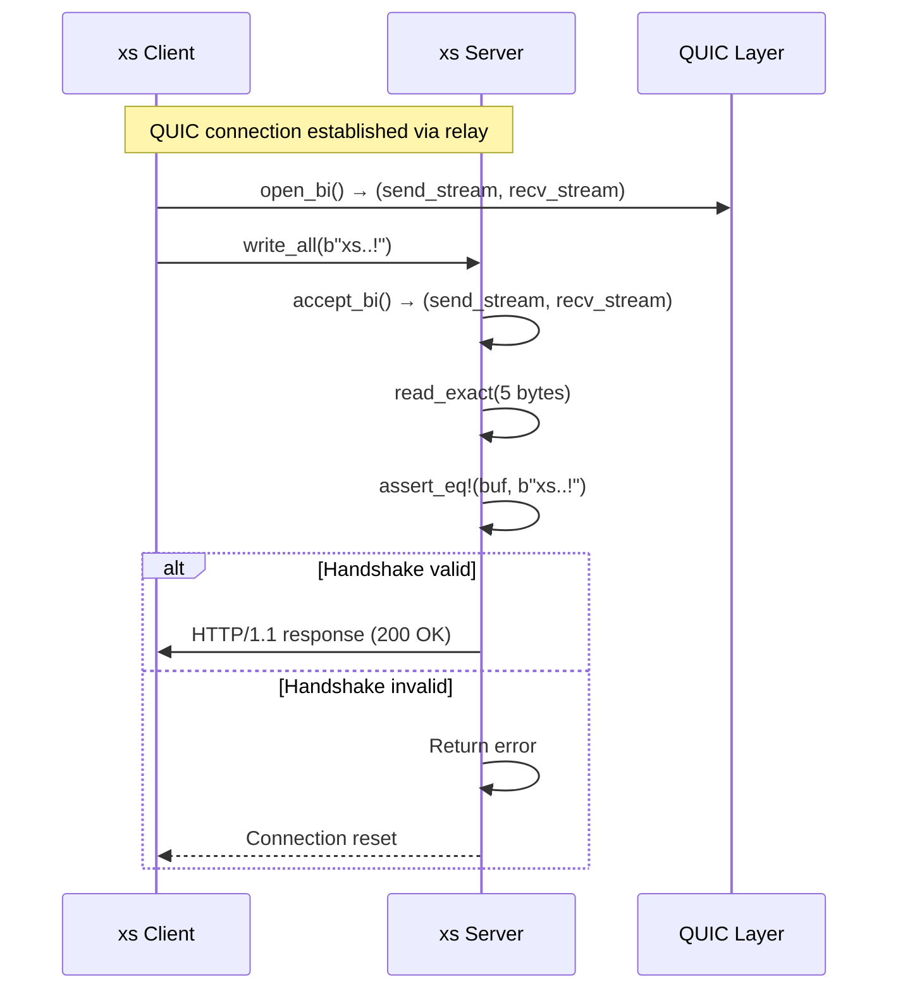
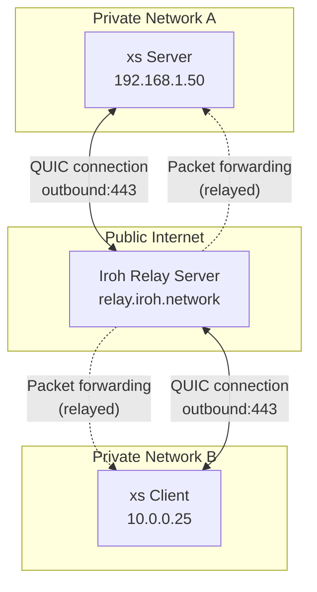
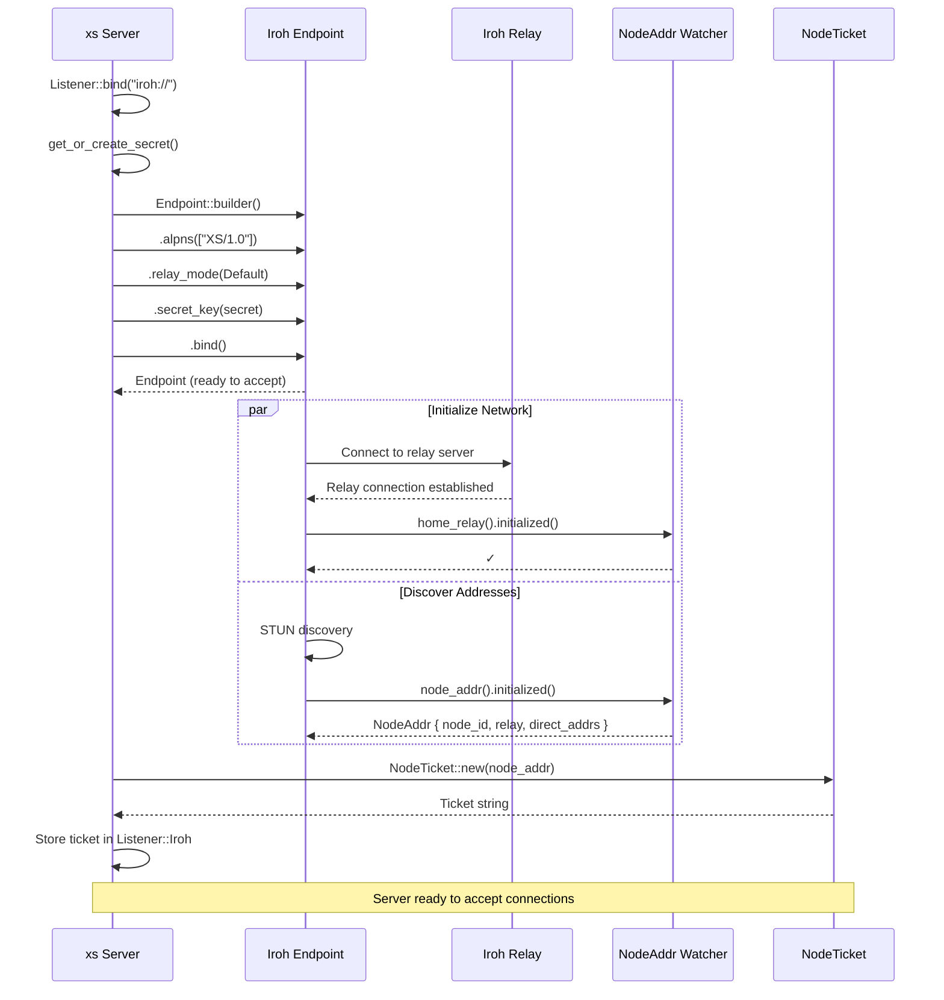
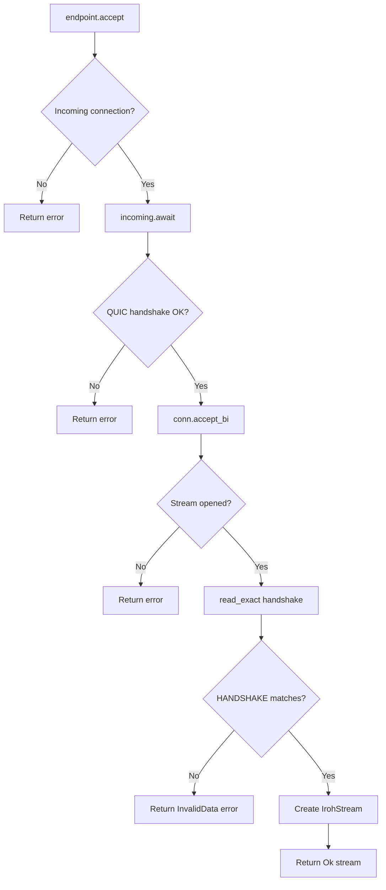
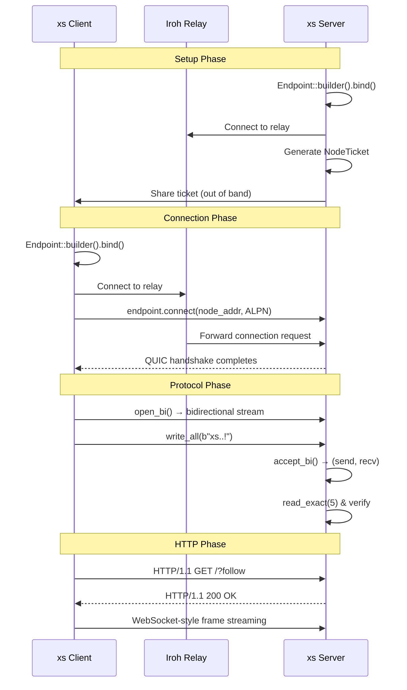

# Iroh Networking Deep Dive

Iroh is a QUIC-based peer-to-peer (P2P) networking library that enables xs to accept connections from anywhere without port forwarding. This document explores how xs integrates Iroh for NAT-traversable, encrypted P2P communication.

## Table of Contents

1. [Architecture Overview](#architecture-overview)
2. [Endpoint Configuration](#endpoint-configuration)
3. [The Handshake Protocol](#the-handshake-protocol)
4. [NodeTickets and Connection Establishment](#nodetickets-and-connection-establishment)
5. [The IrohStream Wrapper](#the-irohstream-wrapper)
6. [NAT Traversal via Relay Infrastructure](#nat-traversal-via-relay-infrastructure)
7. [Connection Flow: Binding to Tickets](#connection-flow-binding-to-tickets)
8. [Accept Loop and Validation](#accept-loop-and-validation)
9. [Secret Key Management](#secret-key-management)
10. [Client Connection Flow](#client-connection-flow)

---

## Architecture Overview

Iroh provides a modern P2P networking stack built on QUIC. Unlike traditional TCP servers that require public IP addresses and port forwarding, Iroh uses a relay infrastructure to establish connections between nodes behind NATs.

**Source**: `src/listener.rs:99-105`

```rust
/// The ALPN for xs protocol.
pub const ALPN: &[u8] = b"XS/1.0";

/// The handshake to send when connecting.
/// The connecting side must send this handshake, the listening side must consume it.
pub const HANDSHAKE: [u8; 5] = *b"xs..!";
```

The xs integration wraps Iroh's `Endpoint` in a unified `Listener` enum that also supports TCP and Unix domain sockets:

**Source**: `src/listener.rs:217-221`

```rust
pub enum Listener {
    Tcp(TcpListener),
    Unix(UnixListener),
    Iroh(Endpoint, String), // Endpoint and ticket
}
```

---

## Endpoint Configuration

When binding to an `iroh://` address, xs configures an Iroh endpoint with three critical parameters:

**Source**: `src/listener.rs:296-314`

```rust
if addr.starts_with("iroh://") {
    tracing::info!("Binding iroh endpoint");

    let secret_key = get_or_create_secret()?;
    let endpoint = Endpoint::builder()
        .alpns(vec![ALPN.to_vec()])
        .relay_mode(RelayMode::Default)
        .secret_key(secret_key)
        .bind()
        .await
        .map_err(|e| {
            tracing::error!("Failed to bind iroh endpoint: {}", e);
            io::Error::other(format!("Failed to bind endpoint: {e}"))
        })?;

    tracing::debug!("Iroh endpoint bound successfully");
```

### Configuration Breakdown

| Parameter | Value | Purpose |
|-----------|-------|---------|
| `alpns` | `[b"XS/1.0"]` | Application-Layer Protocol Negotiation — identifies the xs protocol |
| `relay_mode` | `RelayMode::Default` | Uses Iroh's public relay servers for NAT traversal |
| `secret_key` | From `IROH_SECRET` or generated | Cryptographic identity of this node |

**Aha**: The ALPN is not just for show — Iroh uses it to route incoming connections to the correct application handler. Multiple protocols can coexist on the same endpoint as long as they have unique ALPNs.

---

## The Handshake Protocol

After the QUIC connection is established, xs performs an application-level handshake to verify the peer is speaking the xs protocol.

**Source**: `src/listener.rs:102-104`

```rust
/// The handshake to send when connecting.
/// The connecting side must send this handshake, the listening side must consume it.
pub const HANDSHAKE: [u8; 5] = *b"xs..!";
```

### Why a Custom Handshake?

QUIC provides encrypted transport and ALPN verifies protocol intent, but the 5-byte `xs..!` handshake serves an additional purpose: **it prevents accidental connections from non-xs Iroh clients**. If a random Iroh client connects with the same ALPN, the handshake check will fail and the connection will be rejected before any HTTP processing begins.

### Handshake Flow



**Source**: `src/listener.rs:263-290`

```rust
// Read and verify the handshake
let mut handshake_buf = [0u8; HANDSHAKE.len()];
#[allow(unused_imports)]
use tokio::io::AsyncReadExt;
recv_stream
    .read_exact(&mut handshake_buf)
    .await
    .map_err(|e| {
        tracing::error!("Failed to read handshake from {}: {}", remote_node_id, e);
        io::Error::other(format!("Failed to read handshake: {e}"))
    })?;

if handshake_buf != HANDSHAKE {
    tracing::error!(
        "Invalid handshake received from {}: expected {:?}, got {:?}",
        remote_node_id,
        HANDSHAKE,
        handshake_buf
    );
    return Err(io::Error::new(
        io::ErrorKind::InvalidData,
        format!("Invalid handshake from {remote_node_id}"),
    ));
}

tracing::info!("Handshake verified successfully from {}", remote_node_id);
```

---

## NodeTickets and Connection Establishment

NodeTickets are Iroh's mechanism for sharing connection information. A ticket encodes everything needed to connect to a node: its NodeId, relay server, and direct addresses.

### Ticket Creation Flow

**Source**: `src/listener.rs:314-324`

```rust
// Wait for the endpoint to be fully ready before creating ticket
endpoint.home_relay().initialized().await;
let node_addr = endpoint.node_addr().initialized().await;

// Create a proper NodeTicket
let ticket = NodeTicket::new(node_addr.clone()).to_string();

tracing::info!("Iroh endpoint ready with node ID: {}", node_addr.node_id);
tracing::info!("Iroh ticket: {}", ticket);

Ok(Listener::Iroh(endpoint, ticket))
```

### What `initialized()` Waits For

Both `home_relay().initialized()` and `node_addr().initialized()` are critical synchronization points:

1. **`home_relay().initialized()`**: Waits until the endpoint has established a connection to a relay server. This is necessary for NAT traversal.

2. **`node_addr().initialized()`**: Waits until the endpoint has determined its own addressing information, including any discovered direct addresses (via STUN) and the relay URL.

**Aha**: Without these `await` points, the ticket would be generated with incomplete addressing information, leading to connection failures. The `Watcher` pattern Iroh uses here allows the endpoint to bind immediately while network discovery happens asynchronously.

### Ticket Format

A NodeTicket serializes to a compact string like:
```
noderecAAAAAAAAAAAAAAAAAAAAAAAAAAAAAAAAAAAAAAAAAAAAAAAAAAAAAAAAAAAAAAAAAAAAAAAAAAAAAAAAAAAAAA...
```

This is encoded as `iroh://<ticket>` in the xs listener display:

**Source**: `src/listener.rs:431-433`

```rust
Listener::Iroh(_, ticket) => {
    write!(f, "iroh://{ticket}")
}
```

---

## The IrohStream Wrapper

Iroh provides separate `SendStream` and `RecvStream` types for bidirectional communication. xs wraps these in a unified `IrohStream` that implements `AsyncRead` + `AsyncWrite`.

**Source**: `src/listener.rs:145-167`

```rust
pub struct IrohStream {
    send_stream: SendStream,
    recv_stream: RecvStream,
}

impl IrohStream {
    pub fn new(send_stream: SendStream, recv_stream: RecvStream) -> Self {
        Self {
            send_stream,
            recv_stream,
        }
    }
}

impl Drop for IrohStream {
    fn drop(&mut self) {
        // Send reset/stop signals to the other side
        self.send_stream.reset(0u8.into()).ok();
        self.recv_stream.stop(0u8.into()).ok();

        tracing::debug!("IrohStream dropped with cleanup");
    }
}
```

### Drop Implementation: Clean Shutdown

**Aha**: The `Drop` implementation is crucial for proper QUIC stream cleanup. QUIC streams can outlive the connection if not properly closed. By calling `reset()` on the send side and `stop()` on the recv side, xs ensures that:

1. **The peer receives an immediate signal** that the stream is closing (not just waiting for timeout)
2. **Resources are freed** on both sides promptly
3. **No data loss** occurs for already-accepted data

The `.ok()` calls ignore errors during drop — if the connection is already dead, cleanup is a no-op.

### AsyncRead/AsyncWrite Implementation

**Source**: `src/listener.rs:169-215`

```rust
impl AsyncRead for IrohStream {
    fn poll_read(
        self: Pin<&mut Self>,
        cx: &mut Context<'_>,
        buf: &mut tokio::io::ReadBuf<'_>,
    ) -> Poll<io::Result<()>> {
        let this = self.get_mut();
        match Pin::new(&mut this.recv_stream).poll_read(cx, buf) {
            Poll::Ready(Ok(())) => Poll::Ready(Ok(())),
            Poll::Ready(Err(e)) => Poll::Ready(Err(io::Error::other(e))),
            Poll::Pending => Poll::Pending,
        }
    }
}

impl AsyncWrite for IrohStream {
    fn poll_write(
        self: Pin<&mut Self>,
        cx: &mut Context<'_>,
        buf: &[u8],
    ) -> Poll<io::Result<usize>> {
        let this = self.get_mut();
        match Pin::new(&mut this.send_stream).poll_write(cx, buf) {
            Poll::Ready(Ok(n)) => Poll::Ready(Ok(n)),
            Poll::Ready(Err(e)) => Poll::Ready(Err(io::Error::other(e))),
            Poll::Pending => Poll::Pending,
        }
    }
    // ... poll_flush and poll_shutdown similarly delegate
}
```

This wrapper allows the Iroh transport to slot into the same HTTP server infrastructure as TCP and Unix sockets, which both implement `AsyncRead + AsyncWrite`.

---

## NAT Traversal via Relay Infrastructure

Iroh's relay servers solve the NAT traversal problem that makes traditional P2P networking difficult.

### The NAT Problem

In a typical home or office network:
1. The xs server runs on a machine with a private IP (e.g., `192.168.1.50`)
2. The router performs NAT — external services see only the router's public IP
3. Incoming connections cannot reach the private machine without port forwarding

### Iroh's Solution: Relay Servers



### How It Works

1. **Both nodes connect outbound** to public relay servers using QUIC over HTTPS (port 443)
2. **Relay coordinates the connection** — when Client wants to connect to Server, the relay forwards packets
3. **Direct connection upgrade** — Iroh attempts to upgrade to a direct connection using STUN to discover public addresses, but falls back to relayed if direct fails

**Aha**: The `RelayMode::Default` setting enables this entire process automatically. The default relay servers are operated by the Iroh team, but self-hosted relays can be used for private deployments.

---

## Connection Flow: Binding to Tickets

The full server-side binding flow:



**Key insight**: The `initialized().await` calls are the critical synchronization points that ensure the ticket contains valid, reachable addressing information before it's exposed to users.

---

## Accept Loop and Validation

The Iroh accept loop follows the same pattern as TCP and Unix sockets but adds the handshake validation:

**Source**: `src/listener.rs:236-292`

```rust
Listener::Iroh(endpoint, _) => {
    // Accept incoming connections
    let incoming = endpoint.accept().await.ok_or_else(|| {
        tracing::error!("No incoming iroh connection available");
        io::Error::other("No incoming connection")
    })?;

    let conn = incoming.await.map_err(|e| {
        tracing::error!("Failed to accept iroh connection: {}", e);
        io::Error::other(format!("Connection failed: {e}"))
    })?;

    let remote_node_id = "unknown"; // We'll use a placeholder for now
    tracing::info!("Got iroh connection from {}", remote_node_id);

    // Wait for the first incoming bidirectional stream
    let (send_stream, mut recv_stream) = conn.accept_bi().await.map_err(|e| {
        tracing::error!(
            "Failed to accept bidirectional stream from {}: {}",
            remote_node_id,
            e
        );
        io::Error::other(format!("Failed to accept stream: {e}"))
    })?;

    tracing::debug!("Accepted bidirectional stream from {}", remote_node_id);

    // Read and verify the handshake
    // ... (handshake validation code)

    let stream = IrohStream::new(send_stream, recv_stream);
    Ok((Box::new(stream), None))
}
```

### The Flow



**Aha**: Notice that `endpoint.accept()` returns an `Incoming` future that must itself be awaited. This two-stage accept allows Iroh to handle the QUIC handshake asynchronously while the application can still cancel if needed.

---

## Secret Key Management

Iroh uses ed25519 keys for node identity. xs supports both persistent and ephemeral keys.

**Source**: `src/listener.rs:115-137`

```rust
/// Get the secret key or generate a new one.
/// Uses IROH_SECRET environment variable if available, otherwise generates a new one.
fn get_or_create_secret() -> io::Result<SecretKey> {
    match std::env::var("IROH_SECRET") {
        Ok(secret) => {
            use std::str::FromStr;
            SecretKey::from_str(&secret).map_err(|e| {
                io::Error::new(
                    io::ErrorKind::InvalidData,
                    format!("Invalid secret key: {e}"),
                )
            })
        }
        Err(_) => {
            let key = SecretKey::generate(rand::rngs::OsRng);
            tracing::info!(
                "Generated new secret key: {}",
                data_encoding::HEXLOWER.encode(&key.to_bytes())
            );
            Ok(key)
        }
    }
}
```

### Persistent vs Ephemeral Keys

| Mode | Source | Use Case |
|------|--------|----------|
| Persistent | `IROH_SECRET` env var | Production — stable NodeId across restarts |
| Ephemeral | Generated on startup | Development/testing — new identity each run |

### Key Format

The `IROH_SECRET` environment variable expects a hex-encoded 32-byte ed25519 private key. The generated key is logged at startup (line 132) so users can capture it for reuse:

```
2024-01-15T10:30:45Z INFO xs::listener: Generated new secret key: a1b2c3d4...
```

**Aha**: The key generation uses `rand::rngs::OsRng`, which sources entropy from the operating system's secure random number generator (`/dev/urandom` on Unix, `BCryptGenRandom` on Windows). This ensures cryptographically strong keys suitable for production use.

---

## Client Connection Flow

The test code in `listener.rs` demonstrates the full client connection flow:

**Source**: `src/listener.rs:368-406`

```rust
Listener::Iroh(_, ticket) => {
    let secret_key = get_or_create_secret()?;

    // Create a client endpoint
    let client_endpoint = Endpoint::builder()
        .alpns(vec![])
        .relay_mode(RelayMode::Default)
        .secret_key(secret_key)
        .bind()
        .await
        .map_err(io::Error::other)?;

    // Parse ticket to get node address
    let node_ticket: NodeTicket = ticket
        .parse()
        .map_err(|e| io::Error::other(format!("Invalid ticket: {}", e)))?;
    let node_addr = node_ticket.node_addr().clone();

    // Connect to the server
    let conn = client_endpoint
        .connect(node_addr, ALPN)
        .await
        .map_err(io::Error::other)?;

    // Open bidirectional stream
    let (mut send_stream, recv_stream) =
        conn.open_bi().await.map_err(io::Error::other)?;

    // Send handshake
    #[allow(unused_imports)]
    use tokio::io::AsyncWriteExt;
    send_stream
        .write_all(&HANDSHAKE)
        .await
        .map_err(io::Error::other)?;

    let stream = IrohStream::new(send_stream, recv_stream);
    Ok(Box::new(stream))
}
```

### Client-Server Full Sequence



---

## Configuration Options and Defaults

| Option | Default | Source | Description |
|--------|---------|--------|-------------|
| ALPN | `b"XS/1.0"` | `listener.rs:100` | Protocol identifier |
| HANDSHAKE | `b"xs..!"` | `listener.rs:104` | 5-byte magic for app-level validation |
| Relay Mode | `RelayMode::Default` | `listener.rs:303` | Uses Iroh public relays |
| Secret Key | Generated ephemeral | `listener.rs:117` | From `IROH_SECRET` env or new |
| Ticket Format | NodeTicket string | `listener.rs:319` | URL-safe base64-encoded |

---

## Cross-References

- [API & Transport](06-api-transport.md) — HTTP API served over Iroh
- [CLI Commands](09-cli-commands.md) — `--expose` flag for Iroh binding
- [Architecture](01-architecture.md) — System boundaries and transport layer
- [Overview](00-overview.md) — xs design philosophy

---

## Next

- Learn how the [Processor System](07-processor-system.md) handles events after they arrive over Iroh
- Understand [Storage Engine](02-storage-engine.md) internals for where frames are persisted
- Review [Production Patterns](10-production-patterns.md) for deploying Iroh-enabled xs clusters
