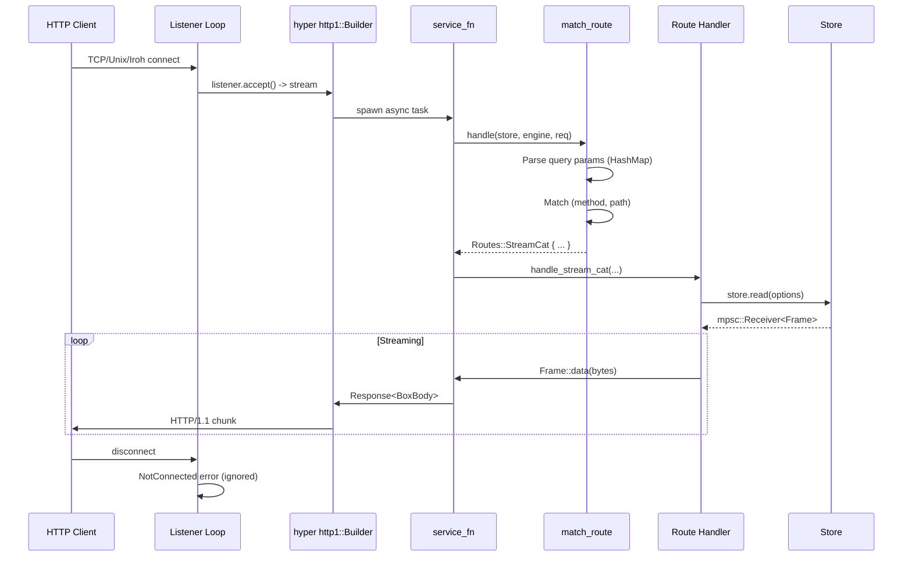
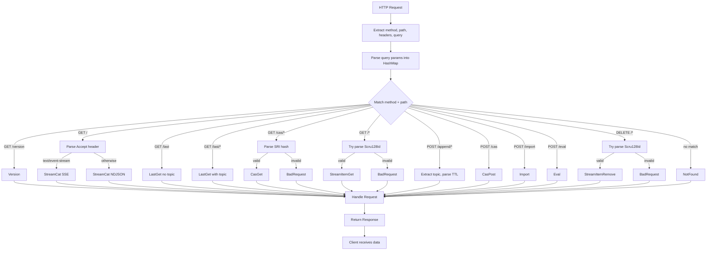

# xs -- HTTP Router Deep Dive

The HTTP router in xs is a carefully designed system that maps incoming HTTP requests to stream operations. It sits at the boundary between network transport and the core store, handling route matching, content negotiation, query parsing, and connection lifecycle management. This document examines the complete request handling pipeline from socket accept to frame streaming.

## The Routes Enum: Type-Safe Request Classification

**Source**: `src/api.rs:53-82`

The `Routes` enum is the heart of xs's routing system. It transforms HTTP requests into type-safe operations that the handler can execute. Every incoming request is classified into exactly one route variant.

```rust
#[derive(Debug, PartialEq, Clone)]
enum AcceptType {
    Ndjson,
    EventStream,
}

enum Routes {
    StreamCat {
        accept_type: AcceptType,
        options: ReadOptions,
        with_timestamp: bool,
    },
    StreamAppend {
        topic: String,
        ttl: Option<TTL>,
        with_timestamp: bool,
    },
    LastGet {
        topic: Option<String>,
        last: usize,
        follow: bool,
        with_timestamp: bool,
    },
    StreamItemGet {
        id: Scru128Id,
        with_timestamp: bool,
    },
    StreamItemRemove(Scru128Id),
    CasGet(ssri::Integrity),
    CasPost,
    Import,
    Eval,
    Version,
    NotFound,
    BadRequest(String),
}
```

The `Routes` enum has two categories:

1. **Success variants** (`StreamCat`, `StreamAppend`, `LastGet`, etc.) carry all parameters extracted from the HTTP request
2. **Error variants** (`NotFound`, `BadRequest`) for requests that fail validation

Each success variant embeds its parameters directly, making the handler's job straightforward: pattern match on the route and call the appropriate handler function with the pre-extracted parameters. This design eliminates redundant parsing and provides compile-time guarantees that all routes are handled.

## Route Matching Logic

**Source**: `src/api.rs:105-213`

The `match_route` function implements a declarative router using pattern matching on `(Method, path)` tuples. Query parameters are parsed once upfront into a `HashMap` for efficient lookup.

```rust
fn match_route(
    method: &Method,
    path: &str,
    headers: &hyper::HeaderMap,
    query: Option<&str>,
) -> Routes {
    let params: HashMap<String, String> =
        url::form_urlencoded::parse(query.unwrap_or("").as_bytes())
            .into_owned()
            .collect();

    match (method, path) {
        (&Method::GET, "/version") => Routes::Version,

        (&Method::GET, "/") => {
            let accept_type = match headers.get(ACCEPT) {
                Some(accept) if accept == "text/event-stream" => AcceptType::EventStream,
                _ => AcceptType::Ndjson,
            };

            let options = ReadOptions::from_query(query);
            let with_timestamp = params.contains_key("with-timestamp");

            match options {
                Ok(options) => Routes::StreamCat {
                    accept_type,
                    options,
                    with_timestamp,
                },
                Err(e) => Routes::BadRequest(e.to_string()),
            }
        }
        // ... additional routes
    }
}
```

```rust
enum Routes {
    StreamCat {
        accept_type: AcceptType,
        options: ReadOptions,
        with_timestamp: bool,
    },
    StreamAppend {
        topic: String,
        ttl: Option<TTL>,
        with_timestamp: bool,
    },
    LastGet {
        topic: Option<String>,
        last: usize,
        follow: bool,
        with_timestamp: bool,
    },
    StreamItemGet {
        id: Scru128Id,
        with_timestamp: bool,
    },
    StreamItemRemove(Scru128Id),
    CasGet(ssri::Integrity),
    CasPost,
    Import,
    Eval,
    Version,
    NotFound,
    BadRequest(String),
}
```

Each variant carries the extracted parameters needed to handle that route. For example:

- `StreamCat` carries `ReadOptions` parsed from query parameters and `AcceptType` from the Accept header
- `StreamAppend` carries the topic name (extracted from path) and optional TTL
- `LastGet` handles the `/last` and `/last/<topic>` endpoints with pagination
- `StreamItemGet` and `StreamItemRemove` parse SCRU128 IDs from the path

The `NotFound` and `BadRequest` variants handle error cases at the routing layer itself.

## Route Matching with `match_route`

**File**: `xs/src/api.rs:105-213`

The `match_route` function is the router's entry point. It takes HTTP method, path, headers, and query string, returning a `Routes` variant:

```rust
fn match_route(
    method: &Method,
    path: &str,
    headers: &hyper::HeaderMap,
    query: Option<&str>,
) -> Routes {
    let params: HashMap<String, String> =
        url::form_urlencoded::parse(query.unwrap_or("").as_bytes())
            .into_owned()
            .collect();

    match (method, path) {
        (&Method::GET, "/version") => Routes::Version,

        (&Method::GET, "/") => {
            let accept_type = match headers.get(ACCEPT) {
                Some(accept) if accept == "text/event-stream" => AcceptType::EventStream,
                _ => AcceptType::Ndjson,
            };

            let options = ReadOptions::from_query(query);
            let with_timestamp = params.contains_key("with-timestamp");

            match options {
                Ok(options) => Routes::StreamCat { accept_type, options, with_timestamp },
                Err(e) => Routes::BadRequest(e.to_string()),
            }
        }
        // ... additional route patterns
    }
}
```

**Aha**: The router parses query parameters once at the start using `url::form_urlencoded::parse`, storing them in a `HashMap`. This is efficient because multiple routes may need to check for the same parameters (like `with-timestamp`), and the HashMap allows O(1) lookups rather than re-parsing.

### Route Pattern Matching Strategy

The `match_route` function uses Rust's pattern matching with guards:

1. **Exact matches** first: `/version`, `/`, `/last`, `/cas`, `/import`, `/eval`
2. **Prefix matches** with guards: `p.starts_with("/last/")`, `p.starts_with("/cas/")`, `p.starts_with("/append/")`
3. **Dynamic ID matches**: `Scru128Id::from_str(p.trim_start_matches('/'))` for frame IDs
4. **Catch-all**: `_ => Routes::NotFound`

This ordering is critical. More specific patterns must come before general patterns. For example, `/last/topic` must be checked before trying to parse the path as a frame ID.

### Complete Route Table

| Method | Path | Route Variant | Key Parameters |
|--------|------|---------------|----------------|
| GET | `/version` | `Version` | None |
| GET | `/` | `StreamCat` | `ReadOptions`, `AcceptType` |
| GET | `/last` | `LastGet` | `last`, `follow` |
| GET | `/last/<topic>` | `LastGet` | `topic`, `last`, `follow` |
| GET | `/cas/<hash>` | `CasGet` | `ssri::Integrity` |
| GET | `/<id>` | `StreamItemGet` | `Scru128Id` |
| POST | `/append/<topic>` | `StreamAppend` | `topic`, `TTL` |
| POST | `/cas` | `CasPost` | Body as content |
| POST | `/import` | `Import` | Frame JSON |
| POST | `/eval` | `Eval` | Nushell script |
| DELETE | `/<id>` | `StreamItemRemove` | `Scru128Id` |

## Query Parameter Parsing

**File**: `xs/src/store/mod.rs:117-124`

The `ReadOptions` struct represents all possible query parameters for the streaming endpoint:

```rust
#[derive(PartialEq, Deserialize, Clone, Debug, Default, bon::Builder)]
pub struct ReadOptions {
    #[serde(default)]
    #[builder(default)]
    pub follow: FollowOption,
    #[serde(default, deserialize_with = "deserialize_bool")]
    #[builder(default)]
    pub new: bool,
    /// Start after this ID (exclusive)
    #[serde(rename = "after")]
    pub after: Option<Scru128Id>,
    /// Start from this ID (inclusive)
    pub from: Option<Scru128Id>,
    pub limit: Option<usize>,
    /// Return the last N frames (most recent)
    pub last: Option<usize>,
    pub topic: Option<String>,
}
```

Query parameter parsing uses serde_urlencoded:

```rust
impl ReadOptions {
    pub fn from_query(query: Option<&str>) -> Result<Self, crate::error::Error> {
        match query {
            Some(q) => Ok(serde_urlencoded::from_str(q)?),
            None => Ok(Self::default()),
        }
    }
}
```

**Aha**: The `deserialize_bool` function (lines 87-96) handles xs's flexible boolean parsing:

```rust
fn deserialize_bool<'de, D>(deserializer: D) -> Result<bool, D::Error>
where
    D: Deserializer<'de>,
{
    let s: String = Deserialize::deserialize(deserializer)?;
    match s.as_str() {
        "false" | "no" | "0" => Ok(false),
        _ => Ok(true),  // Any other value (including empty) is true
    }
}
```

This means `?new`, `?new=true`, `?new=yes`, and `?new=1` all enable the flag, while only specific negative values disable it.

## AcceptType and Content Negotiation

**File**: `xs/src/api.rs:47-51`

The `AcceptType` enum represents the two output formats xs supports:

```rust
#[derive(Debug, PartialEq, Clone)]
enum AcceptType {
    Ndjson,
    EventStream,
}
```

Content negotiation happens in `match_route` (line 120-123):

```rust
let accept_type = match headers.get(ACCEPT) {
    Some(accept) if accept == "text/event-stream" => AcceptType::EventStream,
    _ => AcceptType::Ndjson,
};
```

The logic is simple: if the Accept header contains exactly `text/event-stream`, use SSE format. Otherwise, default to NDJSON.

### Encoding Differences

**File**: `xs/src/api.rs:279-317`

The `handle_stream_cat` function encodes frames differently based on `AcceptType`:

```rust
let stream = stream.map(move |frame| {
    let bytes = match accept_type_clone {
        AcceptType::Ndjson => {
            let mut encoded = serialize_frame(&frame, with_timestamp).into_bytes();
            encoded.push(b'\n');  // Newline-delimited
            encoded
        }
        AcceptType::EventStream => format!(
            "id: {id}\ndata: {data}\n\n",  // SSE format
            id = frame.id,
            data = serialize_frame(&frame, with_timestamp)
        )
        .into_bytes(),
    };
    Ok(hyper::body::Frame::data(Bytes::from(bytes)))
});

let content_type = match accept_type {
    AcceptType::Ndjson => "application/x-ndjson",
    AcceptType::EventStream => "text/event-stream",
};
```

**NDJSON** (Newline-Delimited JSON):
- Each frame is JSON-serialized
- Followed by a single newline (`\n`)
- Content-Type: `application/x-ndjson`
- Best for programmatic clients

**SSE** (Server-Sent Events):
- Each frame has an `id:` field (the SCRU128 ID)
- Followed by `data:` field (the JSON frame)
- Followed by double newline (`\n\n`)
- Content-Type: `text/event-stream`
- Enables browser EventSource with automatic reconnection via `lastEventId`

## The Service Function Wrapper

**File**: `xs/src/api.rs:215-277`

The `handle` function is the core request handler. It's wrapped by hyper's `service_fn` macro:

```rust
async fn handle(
    mut store: Store,
    _engine: nu::Engine,
    req: Request<hyper::body::Incoming>,
) -> HTTPResult {
    let method = req.method();
    let path = req.uri().path();
    let headers = req.headers().clone();
    let query = req.uri().query();

    let res = match match_route(method, path, &headers, query) {
        Routes::Version => handle_version().await,
        Routes::StreamCat { accept_type, options, with_timestamp } => {
            handle_stream_cat(&mut store, options, accept_type, with_timestamp).await
        }
        Routes::StreamAppend { topic, ttl, with_timestamp } => {
            handle_stream_append(&mut store, req, topic, ttl, with_timestamp).await
        }
        // ... additional route handlers
        Routes::NotFound => response_404(),
        Routes::BadRequest(msg) => response_400(msg),
    };

    res.or_else(|e| response_500(e.to_string()))
}
```

Each route variant has a dedicated handler function:

- `handle_version()` - Returns server version
- `handle_stream_cat()` - Streams frames with live following
- `handle_stream_append()` - Appends new frames with CAS storage
- `handle_last_get()` - Gets recent frames with pagination
- `handle_cas_post()` - Stores content in CAS
- `handle_stream_item_remove()` - Deletes frames
- `handle_import()` - Imports frames with preserved IDs
- `handle_eval()` - Executes Nushell scripts

The final `or_else` converts any internal errors to 500 responses.

## Listener Loop and Connection Handling

**File**: `xs/src/api.rs:467-499`

The `listener_loop` function accepts connections and spawns handlers:

```rust
async fn listener_loop(
    mut listener: Listener,
    store: Store,
    engine: nu::Engine,
) -> Result<(), BoxError> {
    loop {
        let (stream, _) = listener.accept().await?;
        let io = TokioIo::new(stream);
        let store = store.clone();
        let engine = engine.clone();
        tokio::task::spawn(async move {
            if let Err(err) = http1::Builder::new()
                .serve_connection(
                    io,
                    service_fn(move |req| handle(store.clone(), engine.clone(), req)),
                )
                .await
            {
                // Error handling (see below)
            }
        });
    }
}
```

**Aha**: Each connection gets its own task spawned via `tokio::task::spawn`. This means:

1. Connections are handled concurrently
2. Slow clients don't block other connections
3. Each connection has its own `store.clone()` (Store is cheap to clone - it's Arc-wrapped internally)
4. The `http1::Builder` configures HTTP/1.1 protocol settings

The `service_fn` closure captures `store` and `engine` by move, ensuring each request handler has access to the store and Nushell engine.

## Error Handling and NotConnected Filtering

**File**: `xs/src/api.rs:484-496`

The router has sophisticated error filtering for connection handling:

```rust
if let Err(err) = http1::Builder::new()
    .serve_connection(io, service_fn(...))
    .await
{
    // Match against the error kind to selectively ignore `NotConnected` errors
    if let Some(std::io::ErrorKind::NotConnected) = err.source().and_then(|source| {
        source
            .downcast_ref::<std::io::Error>()
            .map(|io_err| io_err.kind())
    }) {
        // ignore the NotConnected error, hyper's way of saying the client disconnected
    } else {
        // todo, Handle or log other errors
        tracing::error!("TBD: {:?}", err);
    }
}
```

**Aha**: This error filtering pattern addresses a subtle hyper behavior. When a client disconnects mid-request, hyper surfaces this as an error. The `NotConnected` error kind specifically means "the client closed the connection" - which is not an error condition worth logging. The code:

1. Gets the error's source via `.source()`
2. Downcasts to `std::io::Error` via `.downcast_ref()`
3. Checks if the error kind is `NotConnected`
4. Silently ignores NotConnected, logs others

This prevents log spam from normal client disconnections while still capturing genuine server errors.

## Multiple Concurrent Listeners

**File**: `xs/src/api.rs:422-465`

The `serve` function spawns multiple listeners concurrently:

```rust
pub async fn serve(
    store: Store,
    engine: nu::Engine,
    expose: Option<String>,
) -> Result<(), BoxError> {
    // Unix socket at store path
    let path = store.path.join("sock").to_string_lossy().to_string();
    let listener = Listener::bind(&path).await?;
    let mut listeners = vec![listener];
    let mut expose_meta = None;

    // Optional exposed listener (TCP/TLS/Iroh)
    if let Some(expose) = expose {
        let expose_listener = Listener::bind(&expose).await?;
        
        // Capture ticket for Iroh connections
        if let Some(ticket) = expose_listener.get_ticket() {
            expose_meta = Some(serde_json::json!({"expose": format!("iroh://{}", ticket)}));
        } else {
            expose_meta = Some(serde_json::json!({"expose": expose}));
        }
        
        listeners.push(expose_listener);
    }

    // Record startup event
    if let Err(e) = store.append(Frame::builder("xs.start").maybe_meta(expose_meta).build()) {
        tracing::error!("Failed to append xs.start frame: {}", e);
    }

    // Spawn listener tasks concurrently
    let mut tasks = Vec::new();
    for listener in listeners {
        let store = store.clone();
        let engine = engine.clone();
        let task = tokio::spawn(async move { listener_loop(listener, store, engine).await });
        tasks.push(task);
    }

    // Wait for all tasks (runs until error or shutdown)
    for task in tasks {
        task.await??;
    }

    Ok(())
}
```

**Aha**: The design elegantly handles multiple transports by:

1. Creating a `Vec<Listener>` containing all listeners
2. Spawning a separate task for each listener via `tokio::spawn`
3. Using the same `listener_loop` for all transports
4. Waiting for all tasks with `task.await??` (propagates errors)

This means xs can simultaneously accept connections via Unix socket (local only) and TCP/TLS/Iroh (exposed), using the same handler code for all. The `Listener` enum abstracts over transport details.

## Request Lifecycle Sequence



## Route Dispatch Flowchart



## Cross-References

- [00-overview.md](00-overview.md) - Project overview and philosophy
- [01-architecture.md](01-architecture.md) - Module layout and dependency graph
- [02-storage-engine.md](02-storage-engine.md) - Store internals and ReadOptions
- [06-api-transport.md](06-api-transport.md) - Transport layer (Unix/TCP/TLS/Iroh)
- [07-processor-system.md](07-processor-system.md) - Actor/Service/Action processors
- [11-iroh-networking-deep-dive.md](11-iroh-networking-deep-dive.md) - Iroh P2P transport details

## Next Steps

After understanding the HTTP router, explore:

1. **Store Operations** - How the read/write operations work internally ([02-storage-engine.md](02-storage-engine.md))
2. **Nushell Integration** - How `/eval` executes scripts ([08-nushell-integration.md](08-nushell-integration.md))
3. **Client Library** - How clients connect over various transports ([06-api-transport.md](06-api-transport.md))
