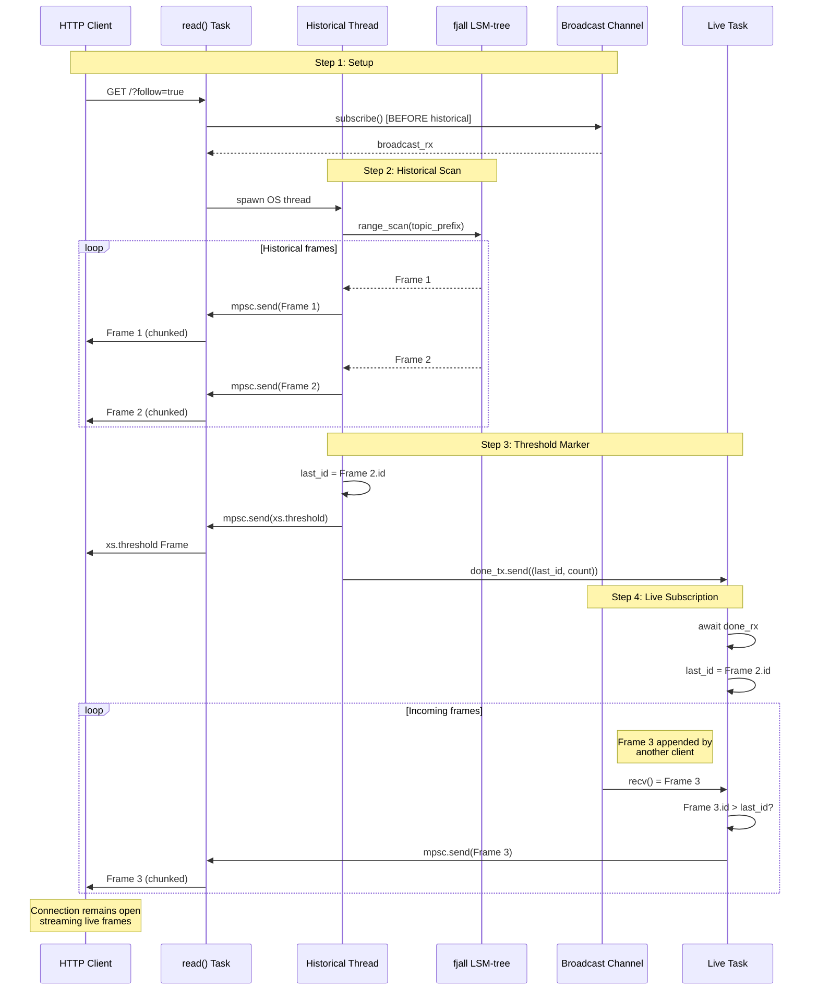

# xs -- Store Broadcasting Deep Dive

A comprehensive analysis of the xs store's internal broadcasting mechanism, the coordination between historical and live data streams, and the architectural decisions that enable reactive event streaming.

**Source**: `/home/darkvoid/Boxxed/@formulas/src.rust/src.llamacpp/src.datastar/xs/src/store/mod.rs`

## Overview

The xs store implements a hybrid streaming model that combines append-only persistence with reactive live broadcasting. When a client subscribes to events, they receive all historical frames matching their query criteria, followed by a `xs.threshold` marker frame, then live frames as they are appended. This architecture enables both event sourcing (replaying past events) and pub/sub (receiving new events in real-time) within a single unified API.

The key challenge: ensuring a client never misses frames between the historical scan and the live subscription, while also preventing duplicate delivery when the same frame appears in both streams.

## The Store Struct

**File**: `xs/src/store/mod.rs:192-201`

```rust
#[derive(Clone)]
pub struct Store {
    pub path: PathBuf,
    db: Database,
    stream: Keyspace,
    idx_topic: Keyspace,
    broadcast_tx: broadcast::Sender<Frame>,
    gc_tx: UnboundedSender<GCTask>,
    append_lock: Arc<Mutex<()>>,
}
```

### Field Breakdown

| Field | Type | Purpose |
|-------|------|---------|
| `path` | `PathBuf` | Root directory for store files (fjall/, cacache/, sock) |
| `db` | `Database` | fjall LSM-tree database handle |
| `stream` | `Keyspace` | Primary keyspace: frame ID -> Frame JSON |
| `idx_topic` | `Keyspace` | Topic index keyspace for efficient queries |
| `broadcast_tx` | `broadcast::Sender<Frame>` | Tokio broadcast channel for live subscribers (capacity 1024) |
| `gc_tx` | `UnboundedSender<GCTask>` | Channel to the GC worker thread |
| `append_lock` | `Arc<Mutex<()>>` | Serializes append operations for SCRU128 monotonicity |

**Aha**: The `Store` uses interior mutability via `Arc` wrapping. This allows cheap cloning (`Store` is `#[derive(Clone)]`) - each clone just increments reference counts. The actual database, keyspaces, and channels are all behind `Arc` internally.

## The Broadcast Channel (Capacity 1024)

**File**: `xs/src/store/mod.rs:236`

```rust
let (broadcast_tx, _) = broadcast::channel(1024);
```

The broadcast channel is the heart of xs's reactive streaming. It uses `tokio::sync::broadcast` with a capacity of 1024 frames. When a frame is appended, it's sent to this channel, and all active subscribers receive it.

### How Broadcast Works

```rust
// On append
let _ = self.broadcast_tx.send(frame.clone());

// On read with follow
let broadcast_rx = self.broadcast_tx.subscribe();
```

The `broadcast::channel` creates a multi-producer, multi-consumer channel where each message is received by all current receivers. If a receiver lags behind (its buffer fills), it's dropped with a `Lagged` error.

**Aha**: The underscore prefix `let _ =` is intentional - the broadcast send can fail if there are no receivers (returns `Err(SendError)`), which is fine. The frame is already persisted; broadcast is best-effort for live subscribers.

### Buffer Size Tradeoff

1024 frames is approximately 1 second of buffer at typical throughput:
- Each frame is small (JSON metadata, ~100-500 bytes)
- At 1000 frames/sec, the buffer holds ~1 second
- Slow subscribers that fall behind more than 1 second get dropped
- This prevents unbounded memory growth from slow consumers

## The read() Method: Coordinating Historical + Live

**File**: `xs/src/store/mod.rs:262-463`

The `read()` method is the most complex function in xs. It handles:
1. Historical frame iteration (from disk)
2. Live frame subscription (from broadcast)
3. The `xs.threshold` marker between them
4. Deduplication logic
5. Optional heartbeat generation

### read() Implementation Walkthrough

```rust
pub async fn read(&self, options: ReadOptions) -> tokio::sync::mpsc::Receiver<Frame> {
    let (tx, rx) = tokio::sync::mpsc::channel(100);

    let should_follow = matches!(
        options.follow,
        FollowOption::On | FollowOption::WithHeartbeat(_)
    );

    // Step 1: Subscribe to broadcast BEFORE starting historical scan
    let broadcast_rx = if should_follow {
        Some(self.broadcast_tx.subscribe())
    } else {
        None
    };
```

**Critical ordering**: The broadcast subscription happens BEFORE the historical scan starts. This ensures no frames are lost in the window between "last historical frame" and "subscription active."

```rust
    // Step 2: Spawn OS thread for historical processing
    let done_rx = if !options.new {
        let (done_tx, done_rx) = tokio::sync::oneshot::channel();
        // ... clone needed values ...
        
        std::thread::spawn(move || {
            let mut last_id = None;
            let mut count = 0;

            // Handle --last N: get N most recent frames
            if let Some(last_n) = options.last {
                // Reverse iteration, collect last N, reverse back
            } else {
                // Normal forward iteration
                let iter = /* ... create iterator based on options ... */;
                
                for frame in iter {
                    // Skip expired TTL::Time frames
                    if let Some(TTL::Time(ttl)) = frame.ttl.as_ref() {
                        if is_expired(&frame.id, ttl) {
                            let _ = gc_tx.send(GCTask::Remove(frame.id));
                            continue;
                        }
                    }

                    last_id = Some(frame.id);
                    
                    if let Some(limit) = options.limit {
                        if count >= limit {
                            return;
                        }
                    }

                    if tx_clone.blocking_send(frame).is_err() {
                        return; // Receiver dropped
                    }
                    count += 1;
                }
            }
```

The historical scan runs in a dedicated OS thread (not a Tokio task) because fjall's iterators are synchronous and may block on disk I/O. Using `std::thread::spawn` prevents blocking the async runtime.

```rust
            // Step 3: Send threshold marker if following
            if should_follow_clone {
                let threshold = Frame::builder("xs.threshold")
                    .id(scru128::new())
                    .ttl(TTL::Ephemeral)
                    .build();
                if tx_clone.blocking_send(threshold).is_err() {
                    return;
                }
            }

            // Signal completion with last seen ID
            let _ = done_tx.send((last_id, count));
        });

        Some(done_rx)
    } else {
        None
    };
```

### The Threshold Frame

The `xs.threshold` frame is a synthetic marker that tells the client: "all historical data sent, switching to live." It's ephemeral (never stored) and has a fresh SCRU128 ID. Clients use this to:

1. Know when to switch from "catching up" to "live" mode
2. Detect gaps (if the next frame's ID is not greater than threshold's ID, something was lost)

### The Live Subscription Loop

```rust
    if let Some(broadcast_rx) = broadcast_rx {
        {
            let tx = tx.clone();
            let limit = options.limit;

            tokio::spawn(async move {
                // Wait for historical processing to complete
                let (last_id, mut count) = match done_rx {
                    Some(done_rx) => match done_rx.await {
                        Ok((id, count)) => (id, count),
                        Err(_) => return,
                    },
                    None => (None, 0),
                };

                let mut broadcast_rx = broadcast_rx;
                while let Ok(frame) = broadcast_rx.recv().await {
```

**Aha**: The live loop waits for `done_rx` before starting. This ensures the `xs.threshold` marker is sent before any live frames, maintaining the strict ordering guarantee.

## Deduplication Logic

**File**: `xs/src/store/mod.rs:423-428`

```rust
                // Skip if we've already seen this frame during historical scan
                if let Some(last_scanned_id) = last_id {
                    if frame.id <= last_scanned_id {
                        continue;
                    }
                }
```

The deduplication check uses SCRU128's time-ordered property. Since SCRU128 IDs are monotonically increasing, any frame with `id <= last_scanned_id` was already sent in the historical stream.

**Aha**: This is why the `append_lock` is critical - without serialized appends, two frames could race and arrive at subscribers out of SCRU128 order, breaking the deduplication invariant.

The comparison `frame.id <= last_scanned_id` handles:
1. Exact duplicates (same ID) - skip
2. Out-of-order arrivals (shouldn't happen with append_lock) - skip
3. Normal case: new frame has higher ID - send

## Heartbeat (xs.pulse) Frames

**File**: `xs/src/store/mod.rs:445-459`

```rust
            if let FollowOption::WithHeartbeat(duration) = options.follow {
                let heartbeat_tx = tx;
                tokio::spawn(async move {
                    loop {
                        tokio::time::sleep(duration).await;
                        let frame = Frame::builder("xs.pulse")
                            .id(scru128::new())
                            .ttl(TTL::Ephemeral)
                            .build();
                        if heartbeat_tx.send(frame).await.is_err() {
                            break;
                        }
                    }
                });
            }
```

When `follow` includes a heartbeat duration, xs spawns a separate task that sends `xs.pulse` frames at the specified interval. These are ephemeral (not stored) and serve to:

1. Keep connections alive through proxies/load balancers
2. Detect dead connections early
3. Give clients a "clock tick" for timeouts

The pulse interval is configured via query parameter: `?follow=5000` for 5-second heartbeats.

## The GC Worker and GCTask Enum

**File**: `xs/src/store/mod.rs:185-190`

```rust
#[derive(Debug)]
enum GCTask {
    Remove(Scru128Id),
    CheckLastTTL { topic: String, keep: u32 },
    Drain(tokio::sync::oneshot::Sender<()>),
}
```

The GC worker is a dedicated OS thread that handles asynchronous cleanup:

| Task | Purpose |
|------|---------|
| `Remove(id)` | Delete a specific frame from stream and all indexes |
| `CheckLastTTL { topic, keep }` | Enforce `TTL::Last(n)` by keeping only N newest frames |
| `Drain(tx)` | Synchronization: signal when all pending tasks complete |

**File**: `xs/src/store/mod.rs:796-830`

```rust
fn spawn_gc_worker(mut gc_rx: UnboundedReceiver<GCTask>, store: Store) {
    std::thread::spawn(move || {
        while let Some(task) = gc_rx.blocking_recv() {
            match task {
                GCTask::Remove(id) => {
                    let _ = store.remove(&id);
                }

                GCTask::CheckLastTTL { topic, keep } => {
                    let prefix = idx_topic_key_prefix(&topic);
                    let frames_to_remove: Vec<_> = store
                        .idx_topic
                        .prefix(&prefix)
                        .rev() // Scan from newest to oldest
                        .skip(keep as usize)
                        .filter_map(|guard| { /* extract frame ID */ })
                        .collect();

                    for frame_id in frames_to_remove {
                        let _ = store.remove(&frame_id);
                    }
                }

                GCTask::Drain(tx) => {
                    let _ = tx.send(());
                }
            }
        }
    });
}
```

**Aha**: The `CheckLastTTL` logic iterates in reverse (newest first), skips the `keep` newest entries, and removes everything else. This efficiently maintains only the N most recent frames per topic.

## TTL::Time Expiry (Lazy Detection)

**File**: `xs/src/store/mod.rs:832-841`

```rust
fn is_expired(id: &Scru128Id, ttl: &Duration) -> bool {
    let created_ms = id.timestamp();
    let expires_ms = created_ms.saturating_add(ttl.as_millis() as u64);
    let now_ms = std::time::SystemTime::now()
        .duration_since(std::time::UNIX_EPOCH)
        .unwrap()
        .as_millis() as u64;

    now_ms >= expires_ms
}
```

`TTL::Time` frames are **lazily expired** during reads:

1. Frame is stored with its TTL duration
2. On read, check if `now > frame_timestamp + ttl`
3. If expired, skip the frame and schedule `GCTask::Remove`
4. Frame may briefly appear in prefix scans before GC runs

**Aha**: This design trades off storage efficiency for read performance. No background sweeper needed - expired frames are discovered organically during normal reads. The `is_expired` function extracts the timestamp from the SCRU128 ID itself, so no extra metadata storage needed.

## The append_lock Mutex

**File**: `xs/src/store/mod.rs:648-674`

```rust
pub fn append(&self, mut frame: Frame) -> Result<Frame, crate::error::Error> {
    // Serialize all appends to ensure ID generation, write, and broadcast
    // happen atomically. This guarantees subscribers receive frames in
    // scru128 ID order.
    let _guard = self.append_lock.lock().unwrap();

    frame.id = scru128::new();

    // Check for null byte in topic
    idx_topic_key_from_frame(&frame)?;

    // Only store if not ephemeral
    if frame.ttl != Some(TTL::Ephemeral) {
        self.insert_frame(&frame)?;

        // If TTL::Last, schedule GC task
        if let Some(TTL::Last(n)) = frame.ttl {
            let _ = self.gc_tx.send(GCTask::CheckLastTTL {
                topic: frame.topic.clone(),
                keep: n,
            });
        }
    }

    let _ = self.broadcast_tx.send(frame.clone());
    Ok(frame)
}
```

**Aha**: The `append_lock` is essential for correctness. Without it:

1. Two concurrent appends could generate SCRU128 IDs out of order (time moves backward on one thread)
2. The broadcast could happen before the write completes (subscribers see frames that don't exist on disk yet)
3. Deduplication in `read()` would fail (assumes SCRU128 monotonicity)

The lock serializes: ID generation -> disk write -> broadcast. This is a brief hold (microseconds) but ensures consistency.

## Store Recovery on Restart

**File**: `xs/src/store/mod.rs:203-253`

```rust
pub fn new(path: PathBuf) -> Result<Store, StoreError> {
    let db = match Database::builder(path.join("fjall"))
        .cache_size(32 * 1024 * 1024)
        .worker_threads(1)
        .open()
    {
        Ok(db) => db,
        Err(FjallError::Locked) => return Err(StoreError::Locked),
        Err(e) => return Err(StoreError::Other(e)),
    };

    // Open keyspaces...
    let stream = db.keyspace("stream", stream_opts).unwrap();
    let idx_topic = db.keyspace("idx_topic", idx_opts).unwrap();

    // Create NEW broadcast channel (old one is gone)
    let (broadcast_tx, _) = broadcast::channel(1024);
    
    // Spawn GC worker
    let (gc_tx, gc_rx) = mpsc::unbounded_channel();
    // ...
}
```

On restart:

1. **fjall recovery**: The LSM-tree automatically replays its WAL
2. **Fresh broadcast channel**: Old subscribers are gone, new ones subscribe to fresh channel
3. **GC worker respawned**: New thread, new queue
4. **No persisted subscriber state**: Clients must reconnect and resume from their last seen ID

**Aha**: The ephemeral nature of the broadcast channel means xs is stateless regarding live subscriptions. Recovery is simply reopening the database and creating new channels. This makes restarts cheap and predictable.

## nu_modules_at: Point-in-Time Module Loading

**File**: `xs/src/store/mod.rs:534-551`

```rust
pub fn nu_modules_at(
    &self,
    as_of: &Scru128Id,
) -> std::collections::HashMap<String, ssri::Integrity> {
    let mut modules = std::collections::HashMap::new();
    let options = ReadOptions::builder().follow(FollowOption::Off).build();
    for frame in self.read_sync(options) {
        if frame.id > *as_of {
            break;
        }
        if let Some(hash) = frame.hash {
            if frame.topic.ends_with(".nu") {
                modules.insert(frame.topic, hash);
            }
        }
    }
    modules
}
}
```

This function scans the entire stream up to a specific point (`as_of`) and returns a mapping of `.nu` topic names to their CAS hashes. This enables:

1. **Time-travel debugging**: Load modules as they existed at frame X
2. **Reproducible evaluation**: Re-run Nushell scripts with the exact module versions from a specific moment
3. **Module versioning**: Topics ending in `.nu` are treated as module definitions

**Aha**: The function uses `read_sync` (blocking) and iterates until `frame.id > *as_of`. SCRU128 time-ordering makes this efficient - it's a simple prefix scan that stops when IDs exceed the threshold. The HashMap automatically handles duplicate topics (later frames overwrite earlier ones), giving the "latest as of" semantics.

## Sequence Diagram: Historical → Threshold → Live



## Flowchart: Append Process

```mermaid
flowchart TD
    A[Client calls POST /append/topic] --> B[API receives request]
    B --> C[Stream body to CAS]
    C --> D[Create Frame with hash]
    D --> E[Store::append(frame)]

    E --> F{Acquire append_lock}
    F -->|Locked| G[Wait]
    F -->|Acquired| H[Generate SCRU128 ID]
    G --> F

    H --> I{Ephemeral?}
    I -->|No| J[insert_frame to fjall]
    I -->|Yes| K

    J --> J1{Last TTL?}
    J1 -->|Yes| J2[Send CheckLastTTL to GC]
    J1 -->|No| K
    J2 --> K

    K[Broadcast frame] --> L{Send succeeded?}
    L -->|Yes| M[Release lock]
    L -->|No| M
    L -->|No| N[Log broadcast failure]
    N --> M

    M --> O[Return Frame with ID]
    O --> P[Client receives response]
```

## Cross-References

- [02-storage-engine.md](02-storage-engine.md) - fjall configuration, keyspace options, on-disk layout
- [03-frame-model.md](03-frame-model.md) - Frame struct, TTL policies, ReadOptions
- [04-scru128-ids.md](04-scru128-ids.md) - SCRU128 ID generation and monotonicity
- [06-api-transport.md](06-api-transport.md) - HTTP API that calls store.read()
- [07-processor-system.md](07-processor-system.md) - How processors subscribe to streams
- [12-http-router-deep-dive.md](12-http-router-deep-dive.md) - HTTP routing and query parsing

## Next Steps

After understanding the store broadcasting mechanism:

1. **API Transport** - How HTTP/Unix/TCP/Iroh listeners connect to the store ([06-api-transport.md](06-api-transport.md))
2. **Processor System** - How actors and services consume from the broadcast stream ([07-processor-system.md](07-processor-system.md))
3. **Nushell Integration** - How `nu_modules_at` enables time-travel evaluation ([08-nushell-integration.md](08-nushell-integration.md))
