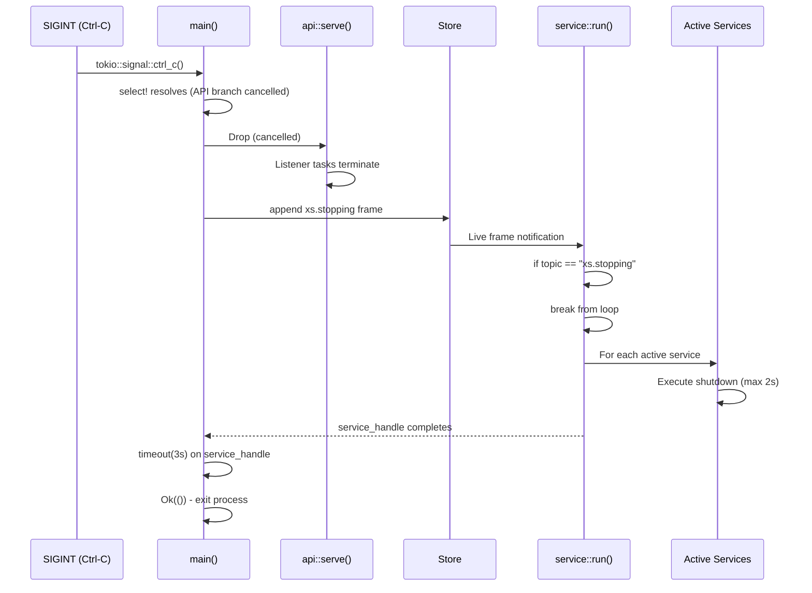

# xs -- Server Lifecycle Deep Dive

## Overview

The xs server lifecycle is a carefully orchestrated sequence of initialization, service startup, graceful shutdown, and resource cleanup. Understanding this lifecycle is essential for operators deploying xs in production and developers extending the system. This document traces the exact execution path from `xs serve` invocation to final process termination.

## The Entry Point: main.rs

**File**: `/home/darkvoid/Boxxed/@formulas/src.rust/src.llamacpp/src.datastar/xs/src/main.rs:262-312`

The server lifecycle begins in the `main()` function, which is annotated with `#[tokio::main]` for the async runtime:

```rust
#[tokio::main]
async fn main() -> Result<(), Box<dyn std::error::Error + Send + Sync>> {
    // Install the default rustls crypto provider first
    rustls::crypto::ring::default_provider()
        .install_default()
        .expect("Failed to install rustls crypto provider");

    nu_command::tls::CRYPTO_PROVIDER
        .default()
        .then_some(())
        .expect("failed to set nu command crypto provider");

    let args = Args::parse();
    let addr = extract_addr_from_command(&args.command);
    let res = match args.command {
        Command::Serve(args) => serve(args).await,
        // ... other commands
    };
    // Error handling ...
}
```

The crypto providers must be initialized before any TLS operations. This is a strict requirement enforced by rustls.

## The Command Enum: All CLI Commands

**File**: `/home/darkvoid/Boxxed/@formulas/src.rust/src.llamacpp/src.datastar/xs/src/main.rs:32-60`

The `Command` enum defines all CLI subcommands:

```rust
#[derive(Subcommand, Debug)]
enum Command {
    /// Provides an API to interact with a local store
    Serve(CommandServe),
    /// `cat` the event stream
    Cat(CommandCat),
    /// Append an event to the stream
    Append(CommandAppend),
    /// Retrieve content from Content-Addressable Storage
    Cas(CommandCas),
    /// Store content in Content-Addressable Storage
    CasPost(CommandCasPost),
    /// Remove an item from the stream
    Remove(CommandRemove),
    /// Get the most recent frame for a topic
    Last(CommandLast),
    /// Get a frame by ID
    Get(CommandGet),
    /// Import a frame directly into the store
    Import(CommandImport),
    /// Get the version of the server
    Version(CommandVersion),
    /// Manage the embedded xs.nu module
    Nu(CommandNu),
    /// Generate and manipulate SCRU128 IDs
    Scru128(CommandScru128),
    /// Evaluate a Nushell script with store helper commands available
    Eval(CommandEval),
}
```

## Phase 1: The serve() Function - Server Initialization

**File**: `/home/darkvoid/Boxxed/@formulas/src.rust/src.llamacpp/src.datastar/xs/src/main.rs:314-383`

The `serve()` function orchestrates the entire server startup sequence:

```rust
async fn serve(args: CommandServe) -> Result<(), Box<dyn std::error::Error + Send + Sync>> {
    xs::trace::init();

    tracing::trace!("Starting server with path: {:?}", args.path);

    let store = match Store::new(args.path.clone()) {
        Ok(store) => store,
        Err(StoreError::Locked) => {
            let sock_path = args.path.join("sock");
            eprintln!("store locked: {} (already running)", args.path.display());
            // ... helpful error messages ...
            std::process::exit(1);
        }
        Err(e) => return Err(e.into()),
    };
    let engine = nu::Engine::new()?;
    // ... background tasks ...
}
```

### Store Initialization with Lock Detection

The store is the first component initialized. It attempts to acquire an exclusive lock on the store directory. If another xs server is already running on this store, `StoreError::Locked` is returned and the process exits with a helpful message showing how to connect to the existing server.

### Nu Engine Initialization

**File**: `/home/darkvoid/Boxxed/@formulas/src.rust/src.llamacpp/src.datastar/xs/src/nu/engine.rs:16-33`

The Nushell engine is created next:

```rust
pub struct Engine {
    pub state: EngineState,
}

impl Engine {
    pub fn new() -> Result<Self, Error> {
        let mut engine_state = create_default_context();
        engine_state = add_shell_command_context(engine_state);
        engine_state = add_cli_context(engine_state);

        let init_cwd = std::env::current_dir()?;
        gather_parent_env_vars(&mut engine_state, init_cwd.as_ref());

        Ok(Self {
            state: engine_state,
        })
    }
}
```

The engine initialization:
1. Creates a default Nushell context with core commands
2. Adds shell command context (file operations, etc.)
3. Adds CLI context (interactive features)
4. Gathers environment variables from the parent process

## Phase 2: Background Task Spawning

**File**: `/home/darkvoid/Boxxed/@formulas/src.rust/src.llamacpp/src.datastar/xs/src/main.rs:340-372`

After store and engine initialization, four background tasks are spawned:

### Task 1: log_stream Printer

```rust
{
    let store = store.clone();
    tokio::spawn(async move {
        let _ = xs::trace::log_stream(store).await;
    });
}
```

The `log_stream` task subscribes to all new frames and prints them to stderr in a compact format. This provides real-time visibility into store activity.

### Task 2: Actor Processor

```rust
{
    let store = store.clone();
    tokio::spawn(async move {
        if let Err(e) = xs::processor::actor::run(store).await {
            eprintln!("Actor processor error: {e}");
        }
    });
}
```

### Task 3: Service Processor

```rust
let service_handle = {
    let store = store.clone();
    tokio::spawn(async move {
        if let Err(e) = xs::processor::service::run(store).await {
            eprintln!("Service processor error: {e}");
        }
    })
};
```

Note that `service_handle` is captured separately because the service processor requires special handling during shutdown (see Phase 5).

### Task 4: Action Processor

```rust
{
    let store = store.clone();
    tokio::spawn(async move {
        if let Err(e) = xs::processor::action::run(store).await {
            eprintln!("Action processor error: {e}");
        }
    });
}
```

## Phase 3: Processor Compaction on Startup

**File**: `/home/darkvoid/Boxxed/@formulas/src.rust/src.llamacpp/src.datastar/xs/src/processor/actor/serve.rs:31-80`

All three processors use the same compaction pattern. Here is the actor processor as an example:

```rust
pub async fn run(store: Store) -> Result<(), Box<dyn std::error::Error + Send + Sync>> {
    let rx = store
        .read(ReadOptions::builder().follow(FollowOption::On).build())
        .await;
    let mut lifecycle = LifecycleReader::new(rx);
    let mut compacted: HashMap<String, Frame> = HashMap::new();

    while let Some(event) = lifecycle.recv().await {
        match event {
            Lifecycle::Historical(frame) => {
                if let Some((topic, suffix)) = frame.topic.rsplit_once('.') {
                    match suffix {
                        "register" => {
                            compacted.insert(topic.to_string(), frame);
                        }
                        "unregister" | "inactive" => {
                            if let Some(meta) = &frame.meta {
                                if let Some(actor_id) =
                                    meta.get("actor_id").and_then(|v| v.as_str())
                                {
                                    if let Some(f) = compacted.get(topic) {
                                        if f.id.to_string() == actor_id {
                                            compacted.remove(topic);
                                        }
                                    }
                                }
                            }
                        }
                        _ => {}
                    }
                }
            }
            Lifecycle::Threshold(_) => {
                let mut ordered: Vec<_> = compacted.drain().collect();
                ordered.sort_by_key(|(_, frame)| frame.id);

                for (topic, frame) in ordered {
                    start_actor(&frame, &store, &topic).await?;
                }
            }
            Lifecycle::Live(frame) => {
                if let Some(topic) = frame.topic.strip_suffix(".register") {
                    start_actor(&frame, &store, topic).await?;
                }
            }
        }
    }

    Ok(())
}
```

### The Compaction Algorithm

Each processor follows this pattern:

1. **Read all historical frames** using `ReadOptions::builder().follow(FollowOption::On)`
2. **Track lifecycle frames** in a `HashMap<String, Frame>`:
   - Actors: `.register` adds, `.unregister`/`.inactive` removes
   - Services: `.spawn` adds, `.terminate` removes
   - Actions: `.define` adds (no removal - last definition wins)
3. **At `xs.threshold`**: Drain the map and spawn processors in order sorted by frame ID
4. **Process live events**: Handle new registrations/spawns/definitions

This compaction means startup time is proportional to the number of processor lifecycle events, not total frame count.

### LifecycleReader: Historical vs Live

**File**: `/home/darkvoid/Boxxed/@formulas/src.rust/src.llamacpp/src.datastar/xs/src/processor/mod.rs:22-52`

```rust
pub enum Lifecycle {
    Historical(Frame),  // Replayed from store on startup
    Threshold(Frame),   // Marks end of historical data
    Live(Frame),        // Real-time new frames
}

pub struct LifecycleReader {
    rx: mpsc::Receiver<Frame>,
    past_threshold: bool,
}

impl LifecycleReader {
    pub async fn recv(&mut self) -> Option<Lifecycle> {
        let frame = self.rx.recv().await?;
        if !self.past_threshold {
            if frame.topic == "xs.threshold" {
                self.past_threshold = true;
                return Some(Lifecycle::Threshold(frame));
            }
            return Some(Lifecycle::Historical(frame));
        }
        Some(Lifecycle::Live(frame))
    }
}
```

## Phase 4: Listener Binding and xs.start Frame

**File**: `/home/darkvoid/Boxxed/@formulas/src.rust/src.llamacpp/src.datastar/xs/src/api.rs:422-465`

The `serve()` function in `api.rs` handles listener binding:

```rust
pub async fn serve(
    store: Store,
    engine: nu::Engine,
    expose: Option<String>,
) -> Result<(), BoxError> {
    let path = store.path.join("sock").to_string_lossy().to_string();
    let listener = Listener::bind(&path).await?;

    let mut listeners = vec![listener];
    let mut expose_meta = None;

    if let Some(expose) = expose {
        let expose_listener = Listener::bind(&expose).await?;

        // Check if this is an iroh listener and get the ticket
        if let Some(ticket) = expose_listener.get_ticket() {
            expose_meta = Some(serde_json::json!({"expose": format!("iroh://{}", ticket)}));
        } else {
            expose_meta = Some(serde_json::json!({"expose": expose}));
        }

        listeners.push(expose_listener);
    }

    if let Err(e) = store.append(Frame::builder("xs.start").maybe_meta(expose_meta).build()) {
        tracing::error!("Failed to append xs.start frame: {}", e);
    }

    // ... spawn listener tasks ...
}
```

### How xs.start Frame is Appended with Expose Metadata

The `xs.start` frame includes metadata about any exposed listeners:

| `--expose` Value | Metadata Format |
|-----------------|-----------------|
| `:8080` (TCP) | `{"expose": ":8080"}` |
| `/tmp/xs.sock` (Unix) | `{"expose": "/tmp/xs.sock"}` |
| `iroh://` (Iroh) | `{"expose": "iroh://<ticket>"}` |

This allows clients to discover the server's listening address by reading the `xs.start` frame.

### Listener Binding Logic

**File**: `/home/darkvoid/Boxxed/@formulas/src.rust/src.llamacpp/src.datastar/xs/src/listener.rs:296-338`

```rust
pub async fn bind(addr: &str) -> io::Result<Self> {
    if addr.starts_with("iroh://") {
        // Iroh P2P endpoint with ticket generation
        let secret_key = get_or_create_secret()?;
        let endpoint = Endpoint::builder()
            .alpns(vec![ALPN.to_vec()])
            .relay_mode(RelayMode::Default)
            .secret_key(secret_key)
            .bind()
            .await?;
        // ... create ticket ...
        Ok(Listener::Iroh(endpoint, ticket))
    } else if addr.starts_with('/') || addr.starts_with('.') || is_windows_path(addr) {
        // Unix domain socket (removed first if exists)
        let _ = std::fs::remove_file(addr);
        let listener = UnixListener::bind(addr)?;
        Ok(Listener::Unix(listener))
    } else {
        // TCP (":PORT" expands to "127.0.0.1:PORT")
        let mut addr = addr.to_owned();
        if addr.starts_with(':') {
            addr = format!("127.0.0.1{addr}");
        };
        let listener = TcpListener::bind(addr).await?;
        Ok(Listener::Tcp(listener))
    }
}
```

## Phase 5: Signal Handling and Graceful Shutdown

**File**: `/home/darkvoid/Boxxed/@formulas/src.rust/src.llamacpp/src.datastar/xs/src/main.rs:374-382`

The main server loop uses `tokio::select!` for graceful shutdown:

```rust
tokio::select! {
    res = xs::api::serve(store.clone(), engine.clone(), args.expose) => { res?; }
    _ = tokio::signal::ctrl_c() => {}
}

store.append(xs::store::Frame::builder("xs.stopping").build())?;
let _ = tokio::time::timeout(Duration::from_secs(3), service_handle).await;
```

### Shutdown Sequence

1. **SIGINT received**: `tokio::signal::ctrl_c()` resolves
2. **Break from select**: The `api::serve()` task is dropped
3. **xs.stopping frame**: Appended to signal all processors
4. **3-second drain**: Wait for service processor to complete
5. **Exit**: Process terminates

### xs.stopping Frame and Service Drain

**File**: `/home/darkvoid/Boxxed/@formulas/src.rust/src.llamacpp/src.datastar/xs/src/processor/service/serve.rs:84-103`

```rust
Lifecycle::Live(frame) => {
    if frame.topic == "xs.stopping" {
        break;
    }
    // ... handle other frames ...
}
```

The service processor specifically watches for `xs.stopping`:

```rust
let deadline = tokio::time::Instant::now() + Duration::from_secs(2);
for (_, handle) in active {
    let remaining = deadline.saturating_duration_since(tokio::time::Instant::now());
    let _ = tokio::time::timeout(remaining, handle).await;
}
```

When `xs.stopping` is received:
1. The service processor breaks from its main loop
2. It waits up to 2 seconds for active services to complete
3. Each service task is awaited with a timeout

**Aha**: The 3-second timeout in `main.rs` is longer than the 2-second timeout in `service/serve.rs` by design. This gives services 2 seconds to shut down gracefully while leaving 1 second of buffer for cleanup before the process exits.

## Phase 6: Listener Loop and Error Handling

**File**: `/home/darkvoid/Boxxed/@formulas/src.rust/src.llamacpp/src.datastar/xs/src/api.rs:467-499`

The `listener_loop` function handles incoming connections:

```rust
async fn listener_loop(
    mut listener: Listener,
    store: Store,
    engine: nu::Engine,
) -> Result<(), BoxError> {
    loop {
        let (stream, _) = listener.accept().await?;
        let io = TokioIo::new(stream);
        let store = store.clone();
        let engine = engine.clone();
        tokio::task::spawn(async move {
            if let Err(err) = http1::Builder::new()
                .serve_connection(
                    io,
                    service_fn(move |req| handle(store.clone(), engine.clone(), req)),
                )
                .await
            {
                // Match against the error kind to selectively ignore `NotConnected` errors
                if let Some(std::io::ErrorKind::NotConnected) = err.source().and_then(|source| {
                    source
                        .downcast_ref::<std::io::Error>()
                        .map(|io_err| io_err.kind())
                }) {
                    // ignore the NotConnected error, hyper's way of saying the client disconnected
                } else {
                    // todo, Handle or log other errors
                    tracing::error!("TBD: {:?}", err);
                }
            }
        });
    }
}
```

### NotConnected Error Filtering

**Aha**: The `NotConnected` error is filtered intentionally. This is hyper's way of signaling that the client disconnected before the server finished sending the response. It is not an error condition - it is normal client behavior (e.g., client received what it needed and closed the connection).

The error chain traversal:
1. `err.source()` - Get the error cause
2. `.downcast_ref::<std::io::Error>()` - Try to cast to IO error
3. `.map(|io_err| io_err.kind())` - Extract the error kind
4. Compare to `NotConnected`

## Sequence Diagram: Startup

```mermaid
sequenceDiagram
    participant Main as main()
    participant Store as Store::new()
    participant Trace as trace::init()
    participant Nu as nu::Engine
    participant Log as log_stream task
    participant Actor as actor::run()
    participant Service as service::run()
    participant Action as action::run()
    participant API as api::serve()
    participant Listener as Listener::bind()

    Main->>Trace: Initialize tracing
    Main->>Store: Open store at path
    alt Store locked
        Store-->>Main: StoreError::Locked
        Main->>Main: eprintln (helpful msg)
        Main->>Main: exit(1)
    end
    Main->>Nu: Engine::new()
    Nu->>Nu: create_default_context()
    Nu->>Nu: add_shell_command_context()
    Nu->>Nu: add_cli_context()
    Nu->>Nu: gather_parent_env_vars()
    Nu-->>Main: Engine ready

    Main->>Log: spawn(log_stream)
    Log->>Store: read(follow=on, new=true)
    Log->>Log: print frames to stderr

    Main->>Actor: spawn(actor::run)
    Actor->>Store: read(follow=on)
    Actor->>Actor: Compact historical .register/.unregister
    Actor->>Actor: Start active actors at threshold

    Main->>Service: spawn(service::run)
    Service->>Store: read(follow=on)
    Service->>Service: Compact historical .spawn/.terminate
    Service->>Service: Start active services at threshold
    Main-->>Service: Capture handle

    Main->>Action: spawn(action::run)
    Action->>Store: read(follow=on)
    Action->>Action: Compact historical .define
    Action->>Action: Register active actions at threshold

    Main->>API: api::serve(store, engine, expose)
    API->>Listener: bind(path/sock)
    alt expose provided
        API->>Listener: bind(expose)
    end
    API->>Store: append xs.start (with expose meta)
    API->>API: Spawn listener_loop tasks
    API-->>Main: Running (select! branch)
```

## Sequence Diagram: Shutdown



## How Graceful Shutdown Propagates Through Tasks

| Task | Shutdown Behavior | Cleanup |
|------|-------------------|---------|
| `api::serve()` | Cancelled via select! | Listeners dropped, connections close |
| `log_stream` | Cancelled when store read ends | Frame receiver dropped |
| `actor::run()` | Receives `xs.stopping` as Live frame | Continues processing until channel closes |
| `service::run()` | Breaks on `xs.stopping`, drains services | 2s timeout for each active service |
| `action::run()` | Receives `xs.stopping` as Live frame | Continues processing until channel closes |

## Key Files Summary

| File | Purpose |
|------|---------|
| `src/main.rs:314-383` | `serve()` function - orchestrates startup/shutdown |
| `src/main.rs:32-60` | `Command` enum - all CLI commands |
| `src/api.rs:422-465` | API server and `xs.start` frame emission |
| `src/api.rs:467-499` | `listener_loop()` with NotConnected handling |
| `src/nu/engine.rs:16-33` | Nu Engine initialization |
| `src/processor/mod.rs:22-52` | `Lifecycle` enum and `LifecycleReader` |
| `src/processor/actor/serve.rs:31-80` | Actor compaction and startup |
| `src/processor/service/serve.rs:56-104` | Service compaction and shutdown handling |
| `src/processor/action/serve.rs:236-287` | Action compaction and execution |
| `src/trace.rs:347-359` | `log_stream()` printer task |
| `src/listener.rs:296-338` | Transport binding (Unix/TCP/Iroh) |

## Next

- Learn about the [Storage Engine](02-storage-engine.md) for details on store initialization and locking
- Explore the [Processor System](07-processor-system.md) for deep dives into actors, services, and actions
- Read the [API & Transport](06-api-transport.md) document for HTTP routes and transport details
- See [CLI Commands](09-cli-commands.md) for all available subcommands and flags
