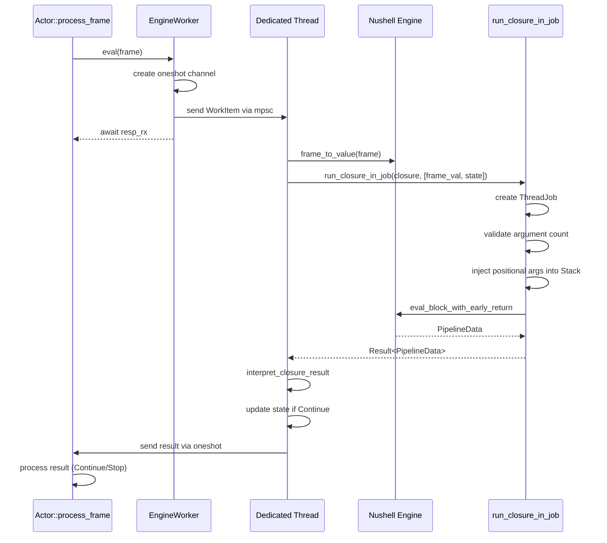
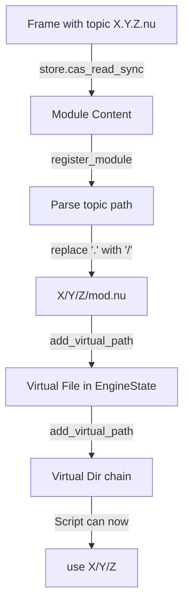

# xs -- Nushell Integration Internals Deep Dive

Nushell integration in xs (cross.stream) is not a thin wrapper around a shell. It is a deeply embedded runtime that executes user-defined closures for every processor type: actors, services, and actions. The integration bridges Nushell's value-oriented pipeline model with xs's stream-based event architecture.

## Overview

xs embeds a full Nushell runtime that powers all event-driven processors. This document explores the internal architecture: how the engine initializes, why thread safety requires the EngineWorker pattern, how closures execute in background jobs, and the virtual file system that enables dynamic module loading.

## Engine::new() Initialization

**Source**: `/home/darkvoid/Boxxed/@formulas/src.rust/src.llamacpp/src.datastar/xs/src/nu/engine.rs:21-33`

The `Engine` struct wraps Nushell's `EngineState` and provides the primary interface for parsing, evaluating, and executing closures.

```rust
#[derive(Clone)]
pub struct Engine {
    pub state: EngineState,
}

impl Engine {
    pub fn new() -> Result<Self, Error> {
        let mut engine_state = create_default_context();
        engine_state = add_shell_command_context(engine_state);
        engine_state = add_cli_context(engine_state);

        let init_cwd = std::env::current_dir()?;
        gather_parent_env_vars(&mut engine_state, init_cwd.as_ref());

        Ok(Self { state: engine_state })
    }
}
```

The initialization sequence matters:

1. **`create_default_context()`** - Core language commands (let, def, if, for, etc.)
2. **`add_shell_command_context()`** - Shell operations (ls, cd, open, etc.)
3. **`add_cli_context()`** - CLI-specific features (history, completion, etc.)
4. **`gather_parent_env_vars()`** - Inherits environment from parent process

This layered approach gives scripts full Nushell capabilities while maintaining isolation from the host system.

## Why EngineState is Not Send

**Aha**: `EngineState` does not implement `Send`. This is a fundamental constraint from Nushell's architecture. The state contains raw pointers, RefCell instances, and other thread-unsafe interior mutability. You cannot move an `EngineState` between threads.

```rust
// This WILL NOT compile:
tokio::spawn(async move {
    engine.eval(input, script);  // Error: EngineState is not Send
});
```

This constraint shapes the entire xs architecture. The obvious pattern -- create an engine, spawn async tasks that use it -- is impossible. Instead, xs uses two patterns:

1. **Synchronous execution** in services (the HTTP handler borrows the engine for the request duration)
2. **Dedicated OS thread** with message passing for actors (the `EngineWorker` pattern)

The `EngineWorker` pattern is the clever solution: instead of moving the engine between threads, move the work to the thread that owns the engine.

## Engine Initialization

**File**: `/home/darkvoid/Boxxed/@formulas/src.rust/src.llamacpp/src.datastar/xs/src/nu/engine.rs`

The `Engine` struct wraps Nushell's `EngineState`:

```rust
#[derive(Clone)]
pub struct Engine {
    pub state: EngineState,
}
```

### Engine::new() - The Initialization Sequence

```rust
impl Engine {
    pub fn new() -> Result<Self, Error> {
        let mut engine_state = create_default_context();
        engine_state = add_shell_command_context(engine_state);
        engine_state = add_cli_context(engine_state);

        let init_cwd = std::env::current_dir()?;
        gather_parent_env_vars(&mut engine_state, init_cwd.as_ref());

        Ok(Self {
            state: engine_state,
        })
    }
}
```

The initialization layers are:

1. **`create_default_context()`** - Core language commands (let, def, if, etc.)
2. **`add_shell_command_context()`** - Shell operations (ls, cd, open, etc.)
3. **`add_cli_context()`** - CLI-specific features (history, completion, etc.)
4. **`gather_parent_env_vars()`** - Inherits environment from parent process

This layered approach gives scripts full Nushell capabilities while maintaining isolation from the host system.

## The EngineWorker Pattern

**Source**: `/home/darkvoid/Boxxed/@formulas/src.rust/src.llamacpp/src.datastar/xs/src/processor/actor/actor.rs:392-458`

Actors must process frames asynchronously (they subscribe to streams), but the Nushell engine cannot leave the thread where it was created. The `EngineWorker` bridges this gap with a dedicated OS thread and an async channel.

```rust
pub struct EngineWorker {
    work_tx: mpsc::Sender<WorkItem>,
}

struct WorkItem {
    frame: Frame,
    resp_tx: oneshot::Sender<Result<ClosureResult, Error>>,
}

impl EngineWorker {
    pub fn new(
        engine: nu::Engine,
        closure: nu_protocol::engine::Closure,
        initial_state: Value,
    ) -> Self {
        let (work_tx, mut work_rx) = mpsc::channel(32);

        std::thread::spawn(move || {
            let mut engine = engine;
            let mut state = initial_state;

            while let Some(WorkItem { frame, resp_tx }) = work_rx.blocking_recv() {
                let frame_val =
                    crate::nu::frame_to_value(&frame, nu_protocol::Span::unknown(), false);

                let pipeline = engine.run_closure_in_job(
                    &closure,
                    vec![frame_val, state.clone()],
                    None,
                    format!("actor {topic}", topic = frame.topic),
                );

                let result = pipeline
                    .map_err(|e| {
                        let working_set = nu_protocol::engine::StateWorkingSet::new(&engine.state);
                        Error::from(nu_protocol::format_cli_error(None, &working_set, &*e, None))
                    })
                    .and_then(|pd| {
                        pd.into_value(nu_protocol::Span::unknown())
                            .map_err(Error::from)
                    })
                    .and_then(interpret_closure_result);

                if let Ok(ClosureResult::Continue { ref next_state, .. }) = result {
                    state = next_state.clone();
                }

                let _ = resp_tx.send(result);
            }
        });

        Self { work_tx }
    }

    pub async fn eval(&self, frame: Frame) -> Result<ClosureResult, Error> {
        let (resp_tx, resp_rx) = oneshot::channel();
        let work_item = WorkItem { frame, resp_tx };

        self.work_tx
            .send(work_item)
            .await
            .map_err(|_| Error::from("Engine worker thread has terminated"))?;

        resp_rx
            .await
            .map_err(|_| Error::from("Engine worker thread has terminated"))?
    }
}
```

**Key insight**: The `EngineWorker` creates a thread that lives for the actor's lifetime. The engine lives on that thread. Work arrives via `tokio::sync::mpsc`. Results return via `tokio::sync::oneshot`. The actor's async `process_frame` method never touches the engine directly -- it sends a message and awaits the response.

**Aha**: This pattern elegantly solves the `!Send` constraint by keeping the `EngineState` on a single dedicated OS thread, using `mpsc::channel` for async-to-sync communication, using `oneshot::channel` for synchronous responses, and maintaining actor state (the `state` variable) as a local on the thread. This is similar to how browsers run JS engines on dedicated threads, but with Rust's ownership making the boundary explicit.

## Closure Execution Sequence Diagram



## run_closure_in_job: Background Job Execution

**File**: `/home/darkvoid/Boxxed/@formulas/src.rust/src.llamacpp/src.datastar/xs/src/nu/engine.rs` (lines 178-284)

The `run_closure_in_job` method executes closures with full job tracking:

```rust
pub fn run_closure_in_job(
    &mut self,
    closure: &nu_protocol::engine::Closure,
    args: Vec<Value>,
    pipeline_input: Option<PipelineData>,
    job_name: impl Into<String>,
) -> Result<PipelineData, Box<ShellError>> {
    let job_display_name = job_name.into();

    // Create & register job (boilerplate)
    let (sender, _rx) = std::sync::mpsc::channel();
    let job = ThreadJob::new(
        self.state.signals().clone(),
        Some(job_display_name.clone()),
        sender,
    );
    let _job_id = {
        let mut j = self.state.jobs.lock().unwrap();
        j.add_job(Job::Thread(job.clone()))
    };

    // Temporarily attach the job to self.state
    let saved_bg_job = self.state.current_job.background_thread_job.clone();
    self.state.current_job.background_thread_job = Some(job.clone());

    // Prepare stack & validate/inject positional arguments
    let block = self.state.get_block(closure.block_id);
    let mut stack = Stack::new();
    let mut stack = stack.push_redirection(Some(Redirection::Pipe(OutDest::PipeSeparate)), None);

    // Validate argument count
    let num_required = block.signature.required_positional.len();
    let num_optional = block.signature.optional_positional.len();
    // ... validation logic ...

    // Inject provided positional args
    for (i, val) in args.iter().enumerate() {
        let param = if i < num_required {
            &block.signature.required_positional[i]
        } else {
            &block.signature.optional_positional[i - num_required]
        };
        if let Some(var_id) = param.var_id {
            stack.add_var(var_id, val.clone());
        }
    }

    // Set default values for optional params not covered
    let optional_covered = args.len().saturating_sub(num_required);
    for i in optional_covered..num_optional {
        let param = &block.signature.optional_positional[i];
        if let Some(var_id) = param.var_id {
            let default = param.default_value.clone()
                .unwrap_or_else(|| Value::nothing(Span::unknown()));
            stack.add_var(var_id, default);
        }
    }

    // Execute with eval_block_with_early_return
    let eval_res = nu_engine::eval_block_with_early_return::<WithoutDebug>(
        &self.state,
        &mut stack,
        block,
        eval_pipeline_input,
    );

    // Merge env, restore job, cleanup
    if eval_res.is_ok() {
        if let Err(e) = self.state.merge_env(&mut stack) { /* ... */ }
    }
    self.state.current_job.background_thread_job = saved_bg_job;
    eval_res.map(|exec_data| exec_data.body).map_err(Box::new)
}
```

Key aspects:

1. **Job Registration**: Creates a `ThreadJob` with signal handling and registers it in `EngineState.jobs`
2. **Argument Injection**: Manually binds positional arguments to the closure's variables
3. **Default Handling**: Injects default values for optional parameters not provided
4. **Early Return Support**: Uses `eval_block_with_early_return` for `return` statement support
5. **Environment Merge**: Persists any environment changes made by the closure
6. **Cleanup**: Always restores the saved background job state

## Custom Commands Reference

All custom commands are prefixed with `.` to avoid collisions with built-in Nushell commands.

### .append (Direct vs Buffered)

**Direct** (`/home/darkvoid/Boxxed/@formulas/src.rust/src.llamacpp/src.datastar/xs/src/nu/commands/append_command.rs`): Used by services, actions, and eval. Writes immediately to the store.

```rust
impl Command for AppendCommand {
    fn name(&self) -> &str { ".append" }
    
    fn signature(&self) -> Signature {
        Signature::build(".append")
            .input_output_types(vec![(Type::Any, Type::Any)])
            .required("topic", SyntaxShape::String, "this clip's topic")
            .named("meta", SyntaxShape::Record(vec![]), "arbitrary metadata", None)
            .named("ttl", SyntaxShape::String, "TTL specification", None)
            .switch("with-timestamp", "include timestamp extracted from frame ID", None)
    }

    fn run(&self, engine_state: &EngineState, stack: &mut Stack, call: &Call, input: PipelineData) 
        -> Result<PipelineData, ShellError> {
        // ... extracts flags and input ...
        let hash = util::write_pipeline_to_cas(input, &store, span)?;
        let frame = store.append(Frame::builder(topic).maybe_hash(hash).meta(final_meta).maybe_ttl(ttl).build())?;
        Ok(PipelineData::Value(util::frame_to_value(&frame, span, with_timestamp), None))
    }
}
```

**Buffered** (`/home/darkvoid/Boxxed/@formulas/src.rust/src.llamacpp/src.datastar/xs/src/nu/commands/append_command_buffered.rs`): Used by actors. Buffers frames for batch processing.

```rust
pub struct AppendCommand {
    output: Arc<Mutex<Vec<Frame>>>,  // Shared with actor
    store: Store,
}

fn run(&self, ..., input: PipelineData) -> Result<PipelineData, ShellError> {
    // ... extracts args ...
    let frame = Frame::builder(topic)
        .maybe_meta(meta.map(|v| value_to_json(&v)))
        .maybe_hash(hash)
        .maybe_ttl(ttl)
        .build();
    
    self.output.lock().unwrap().push(frame);  // Buffer, don't write yet
    Ok(PipelineData::Empty)
}
```

### .cas (Content-Addressed Storage)

**File**: `/home/darkvoid/Boxxed/@formulas/src.rust/src.llamacpp/src.datastar/xs/src/nu/commands/cas_command.rs`

Retrieves content by hash:

```rust
fn run(&self, engine_state: &EngineState, stack: &mut Stack, call: &Call, _input: PipelineData) 
    -> Result<PipelineData, ShellError> {
    let span = call.head;
    let hash: String = call.req(engine_state, stack, 0)?;
    let hash: ssri::Integrity = hash.parse().map_err(|e| /* ... */)?;

    let mut reader = self.store.cas_reader_sync(hash).map_err(|e| /* ... */)?;
    let mut contents = Vec::new();
    reader.read_to_end(&mut contents).map_err(|e| /* ... */)?;

    // Try to convert to string if valid UTF-8, otherwise return as binary
    let value = match String::from_utf8(contents.clone()) {
        Ok(string) => Value::string(string, span),
        Err(_) => Value::binary(contents, span),
    };

    Ok(PipelineData::Value(value, None))
}
```

### .cat (Frame Query)

**File**: `/home/darkvoid/Boxxed/@formulas/src.rust/src.llamacpp/src.datastar/xs/src/nu/commands/cat_command.rs`

```rust
fn run(&self, engine_state: &EngineState, stack: &mut Stack, call: &Call, _input: PipelineData) 
    -> Result<PipelineData, ShellError> {
    let limit: Option<usize> = call.get_flag(engine_state, stack, "limit")?;
    let last: Option<usize> = call.get_flag(engine_state, stack, "last")?;
    let after: Option<String> = call.get_flag(engine_state, stack, "after")?;
    let from: Option<String> = call.get_flag(engine_state, stack, "from")?;
    let topic: Option<String> = call.get_flag(engine_state, stack, "topic")?;

    let options = ReadOptions::builder()
        .maybe_after(after.map(|s| s.parse().unwrap()))
        .maybe_from(from.map(|s| s.parse().unwrap()))
        .maybe_limit(limit)
        .maybe_last(last)
        .maybe_topic(topic)
        .build();

    let frames: Vec<_> = self.store.read_sync(options).collect();

    let output = Value::list(
        frames.into_iter()
            .map(|frame| crate::nu::util::frame_to_value(&frame, call.head, with_timestamp))
            .collect(),
        call.head,
    );

    Ok(PipelineData::Value(output, None))
}
```

### .id (SCRU128 Operations)

**File**: `/home/darkvoid/Boxxed/@formulas/src.rust/src.llamacpp/src.datastar/xs/src/nu/commands/scru128_command.rs`

Supports generating, unpacking, and packing IDs:

```rust
fn run(&self, engine_state: &EngineState, stack: &mut Stack, call: &Call, input: PipelineData) 
    -> Result<PipelineData, ShellError> {
    let span = call.head;
    let subcommand: Option<String> = call.opt(engine_state, stack, 0)?;

    match subcommand.as_deref() {
        Some("unpack") => {
            let id_string = get_string_input(call, engine_state, stack, input, span)?;
            let result = crate::scru128::unpack_to_json(&id_string)?;
            let nu_value = util::json_to_value(&result, span);
            let nu_value = convert_timestamp_to_datetime(nu_value, span);
            Ok(PipelineData::Value(nu_value, None))
        }
        Some("pack") => {
            let components = get_record_input(call, engine_state, stack, input, span)?;
            let json_value = util::value_to_json(&components);
            let result = crate::scru128::pack_from_json(json_value)?;
            Ok(PipelineData::Value(Value::string(result, span), None))
        }
        None => {
            let result = crate::scru128::generate()?;
            Ok(PipelineData::Value(Value::string(result, span), None))
        }
    }
}
```

## Virtual File System for *.nu Modules

**File**: `/home/darkvoid/Boxxed/@formulas/src.rust/src.llamacpp/src.datastar/xs/src/nu/vfs.rs`

The VFS enables storing Nushell modules as frames in the event stream:

### Module Loading Architecture



### Implementation

```rust
/// Load modules from a topic->hash map into the engine's VFS.
pub fn load_modules(
    engine_state: &mut EngineState,
    store: &Store,
    modules: &HashMap<String, ssri::Integrity>,
) -> Result<(), Box<dyn std::error::Error + Send + Sync>> {
    for (topic, hash) in modules {
        let name = match topic.strip_suffix(".nu") {
            Some(n) if !n.is_empty() => n,
            _ => continue,
        };
        let content_bytes = store.cas_read_sync(hash)?;
        let content = String::from_utf8(content_bytes)?;
        register_module(engine_state, name, &content)?;
    }
    Ok(())
}

/// Register a single module by name and content into the engine's VFS.
fn register_module(
    engine_state: &mut EngineState,
    name: &str,
    content: &str,
) -> Result<(), Box<dyn std::error::Error + Send + Sync>> {
    let module_path = name.replace('.', "/");
    let mut working_set = StateWorkingSet::new(engine_state);

    // Register <module_path>/mod.nu as a virtual file
    let virt_file_name = format!("{module_path}/mod.nu");
    let file_id = working_set.add_file(virt_file_name.clone(), content.as_bytes());
    let virt_file_id = working_set.add_virtual_path(virt_file_name, VirtualPath::File(file_id));

    // Build directory chain from leaf to root
    let segments: Vec<&str> = module_path.split('/').collect();
    let mut child_id = virt_file_id;

    for depth in (0..segments.len()).rev() {
        let dir_path = if depth == 0 {
            segments[0].to_string()
        } else {
            segments[..=depth].join("/")
        };
        child_id = working_set.add_virtual_path(dir_path, VirtualPath::Dir(vec![child_id]));
    }

    engine_state.merge_delta(working_set.render())?;
    Ok(())
}
```

### Example Module Mapping

| Topic | CAS Hash | Virtual Path | Usage |
|-------|----------|--------------|-------|
| `discord.api.nu` | `sha256-abc...` | `discord/api/mod.nu` | `use discord/api` |
| `utils.strings.nu` | `sha256-def...` | `utils/strings/mod.nu` | `use utils/strings` |
| `app.config.nu` | `sha256-ghi...` | `app/config/mod.nu` | `use app/config` |

## Script Parsing and Evaluation

### The NuScriptConfig Pattern

**File**: `/home/darkvoid/Boxxed/@formulas/src.rust/src.llamacpp/src.datastar/xs/src/nu/config.rs`

All processor scripts must evaluate to a record containing at minimum a `run:` field:

```rust
pub struct NuScriptConfig {
    /// The main executable closure defined by the `run:` field
    pub run_closure: Closure,
    /// The full Nushell Value that the script evaluated to
    pub full_config_value: Value,
}

impl NuScriptConfig {
    /// Deserializes specific options from the full_config_value
    pub fn deserialize_options<T>(&self) -> Result<T, Error>
    where
        T: for<'de> serde::Deserialize<'de>,
    {
        let json_value = value_to_json(&self.full_config_value);
        serde_json::from_value(json_value)
            .map_err(|e| format!("Failed to deserialize script options: {e}").into())
    }
}
```

### parse_config Implementation

```rust
pub fn parse_config(engine: &mut crate::nu::Engine, script: &str) -> Result<NuScriptConfig, Error> {
    let mut working_set = StateWorkingSet::new(&engine.state);
    let block = parse(&mut working_set, None, script.as_bytes(), false);

    // Check for parse/compile errors
    if let Some(err) = working_set.parse_errors.first() { /* ... */ }
    if let Some(err) = working_set.compile_errors.first() { /* ... */ }

    engine.state.merge_delta(working_set.render())?;

    // Evaluate to get the config record
    let mut stack = Stack::new();
    let eval_result = eval_block_with_early_return::<WithoutDebug>(
        &engine.state, &mut stack, &block, PipelineData::empty()
    )?;

    let config_value = eval_result.body.into_value(Span::unknown())?;

    // Extract the 'run' closure
    let run_val = config_value.get_data_by_key("run")
        .ok_or_else(|| -> Error { "Script must define a 'run' closure.".into() })?;
    let run_closure = run_val.as_closure()
        .map_err(|e| -> Error { format!("'run' field must be a closure: {e}").into() })?;

    engine.state.merge_env(&mut stack)?;

    Ok(NuScriptConfig {
        run_closure: run_closure.clone(),
        full_config_value: config_value,
    })
}
```

### Script Examples

**Actor Script**:
```nushell
{
    run: {|frame, state|
        let new_count = ($state | default 0) + 1
        {out: {count: $new_count}, next: $new_count}
    }
    start: "new"
    pulse: 5000
    return_options: {suffix: "out", target: "cas", ttl: "last:10"}
}
```

**Service Script**:
```nushell
{
    run: {||
        .cat --follow --topic "requests.*" | each {|frame|
            .append "responses" --meta {result: "processed"}
        }
    }
    duplex: true
    return_options: {suffix: "recv"}
}
```

## Build Engine Pattern

**File**: `/home/darkvoid/Boxxed/@formulas/src.rust/src.llamacpp/src.datastar/xs/src/processor/mod.rs`

All processors use a common pattern to build their engines:

```rust
pub fn build_engine(
    store: &Store,
    as_of: &Scru128Id,
) -> Result<nu::Engine, Box<dyn std::error::Error + Send + Sync>> {
    let mut engine = nu::Engine::new()?;
    nu::add_core_commands(&mut engine, store)?;
    engine.add_alias(".rm", ".remove")?;
    let modules = store.nu_modules_at(as_of);
    nu::load_modules(&mut engine.state, store, &modules)?;
    Ok(engine)
}
```

Steps:
1. Create new engine with default contexts
2. Add core commands (`.cas`, `.get`, `.remove`, `.id`)
3. Add aliases (`.rm` → `.remove`)
4. Load VFS modules as of the specified frame ID

The `as_of` parameter enables **point-in-time module loading** — actors see modules as they existed at registration time, supporting reproducible execution.

## Type Conversion Bridge

**File**: `/home/darkvoid/Boxxed/@formulas/src.rust/src.llamacpp/src.datastar/xs/src/nu/util.rs`

The util module provides bidirectional conversion between Nushell Values and JSON:

```rust
// JSON to Nushell Value
pub fn json_to_value(json: &serde_json::Value, span: Span) -> Value {
    match json {
        serde_json::Value::Null => Value::nothing(span),
        serde_json::Value::Bool(b) => Value::bool(*b, span),
        serde_json::Value::Number(n) => /* int or float */,
        serde_json::Value::String(s) => Value::string(s, span),
        serde_json::Value::Array(arr) => /* recursive list conversion */,
        serde_json::Value::Object(obj) => /* recursive record conversion */,
    }
}

// Nushell Value to JSON
pub fn value_to_json(value: &Value) -> serde_json::Value {
    match value {
        Value::Nothing { .. } => serde_json::Value::Null,
        Value::Bool { val, .. } => serde_json::Value::Bool(*val),
        Value::Int { val, .. } => (*val).into(),
        Value::Float { val, .. } => serde_json::Number::from_f64(*val).unwrap(),
        Value::String { val, .. } => serde_json::Value::String(val.clone()),
        // ... more variants ...
    }
}

// Frame to Nushell Record
pub fn frame_to_value(frame: &Frame, span: Span, with_timestamp: bool) -> Value {
    let mut record = Record::new();
    record.push("id", Value::string(frame.id.to_string(), span));
    record.push("topic", Value::string(frame.topic.clone(), span));
    if let Some(hash) = &frame.hash { record.push("hash", /* ... */); }
    if let Some(meta) = &frame.meta { record.push("meta", /* ... */); }
    if let Some(ttl) = &frame.ttl { record.push("ttl", /* ... */); }
    if with_timestamp { record.push("timestamp", /* ... */); }
    Value::record(record, span)
}
```

## Summary

The Nushell integration in xs is a sophisticated embedding that addresses several challenges:

| Challenge | Solution |
|-----------|----------|
| EngineState not Send | EngineWorker pattern with dedicated OS thread |
| Stateful actor execution | Mutable `state` local on worker thread |
| Dynamic module loading | Virtual File System mapping topics to module paths |
| Immediate vs buffered output | Separate command implementations (direct vs buffered) |
| Point-in-time reproducibility | `as_of` parameter for module loading |
| Type interoperability | Bidirectional JSON/Value conversion utilities |

The result is a reactive event processing system where Nushell closures become first-class computational units, with full access to the store via custom commands and the ability to maintain state across invocations.

## Cross-Reference

- [08-nushell-integration.md](08-nushell-integration.md) - User-facing documentation
- [07-processor-system.md](07-processor-system.md) - Actor/Service/Action architecture
- [03-frame-model.md](03-frame-model.md) - Frame structure and metadata
- [04-scru128-ids.md](04-scru128-ids.md) - ID generation and timestamp extraction
- [14-server-lifecycle-deep-dive.md](14-server-lifecycle-deep-dive.md) - Server startup and processor spawning
