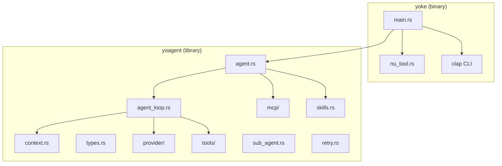
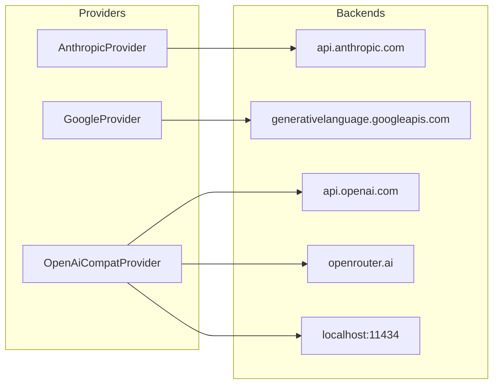
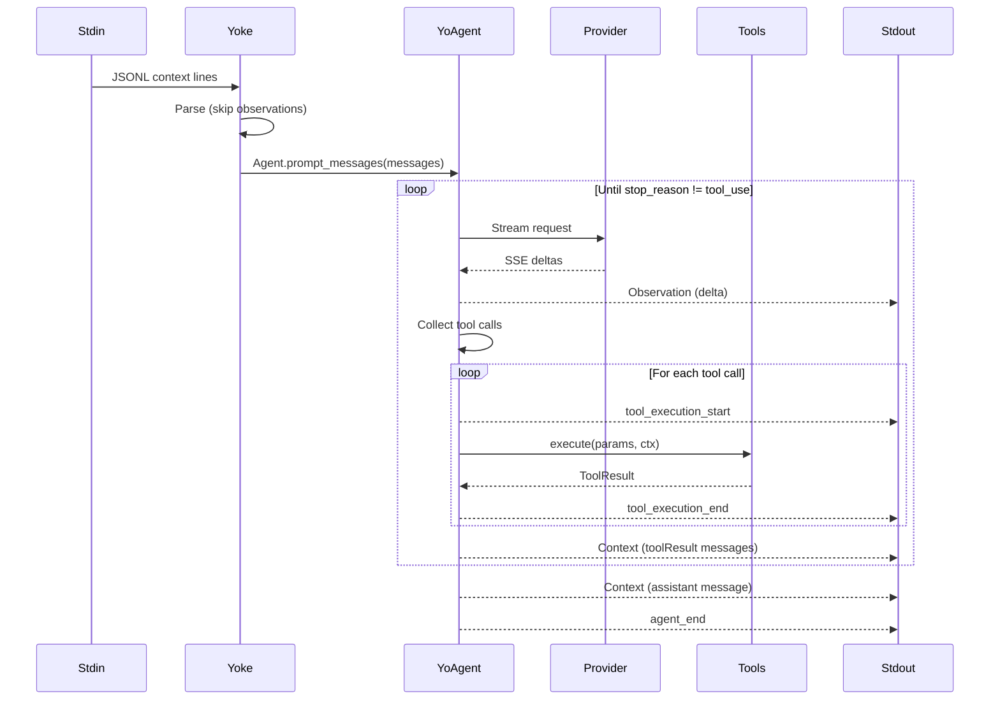

# yoke -- Architecture

## Two-Crate Structure



## yoke Binary (src/main.rs)

The binary handles:
- CLI argument parsing (clap 4)
- JSONL stdin parsing (context lines only, observations skipped)
- Provider/model selection and configuration
- Tool set construction (`--tools` flag)
- Nushell engine configuration (`--plugin`, `-I`, `--config`)
- Event emission (JSONL stdout)
- Skills loading (`--skills`)

### CLI Flags

| Flag | Type | Default | Purpose |
|------|------|---------|---------|
| `--provider` | String | (required) | anthropic, openai, gemini, openrouter, ollama |
| `--model` | String | (required) | Model identifier |
| `--base_url` | String | localhost:11434 | Custom base URL (ollama) |
| `--tools` | String | none | Tool groups/names (comma-separated) |
| `--skills` | String | none | Skill directory paths |
| `--plugin` | Path[] | [] | Nushell plugin binaries |
| `-I` | Path[] | [] | Nushell include paths |
| `--config` | Path | none | Nushell init script |
| `--thinking` | Enum | off | Extended thinking: off/minimal/low/medium/high |
| `--max_turns` | usize/"unlimited" | 50 | Max tool-call loops |
| prompt | String | none | Trailing user message |

## yoagent Library (yoagent/src/lib.rs)

```rust
pub mod agent;       // Stateful Agent struct
pub mod agent_loop;  // Core loop: prompt → stream → tool exec → repeat
pub mod context;     // Token estimation, compaction, execution limits
pub mod mcp;         // MCP (Model Context Protocol) client
pub mod provider;    // Multi-provider streaming (Anthropic, Google, OpenAI-compat)
pub mod retry;       // Retry with exponential backoff
pub mod skills;      // AgentSkills-compatible skill loading
pub mod sub_agent;   // Sub-agent tool (agent-as-tool)
pub mod tools;       // Built-in tools (bash, edit, read, write, search, list)
pub mod types;       // Core types (Message, Content, AgentEvent, etc.)
pub mod openapi;     // OpenAPI spec → tool adapter (feature-gated)
```

## Provider Architecture



Three provider implementations cover all backends:
- `AnthropicProvider` — Anthropic Messages API (native)
- `GoogleProvider` — Google Generative AI API (native)
- `OpenAiCompatProvider` — OpenAI Chat Completions (also used for OpenRouter, Ollama, Azure)

## Data Flow



## Concurrency Model

- **Single tokio runtime** — Multi-threaded (`features = ["full"]`)
- **Event channel** — `mpsc::unbounded_channel` for Agent → stdout printer
- **Tool execution** — Configurable: sequential (default), parallel, or batched
- **Nushell** — Runs on dedicated `spawn_blocking` thread (engine not Send)
- **Streaming** — SSE events processed as they arrive via `reqwest-eventsource`

## Agent Struct

```rust
pub struct Agent {
    // Identity
    pub system_prompt: String,
    pub model: String,
    pub api_key: String,
    pub thinking_level: ThinkingLevel,
    
    // State
    messages: Vec<AgentMessage>,
    tools: Vec<Box<dyn AgentTool>>,
    provider: Arc<dyn StreamProvider>,
    
    // Queues (for mid-run steering)
    steering_queue: Arc<Mutex<Vec<AgentMessage>>>,
    follow_up_queue: Arc<Mutex<Vec<AgentMessage>>>,
    
    // Configuration
    pub context_config: Option<ContextConfig>,
    pub execution_limits: Option<ExecutionLimits>,
    pub cache_config: CacheConfig,
    pub tool_execution: ToolExecutionStrategy,
    pub retry_config: RetryConfig,
    
    // Lifecycle callbacks
    before_turn: Option<BeforeTurnFn>,
    after_turn: Option<AfterTurnFn>,
    on_error: Option<OnErrorFn>,
    
    // Control
    cancel: Option<CancellationToken>,
}
```
