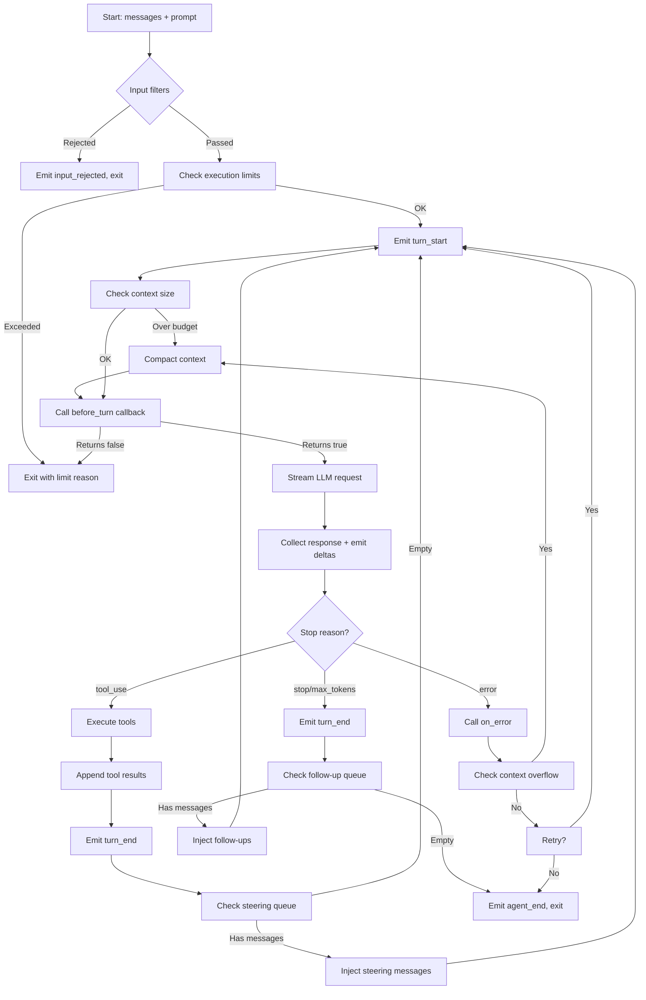

# yoke -- Agent Loop

## The Core Loop

**File**: `yoagent/src/agent_loop.rs`

The agent loop is the heart of yoagent. It implements the standard agentic pattern:

```
prompt → LLM stream → collect response → if tool_calls → execute tools → repeat
                                        → if stop → exit
```

## Loop Flow



## Two Entry Points

### agent_loop() — Fresh start

```rust
pub async fn agent_loop(
    config: AgentLoopConfig,
    tools: Vec<Box<dyn AgentTool>>,
    system_prompt: String,
    messages: Vec<AgentMessage>,
    tx: mpsc::UnboundedSender<AgentEvent>,
) -> (Vec<Box<dyn AgentTool>>, Vec<AgentMessage>)
```

Starts with new messages. Returns owned tools + final message history.

### agent_loop_continue() — Resume

```rust
pub async fn agent_loop_continue(
    config: AgentLoopConfig,
    tools: Vec<Box<dyn AgentTool>>,
    system_prompt: String,
    existing_messages: Vec<AgentMessage>,
    new_messages: Vec<AgentMessage>,
    tx: mpsc::UnboundedSender<AgentEvent>,
) -> (Vec<Box<dyn AgentTool>>, Vec<AgentMessage>)
```

Resumes from existing context with new messages appended.

## AgentLoopConfig

```rust
pub struct AgentLoopConfig {
    pub provider: Arc<dyn StreamProvider>,
    pub model: String,
    pub api_key: String,
    pub thinking_level: ThinkingLevel,
    pub max_tokens: Option<u32>,
    pub temperature: Option<f32>,
    pub model_config: Option<ModelConfig>,
    
    // Context transforms
    pub convert_to_llm: Option<ConvertToLlmFn>,
    pub transform_context: Option<TransformContextFn>,
    
    // Message queues
    pub get_steering_messages: Option<GetMessagesFn>,
    pub get_follow_up_messages: Option<GetMessagesFn>,
    
    // Context management
    pub context_config: Option<ContextConfig>,
    pub compaction_strategy: Option<Arc<dyn CompactionStrategy>>,
    pub execution_limits: Option<ExecutionLimits>,
    
    // Features
    pub cache_config: CacheConfig,
    pub tool_execution: ToolExecutionStrategy,
    pub retry_config: RetryConfig,
    
    // Callbacks
    pub before_turn: Option<BeforeTurnFn>,
    pub after_turn: Option<AfterTurnFn>,
    pub on_error: Option<OnErrorFn>,
    pub input_filters: Vec<Arc<dyn InputFilter>>,
}
```

## Execution Limits

**File**: `yoagent/src/context.rs`

```rust
pub struct ExecutionLimits {
    pub max_turns: Option<usize>,       // Default: 50 (yoke CLI)
    pub max_tokens: Option<usize>,      // Total output tokens budget
    pub max_duration: Option<Duration>, // Wall-clock timeout
}
```

The execution tracker monitors turns, tokens, and time:

```rust
pub struct ExecutionTracker {
    turns: usize,
    output_tokens: usize,
    start: Instant,
    limits: ExecutionLimits,
}
```

## Tool Execution Strategy

```rust
pub enum ToolExecutionStrategy {
    Sequential,            // One at a time (default)
    Parallel,              // All tool calls in parallel
    Batched { max: usize }, // Up to `max` in parallel
}
```

## Steering and Follow-Up Queues

Two queues allow external code to inject messages mid-run:

- **Steering queue** — Checked after each turn. For user interruptions ("stop", "change approach").
- **Follow-up queue** — Checked when agent would normally exit. For queued work.

Both support two delivery modes:
- `QueueMode::OneAtATime` — Deliver one message per turn
- `QueueMode::All` — Deliver all queued messages at once

## Retry Logic

**File**: `yoagent/src/retry.rs`

```rust
pub struct RetryConfig {
    pub max_retries: u32,           // Default: 3
    pub initial_delay_ms: u64,      // Default: 1000
    pub max_delay_ms: u64,          // Default: 30000
    pub backoff_factor: f64,        // Default: 2.0
}
```

Retries with exponential backoff for:
- HTTP 429 (rate limit)
- HTTP 5xx (server error)
- Connection errors
- Context overflow (triggers compaction first)

## Input Filters

```rust
pub trait InputFilter: Send + Sync {
    fn check(&self, message: &AgentMessage) -> FilterResult;
}

pub enum FilterResult {
    Pass,
    Warn(String),   // Message passes but warning is appended
    Reject(String), // Message blocked, reason emitted as input_rejected
}
```

Filters run in order. First `Reject` wins. `Warn` messages accumulate.

## Event Emission

The loop emits `AgentEvent`s through an unbounded mpsc channel:

```rust
pub enum AgentEvent {
    AgentStart,
    AgentEnd { reason: StopReason },
    TurnStart,
    TurnEnd { usage: Usage },
    MessageStart { role: String },
    MessageUpdate { delta: StreamDelta, accumulated: String },
    MessageEnd { message: AgentMessage },
    ToolExecutionStart { tool_call_id, tool_name, args },
    ToolExecutionUpdate { tool_call_id, tool_name, text },
    ToolExecutionEnd { tool_call_id, tool_name, result, is_error },
    ProgressMessage { tool_call_id, tool_name, text },
    InputRejected { reason: String },
}
```

## ThinkingLevel

```rust
pub enum ThinkingLevel {
    Off,      // No extended thinking
    Minimal,  // Minimal thinking budget
    Low,      // Low budget
    Medium,   // Medium budget
    High,     // Maximum thinking budget
}
```

Maps to provider-specific thinking parameters (e.g., Anthropic's `budget_tokens`, Gemini's thinking config).

## Prompt Caching

```rust
pub struct CacheConfig {
    pub enabled: bool,           // Default: true
    pub strategy: CacheStrategy, // Where to place cache breakpoints
}

pub enum CacheStrategy {
    Auto,           // Provider decides
    SystemOnly,     // Cache system prompt only
    LastTwoTurns,   // Cache up to the last 2 turns
}
```

Caching reduces cost and latency by reusing cached prefixes across turns.
