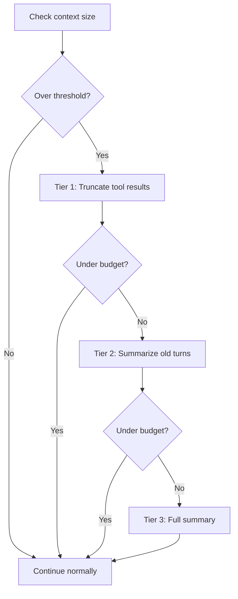

# yoke -- Context Management

## The Problem

LLMs have finite context windows. As conversations grow (especially with tool results), the context can exceed the model's limit. Context management automatically compacts the conversation to stay within budget.

## Token Estimation

**File**: `yoagent/src/context.rs`

```rust
pub fn estimate_tokens(text: &str) -> usize {
    text.len().div_ceil(4)  // ~4 chars per token for English
}
```

Fast, zero-dependency estimation. For images:
```rust
// base64 len * 3/4 = raw bytes; ~750 bytes per token
// Clamped to [85, 16000]
(raw_bytes / 750).clamp(85, 16_000)
```

### Per-Message Estimation

```rust
pub fn message_tokens(msg: &AgentMessage) -> usize {
    match msg {
        AgentMessage::Llm(Message::User { content, .. }) => content_tokens(content) + 4,
        AgentMessage::Llm(Message::Assistant { content, .. }) => content_tokens(content) + 4,
        AgentMessage::Llm(Message::ToolResult { content, tool_name, .. }) => 
            content_tokens(content) + estimate_tokens(tool_name) + 8,
        AgentMessage::Extension(ext) => estimate_tokens(&ext.data.to_string()) + 4,
    }
}
```

The `+ 4` / `+ 8` are overhead estimates for message framing tokens.

## Context Tracker

Combines real usage data from provider responses with estimates for new messages:

```rust
pub struct ContextTracker {
    last_known_input_tokens: usize,   // From provider's usage response
    estimated_since_last: usize,       // Tokens added since last response
}
```

This is more accurate than pure estimation — it uses actual token counts when available and only estimates the delta.

## ContextConfig

```rust
pub struct ContextConfig {
    pub max_tokens: usize,        // Context budget (e.g., 100000)
    pub reserve_tokens: usize,    // Keep this much free for output (e.g., 4096)
    pub compaction_threshold: f64, // Trigger compaction at this % (e.g., 0.85)
}
```

Compaction triggers when:
```
current_tokens > max_tokens * compaction_threshold
```

## CompactionStrategy Trait

```rust
pub trait CompactionStrategy: Send + Sync {
    fn compact(&self, messages: &[AgentMessage], budget: usize) -> Vec<AgentMessage>;
}
```

Custom compaction strategies can be injected. The default is `DefaultCompaction`.

## DefaultCompaction

**File**: `yoagent/src/context.rs`

Tiered approach inspired by Claude Code:

### Tier 1: Truncate Tool Results

Large tool outputs (file contents, command output) are truncated to fit:

```rust
fn truncate_tool_results(messages: &mut [AgentMessage], target_reduction: usize) {
    // Find largest tool results
    // Truncate from largest to smallest until target met
    // Add "[truncated]" marker
}
```

### Tier 2: Summarize Old Turns

If truncation isn't enough, old conversation turns are summarized:

```rust
fn summarize_turns(messages: &mut Vec<AgentMessage>, keep_recent: usize) {
    // Keep the most recent `keep_recent` turns intact
    // Replace older turns with a summary message
    // Summary preserves key decisions and context
}
```

### Tier 3: Full Summary

If still over budget, replace entire history with a compact summary:

```rust
fn full_summary(messages: &[AgentMessage]) -> Vec<AgentMessage> {
    // Generate a single summary message
    // Preserves: current task, key decisions, recent context
    // Discards: verbose tool outputs, thinking blocks
}
```

## Compaction Flow



## Execution Limits

```rust
pub struct ExecutionLimits {
    pub max_turns: Option<usize>,         // Default: Some(50) via CLI
    pub max_tokens: Option<usize>,        // Total output tokens
    pub max_duration: Option<Duration>,   // Wall-clock timeout
}

impl Default for ExecutionLimits {
    fn default() -> Self {
        Self {
            max_turns: None,      // Library default: unlimited
            max_tokens: None,
            max_duration: None,
        }
    }
}
```

### ExecutionTracker

```rust
pub struct ExecutionTracker {
    turns: usize,
    output_tokens: usize,
    start: Instant,
    limits: ExecutionLimits,
}

impl ExecutionTracker {
    pub fn should_stop(&self) -> bool {
        // Check all three limits
    }
    pub fn record_turn(&mut self, usage: &Usage) {
        self.turns += 1;
        self.output_tokens += usage.output_tokens;
    }
}
```

## Context Overflow Recovery

When a provider returns a context overflow error:

1. Agent loop catches the error
2. Triggers compaction with aggressive settings
3. Retries the LLM call with reduced context
4. If still too large, applies further tiers

This handles the case where estimation was too optimistic — the provider is the ultimate authority on context size.

## convert_to_llm

Before sending to the provider, messages are filtered:

```rust
fn default_convert_to_llm(messages: &[AgentMessage]) -> Vec<Message> {
    messages
        .iter()
        .filter_map(|m| m.as_llm().cloned())
        .collect()
}
```

This strips `Extension` messages (UI-only, app-specific) that the LLM shouldn't see.

Custom `convert_to_llm` functions can implement more sophisticated filtering (e.g., hiding certain tool results, injecting context).
