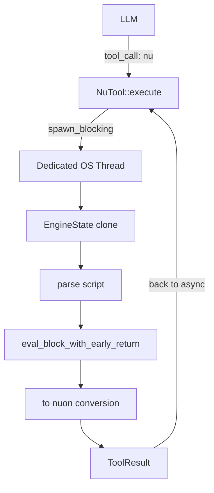

# yoke -- Nushell Tool

## Overview

**File**: `src/nu_tool.rs`

The `nu` tool embeds a full Nushell engine inside yoke. Unlike the `bash` tool which spawns subprocesses, the `nu` tool runs scripts in-process with zero subprocess overhead. Output is automatically converted to nuon format for clean structured data round-tripping.

## Architecture



## Configuration

Called once at startup before any tool execution:

```rust
pub fn configure(plugins: Vec<PathBuf>, include_paths: Vec<PathBuf>, config: Option<PathBuf>) {
    NU_CONFIG.set(NuConfig { plugins, include_paths, config });
    if config.is_some() {
        // Eager init: catch config errors at startup
        let _ = engine_state();
    }
}
```

### CLI Flags

```bash
yoke --tools nu \
  --plugin /usr/local/bin/nu_plugin_polars \
  --plugin /usr/local/bin/nu_plugin_formats \
  -I ./lib \
  --config ./init.nu \
  "analyze the data"
```

| Flag | Purpose |
|------|---------|
| `--plugin <path>` | Load Nushell plugin binary (repeatable) |
| `-I <path>` | Add module search path (repeatable) |
| `--config <file>` | Run init script at startup |

## Engine Initialization

```rust
static ENGINE: OnceLock<EngineState> = OnceLock::new();

fn engine_state() -> &'static EngineState {
    ENGINE.get_or_init(|| {
        // 1. Create default context (nu-cmd-lang)
        // 2. Add shell commands (nu-command)
        // 3. Add CLI context (nu-cli)
        // 4. Gather parent env vars
        // 5. Load plugins
        // 6. Set NU_LIB_DIRS
        // 7. Run config script (fatal on error)
    })
}
```

The engine is initialized lazily (or eagerly if `--config` is provided). Once initialized, it's shared across all tool invocations via cloning.

## Plugin Loading

**Function**: `load_plugin(engine_state, path)`

```rust
fn load_plugin(engine_state: &mut EngineState, path: &Path) -> Result<(), String> {
    // 1. Canonicalize path
    // 2. Create PluginIdentity (validates nu_plugin_* naming)
    // 3. Add to working set
    // 4. Spawn plugin process
    // 5. Get metadata
    // 6. Get signatures (command declarations)
    // 7. Register all commands
}
```

Plugin names are extracted and included in the tool description so the LLM knows they're available.

## Config Script

**Function**: `run_config_script(engine_state, path)`

```rust
fn run_config_script(engine_state: &mut EngineState, path: &Path) -> Result<(), String> {
    // 1. Read file contents
    // 2. Parse into AST (fatal on parse error)
    // 3. Check for compile errors (fatal)
    // 4. Merge AST delta into engine state
    // 5. Eval block (fatal on eval error)
    // 6. Merge env from stack back to engine state
}
```

All errors are fatal — they surface at startup with file path and span information. This ensures misconfigurations are caught immediately, not mid-conversation.

## Tool Schema

```json
{
  "type": "object",
  "properties": {
    "command": {
      "type": "string",
      "description": "The Nushell pipeline to execute."
    },
    "input": {
      "description": "Optional JSON data piped as $in to the command."
    }
  },
  "required": ["command"]
}
```

## Execution Flow

```rust
async fn execute(&self, params: Value, ctx: ToolContext) -> Result<ToolResult, ToolError> {
    let command = params["command"].as_str()?;
    let input_json = params.get("input"); // Optional

    let handle = tokio::task::spawn_blocking(move || {
        let mut engine_state = engine_state().clone();
        
        // Build script: wrap with input piping and nuon output
        let script = match input_json {
            Some(json) => format!("r#'{json}'# | from json | {command} | to nuon"),
            None => format!("{command} | to nuon"),
        };

        // Parse
        let block = parse(&mut working_set, None, script.as_bytes(), false);
        
        // Eval
        let result = eval_block_with_early_return(&engine_state, &mut stack, &block, PipelineData::empty());
        
        // Convert to string
        result.into_value(Span::unknown())?.to_expanded_string(" ", &config)
    });

    // Race: execution vs cancellation
    tokio::select! {
        _ = ctx.cancel.cancelled() => Err(ToolError::Cancelled),
        result = handle => { /* handle success/error */ }
    }
}
```

### Key Design Choices

1. **`spawn_blocking`** — Nushell's EngineState isn't async-safe. Runs on a blocking thread pool.
2. **Clone engine state** — Each invocation clones the base state. No shared mutable state between calls.
3. **Auto `to nuon`** — Output is always converted to nuon. The LLM doesn't need to add `| to nuon` or `| to json`.
4. **`r#'...'#` for input** — Raw string literal avoids escaping issues with JSON input.
5. **Cancellation** — `tokio::select!` races execution against the cancel token.

## Input Parameter

The `input` parameter allows passing structured data without string quoting:

```json
{"command": "$in | where price > 20", "input": [{"name": "Widget", "price": 25.50}]}
```

This avoids the LLM having to worry about escaping JSON inside a string. The JSON is serialized, wrapped in a raw string literal, and piped through `from json` before the command.

## Tool Description

The description is dynamically generated based on loaded plugins:

```
Execute a Nushell script. Output is auto-converted to nuon...

Use help liberally to learn how nushell works.
Do NOT guess command names or flags -- discover them with help.
If you encounter an error, you MUST use help related to your task before trying again.

Examples:
  {command: "help where"}
  {command: "$in | where price > 20", input: [...]}
  {command: "seq 1 10 | each { |n| $n * $n }"}

Plugins loaded: polars, formats.
Plugin commands are prefixed with the plugin name.
```

## Error Handling

- **Parse errors**: Returned as `ToolResult` with `success: false` (not ToolError — lets the LLM see the error and try again)
- **Eval errors**: Same — returned as text content
- **Fatal config errors**: Exit process with formatted error at startup
- **Task panics**: Converted to `ToolError::Failed`
