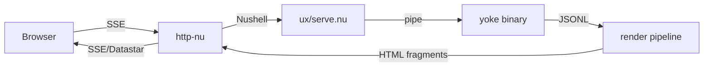

# yoke -- Integration Patterns

## With xs (cross.stream)

yoke and xs form a complete agent system:
- **xs** persists conversations as event streams
- **yoke** drives individual agent turns
- **Nushell** orchestrates the flow

### Pattern: Persistent Agent

```nushell
# Store conversation in xs
let store = "~/.local/share/cross.stream/store"

# User sends a message
.append "chat.user" --meta {text: "refactor main.rs"}

# Collect context from xs, pipe to yoke, store result
.cat --topic "chat.*" | to json -r \
  | yoke --provider anthropic --model claude-sonnet-4-20250514 \
  | each {|line| .append "chat.response" --meta $line}
```

### Pattern: Reactive Agent (xs Service)

```nushell
# Register as an xs service that responds to user messages
.append "agent.spawn" ({
    run: {||
        .cat --follow --new --topic "chat.user" | each {|frame|
            # Build context from history
            let context = (.cat --topic "chat.*" --last 50 | to json -r)
            
            # Run yoke turn
            let result = ($context | yoke --provider gemini --model gemini-2.5-flash)
            
            # Store response
            $result | each {|line| .append "chat.assistant" --meta $line}
        }
    }
} | to nuon)
```

## With http-nu (Web UI)

yoke includes a browser-based UI powered by http-nu and Datastar.

### Architecture



### serve.nu

**File**: `ux/serve.nu`

The web UI handler:
1. Receives user input via HTTP POST
2. Builds context from the xs store
3. Pipes to `yoke` with chosen provider/model
4. Streams JSONL through `render-gemini.nu` (or equivalent)
5. Renders markdown + syntax highlighting as HTML fragments
6. Sends fragments via Datastar SSE for DOM morphing

### render-gemini.nu

**File**: `ux/render-gemini.nu`

Transforms yoke's JSONL observations into rendered HTML:
- `delta` (text) → markdown-to-HTML conversion
- `delta` (thinking) → collapsible thinking block
- `tool_execution_start` → tool invocation indicator
- `tool_execution_end` → tool result display
- Grounding sources → citation links

## Skills (AgentSkills)

**File**: `yoagent/src/skills.rs`

yoke supports [AgentSkills](https://agentskills.io)-compatible skill directories:

```
skills/
  greet/
    SKILL.md        # Frontmatter: name, description. Body: full instructions.
  weather/
    SKILL.md
    scripts/        # Optional supporting files
```

### Loading

```rust
pub struct SkillSet {
    skills: Vec<Skill>,
}

pub struct Skill {
    pub name: String,
    pub description: String,
    pub path: PathBuf,  // Path to SKILL.md
}
```

### How Skills Work

1. Skill metadata (name + short description) is injected into the system prompt
2. The agent sees available skills and their descriptions
3. When the agent wants to activate a skill, it uses `read_file` to read the full SKILL.md
4. SKILL.md body contains detailed instructions the agent follows

This is a lazy-loading pattern — full instructions only loaded on demand, keeping the base context small.

### Usage

```bash
yoke --provider gemini --model gemini-2.5-flash \
  --skills ./skills \
  --tools read_file \
  "use the greet skill to say hello"
```

## MCP (Model Context Protocol)

**File**: `yoagent/src/mcp/`

yoagent includes an MCP client for connecting to external tool servers:

```rust
pub struct McpClient {
    transport: Box<dyn McpTransport>,
}

pub trait McpTransport: Send + Sync {
    async fn send(&self, request: JsonRpcRequest) -> Result<JsonRpcResponse>;
    async fn close(&self);
}
```

### MCP Tool Adapter

```rust
pub struct McpToolAdapter {
    client: Arc<McpClient>,
    tool_name: String,
    description: String,
    schema: serde_json::Value,
}

#[async_trait]
impl AgentTool for McpToolAdapter {
    async fn execute(&self, params: Value, _ctx: ToolContext) -> Result<ToolResult, ToolError> {
        self.client.call_tool(&self.tool_name, params).await
    }
}
```

### Transport Options

- **Stdio** — Spawn MCP server as subprocess, communicate via stdin/stdout
- **SSE** — Connect to MCP server over HTTP with Server-Sent Events

## Sub-Agents

**File**: `yoagent/src/sub_agent.rs`

An agent can delegate to sub-agents:

```rust
let research_agent = Agent::new(GoogleProvider)
    .with_model("gemini-2.5-flash")
    .with_tools(vec![Box::new(WebSearchTool)]);

let sub_agent_tool = SubAgentTool::new(
    "research",
    "Researches topics using web search",
    research_agent,
);

let main_agent = Agent::new(AnthropicProvider)
    .with_model("claude-sonnet-4-20250514")
    .with_tools(vec![Box::new(sub_agent_tool)]);
```

When the main agent calls the `research` tool, a complete agent loop runs as a nested operation.

## Tool Eval Framework

**Directory**: `tests/tools/`

Evaluation framework for testing tool behavior:

```
tests/tools/nu/
  case1.md          # Test case: prompt + evaluation criteria
  perform.nu        # Runner: executes yoke, checks output
```

### Case Format

Markdown with prompt and expected behavior. `perform.nu` runs the case through yoke and validates the output against criteria.

```nushell
cd tests/tools/nu
$env.GEMINI_API_KEY = "key"
nu perform.nu case1.md
```

## Composition Patterns

### Pipeline: Multi-Model

```nushell
# Draft with fast model, refine with strong model
yoke --provider gemini --model gemini-2.5-flash --tools code "draft main.rs" \
  | yoke --provider anthropic --model claude-sonnet-4-20250514 --tools code "review and improve"
```

### Fan-Out: Parallel Agents

```nushell
# Run same prompt against multiple models, compare
let prompt = "explain ownership in rust"
let models = [
    [gemini, gemini-2.5-flash]
    [anthropic, claude-sonnet-4-20250514]
    [openai, gpt-5.4-mini]
]

$models | par-each {|m|
    yoke --provider $m.0 --model $m.1 --tools none $prompt | last
}
```

### Checkpoint: Save and Resume

```nushell
# Save checkpoint after expensive work
yoke --provider anthropic --model claude-sonnet-4-20250514 --tools code "analyze the codebase" \
  | tee { save -f checkpoint.jsonl }

# Resume from checkpoint for follow-up questions
cat checkpoint.jsonl | yoke --provider anthropic --model claude-sonnet-4-20250514 "what did you find?"
cat checkpoint.jsonl | yoke --provider anthropic --model claude-sonnet-4-20250514 "suggest improvements"
```
