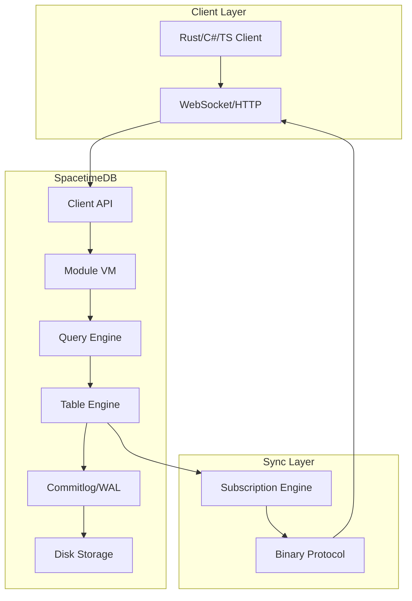

# SpacetimeDB: Complete Exploration

## Overview

**SpacetimeDB** is a relational database system that doubles as a server replacement. It allows you to upload application logic directly into the database as "modules" (fancy stored procedures), eliminating the need for separate web servers, microservices, or infrastructure.

### Why This Exploration Exists

This is a **complete textbook** that takes you from zero database knowledge to understanding how to build and deploy production database systems with Rust/valtron replication.

### Key Characteristics

| Aspect | SpacetimeDB |
|--------|-------------|
| **Core Innovation** | In-memory database with WAL persistence, server-side modules |
| **Language** | Rust (serverside), C# (via .NET bindings) |
| **Purpose** | Real-time multiplayer applications, games, chat |
| **Architecture** | In-memory state, WAL persistence, binary sync protocol |
| **License** | BSL 1.1 (converts to AGPL v3.0 with linking exception) |
| **Rust Equivalent** | valtron executor (no async/await, no tokio) |

---

## Complete Table of Contents

This exploration consists of multiple deep-dive documents:

### Part 1: Foundations
1. **[Zero to Database Engineer](00-zero-to-db-engineer.md)** - Start here if new to databases
   - What are databases?
   - Storage engines explained
   - Query execution fundamentals
   - Distributed consensus basics

### Part 2: Core Implementation
2. **[Architecture Deep Dive](01-storage-engine-deep-dive.md)**
   - In-memory data structures
   - Table storage layout
   - Index implementation
   - Commitlog/WAL design

3. **[Query Execution](02-query-execution-deep-dive.md)**
   - SQL parsing
   - Query planning
   - Expression evaluation
   - Incremental view maintenance

4. **[Distributed Consensus](03-consensus-replication-deep-dive.md)**
   - Multi-node replication
   - Consensus protocols
   - Leader election
   - Conflict resolution

### Part 3: Rust Replication
5. **[Rust Revision](rust-revision.md)**
   - Complete Rust translation guide
   - Type system design
   - Memory management
   - Code examples

### Part 4: Production
6. **[Production-Grade](production-grade.md)**
   - Performance tuning
   - Memory optimization
   - Monitoring
   - Deployment strategies

7. **[Valtron Integration](04-valtron-integration.md)**
   - Lambda deployment
   - Serverless patterns
   - No async/await design

---

## File Structure

```
SpacetimeDB/
├── crates/
│   ├── core/           # Main database engine
│   ├── table/          # Table storage engine
│   ├── commitlog/      # WAL implementation
│   ├── execution/      # Query execution
│   ├── query/          # Query planner
│   ├── sql-parser/     # SQL parsing
│   ├── sats/           # Algebraic data types
│   ├── schema/         # Schema management
│   ├── subscription/   # Incremental view maintenance
│   ├── physical-plan/  # Physical query plans
│   ├── expr/           # Expression evaluation
│   ├── vm/             # Module VM
│   ├── bindings/       # Rust/C# module bindings
│   ├── client-api/     # HTTP/WebSocket API
│   ├── standalone/     # Single-node server
│   └── cli/            # CLI tool
├── modules/            # Example modules
├── sdk/                # Client SDKs
└── tools/              # Development tools
```

---

## Architecture Summary

### High-Level Flow



### Component Summary

| Component | Purpose | Deep Dive |
|-----------|---------|-----------|
| Table Engine | In-memory row storage | [Storage Engine](01-storage-engine-deep-dive.md) |
| Commitlog | Write-ahead log | [Storage Engine](01-storage-engine-deep-dive.md) |
| Query Engine | SQL parsing, planning | [Query Execution](02-query-execution-deep-dive.md) |
| VM | Module execution sandbox | [Rust Revision](rust-revision.md) |
| Subscription | Incremental view sync | [Query Execution](02-query-execution-deep-dive.md) |

---

## Key Insights

### 1. In-Memory First Architecture

All application state lives in memory for maximum speed. Persistence is achieved through a write-ahead log (WAL) that records all mutations. On restart, the WAL is replayed to reconstruct state.

### 2. Modules as Serverless Functions

Modules are Rust/C# libraries compiled to WebAssembly. They define:
- Tables (schema)
- Reducers (transaction logic)
- Queries (read operations)

### 3. Binary Sync Protocol

Clients subscribe to queries and receive binary diffs when data changes. This enables real-time synchronization without polling.

### 4. No Infrastructure Required

Since the database IS the server, you deploy one binary and connect directly. No API servers, no microservices, no Kubernetes.

---

## Running SpacetimeDB

```bash
# Install
curl -sSf https://install.spacetimedb.com | sh

# Start local node
spacetime start

# Or with Docker
docker run --rm -p 3000:3000 clockworklabs/spacetime start
```

---

## Document History

| Date | Change |
|------|--------|
| 2026-03-27 | Initial exploration created |

---

*This exploration is a living document. Revisit sections as concepts become clearer through implementation.*
