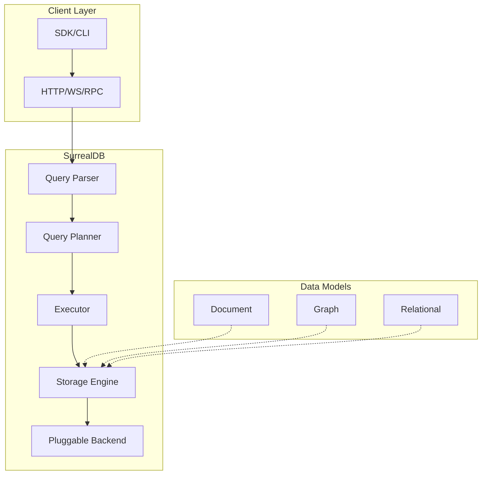

# SurrealDB: Complete Exploration

## Overview

**SurrealDB** is a multi-model database that combines document, graph, relational, and real-time capabilities in a single platform. It's designed for modern applications requiring flexible data models with strong consistency.

### Key Characteristics

| Aspect | SurrealDB |
|--------|-----------|
| **Core Innovation** | Multi-model: document + graph + relational |
| **Language** | Rust |
| **Query Language** | SurrealQL (SQL-like with graph extensions) |
| **Storage** | Pluggable: RocksDB, TiKV, FoundationDB, memory |
| **License** | Apache 2.0 |
| **Rust Equivalent** | valtron executor (no async/await) |

---

## Complete Table of Contents

1. **[Zero to Database Engineer](00-zero-to-db-engineer.md)** - Database fundamentals
2. **[Storage Engine Deep Dive](01-storage-engine-deep-dive.md)** - Storage internals
3. **[Query Execution Deep Dive](02-query-execution-deep-dive.md)** - SurrealQL processing
4. **[Consensus and Replication](03-consensus-replication-deep-dive.md)** - Distributed systems
5. **[Rust Revision](rust-revision.md)** - Rust translation guide
6. **[Production-Grade](production-grade.md)** - Production deployment
7. **[Valtron Integration](04-valtron-integration.md)** - Lambda deployment

---

## File Structure

```
surrealdb/
├── core/           # Core database engine
│   ├── sql/        # SurrealQL parser
│   ├── syn/        # Query syntax
│   ├── dbs/        # Database engine
│   ├── vs/         # Value storage
│   ├── idg/        # Index data structures
│   └── fnc/        # Functions
├── sdk/            # Client SDK
│   ├── src/
│   │   ├── api/    # API traits
│   │   ├── method/ # Query methods
│   │   └── opt/    # Configuration
│   └── examples/
├── src/            # Server implementation
│   ├── net/        # HTTP/WebSocket
│   ├── rpc/        # RPC handlers
│   └── cli/        # CLI commands
└── tests/          # Integration tests
```

---

## Architecture Summary

### High-Level Flow



### Component Summary

| Component | Purpose | Deep Dive |
|-----------|---------|-----------|
| SurrealQL Parser | Query parsing, syntax | [Query Execution](02-query-execution-deep-dive.md) |
| Storage Engine | Pluggable backends | [Storage Engine](01-storage-engine-deep-dive.md) |
| Graph Engine | Relationship traversal | [Query Execution](02-query-execution-deep-dive.md) |
| Indexing | Fast lookups | [Storage Engine](01-storage-engine-deep-dive.md) |

---

## SurrealQL Query Examples

```sql
-- Document-style
CREATE user:1 SET name = 'Alice', age = 30;

-- Graph-style
CREATE friend RELATES user:1 TO user:2 SET since = 2024;
SELECT ->friend->user FROM user:1;

-- Relational-style
SELECT * FROM user WHERE age > 25 ORDER BY name;

-- Combined
SELECT
    name,
    (SELECT count() FROM ->friend) as friend_count
FROM user
WHERE age > 25;
```

---

## Running SurrealDB

```bash
# Install
curl --proto '=https' --tlsv1.2 -sSf https://install.surrealdb.com | sh

# Start with RocksDB
surreal start --log debug --user root --pass root rocksdb:data.db

# Start with memory storage
surreal start --log debug --user root --pass root memory

# Connect with CLI
surreal sql --endpoint http://localhost:8000 --user root --pass root
```

---

## Key Insights

### 1. Multi-Model Architecture

SurrealDB stores data as documents but allows graph-style traversals and relational queries on the same data.

### 2. Pluggable Storage

The storage layer is abstracted, allowing different backends (RocksDB, TiKV, etc.) without changing query logic.

### 3. Record IDs

Every record has a unique ID with type: `user:1`, `post:abc123`, enabling graph relationships.

### 4. Graph Edges as Documents

Edges are stored as documents with `IN` and `OUT` fields, enabling efficient graph traversals.

---

## Document History

| Date | Change |
|------|--------|
| 2026-03-27 | Initial exploration created |

---

*This exploration is a living document. Revisit sections as concepts become clearer through implementation.*
