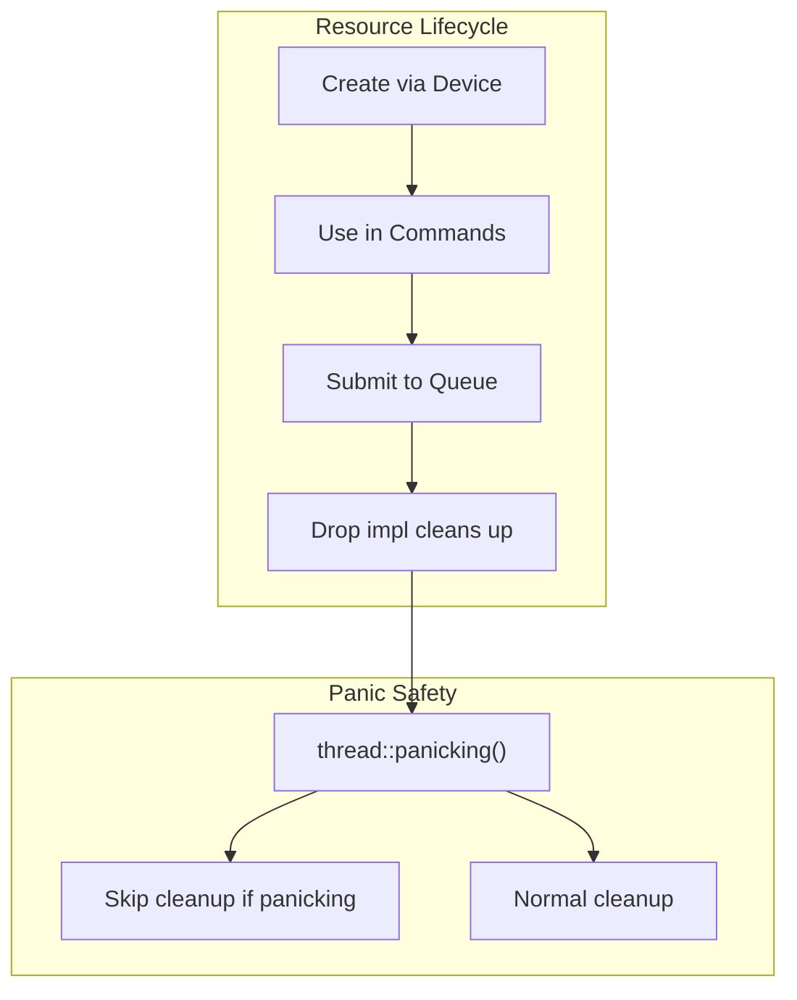
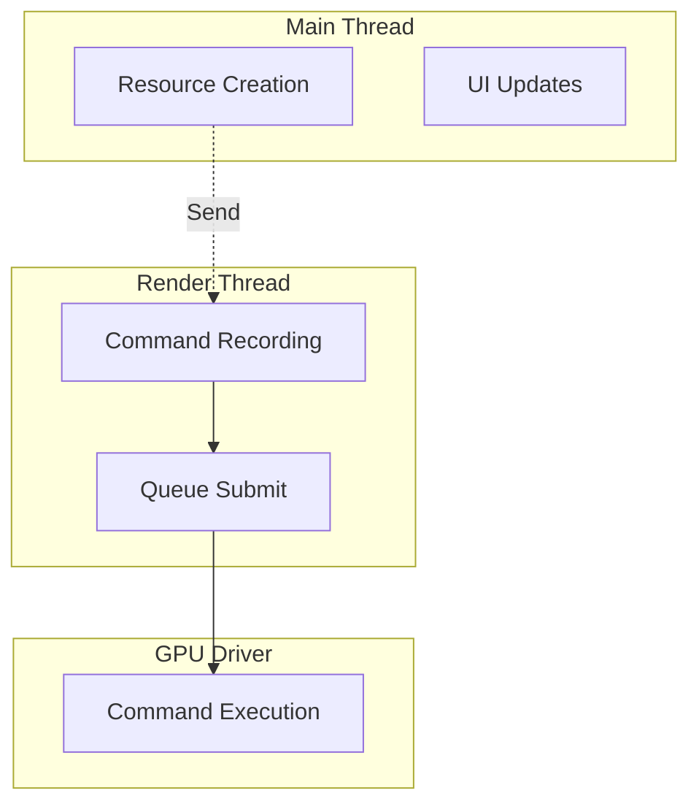
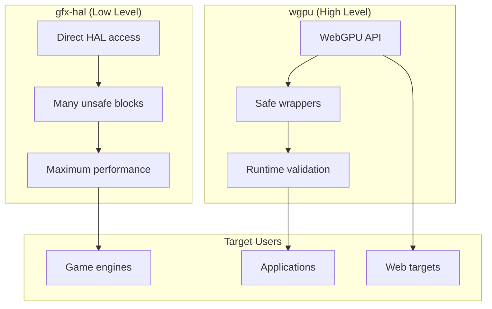

# API Design Deep Dive: Rust API Design and Safety

## 1. Overview

This document examines the Rust-specific design decisions in gfx-rs/wgpu, focusing on how the API leverages Rust's type system for safety while maintaining low-level GPU access performance.

## 2. The Backend Trait Pattern

### 2.1 Associated Types for Static Dispatch

gfx-rs uses the **Associated Types Pattern** extensively to enable static dispatch while maintaining abstraction:

```rust
// From gfx/src/hal/src/lib.rs (simplified)
pub trait Backend: 'static + Sized + fmt::Debug + Send + Sync {
    type Instance: fmt::Debug;
    type PhysicalDevice: adapter::PhysicalDevice<Self>;
    type Device: device::Device<Self>;
    type Surface: window::Surface<Self>;
    type CommandBuffer: command::CommandBuffer<Self>;
    type Buffer: buffer::Buffer<Self>;
    type Image: image::Image<Self>;
    // ... 30+ associated types
}
```

**Design Rationale:**

| Aspect | Decision | Rationale |
|--------|----------|-----------|
| `Sized` bound | Required | All associated types must have known size for stack allocation |
| `'static` bound | Required | GPU resources outlive any local scope |
| `Send + Sync` | Required | GPU operations span multiple threads |
| Associated types | Over generics | Single implementation per backend, enables monomorphization |

### 2.2 Type Safety Through PhantomData

Backends implement the trait with concrete types:

```rust
// From gfx/src/backend/vulkan/src/lib.rs
pub struct Instance {
    pub raw: Arc<RawInstance>,
    // PhantomData<Backend> ensures type safety
}

pub enum Backend {}
impl hal::Backend for Backend {
    type Instance = Instance;
    type PhysicalDevice = PhysicalDevice;
    type Device = device::Device;
    // ...
}
```

## 3. Ownership Model for GPU Resources

### 3.1 RAII-Based Resource Management

GPU resources follow Rust's ownership model with explicit drop handling:

```rust
// From wgpu-native/src/lib.rs
pub struct WGPUBufferImpl {
    context: Arc<Context>,
    id: id::BufferId,
    error_sink: ErrorSink,
    data: BufferData,
}

impl Drop for WGPUBufferImpl {
    fn drop(&mut self) {
        if !thread::panicking() {
            let context = &self.context;
            context.buffer_drop(self.id);
        }
    }
}
```

**Key Patterns:**



### 3.2 Arc-Based Shared Ownership

Multiple components may reference GPU resources:

```rust
// From wgpu-native/src/lib.rs
pub struct WGPUDeviceImpl {
    context: Arc<Context>,
    id: id::DeviceId,
    queue: Arc<QueueId>,
    error_sink: ErrorSink,
}
```

**Why Arc over Rc?**

- GPU operations span multiple threads
- Command submission happens on different threads than creation
- `Send + Sync` bounds require thread-safe reference counting

## 4. Safe vs. Unsafe Boundaries

### 4.1 Unsafe Trait Methods

The HAL traits mark inherently unsafe operations:

```rust
// From gfx/src/hal/src/command/mod.rs
pub trait CommandBuffer<B: Backend>: fmt::Debug + Any + Send + Sync {
    /// Begins recording commands - unsafe because:
    /// - Command buffer must be in ready state
    /// - Inheritance info must match render pass
    unsafe fn begin(
        &mut self,
        flags: CommandBufferFlags,
        inheritance_info: CommandBufferInheritanceInfo<B>,
    );

    /// Pipeline barriers require explicit synchronization
    unsafe fn pipeline_barrier<'a, T>(
        &mut self,
        stages: Range<pso::PipelineStage>,
        dependencies: Dependencies,
        barriers: T,
    ) where T: Iterator<Item = Barrier<'a, B>>;
}
```

### 4.2 Safety Documentation

Each unsafe method includes safety requirements:

```rust
// From gfx/src/hal/src/device.rs
/// # Safety
/// - The memory must not be already mapped
/// - The range must be within the allocated memory
/// - The memory must have HOST_VISIBLE flag
pub unsafe fn map_memory(
    &self,
    memory: &B::Memory,
    range: Range<u64>,
) -> Result<*mut u8, MapError>;
```

### 4.3 Validation Layers

wgpu adds runtime validation on top of unsafe HAL:

```rust
// Conceptual example from wgpu-core
pub fn create_buffer<A: HalApi>(
    device: &Arc<Device<A>>,
    desc: &BufferDescriptor,
) -> Result<Buffer<A>, CreateBufferError> {
    // Validated in safe wrapper
    if desc.size == 0 {
        return Err(CreateBufferError::ZeroSize);
    }
    if !desc.usage.is_valid() {
        return Err(CreateBufferError::InvalidUsage);
    }

    // Then call unsafe HAL
    unsafe {
        device.raw.create_buffer(desc)
    }
}
```

## 5. Borrowing and Lifetimes for Mappings

### 5.1 Temporary Mapping Pattern

Buffer mappings use lifetime-bound guards:

```rust
// Conceptual pattern from wgpu
pub struct BufferSlice<'a> {
    buffer: &'a Buffer,
    offset: u64,
    size: u64,
}

pub struct BufferView<'a> {
    slice: BufferSlice<'a>,
    mapped_memory: *mut u8,
    _lifetime: PhantomData<&'a mut [u8]>,
}

impl<'a> Buffer<'a> {
    /// Map for reading - returns guard that unmaps on drop
    pub fn map_read(&self) -> Result<BufferView<'a>, MapError> {
        // ... mapping logic
        Ok(BufferView {
            slice: self.slice(0, self.size()),
            mapped_memory: ptr,
            _lifetime: PhantomData,
        })
    }
}

impl<'a> Drop for BufferView<'a> {
    fn drop(&mut self) {
        unsafe { self.unmap(); }
    }
}
```

### 5.2 Borrow Checker Enforcement

```rust
// This code is prevented by borrow checker:
let buffer = device.create_buffer(...);
let view1 = buffer.map_read()?;
let view2 = buffer.map_write()?; // Error: buffer already borrowed

// Correct pattern:
{
    let view = buffer.map_read()?;
    // use view
} // view dropped, borrow ends
let view = buffer.map_write()?; // OK: no active borrow
```

## 6. Send/Sync for Threading

### 6.1 Thread Safety Annotations

```rust
// From gfx/src/backend/metal/src/lib.rs
// Command buffer is Send but not Sync (single writer)
unsafe impl Send for WGPUComputePassEncoderImpl {}
// Note: No Sync impl - cannot share across threads

// From wgpu-native/src/lib.rs
// Device is both Send and Sync
pub struct WGPUDeviceImpl {
    // Contains Arc<Context> which is Sync
}
```

### 6.2 Threading Model



### 6.3 Explicit Send Boundaries

```rust
// From gfx/src/hal/src/adapter.rs
pub struct Gpu<B: Backend> {
    pub device: B::Device,
    pub queue_groups: Vec<QueueGroup<B>>,
}

// B::Device: Send + Sync (from Backend trait)
// QueueGroup: Send (queue submission from any thread)
```

## 7. Error Handling Patterns

### 7.1 Thiserror-Based Error Types

```rust
// From gfx/src/hal/src/device.rs
#[derive(Clone, Debug, PartialEq, thiserror::Error)]
pub enum CreationError {
    #[error("Out of either host or device memory.")]
    OutOfMemory(#[from] OutOfMemory),

    #[error("Implementation specific error occurred")]
    InitializationFailed,

    #[error("Requested feature is missing")]
    MissingFeature,

    #[error("Too many objects")]
    TooManyObjects,

    #[error("Logical or Physical device was lost during creation")]
    DeviceLost,
}
```

### 7.2 Result vs. Panic

| Situation | Handling | Rationale |
|-----------|----------|-----------|
| Resource creation | `Result<T, Error>` | Expected failure modes |
| Driver errors | `Result<T, DeviceLost>` | Recoverable in some cases |
| Invalid API usage | Panic (debug) / UB (release) | Programmer error |
| Out of memory | `Result<T, OutOfMemory>` | Runtime condition |

### 7.3 Error Propagation Chain

```rust
// From wgpu-native/src/lib.rs
impl Drop for WGPUDeviceImpl {
    fn drop(&mut self) {
        if !thread::panicking() {
            let context = &self.context;

            // Wait for GPU to finish
            match context.device_poll(self.id, wgt::PollType::wait_indefinitely()) {
                Ok(_) => (),
                Err(err) => handle_error_fatal(err, "WGPUDeviceImpl::drop"),
            }

            context.device_drop(self.id);
        }
    }
}
```

## 8. Type-Level Graphics State

### 8.1 Bitflags for Feature Sets

```rust
// From gfx/src/hal/src/lib.rs
bitflags! {
    pub struct Features: u128 {
        const ROBUST_BUFFER_ACCESS = 0x0000_0000_0000_0001;
        const FULL_DRAW_INDEX_U32 = 0x0000_0000_0000_0002;
        const IMAGE_CUBE_ARRAY = 0x0000_0000_0000_0004;
        const INDEPENDENT_BLENDING = 0x0000_0000_0000_0008;
        // ... 100+ features across multiple bit ranges
    }
}
```

### 8.2 State Objects with Type-Level Defaults

```rust
// From gfx/src/hal/src/pso/mod.rs
#[derive(Clone, Copy, Debug, Eq, Hash, PartialEq)]
pub enum State<T> {
    Static(T),
    Dynamic,
}

impl<T> State<T> {
    pub fn static_or(self, default: T) -> T {
        match self {
            State::Static(v) => v,
            State::Dynamic => default,
        }
    }
}
```

## 9. Zero-Cost Abstractions

### 9.1 Newtype Pattern for Type Safety

```rust
// From gfx/src/hal/src/image.rs
pub type Size = u32;
pub type Layer = u16;
pub type Level = u8;
pub type TexelCoordinate = i32;

// Structured access prevents mixing up parameters
#[derive(Clone, Copy, Debug, Hash, PartialEq, Eq)]
pub struct Extent {
    pub width: Size,
    pub height: Size,
    pub depth: Size,
}
```

### 9.2 Inlined Helper Methods

```rust
// From gfx/src/hal/src/image.rs
impl Extent {
    #[inline]
    pub fn is_empty(&self) -> bool {
        self.width == 0 || self.height == 0 || self.depth == 0
    }

    #[inline]
    pub fn at_level(&self, level: Level) -> Self {
        Extent {
            width: 1.max(self.width >> level),
            height: 1.max(self.height >> level),
            depth: 1.max(self.depth >> level),
        }
    }
}
```

## 10. Comparison: gfx-hal vs. wgpu Safety

| Aspect | gfx-hal | wgpu |
|--------|---------|------|
| Unsafe blocks | Many (HAL level) | Fewer (wrapped) |
| Runtime validation | Minimal | Extensive |
| Error handling | Results + panics | Results everywhere |
| Lifetimes | Explicit | Guarded by scopes |
| Threading | Manual Send/Sync | Scoped handles |



## 11. Key Takeaways for Rust GPU API Design

1. **Use associated types** for backend abstraction with zero overhead
2. **Mark unsafe clearly** with comprehensive safety documentation
3. **Leverage Drop** for automatic resource cleanup
4. **Use Arc for shared ownership** across thread boundaries
5. **Employ lifetime guards** for temporary mappings
6. **Implement Send/Sync explicitly** based on actual thread safety
7. **Use thiserror** for clear error type hierarchies
8. **Provide both safe and unsafe APIs** for different user needs

---

*This deep dive analyzed API design patterns from gfx-rs at `/home/darkvoid/Boxxed/@formulas/src.rust/src.webgpu/src.gfx-rs/`*
