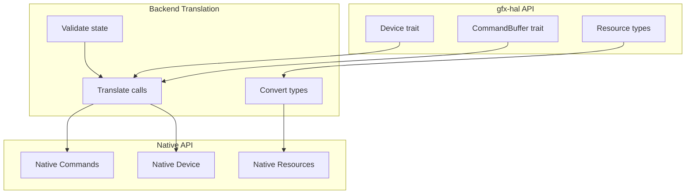
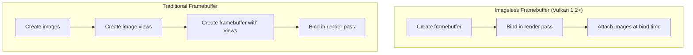
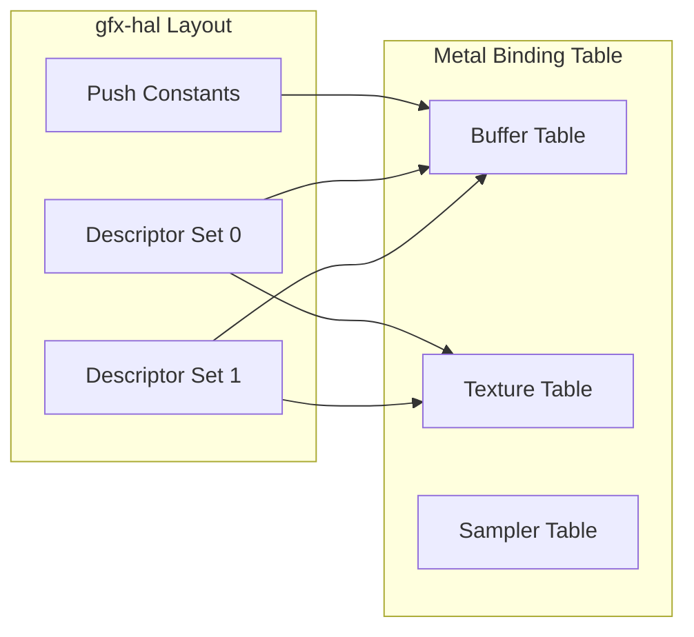
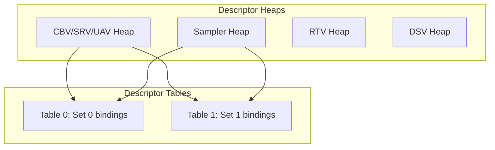
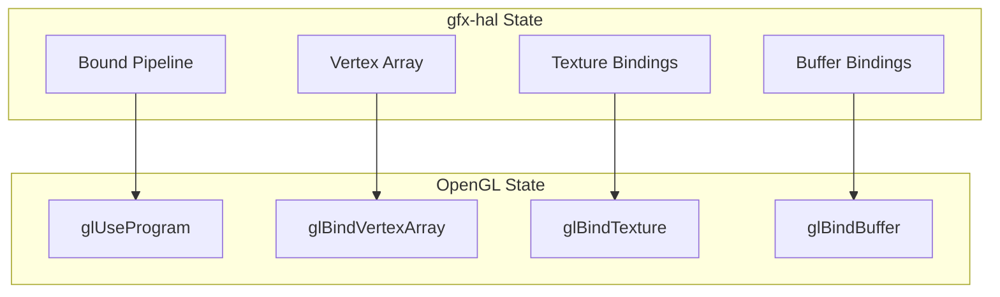
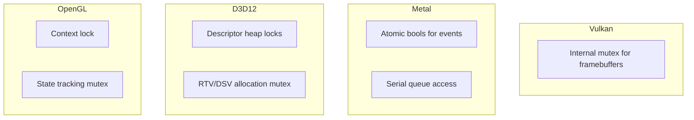
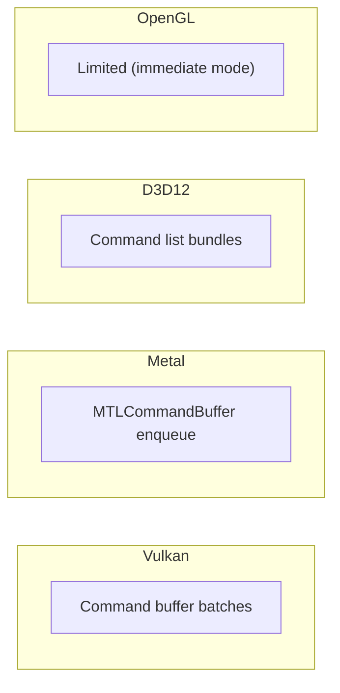

# Backend Implementation Deep Dive: Vulkan, Metal, D3D12, OpenGL

## 1. Overview

This document examines how gfx-rs implements cross-platform graphics backends, providing a unified API while translating to native graphics APIs. We analyze the Vulkan, Metal, DirectX 12, and OpenGL backend implementations.

## 2. Backend Architecture

### 2.1 Unified Backend Structure

Each backend follows the same module structure:

```
backend/
├── lib.rs              # Backend trait implementation, Instance
├── device.rs           # Device and PhysicalDevice implementations
├── command.rs          # Command buffer and command pool
├── resource.rs         # Buffers, Images, Views
├── conv.rs             # Type conversions to/from native API
├── window.rs           # Surface and swapchain
└── internal.rs         # Internal utilities and helpers
```

### 2.2 Translation Layer Model



## 3. Vulkan Backend (gfx-backend-vulkan)

### 3.1 Architecture Overview

The Vulkan backend is the most feature-complete and serves as the reference implementation:

```rust
// From gfx/src/backend/vulkan/src/lib.rs
pub struct RawInstance {
    inner: ash::Instance,
    handle_is_external: bool,
    debug_messenger: Option<DebugMessenger>,
    get_physical_device_properties: Option<ExtensionFn<...>>,
    display: Option<khr::Display>,
    external_memory_capabilities: Option<ExtensionFn<...>>,
}
```

### 3.2 Key Design Decisions

#### Extension Function Loading

```rust
// From gfx/src/backend/vulkan/src/lib.rs
#[cfg(not(feature = "use-rtld-next"))]
use ash::Entry;
#[cfg(feature = "use-rtld-next")]
type Entry = ash::EntryCustom<()>;

pub enum DebugMessenger {
    Utils(ext::DebugUtils, vk::DebugUtilsMessengerEXT),
    #[allow(deprecated)]
    Report(ext::DebugReport, vk::DebugReportCallbackEXT),
}
```

#### Stack Memory Optimization

The Vulkan backend uses `inplace_it` for stack allocation of iterator data:

```rust
// Comment from lib.rs:
/*
## Stack memory

Most of the code just passes the data through. The only problem
that affects all the pieces is related to memory allocation:
Vulkan expects slices, but the API gives us Iterator.
So we end up using a lot of inplace_it to get things collected on stack.
*/
```

### 3.3 Command Recording

```rust
// From gfx/src/backend/vulkan/src/command.rs (simplified)
pub struct RawCommandBuffer {
    raw: vk::CommandBuffer,
    device: vk::Device,
    // Track state for validation
    state: CommandBufferState,
}

impl command::CommandBuffer<Backend> for RawCommandBuffer {
    unsafe fn begin_render_pass<T>(&mut self, ...) {
        let info = vk::RenderPassBeginInfo {
            render_pass: self.render_pass,
            framebuffer: self.framebuffer,
            render_area: make_rect(rect),
            clear_value_count: clears.len() as u32,
            p_clear_values: clears.as_ptr(),
            ..Default::default()
        };
        self.device.cmd_begin_render_pass(self.raw, &info, contents);
    }
}
```

### 3.4 Framebuffer Handling



```rust
// From gfx/src/backend/vulkan/src/lib.rs
/*
## Framebuffers

HAL is modelled after image-less framebuffers. If the Vulkan
implementation supports it, we map it 1:1. If it doesn't expose
KHR_imageless_framebuffer, we keep all created framebuffers
in an internally-synchronized map.
*/
```

### 3.5 Feature Mapping

```rust
// From gfx/src/backend/vulkan/src/physical_device.rs
fn map_features(features: vk::Features) -> hal::Features {
    let mut f = hal::Features::empty();

    if features.robust_buffer_access() != 0 {
        f |= hal::Features::ROBUST_BUFFER_ACCESS;
    }
    if features.full_draw_index_uint32() != 0 {
        f |= hal::Features::FULL_DRAW_INDEX_U32;
    }
    if features.image_cube_array() != 0 {
        f |= hal::Features::IMAGE_CUBE_ARRAY;
    }
    // ... 50+ feature mappings

    f
}
```

## 4. Metal Backend (gfx-backend-metal)

### 4.1 Architecture Overview

The Metal backend translates Vulkan-style calls to Apple's Metal API:

```rust
// From gfx/src/backend/metal/src/lib.rs
pub type FastHashMap<K, V> = HashMap<K, V, BuildHasherDefault<fxhash::FxHasher>>;

/// Method of recording one-time-submit command buffers.
#[derive(Clone, Debug, Hash, PartialEq)]
pub enum OnlineRecording {
    Immediate,
    Deferred,
    // ...
}
```

### 4.2 Pipeline Layout Translation

```rust
// From gfx/src/backend/metal/src/lib.rs:
/*
## Pipeline Layout

In Metal, push constants, vertex buffers, and resources in the descriptor sets
are all placed together in the native resource bindings:

1. Push constants (if any)
2. Descriptor set 0 resources
3. Other descriptor sets
4. Vertex buffers (at end of VS buffer table)

When argument buffers are supported, each descriptor set becomes a buffer binding.
*/
```



### 4.3 Command Recording Strategies

```rust
// From gfx/src/backend/metal/src/lib.rs:
/*
## Command recording

One-time-submit primary command buffers are recorded "live" into
MTLCommandBuffer.

Multi-submit and secondary command buffers are recorded as "soft"
commands into Journal. Actual native recording happens at submit
or execute_commands.
*/
```


### 4.4 Memory Storage Modes

```rust
// From gfx/src/backend/metal/src/lib.rs:
/*
## Memory

- "Shared" storage for CPU-coherent memory
- "Managed" for non-coherent CPU-visible memory
- "Private" for device-local memory

Metal doesn't have CPU-visible memory for textures. We only allow
RGBA8 2D textures for transfer operations (glorified staging buffers).
*/
```

| gfx-hal Memory Type | Metal Storage |
|---------------------|---------------|
| CPU_VISIBLE + COHERENT | Shared |
| CPU_VISIBLE (non-coherent) | Managed |
| DEVICE_LOCAL | Private |

### 4.5 Event Handling

```rust
// From gfx/src/backend/metal/src/lib.rs:
/*
## Events

Events are represented by just an atomic bool. When recording, a
command buffer keeps track of all events set or reset.

Signalling within a command buffer: check local list.
Waiting across command buffers: check accumulated list at submission.
*/
```

## 5. DirectX 12 Backend (gfx-backend-dx12)

### 5.1 Architecture Overview

```rust
// From gfx/src/backend/dx12/src/lib.rs (structure)
pub struct Instance {
    factory: d3d12::D3D12Factory,
    library: ComPtr<dxgi1_4::IDXGIFactory4>,
}

pub struct Device {
    raw: ComPtr<d3d12::ID3D12Device>,
    // Resource allocation tracking
    // Descriptor heap management
}
```

### 5.2 Descriptor Heap Management



### 5.3 Root Signature Translation

```rust
// Root parameters map gfx-hal pipeline layout to D3D12 root signature
// From gfx/src/backend/dx12/src/device.rs

fn translate_root_signature(
    layout: &PipelineLayout,
) -> D3D12_ROOT_SIGNATURE_DESC {
    D3D12_ROOT_SIGNATURE_DESC {
        NumParameters: layout.bindings.len() as u32,
        pParameters: root_parameters.as_ptr(),
        NumStaticSamplers: 0,
        Flags: D3D12_ROOT_SIGNATURE_FLAG_ALLOW_INPUT_ASSEMBLER_INPUT_LAYOUT,
    }
}
```

### 5.4 Command List Recording

```rust
// From gfx/src/backend/dx12/src/command.rs
pub struct CommandList {
    raw: ComPtr<d3d12::ID3D12GraphicsCommandList>,
    allocator: ComPtr<d3d12::ID3D12CommandAllocator>,
    closed: bool,
}

impl command::CommandBuffer for CommandList {
    unsafe fn begin(&mut self, flags: CommandBufferFlags) {
        self.allocator.Reset();
        self.raw.Reset(&self.allocator, None);
        self.closed = false;
    }

    unsafe fn finish(&mut self) {
        self.raw.Close();
        self.closed = true;
    }
}
```

## 6. OpenGL Backend (gfx-backend-gl)

### 6.1 Architecture Overview

The OpenGL backend provides a fallback for platforms without modern APIs:

```rust
// From gfx/src/backend/gl/src/lib.rs
pub struct Instance {
    // Supported extensions
    extensions: Extensions,
    // Version info
    version: Version,
}

pub enum Backend {}
impl hal::Backend for Backend {
    // OpenGL-specific implementations
}
```

### 6.2 State Tracking

OpenGL requires explicit state tracking due to its global state machine nature:



### 6.3 Shader Translation Integration

```rust
// OpenGL backend uses Naga for shader translation
// Source GLSL -> Naga IR -> Target GLSL (with extensions handled)

// From gfx/src/backend/gl/src/device.rs
fn create_shader_module(
    &self,
    source: &str,
) -> Result<ShaderModule, ShaderError> {
    // Parse with Naga
    let module = naga::front::glsl::parse_str(source)?;

    // Generate GLSL for target version
    let info = naga::valid::Validator::new().validate(&module)?;

    Ok(ShaderModule { module, info })
}
```

### 6.4 Limitations Mapping

| Feature | OpenGL Support | Notes |
|---------|----------------|-------|
| Compute Shaders | GL 4.3+ / ES 3.1+ | Via compute shader extension |
| Instancing | GL 3.3+ / ES 3.0+ | Core in modern GL |
| Transform Feedback | GL 3.0+ | For vertex capture |
| SSBOs | GL 4.3+ / ES 3.1+ | Shader storage buffers |
| Multiview | Extension only | OVR_multiview2 |

## 7. Cross-Backend Abstraction Patterns

### 7.1 Resource Conversion Traits

```rust
// Common pattern across all backends
trait Conv<T> {
    fn conv(&self) -> T;
}

// Vulkan example
impl Conv<vk::BufferUsageFlags> for buffer::Usage {
    fn conv(&self) -> vk::BufferUsageFlags {
        let mut flags = vk::BufferUsageFlags::default();
        if self.contains(Usage::TRANSFER_SRC) {
            flags |= vk::BufferUsageFlags::TRANSFER_SRC;
        }
        // ... map all usage flags
        flags
    }
}

// Metal example
impl Conv<MTLResourceOptions> for memory::Properties {
    fn conv(&self) -> MTLResourceOptions {
        if self.contains(Properties::CPU_VISIBLE) {
            if self.contains(Properties::COHERENT) {
                MTLResourceOptions::StorageModeShared
            } else {
                MTLResourceOptions::StorageModeManaged
            }
        } else {
            MTLResourceOptions::StorageModePrivate
        }
    }
}
```

### 7.2 Backend Capability Tables

```rust
// Each backend reports capabilities through trait methods
pub trait PhysicalDevice<B: Backend> {
    fn features(&self) -> Features;
    fn properties(&self) -> PhysicalDeviceProperties;
    fn format_properties(&self, format: Format) -> format::Properties;
    fn memory_properties(&self) -> MemoryProperties;
}
```

### 7.3 Internal Synchronization



## 8. Performance Considerations by Backend

### 8.1 Allocation Strategies

| Backend | Strategy | Notes |
|---------|----------|-------|
| Vulkan | Manual with allocators | Backend manages descriptor pools |
| Metal | Autoreleased pools | Deferred release via reference counting |
| D3D12 | Heap-based | Descriptor heaps pre-allocated |
| OpenGL | Direct | No abstraction, direct GL calls |

### 8.2 Batching Opportunities



### 8.3 Validation Overhead

| Backend | Debug Overhead | Release Overhead |
|---------|----------------|------------------|
| Vulkan | High (validation layers) | Minimal |
| Metal | Medium (Xcode GPU frame capture) | Low |
| D3D12 | Medium (PIX) | Low |
| OpenGL | Variable (driver dependent) | Variable |

## 9. Backend Selection at Runtime

```rust
// From gfx/examples/quad/main.rs
#[cfg(feature = "vulkan")]
extern crate gfx_backend_vulkan as back;
#[cfg(feature = "dx12")]
extern crate gfx_backend_dx12 as back;
#[cfg(feature = "metal")]
extern crate gfx_backend_metal as back;
#[cfg(feature = "gl")]
extern crate gfx_backend_gl as back;

let instance = back::Instance::create("gfx-rs quad", 1)
    .expect("Failed to create instance");
```

### 9.1 Platform-Specific Selection

```rust
// Recommended pattern for cross-platform applications
#[cfg(target_os = "windows")]
type PreferredBackend = gfx_backend_dx12::Backend;

#[cfg(target_os = "macos")]
type PreferredBackend = gfx_backend_metal::Backend;

#[cfg(target_os = "linux")]
type PreferredBackend = gfx_backend_vulkan::Backend;
```

## 10. Key Files by Backend

### Vulkan
| File | Purpose |
|------|---------|
| `gfx/src/backend/vulkan/src/lib.rs` | Instance, extensions |
| `gfx/src/backend/vulkan/src/device.rs` | Device implementation |
| `gfx/src/backend/vulkan/src/command.rs` | Command buffers |
| `gfx/src/backend/vulkan/src/physical_device.rs` | Adapter enumeration |

### Metal
| File | Purpose |
|------|---------|
| `gfx/src/backend/metal/src/lib.rs` | Instance, types |
| `gfx/src/backend/metal/src/device.rs` | Device, pipeline |
| `gfx/src/backend/metal/src/command.rs` | Command recording |
| `gfx/src/backend/metal/src/soft.rs` | Soft command journal |

### D3D12
| File | Purpose |
|------|---------|
| `gfx/src/backend/dx12/src/lib.rs` | Instance |
| `gfx/src/backend/dx12/src/device.rs` | Device, heaps |
| `gfx/src/backend/dx12/src/command.rs` | Command lists |
| `gfx/src/backend/dx12/src/root_constants.rs` | Root signature |

### OpenGL
| File | Purpose |
|------|---------|
| `gfx/src/backend/gl/src/lib.rs` | Instance |
| `gfx/src/backend/gl/src/device.rs` | Device, shaders |
| `gfx/src/backend/gl/src/command.rs` | GL commands |

---

*This deep dive analyzed backend implementations from gfx-rs at `/home/darkvoid/Boxxed/@formulas/src.rust/src.webgpu/src.gfx-rs/`*
