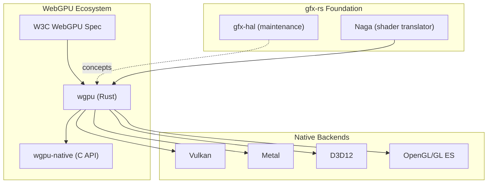
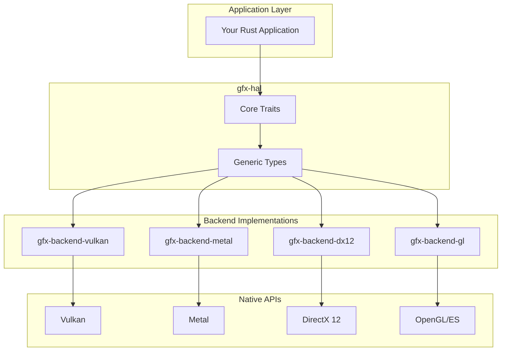
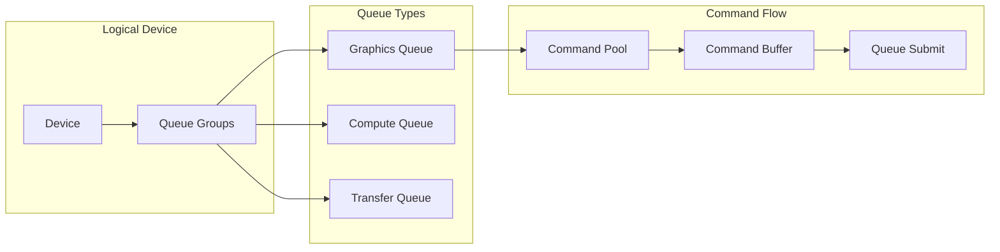
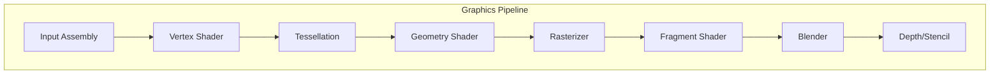
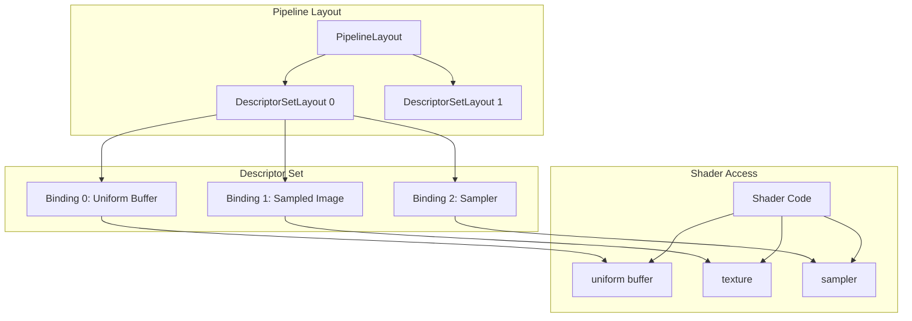
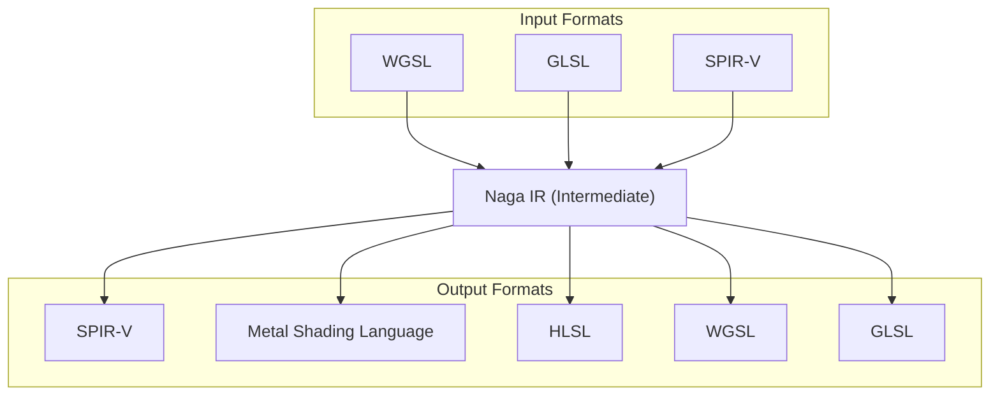

# gfx-rs / wgpu: Comprehensive Exploration

## Executive Summary

gfx-rs is a pioneering Rust graphics ecosystem that evolved from a low-level hardware abstraction layer (gfx-hal) into the foundation for wgpu, a cross-platform WebGPU implementation. This exploration covers the original gfx-rs repository structure, its HAL design, backend implementations, and the evolution toward modern WebGPU-based graphics in Rust.

## 1. Project Overview and History

### 1.1 What is gfx-rs/wgpu?

gfx-rs is a **low-level, cross-platform graphics and compute abstraction library** in Rust. It provides a Vulkan-inspired hardware abstraction layer (HAL) that translates API calls to native graphics backends including:

- **Vulkan** (Linux, Windows, Android)
- **DirectX 12** (Windows)
- **DirectX 11** (Windows, legacy)
- **Metal** (macOS, iOS)
- **OpenGL/OpenGL ES** (Linux, BSD, Android, Web/WebGL2)

The project has evolved through distinct phases:

```mermaid
timeline
    title gfx-rs Evolution Timeline
    section Phase 1: Pre-LL gfx
      2015-2017 : Original high-level gfx crate
                  "pre-ll" branch now
    section Phase 2: gfx-hal Era
      2017-2021 : gfx-hal low-level HAL
                  Multi-backend support
                  wgpu-rs built on top
    section Phase 3: wgpu Era
      2021-Present : gfx-hal maintenance mode
                     wgpu-hal replaces gfx-hal
                     WebGPU native implementation
```

### 1.2 Relationship to WebGPU Specification

The **WebGPU** specification is a modern web standard for low-level GPU access. gfx-rs's evolution directly enabled WebGPU in Rust:

1. **gfx-hal** provided the foundational cross-platform abstraction
2. **wgpu** emerged as a safer, WebGPU-aligned API built on gfx-hal
3. **wgpu-hal** (forked from gfx-hal concepts) now powers wgpu
4. **wgpu-native** provides C bindings for WebGPU-native interop



### 1.3 Key Design Goals and Philosophy

The gfx-rs ecosystem follows these core principles:

| Principle | Description |
|-----------|-------------|
| **Low-level access** | Direct GPU control with minimal overhead |
| **Cross-platform** | Single API targeting all major graphics APIs |
| **Rust-first** | Leverage Rust's type system for safety where possible |
| **Vulkan-inspired** | API design mirrors Vulkan's explicit control model |
| **Performance** | Zero-cost abstractions, stack allocation where feasible |
| **Backend parity** | Consistent behavior across all backends |

### 1.4 Repository Structure

```
/home/darkvoid/Boxxed/@formulas/src.rust/src.webgpu/src.gfx-rs/
├── gfx/                          # Main gfx-hal repository
│   ├── src/
│   │   ├── hal/                  # Hardware Abstraction Layer core
│   │   ├── backend/
│   │   │   ├── vulkan/           # Vulkan backend
│   │   │   ├── metal/            # Metal backend
│   │   │   ├── dx12/             # DirectX 12 backend
│   │   │   ├── dx11/             # DirectX 11 backend
│   │   │   ├── gl/               # OpenGL/GL ES backend
│   │   │   └── webgpu/           # WebGPU backend
│   │   ├── auxil/                # Helper libraries
│   │   │   ├── renderdoc/        # RenderDoc integration
│   │   │   └── external-memory/  # External memory handling
│   │   └── warden/               # Data-driven test framework
│   └── examples/
│       ├── quad/                 # Basic quad rendering
│       ├── compute/              # Compute shader example
│       ├── colour-uniform/       # Uniform buffer example
│       └── mesh-shading/         # Mesh shader example
│
├── wgpu-native/                  # Native WebGPU C bindings
│   ├── src/
│   │   ├── lib.rs                # Main FFI bindings
│   │   ├── conv.rs               # Type conversions
│   │   └── utils.rs              # Utility functions
│   └── examples/
│       ├── triangle/             # Triangle rendering (C)
│       ├── compute/              # Compute example (C)
│       └── capture/              # Screenshot capture
│
├── naga/                         # Shader translation (now in wgpu repo)
│   ├── src/
│   │   ├── front/                # Shader frontends (input)
│   │   │   ├── glsl/             # GLSL parser
│   │   │   ├── spv/              # SPIR-V parser
│   │   │   └── wgsl/             # WGSL parser
│   │   ├── back/                 # Shader backends (output)
│   │   │   ├── spv/              # SPIR-V output
│   │   │   ├── msl/              # Metal Shading Language
│   │   │   ├── hlsl/             # HLSL output
│   │   │   └── wgsl/             # WGSL output
│   │   └── valid/                # Shader validation
│   └── tests/
│
├── metal-rs/                     # Metal API bindings for Rust
├── d3d12-rs/                     # D3D12 API bindings for Rust
└── rspirv/                       # SPIR-V parsing/serialization
```

## 2. Core Architecture

### 2.1 Hardware Abstraction Layer (HAL) Design

The HAL is the heart of gfx-rs, providing a unified interface across all graphics backends.



### 2.2 Key Traits and Abstractions

#### Instance and Adapter Pattern

```rust
// From gfx/src/hal/src/lib.rs
pub trait Instance<B: Backend>: Send + Sync {
    fn enumerate_adapters(&self) -> Vec<Adapter<B>>;
}

// From gfx/src/hal/src/adapter.rs
pub struct Adapter<B: Backend> {
    pub info: AdapterInfo,
    pub physical_device: B::PhysicalDevice,
    pub queue_families: Vec<B::QueueFamily>,
}
```

The initialization flow:

```rust
use gfx_hal::Instance;
use gfx_backend_vulkan as back;

// 1. Create instance
let instance = back::Instance::create("My App", 1)
    .expect("Failed to create instance");

// 2. Enumerate adapters (GPUs)
let mut adapters = instance.enumerate_adapters();
let adapter = adapters.remove(0);

// 3. Open physical device
let gpu = unsafe {
    adapter.physical_device.open(
        &[(family, &[1.0])],
        Features::empty()
    )
}?;
```

#### Device and Queue Architecture



### 2.3 Backend Trait Requirements

Each backend implements the `Backend` trait with associated types:

```rust
pub trait Backend: 'static + Sized + fmt::Debug + Send + Sync {
    type Instance: fmt::Debug;
    type PhysicalDevice: fmt::Debug;
    type Device: device::Device<Self>;
    type Surface: fmt::Debug;
    type QueueFamily: fmt::Debug;
    type CommandBuffer: command::CommandBuffer<Self>;
    // ... and many more associated types
}
```

## 3. Graphics Pipeline Components

### 3.1 Pipeline State Objects (PSO)

The graphics pipeline is configured through a Pipeline State Object:



From `gfx/src/hal/src/pso/graphics.rs`:

```rust
pub struct GraphicsPipelineDesc<'a, B: Backend> {
    pub primitive_assembler: PrimitiveAssemblerDesc<'a, B>,
    pub rasterizer: Rasterizer,
    pub fragment: Option<EntryPoint<'a, B>>,
    pub blender: BlendDesc,
    pub depth_stencil: DepthStencilDesc,
    pub multisampling: Option<Multisampling>,
    pub layout: &'a B::PipelineLayout,
    pub subpass: pass::Subpass<'a, B>,
}
```

### 3.2 Descriptor Sets and Bind Groups

Descriptor sets organize resource bindings:



### 3.3 Command Buffer Recording

Command buffers record GPU operations:

```rust
// From gfx/src/hal/src/command/mod.rs
pub trait CommandBuffer<B: Backend>: fmt::Debug + Any + Send + Sync {
    unsafe fn begin(&mut self, flags: CommandBufferFlags, ...);
    unsafe fn finish(&mut self);

    // Render commands
    unsafe fn begin_render_pass<T>(&mut self, ...);
    unsafe fn draw(&mut self, vertices: Range<VertexCount>, instances: Range<InstanceCount>);
    unsafe fn end_render_pass(&mut self);

    // Compute commands
    unsafe fn dispatch(&mut self, count: WorkGroupCount);

    // Transfer commands
    unsafe fn copy_buffer(&mut self, src: &B::Buffer, dst: &B::Buffer, ...);
    unsafe fn copy_image(&mut self, src: &B::Image, dst: &B::Image, ...);
}
```

## 4. Naga Shader Translator

Naga is a critical component that translates between shader languages:



From `naga/src/lib.rs`:

```rust
/// The central structure is Module. A Module contains:
/// - Functions with arguments, return type, local variables, and body
/// - EntryPoints for pipeline stages (vertex, fragment, compute)
/// - Constants and GlobalVariables
/// - Types used by the above

pub struct Module {
    pub functions: Arena<Function>,
    pub entry_points: Vec<EntryPoint>,
    pub constants: Arena<Constant>,
    pub global_variables: Arena<GlobalVariable>,
    pub types: UniqueArena<Type>,
}
```

## 5. Example Walkthrough: Quad Rendering

The `gfx/examples/quad/main.rs` demonstrates complete initialization:

```rust
// 1. Create backend instance
let instance = back::Instance::create("gfx-rs quad", 1)
    .expect("Failed to create instance");

// 2. Get first available adapter
let adapter = {
    let mut adapters = instance.enumerate_adapters();
    adapters.remove(0)
};

// 3. Create window surface
let window = winit::window::WindowBuilder::new()
    .build(&event_loop).unwrap();
let surface = unsafe { instance.create_surface(&window) };

// 4. Create device and queues
let mut gpu = unsafe {
    adapter.physical_device.open(
        &[(family, &[1.0])],
        Features::empty()
    )
}.unwrap();

// 5. Create render pass, pipelines, etc.
let render_pass = unsafe {
    device.create_render_pass(...)
};

// 6. Record command buffers and submit
unsafe {
    command_buffer.begin_primary(CommandBufferFlags::ONE_TIME_SUBMIT);
    command_buffer.begin_render_pass(...);
    command_buffer.draw(0..6, 0..1);
    command_buffer.end_render_pass();
    command_buffer.finish();
}
queue.submit(iter::once(command_buffer));
```

## 6. Platform Support Matrix

| Backend | Windows | Linux | macOS | iOS | Android | Web |
|---------|---------|-------|-------|-----|---------|-----|
| Vulkan  | Yes     | Yes   | No*   | No  | Yes     | No  |
| D3D12   | Yes     | No    | No    | No  | No      | No  |
| D3D11   | Yes     | No    | No    | No  | No      | No  |
| Metal   | No      | No    | Yes   | Yes | No      | No  |
| GL/GLes | Yes     | Yes   | Yes** | Yes | Yes     | Yes |

* Vulkan on macOS via MoltenVK
** Metal preferred on macOS, GL available via ANGLE

## 7. Key Files Reference

| File | Purpose |
|------|---------|
| `gfx/src/hal/src/lib.rs` | Core HAL traits and types |
| `gfx/src/hal/src/device.rs` | Device trait for resource creation |
| `gfx/src/hal/src/command/mod.rs` | Command buffer trait |
| `gfx/src/hal/src/pso/mod.rs` | Pipeline state object definitions |
| `gfx/src/hal/src/image.rs` | Image and texture types |
| `gfx/src/hal/src/buffer.rs` | Buffer types and usage flags |
| `gfx/src/backend/vulkan/src/lib.rs` | Vulkan backend implementation |
| `gfx/src/backend/metal/src/lib.rs` | Metal backend implementation |
| `naga/src/lib.rs` | Shader IR and module structure |
| `wgpu-native/src/lib.rs` | C FFI bindings for WebGPU |

## 8. Related Projects and Ecosystem

- **wgpu** (https://github.com/gfx-rs/wgpu) - Active WebGPU implementation
- **wgpu-native** - C API bindings for wgpu
- **Naga** - Now part of wgpu repository
- **metal-rs** - Rust bindings for Metal API
- **d3d12-rs** - Rust bindings for D3D12 API

## 9. Further Reading

- [gfx-hal Documentation](https://docs.rs/gfx-hal)
- [wgpu Documentation](https://docs.rs/wgpu)
- [WebGPU Specification](https://www.w3.org/TR/webgpu/)
- [The Big Picture Blog Post](https://gfx-rs.github.io/2020/11/16/big-picture.html)

---

*This exploration was generated from the gfx-rs source at `/home/darkvoid/Boxxed/@formulas/src.rust/src.webgpu/src.gfx-rs/`*
