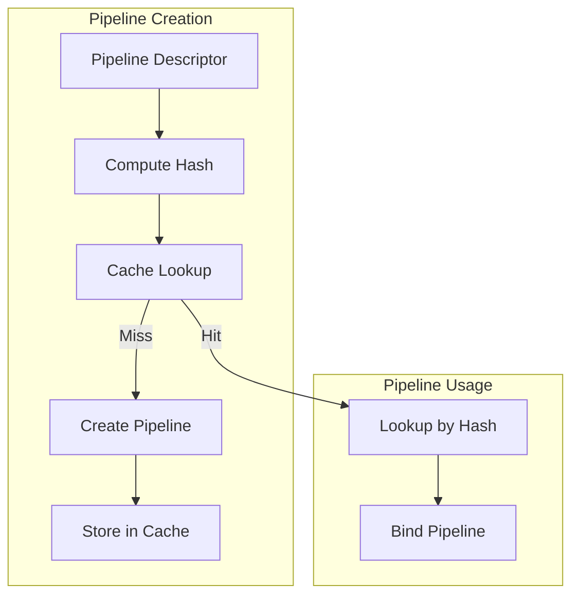
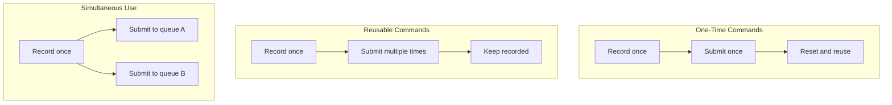
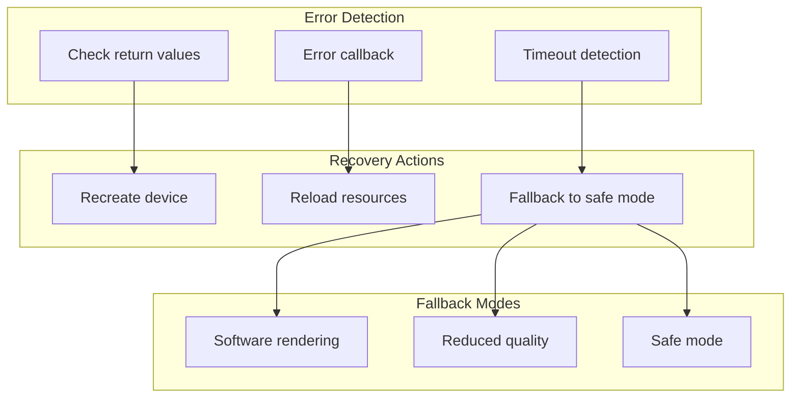

# Production Grade: Performance, Debugging, Validation, Error Recovery

## 1. Overview

This document covers production-ready considerations for gfx-rs/wgpu including performance optimizations, debugging tools, validation layers, and error recovery strategies.

## 2. Performance Optimizations

### 2.1 Pipeline State Object Caching



```rust
// Conceptual pipeline cache
use std::collections::HashMap;
use std::hash::{Hash, Hasher};

pub struct PipelineCache {
    cache: HashMap<u64, Arc<Pipeline>>,
    hasher: AHasherFactory,
}

impl PipelineCache {
    pub fn get_or_create(
        &mut self,
        desc: &PipelineDescriptor,
        create_fn: impl FnOnce() -> Result<Pipeline, Error>,
    ) -> Result<Arc<Pipeline>, Error> {
        let hash = self.compute_hash(desc);

        if let Some(pipeline) = self.cache.get(&hash) {
            return Ok(Arc::clone(pipeline));
        }

        let pipeline = Arc::new(create_fn()?);
        self.cache.insert(hash, Arc::clone(&pipeline));
        Ok(pipeline)
    }
}
```

### 2.2 Descriptor Pool Pre-allocation

```rust
// From gfx/src/hal/src/pso/descriptor.rs
pub trait DescriptorPool<B: Backend> {
    /// Pre-allocate descriptor sets for known workloads
    unsafe fn allocate<'a, I, E>(
        &mut self,
        layouts: I,
        list: &mut E,
    ) -> Result<(), AllocationError>;
}

// Production pattern: Pre-allocate pools based on expected usage
pub struct DescriptorPoolSizes {
    pub uniform_buffers: u32,
    pub storage_buffers: u32,
    pub sampled_images: u32,
    pub samplers: u32,
}

impl Device {
    pub fn create_descriptor_pool(
        &self,
        sizes: &[DescriptorPoolSize],
        flags: DescriptorPoolCreateFlags,
    ) -> Result<DescriptorPool, Error> {
        // Pre-allocate all descriptors upfront
        // Avoids fragmentation during runtime
    }
}
```

### 2.3 Command Buffer Reuse

```rust
// From gfx/src/hal/src/command/mod.rs
bitflags! {
    pub struct CommandBufferFlags: u32 {
        const ONE_TIME_SUBMIT = 0x1;
        const RENDER_PASS_CONTINUE = 0x2;
        const SIMULTANEOUS_USE = 0x4;
    }
}
```

### 2.4 Command Buffer Reuse Patterns



### 2.5 Resource Batching

```rust
// Batch small allocations into larger blocks
pub struct ResourceAllocator {
    chunks: Vec<MemoryChunk>,
    chunk_size: u64,
}

impl ResourceAllocator {
    pub fn allocate(&mut self, size: u64, alignment: u64) -> Allocation {
        // Find existing chunk with space
        for chunk in &mut self.chunks {
            if let Some(allocation) = chunk.try_allocate(size, alignment) {
                return allocation;
            }
        }

        // Create new chunk
        let mut chunk = MemoryChunk::new(self.chunk_size);
        let allocation = chunk.allocate(size, alignment);
        self.chunks.push(chunk);
        allocation
    }
}
```

### 2.6 GPU-Driven Rendering

```rust
// Indirect drawing for GPU-driven workflows
pub struct DrawIndirectArgs {
    pub vertex_count: u32,
    pub instance_count: u32,
    pub first_vertex: u32,
    pub first_instance: u32,
}

pub struct DrawIndexedIndirectArgs {
    pub index_count: u32,
    pub instance_count: u32,
    pub first_index: u32,
    pub base_vertex: i32,
    pub first_instance: u32,
}

// Command buffer records indirect draws
unsafe fn draw_indirect(
    &mut self,
    buffer: &B::Buffer,
    offset: u64,
    draw_count: u32,
    stride: u32,
);
```

## 3. Debugging Tools and Techniques

### 3.1 RenderDoc Integration

```rust
// From gfx/src/auxil/renderdoc/
use renderdoc::RenderDoc;

pub struct RenderDocCapture {
    renderdoc: RenderDoc<ApiEntryV141>,
}

impl RenderDocCapture {
    pub fn new() -> Option<Self> {
        let renderdoc = RenderDoc::new()?;
        Some(Self { renderdoc })
    }

    pub fn start_frame_capture(&mut self) {
        unsafe {
            self.renderdoc.start_frame_capture(ptr::null_mut(), ptr::null_mut());
        }
    }

    pub fn end_frame_capture(&mut self) {
        unsafe {
            self.renderdoc.end_frame_capture(ptr::null_mut(), ptr::null_mut());
        }
    }

    pub fn trigger_capture(&mut self) {
        unsafe {
            self.renderdoc.trigger_capture();
        }
    }
}
```

### 3.2 Validation Layers

```rust
// Vulkan debug messenger setup
// From gfx/src/backend/vulkan/src/lib.rs
pub enum DebugMessenger {
    Utils(ext::DebugUtils, vk::DebugUtilsMessengerEXT),
    #[allow(deprecated)]
    Report(ext::DebugReport, vk::DebugReportCallbackEXT),
}

// Debug message callback
unsafe extern "system" fn debug_callback(
    severity: vk::DebugUtilsMessageSeverityFlagsEXT,
    type_: vk::DebugUtilsMessageTypeFlagsEXT,
    p_callback_data: *const vk::DebugUtilsMessengerCallbackDataEXT,
    _p_user_data: *mut c_void,
) -> vk::Bool32 {
    let callback_data = &*p_callback_data;

    let message = CStr::from_ptr(callback_data.p_message).to_string_lossy();

    match severity {
        vk::DebugUtilsMessageSeverityFlagsEXT::ERROR => {
            log::error!("Vulkan validation: {}", message);
        }
        vk::DebugUtilsMessageSeverityFlagsEXT::WARNING => {
            log::warn!("Vulkan validation: {}", message);
        }
        vk::DebugUtilsMessageSeverityFlagsEXT::INFO => {
            log::info!("Vulkan info: {}", message);
        }
        _ => {}
    }

    vk::FALSE
}
```

### 3.3 API Logging

```rust
// From wgpu-native/Cargo.toml
## Log all API entry points at info instead of trace level.
api_log_info = ["wgc/api_log_info"]

// Logging levels for different scenarios:
// - Debug: All API calls with parameters
// - Info: Entry points only
// - Warn: Validation warnings
// - Error: Errors and failures
```

### 3.4 Memory Tracking

```rust
// Track memory allocations for debugging
pub struct MemoryTracker {
    allocations: HashMap<AllocationId, AllocationInfo>,
    total_allocated: u64,
    peak_allocated: u64,
}

struct AllocationInfo {
    size: u64,
    ty: ResourceType,
    label: String,
    backtrace: Backtrace,
}

impl MemoryTracker {
    pub fn track_allocation(
        &mut self,
        id: AllocationId,
        size: u64,
        ty: ResourceType,
        label: &str,
    ) {
        self.allocations.insert(id, AllocationInfo {
            size,
            ty,
            label: label.to_string(),
            backtrace: Backtrace::new(),
        });
        self.total_allocated += size;
        self.peak_allocated = self.peak_allocated.max(self.total_allocated);
    }

    pub fn print_leaks(&self) {
        if !self.allocations.is_empty() {
            eprintln!("Memory leaks detected:");
            for (id, info) in &self.allocations {
                eprintln!("  {:?}: {} bytes ({}) - {:?}", id, info.size, info.ty, info.label);
            }
        }
    }
}
```

### 3.5 Resource Labels

```rust
// Label resources for debugging tools
pub struct Device {
    // ...
}

impl Device {
    pub fn set_buffer_label(&self, buffer: &Buffer, label: &str) {
        #[cfg(feature = "debug-names")]
        unsafe {
            self.raw.set_buffer_name(buffer.raw, label.as_ptr());
        }
    }

    pub fn set_texture_label(&self, texture: &Texture, label: &str) {
        #[cfg(feature = "debug-names")]
        unsafe {
            self.raw.set_image_name(texture.raw, label.as_ptr());
        }
    }
}
```

## 4. Validation and Error Handling

### 4.1 Validation Modes

```rust
// From wgpu-native/Cargo.toml
## Apply run-time checks, even in release builds.
strict_asserts = ["wgc/strict_asserts", "wgt/strict_asserts"]

// Validation levels:
// 1. None (maximum performance)
// 2. Debug (assertions in debug builds)
// 3. Strict (assertions in all builds)
// 4. Validation layers (backend-specific)
```

### 4.2 Error Types

```rust
// From gfx/src/hal/src/device.rs
#[derive(Clone, Debug, PartialEq, thiserror::Error)]
pub enum CreationError {
    #[error(transparent)]
    OutOfMemory(#[from] OutOfMemory),

    #[error("Implementation specific error occurred")]
    InitializationFailed,

    #[error("Requested feature is missing")]
    MissingFeature,

    #[error("Too many objects")]
    TooManyObjects,

    #[error("Logical or Physical device was lost during creation")]
    DeviceLost,
}

#[derive(Clone, Debug, PartialEq, thiserror::Error)]
pub enum OutOfMemory {
    #[error("Out of host memory")]
    Host,
    #[error("Out of device memory")]
    Device,
}
```

### 4.3 Error Recovery Strategies



### 4.4 Device Lost Handling

```rust
// From wgpu-native/src/lib.rs
impl Drop for WGPUDeviceImpl {
    fn drop(&mut self) {
        if !thread::panicking() {
            let context = &self.context;

            // Wait for GPU to finish
            match context.device_poll(self.id, wgt::PollType::wait_indefinitely()) {
                Ok(_) => (),
                Err(err) => handle_error_fatal(err, "WGPUDeviceImpl::drop"),
            }

            context.device_drop(self.id);
        }
    }
}

// Production pattern: Handle device lost gracefully
pub enum DeviceState {
    Valid,
    Lost(String),
    Suspended,
}

impl Application {
    pub fn handle_device_lost(&mut self, reason: String) {
        self.device_state = DeviceState::Lost(reason.clone());

        // Attempt recovery
        match self.recreate_device() {
            Ok(_) => {
                self.reload_resources();
                self.device_state = DeviceState::Valid;
            }
            Err(_) => {
                // Fall back to safe mode or exit
                self.enter_safe_mode();
            }
        }
    }
}
```

### 4.5 Timeout Handling

```rust
// Fence with timeout
pub fn wait_with_timeout(
    &self,
    fence: &Fence,
    timeout_ns: u64,
) -> Result<bool, WaitError> {
    let start = Instant::now();

    loop {
        if self.fence_is_signaled(fence)? {
            return Ok(true);
        }

        if timeout_ns > 0 && start.elapsed().as_nanos() as u64 >= timeout_ns {
            return Ok(false); // Timeout
        }

        std::thread::sleep(Duration::from_micros(100));
    }
}
```

## 5. Feature Level Handling

### 5.1 Feature Detection

```rust
// From gfx/src/hal/src/adapter.rs
pub trait PhysicalDevice<B: Backend> {
    fn features(&self) -> Features;
    fn properties(&self) -> PhysicalDeviceProperties;
    fn format_properties(&self, format: Option<format::Format>) -> format::Properties;
}

// Feature tier system
pub enum FeatureTier {
    Baseline,    // All devices
    Tier1,       // Modern devices
    Tier2,       // High-end devices
    Extended,    // Enthusiast features
}
```

### 5.2 Graceful Degradation

```rust
// Detect and adapt to available features
pub struct GraphicsPipeline {
    features: SupportedFeatures,
}

impl GraphicsPipeline {
    pub fn create_adaptive(
        device: &Device,
        requested: Features,
    ) -> Result<Self, Error> {
        let available = device.features();

        // Check what we can support
        let supported = requested.intersection(available);

        if supported != requested {
            log::warn!("Some features not available: {:?}", requested - supported);
        }

        // Create pipeline with available features
        Ok(Self {
            features: supported,
        })
    }

    pub fn use_fallback(&self, technique: RenderingTechnique) -> RenderingTechnique {
        match technique {
            RenderingTechnique::RayTracing if !self.features.has_ray_tracing() => {
                RenderingTechnique::Rasterization
            }
            RenderingTechnique::Tessellation if !self.features.has_tessellation() => {
                RenderingTechnique::StandardMesh
            }
            _ => technique,
        }
    }
}
```

### 5.3 Format Support Detection

```rust
// Check format support
pub fn is_format_supported(
    device: &Device,
    format: TextureFormat,
    usage: TextureUsage,
) -> bool {
    let props = device.format_properties(Some(format));

    match usage {
        TextureUsage::SAMPLED => props.linear_tiling.contains(ImageFeatures::SAMPLED),
        TextureUsage::STORAGE => props.linear_tiling.contains(ImageFeatures::STORAGE),
        TextureUsage::RENDER_ATTACHMENT => {
            if format.is_depth_stencil() {
                props.linear_tiling.contains(ImageFeatures::DEPTH_STENCIL_ATTACHMENT)
            } else {
                props.linear_tiling.contains(ImageFeatures::COLOR_ATTACHMENT)
            }
        }
        _ => false,
    }
}
```

## 6. Profiling and Performance Analysis

### 6.1 GPU Timestamp Queries

```rust
// From gfx/src/hal/src/query.rs
bitflags! {
    pub struct PipelineStatistic: u32 {
        const INPUT_ASSEMBLY_VERTICES = 0x1;
        const INPUT_ASSEMBLY_PRIMITIVES = 0x2;
        const VERTEX_SHADER_INVOCATIONS = 0x4;
        const HULL_SHADER_INVOCATIONS = 0x8;
        const DOMAIN_SHADER_INVOCATIONS = 0x10;
        const GEOMETRY_SHADER_INVOCATIONS = 0x20;
        const GEOMETRY_SHADER_PRIMITIVES = 0x40;
        const CLIP_INVOCATIONS = 0x80;
        const CLIP_PRIMITIVES = 0x100;
        const FRAGMENT_SHADER_INVOCATIONS = 0x200;
        const TESSELLATION_CONTROL_SHADER_PATCHES = 0x400;
        const TESSELLATION_EVALUATION_SHADER_INVOCATIONS = 0x800;
        const COMPUTE_SHADER_INVOCATIONS = 0x1000;
    }
}

// Timestamp query pattern
unsafe fn write_timestamp(
    &mut self,
    query_set: &B::QueryPool,
    query_index: u32,
    stage: PipelineStage,
);
```

### 6.2 Profiling Pattern

```rust
// GPU profiling with timestamp queries
pub struct GpuProfiler {
    query_pool: QueryPool,
    results: Vec<TimestampResult>,
    current_query: u32,
}

struct TimestampResult {
    label: String,
    start_query: u32,
    end_query: u32,
}

impl GpuProfiler {
    pub fn begin_pass(&mut self, cmd: &mut CommandBuffer) {
        self.current_query = 0;
    }

    pub fn push(&mut self, cmd: &mut CommandBuffer, label: &str) {
        let query = self.current_query;
        unsafe {
            cmd.write_timestamp(
                &self.query_pool,
                query * 2,
                PipelineStage::TOP_OF_PIPE,
            );
        }
        self.results.push(TimestampResult {
            label: label.to_string(),
            start_query: query * 2,
            end_query: query * 2 + 1,
        });
        self.current_query += 1;
    }

    pub fn end_pass(&mut self, cmd: &mut CommandBuffer) {
        if let Some(result) = self.results.last_mut() {
            unsafe {
                cmd.write_timestamp(
                    &self.query_pool,
                    result.end_query,
                    PipelineStage::BOTTOM_OF_PIPE,
                );
            }
        }
    }

    pub fn resolve(&self) -> Vec<ProfileResult> {
        // Convert timestamps to durations
        // ...
    }
}
```

### 6.3 Frame Analysis

```rust
// Track per-frame statistics
pub struct FrameStats {
    frame_number: u64,
    frame_time_us: u64,
    gpu_time_us: u64,
    draw_calls: u32,
    vertices_drawn: u64,
    primitives_drawn: u64,
    compute_dispatches: u32,
}

pub struct PerformanceMonitor {
    frames: CircularBuffer<FrameStats, 100>,
}

impl PerformanceMonitor {
    pub fn get_average_frame_time(&self) -> f64 {
        let sum: u64 = self.frames.iter().map(|f| f.frame_time_us).sum();
        sum as f64 / self.frames.len() as f64
    }

    pub fn get_percentile(&self, percentile: f64) -> u64 {
        // Calculate percentile from frame history
        // ...
    }
}
```

## 7. Production Checklist

### 7.1 Pre-Release Checklist

| Item | Description | Status |
|------|-------------|--------|
| Validation layers | Enabled in debug builds | ☐ |
| Error handling | All errors handled gracefully | ☐ |
| Device lost recovery | Tested and working | ☐ |
| Memory tracking | No leaks detected | ☐ |
| Performance profiling | Within budget | ☐ |
| Fallback paths | Tested on low-end hardware | ☐ |
| Resource labels | Descriptive names for debugging | ☐ |

### 7.2 Runtime Diagnostics

```rust
// Enable diagnostics in production builds
pub struct DiagnosticsConfig {
    pub log_errors: bool,
    pub track_memory: bool,
    pub gpu_profiling: bool,
    pub crash_reporting: bool,
}

impl DiagnosticsConfig {
    pub fn production() -> Self {
        Self {
            log_errors: true,
            track_memory: true,
            gpu_profiling: false, // Too expensive
            crash_reporting: true,
        }
    }

    pub fn development() -> Self {
        Self {
            log_errors: true,
            track_memory: true,
            gpu_profiling: true,
            crash_reporting: false,
        }
    }
}
```

## 8. Key Files Reference

| File | Purpose |
|------|---------|
| `gfx/src/auxil/renderdoc/` | RenderDoc integration |
| `gfx/src/backend/vulkan/src/lib.rs` | Vulkan debug messenger |
| `wgpu-native/src/logging.rs` | Logging configuration |
| `wgpu-native/src/utils.rs` | Error handling utilities |

## 9. Summary

Production-grade graphics applications should:

1. **Enable validation** in debug builds
2. **Handle errors gracefully** with recovery paths
3. **Use profiling** to identify bottlenecks
4. **Track memory** to prevent leaks
5. **Support fallbacks** for degraded hardware
6. **Label resources** for debugging
7. **Monitor performance** in production

---

*This document analyzed production considerations from `/home/darkvoid/Boxxed/@formulas/src.rust/src.webgpu/src.gfx-rs/`*
