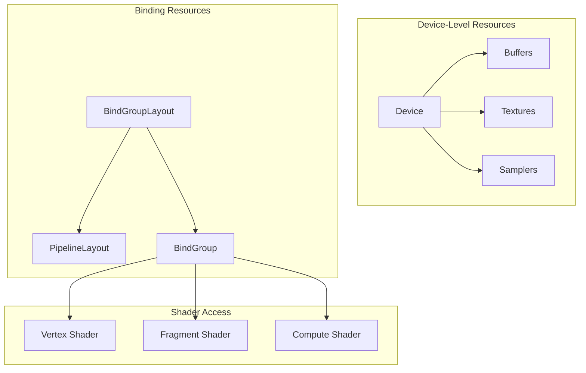
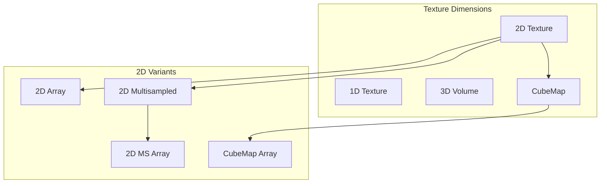
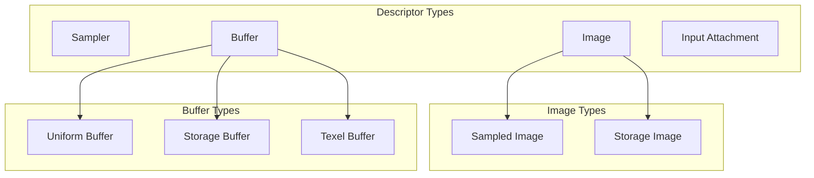
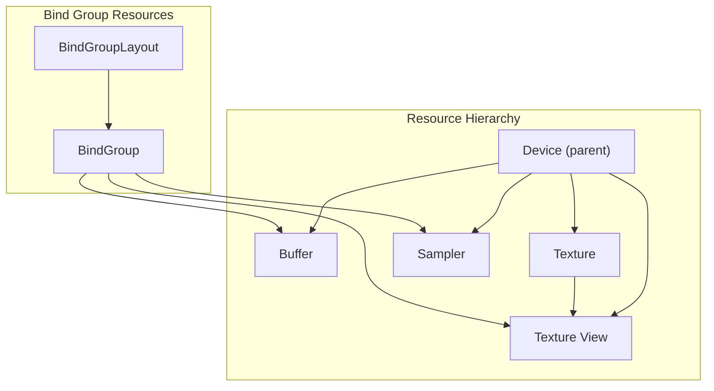
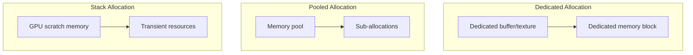
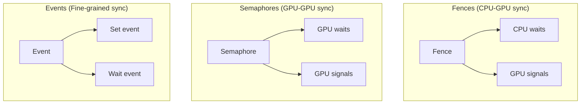

# Resource Management: Buffers, Textures, Bind Groups

## 1. Overview

This document examines how gfx-rs/wgpu manages GPU resources including buffers, textures, samplers, and bind groups. We cover resource creation, lifetime management, memory allocation, and binding patterns.

## 2. Resource Hierarchy



## 3. Buffer Management

### 3.1 Buffer Usage Flags

```rust
// From gfx/src/hal/src/buffer.rs
bitflags! {
    pub struct Usage: u32 {
        const TRANSFER_SRC  = 0x1;
        const TRANSFER_DST = 0x2;
        const UNIFORM_TEXEL = 0x4;
        const STORAGE_TEXEL = 0x8;
        const UNIFORM = 0x10;    // Uniform buffers
        const STORAGE = 0x20;    // Storage buffers
        const INDEX = 0x40;      // Index buffers
        const VERTEX = 0x80;     // Vertex buffers
        const INDIRECT = 0x100;  // Indirect draw buffers
    }
}
```

### 3.2 Buffer Access Flags

```rust
// From gfx/src/hal/src/buffer.rs
bitflags! {
    pub struct Access: u32 {
        const INDIRECT_COMMAND_READ = 0x1;
        const INDEX_BUFFER_READ = 0x2;
        const VERTEX_BUFFER_READ = 0x4;
        const UNIFORM_READ = 0x8;
        const SHADER_READ = 0x20;
        const SHADER_WRITE = 0x40;
        const TRANSFER_READ = 0x800;
        const TRANSFER_WRITE = 0x1000;
        const HOST_READ = 0x2000;
        const HOST_WRITE = 0x4000;
        const MEMORY_READ = 0x8000;
        const MEMORY_WRITE = 0x10000;
    }
}
```

### 3.3 Buffer Creation Pattern

```rust
// From gfx/src/hal/src/device.rs (trait definition)
pub trait Device<B: Backend> {
    unsafe fn create_buffer(
        &self,
        size: u64,
        usage: buffer::Usage,
    ) -> Result<B::Buffer, buffer::CreationError>;

    unsafe fn get_buffer_requirements(
        &self,
        buffer: &B::Buffer,
    ) -> Requirements;

    unsafe fn bind_buffer_memory(
        &self,
        memory: &B::Memory,
        offset: u64,
        buffer: B::Buffer,
    ) -> Result<(), BindError>;
}
```

### 3.4 Buffer SubRanges

```rust
// From gfx/src/hal/src/buffer.rs
#[derive(Clone, Debug, Default, Hash, PartialEq, Eq)]
pub struct SubRange {
    pub offset: Offset,
    pub size: Option<Offset>,
}

impl SubRange {
    pub const WHOLE: Self = SubRange {
        offset: 0,
        size: None,
    };

    pub fn size_to(&self, limit: Offset) -> Offset {
        self.size.unwrap_or(limit - self.offset)
    }
}
```

### 3.5 Memory Mapping

```rust
// Conceptual from wgpu
pub struct Buffer {
    raw: RawBuffer,
    size: u64,
    usage: BufferUsages,
    map_state: MapState,
}

enum MapState {
    Unmapped,
    Waiting(MappingCallback),
    Active { ptr: *mut u8, range: Range<u64> },
}

impl Buffer {
    pub fn map_async(
        &self,
        mode: MapMode,
        range: Range<u64>,
        callback: MappingCallback,
    ) -> Result<(), BufferAccessError> {
        match self.map_state {
            MapState::Unmapped => {
                // Request mapping from device
                self.device.map_buffer(self, mode, range, callback)
            }
            _ => Err(BufferAccessError::AlreadyMapped),
        }
    }

    pub fn get_mapped_range(&self, range: Range<u64>) -> BufferView {
        BufferView {
            buffer: self,
            ptr: self.mapped_ptr + range.start,
            size: range.end - range.start,
            _lifetime: PhantomData,
        }
    }
}
```

## 4. Texture Management

### 4.1 Texture Extent and Dimensions

```rust
// From gfx/src/hal/src/image.rs
#[derive(Clone, Copy, Debug, Default, Hash, PartialEq, Eq)]
pub struct Extent {
    pub width: Size,
    pub height: Size,
    pub depth: Size,
}

impl Extent {
    pub fn is_empty(&self) -> bool {
        self.width == 0 || self.height == 0 || self.depth == 0
    }

    pub fn at_level(&self, level: Level) -> Self {
        Extent {
            width: 1.max(self.width >> level),
            height: 1.max(self.height >> level),
            depth: 1.max(self.depth >> level),
        }
    }
}
```

### 4.2 Texture Kinds (Dimensions)



### 4.3 Texture Usage Flags

```rust
// From gfx/src/hal/src/image.rs
bitflags! {
    pub struct Usage: u32 {
        const TRANSFER_SRC = 0x1;
        const TRANSFER_DST = 0x2;
        const SAMPLED = 0x4;
        const STORAGE = 0x8;
        const COLOR_ATTACHMENT = 0x10;
        const DEPTH_STENCIL_ATTACHMENT = 0x20;
        const TRANSIENT_ATTACHMENT = 0x40;
        const INPUT_ATTACHMENT = 0x80;
    }
}
```

### 4.4 Image Tiling

```rust
// From gfx/src/hal/src/image.rs
#[repr(u32)]
#[derive(Clone, Copy, Debug, Eq, Hash, PartialEq)]
pub enum Tiling {
    /// Optimal tiling for GPU memory access. Implementation-dependent.
    Optimal = 0,
    /// Optimal for CPU read/write. Texels laid out in row-major order.
    Linear = 1,
}
```

### 4.5 Texture Views

```rust
// From gfx/src/hal/src/image.rs
#[derive(Clone, Debug, Hash, PartialEq, Eq)]
pub struct SubresourceRange {
    pub aspects: format::Aspects,
    pub levels: Range<Level>,
    pub layers: Range<Layer>,
}

pub struct ImageView {
    image: Arc<Image>,
    view_kind: ViewKind,
    format: Format,
    swizzle: Swizzle,
    range: SubresourceRange,
}
```

### 4.6 View Creation

```rust
// From gfx/src/hal/src/device.rs
pub trait Device<B: Backend> {
    unsafe fn create_image_view(
        &self,
        image: &B::Image,
        view_kind: image::ViewKind,
        format: format::Format,
        swizzle: format::Swizzle,
        range: image::SubresourceRange,
    ) -> Result<B::ImageView, image::ViewCreationError>;
}
```

## 5. Sampler Management

### 5.1 Sampler Descriptor

```rust
// Conceptual from wgpu
#[derive(Clone, Debug)]
pub struct SamplerDescriptor<'a> {
    pub label: Label<'a>,
    pub address_mode_u: AddressMode,
    pub address_mode_v: AddressMode,
    pub address_mode_w: AddressMode,
    pub mag_filter: FilterMode,
    pub min_filter: FilterMode,
    pub mipmap_filter: FilterMode,
    pub lod_min_clamp: f32,
    pub lod_max_clamp: f32,
    pub compare: Option<CompareFunction>,
    pub anisotropy_clamp: Option<NonZeroU32>,
    pub border_color: Option<SamplerBorderColor>,
}

#[derive(Clone, Copy, Debug)]
pub enum FilterMode {
    Nearest,
    Linear,
}

#[derive(Clone, Copy, Debug)]
pub enum AddressMode {
    ClampToEdge,
    Repeat,
    MirrorRepeat,
}
```

### 5.2 Sampler LOD Calculation

```rust
// Conceptual LOD calculation
fn calculate_lod(
    base_level: u32,
    max_mipmap_level: u32,
    lod_min: f32,
    lod_max: f32,
) -> f32 {
    let lod = (base_level as f32).clamp(lod_min, lod_max);
    lod.min(max_mipmap_level as f32)
}
```

## 6. Bind Groups and Layouts

### 6.1 Descriptor Set Layout Bindings

```rust
// From gfx/src/hal/src/pso/descriptor.rs
#[derive(Clone, Debug)]
pub struct DescriptorSetLayoutBinding {
    pub binding: DescriptorBinding,
    pub ty: DescriptorType,
    pub count: DescriptorArrayIndex,
    pub stage_flags: ShaderStageFlags,
    pub immutable_samplers: bool,
}

#[derive(Clone, Copy, Debug, PartialEq, Eq, Hash)]
pub enum DescriptorType {
    Sampler,
    Image { ty: ImageDescriptorType },
    Buffer { ty: BufferDescriptorType, format: BufferDescriptorFormat },
    InputAttachment,
}
```

### 6.2 Descriptor Type Hierarchy



### 6.3 Pipeline Layout

```rust
// From gfx/src/hal/src/pso/descriptor.rs
pub trait PipelineLayout<B: Backend>: Send + Sync + fmt::Debug {
    // Pipeline layout is created from descriptor set layouts
}

// Conceptual from wgpu
pub struct PipelineLayout {
    bind_group_layouts: Vec<Arc<BindGroupLayout>>,
    push_constant_ranges: Vec<PushConstantRange>,
}

pub struct PushConstantRange {
    pub stages: ShaderStages,
    pub range: Range<u32>,
}
```

### 6.4 Bind Group Creation

```rust
// From gfx/src/hal/src/pso/descriptor.rs
pub trait DescriptorPool<B: Backend>: Send + Sync + fmt::Debug {
    unsafe fn allocate_one(
        &mut self,
        layout: &B::DescriptorSetLayout,
    ) -> Result<B::DescriptorSet, AllocationError>;

    unsafe fn allocate<'a, I, E>(
        &mut self,
        layouts: I,
        list: &mut E,
    ) -> Result<(), AllocationError>
    where
        I: Iterator<Item = &'a B::DescriptorSetLayout>,
        E: Extend<B::DescriptorSet>;
}
```

### 6.5 Writing Descriptors

```rust
// From gfx/src/hal/src/pso/descriptor.rs
pub struct DescriptorSetWrite<'a, B: Backend, I: 'a> {
    pub set: &'a B::DescriptorSet,
    pub binding: DescriptorBinding,
    pub array_offset: DescriptorArrayIndex,
    pub descriptors: I,
}

pub enum Descriptor<'a, B: Backend> {
    Sampler(&'a B::Sampler),
    Image {
        sampler: Option<&'a B::Sampler>,
        image_view: &'a B::ImageView,
        layout: image::Layout,
    },
    Buffer {
        buffer: &'a B::Buffer,
        range: Option<buffer::SubRange>,
    },
    TexelBuffer(&'a B::BufferView),
}
```

### 6.6 Bind Group Binding Order

```rust
// From gfx/src/backend/metal/src/lib.rs:
/*
Pipeline Layout binding order:
1. Push constants (if any)
2. Descriptor set 0 resources
3. Descriptor set 1 resources
4. ... additional sets
5. Vertex buffers (at end of VS buffer table)

When argument buffers are supported, each descriptor set
becomes a single buffer binding.
*/
```

## 7. Resource Lifetime and Ownership

### 7.1 Parent-Child Relationships



### 7.2 Drop Order Requirements

```rust
// Resources must be dropped in correct order:
// 1. BindGroups (reference other resources)
// 2. Views (reference images)
// 3. Samplers
// 4. Buffers, Images
// 5. Device (last)

// From wgpu-native/src/lib.rs
impl Drop for WGPUDeviceImpl {
    fn drop(&mut self) {
        if !thread::panicking() {
            // Wait for GPU to finish using all resources
            match self.context.device_poll(self.id, wgt::PollType::wait_indefinitely()) {
                Ok(_) => (),
                Err(err) => handle_error_fatal(err, "WGPUDeviceImpl::drop"),
            }
            // Now safe to drop device
            self.context.device_drop(self.id);
        }
    }
}
```

## 8. Memory Allocation Strategies

### 8.1 Memory Types and Heaps

```rust
// From gfx/src/hal/src/adapter.rs
#[derive(Copy, Clone, Debug, PartialEq, Eq)]
pub struct MemoryType {
    pub properties: memory::Properties,
    pub heap_index: usize,
}

#[derive(Copy, Clone, Debug, PartialEq, Eq)]
pub struct MemoryHeap {
    pub size: u64,
    pub flags: memory::HeapFlags,
}

#[derive(Clone, Debug, Eq, PartialEq)]
pub struct MemoryProperties {
    pub memory_types: Vec<MemoryType>,
    pub memory_heaps: Vec<MemoryHeap>,
}
```

### 8.2 Memory Properties

```rust
// From gfx/src/hal/src/memory.rs
bitflags! {
    pub struct Properties: u32 {
        const DEVICE_LOCAL = 0x1;
        const HOST_VISIBLE = 0x2;
        const HOST_COHERENT = 0x4;
        const HOST_CACHED = 0x8;
        const LAZILY_ALLOCATED = 0x10;
    }
}

bitflags! {
    pub struct HeapFlags: u32 {
        const DEVICE_LOCAL = 0x1;
        const MULTI_INSTANCE = 0x2;
    }
}
```

### 8.3 Memory Selection Algorithm

```rust
// Conceptual memory type selection
fn find_memory_type(
    memory_props: &MemoryProperties,
    required_properties: Properties,
    memory_type_bits: u32,
) -> Option<u32> {
    for (i, memory_type) in memory_props.memory_types.iter().enumerate() {
        if (memory_type_bits & (1 << i)) != 0 {
            if memory_type.properties.contains(required_properties) {
                return Some(i as u32);
            }
        }
    }
    None
}
```

### 8.4 Allocation Patterns



## 9. Resource Binding Patterns

### 9.1 Static Binding

```rust
// Bind once, use throughout pipeline lifetime
let bind_group = device.create_bind_group(&BindGroupDescriptor {
    layout: &bind_group_layout,
    entries: &[
        BindGroupEntry {
            binding: 0,
            resource: BindingResource::Buffer(buffer.as_entire_buffer_binding()),
        },
        BindGroupEntry {
            binding: 1,
            resource: BindingResource::TextureView(&texture_view),
        },
        BindGroupEntry {
            binding: 2,
            resource: BindingResource::Sampler(&sampler),
        },
    ],
});

// In render/compute pass
render_pass.set_bind_group(0, &bind_group, &[0]);
```

### 9.2 Dynamic Binding

```rust
// Use dynamic offsets for variable buffer bindings
let bind_group = device.create_bind_group(&BindGroupDescriptor {
    layout: &bind_group_layout,
    entries: &[
        BindGroupEntry {
            binding: 0,
            resource: BindingResource::Buffer(BufferBinding {
                buffer: &large_buffer,
                offset: 0,
                size: Some(UNIFORM_SIZE),
            }),
        },
    ],
});

// Bind with dynamic offset
render_pass.set_bind_group(0, &bind_group, &[uniform_offset]);
```

### 9.3 Bind Group Layout Compatibility

```rust
// Bind groups are compatible if:
// 1. Same number of bindings
// 2. Same binding indices
// 3. Same descriptor types
// 4. Same shader stage visibility
// 5. Same array sizes (if applicable)

// Pipeline layouts are compatible if:
// 1. Same number of bind group layouts
// 2. Each bind group layout is compatible

// This allows bind group reuse across pipelines
```

## 10. Resource State Tracking

### 10.1 Image Layouts

```rust
// From gfx/src/hal/src/image.rs
#[derive(Clone, Copy, Debug, Hash, PartialEq, Eq)]
pub enum Layout {
    Undefined,
    General,
    ColorAttachmentOptimal,
    DepthStencilAttachmentOptimal,
    DepthStencilReadOnlyOptimal,
    ShaderReadOnlyOptimal,
    TransferSrcOptimal,
    TransferDstOptimal,
    Preinitialized,
    Present,
}
```

### 10.2 Pipeline Barriers

```rust
// From gfx/src/hal/src/command/mod.rs
pub trait CommandBuffer<B: Backend> {
    unsafe fn pipeline_barrier<'a, T>(
        &mut self,
        stages: Range<pso::PipelineStage>,
        dependencies: Dependencies,
        barriers: T,
    ) where T: Iterator<Item = Barrier<'a, B>>;
}

// Barrier types
pub enum Barrier<'a, B: Backend> {
    Buffer {
        states: Range<buffer::State>,
        target: &'a B::Buffer,
        range: buffer::SubRange,
        families: Option<QueueFamilies>,
    },
    Image {
        states: Range<image::State>,
        target: &'a B::Image,
        range: image::SubresourceRange,
        families: Option<QueueFamilies>,
    },
}
```

### 10.3 Synchronization Primitives



## 11. Key Files Reference

| File | Purpose |
|------|---------|
| `gfx/src/hal/src/buffer.rs` | Buffer types and usage |
| `gfx/src/hal/src/image.rs` | Texture types, views, layouts |
| `gfx/src/hal/src/memory.rs` | Memory types and properties |
| `gfx/src/hal/src/pso/descriptor.rs` | Descriptor sets, layouts |
| `gfx/src/hal/src/device.rs` | Resource creation traits |

## 12. Summary

Resource management in gfx-rs/wgpu follows these principles:

1. **Explicit lifetime management** through RAII
2. **Clear ownership hierarchy** (Device -> Resources -> Views)
3. **Type-safe binding** through layout compatibility
4. **Flexible memory allocation** with type selection
5. **Explicit state tracking** through barriers and layouts
6. **Dynamic binding support** for efficient updates

---

*This document analyzed resource management patterns from `/home/darkvoid/Boxxed/@formulas/src.rust/src.webgpu/src.gfx-rs/`*
