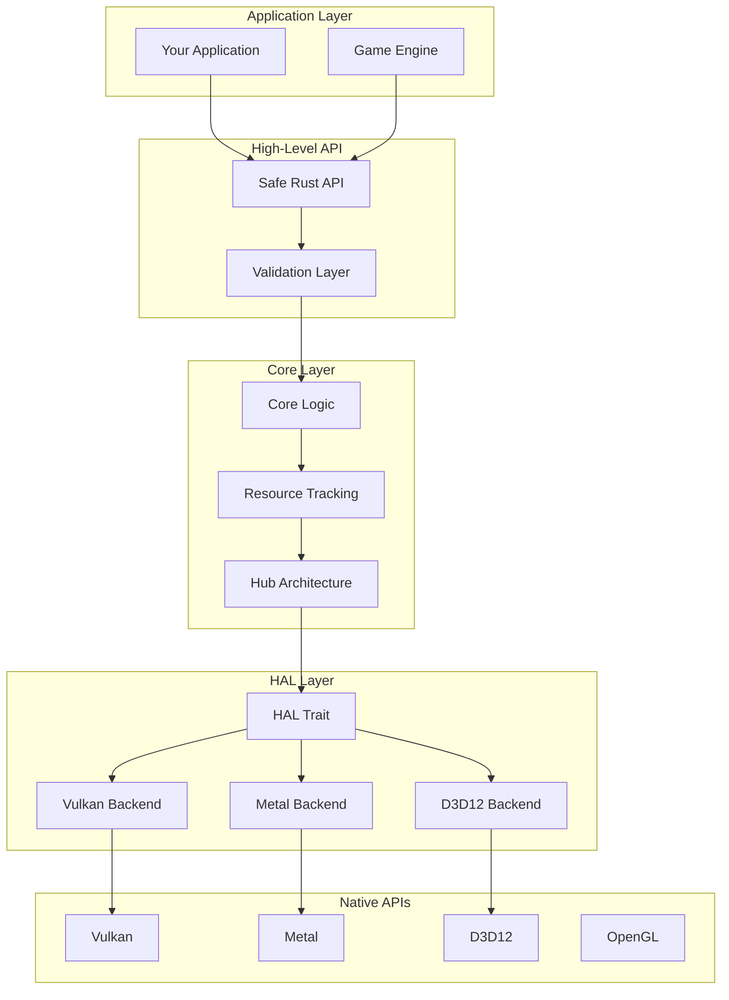
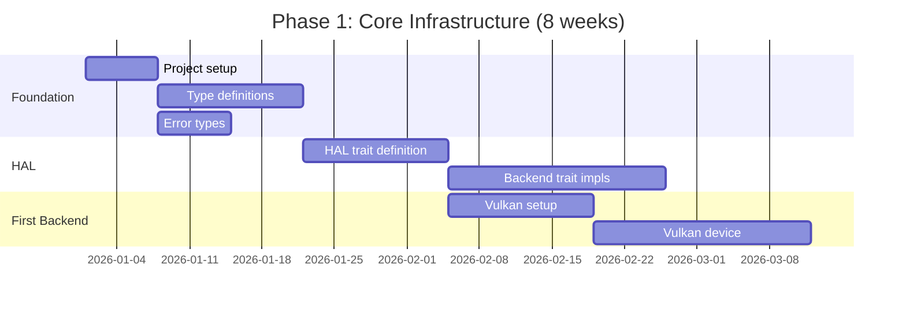
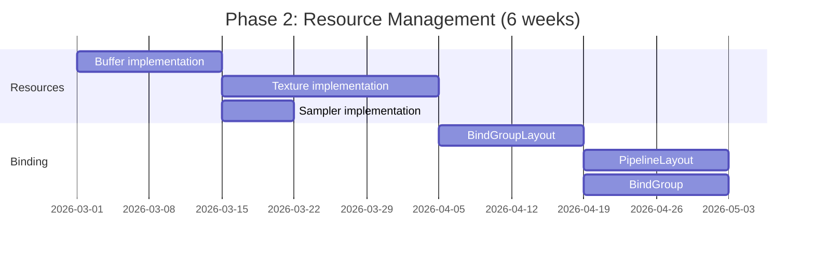
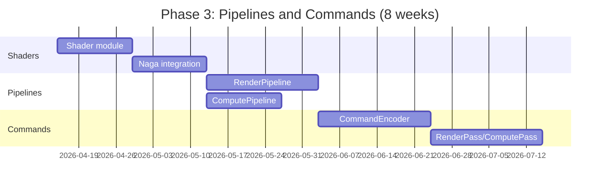

# Rust Revision: Building Similar Systems in Rust

## 1. Overview

This document provides guidance on building a gfx-rs/wgpu-like graphics system in Rust, covering crate recommendations, architectural decisions, lessons learned from gfx-rs, and what to do differently.

## 2. System Architecture

### 2.1 Recommended Layered Architecture



### 2.2 Crate Structure

```
my-graphics/
├── Cargo.toml (workspace)
├── my-graphics/           # Main safe API crate
├── my-graphics-core/      # Core logic and tracking
├── my-graphics-hal/       # HAL trait definitions
├── my-graphics-vulkan/    # Vulkan backend
├── my-graphics-metal/     # Metal backend
├── my-graphics-d3d12/     # D3D12 backend
├── my-graphics-gl/        # OpenGL backend
└── my-graphics-shader/    # Shader compilation/translation
```

## 3. Crate Recommendations

### 3.1 Core Dependencies

```toml
[workspace.dependencies]
# Low-level API bindings
ash = "0.38"                    # Vulkan
metal = "0.29"                  # Metal
d3d12 = "0.20"                  # D3D12 (from gfx-rs ecosystem)
gl = "0.14"                     # OpenGL bindings

# Shader handling
naga = "0.20"                   # Shader translation
spirv = "0.3"                   # SPIR-V types

# Utilities
bitflags = "2"                  # Flag types
thiserror = "2"                 # Error types
log = "0.4"                     # Logging
parking_lot = "0.12"            # Synchronization
smallvec = "1"                  # Stack vectors
arrayvec = "0.7"                # Stack arrays
rustc-hash = "2"                # Fast hashing
indexmap = "2"                  # Indexed maps

# Windowing (examples)
winit = "0.30"
raw-window-handle = "0.6"

# Optional: GPU allocation
gpu-alloc = "0.6"               # GPU memory allocation
gpu-descriptor = "0.3"          # Descriptor allocation
```

### 3.2 Recommended External Crates

| Purpose | Crate | Notes |
|---------|-------|-------|
| GPU Memory Allocation | `gpu-alloc` | Vulkan-style allocation |
| Descriptor Allocation | `gpu-descriptor` | Descriptor set management |
| Shader Translation | `naga` | Multi-shader translation |
| Profiling | `tracing` + `tracing-chrome` | CPU profiling |
| Validation | Custom | Build on HAL errors |
| Math | `glam` or `nalgebra` | Vector/math types |

## 4. Key Design Decisions

### 4.1 Backend Trait Pattern

```rust
// Use associated types for zero-cost abstraction
pub trait Backend: 'static + Sized + Send + Sync + Debug {
    type Instance: Debug;
    type PhysicalDevice: PhysicalDevice<Self>;
    type Device: Device<Self>;
    type Buffer: Debug + Send + Sync;
    type Texture: Debug + Send + Sync;
    type Sampler: Debug + Send + Sync;
    type BindGroupLayout: Debug + Send + Sync;
    type PipelineLayout: Debug + Send + Sync;
    type ShaderModule: Debug + Send + Sync;
    type RenderPipeline: Debug + Send + Sync;
    type ComputePipeline: Debug + Send + Sync;
    type CommandBuffer: CommandBuffer<Self>;
    type CommandEncoder: CommandEncoder<Self>;
    // ... 30+ associated types
}

// Each backend implements:
pub struct VulkanBackend {}
impl Backend for VulkanBackend {
    type Instance = VulkanInstance;
    type PhysicalDevice = VulkanPhysicalDevice;
    // ... etc
}
```

### 4.2 Resource Handle Design

```rust
// Option 1: ID-based handles (like wgpu-core)
#[derive(Debug, Clone, Copy, PartialEq, Eq, Hash)]
pub struct Handle<T>(u64, PhantomData<T>);

pub struct Registry<T> {
    data: Vec<Option<T>>,
    free_list: Vec<u64>,
    epochs: Vec<u64>,
}

// Option 2: Arc-based handles (simpler)
pub type BufferHandle = Arc<Buffer>;
pub type TextureHandle = Arc<Texture>;

// Option 3: Typed arena allocation
pub struct Arena<T> {
    chunks: Vec<Box<[T]>>,
    // ...
}
```

### 4.3 Error Handling Strategy

```rust
// Use thiserror for clear error types
#[derive(Debug, thiserror::Error)]
pub enum GraphicsError {
    #[error("Out of memory: {0}")]
    OutOfMemory(MemoryType),

    #[error("Device lost: {0}")]
    DeviceLost(String),

    #[error("Invalid resource: {0}")]
    InvalidResource(String),

    #[error("Shader compilation failed: {0}")]
    ShaderCompilation(String),

    #[error("Validation error: {0}")]
    ValidationError(String),
}

// Use Result with context
pub type Result<T> = std::result::Result<T, GraphicsError>;

// Implementation-level errors stay internal
#[derive(Debug)]
enum InternalError {
    VulkanError(vk::Result),
    MetalError,
    D3D12Error,
}

impl From<InternalError> for GraphicsError {
    fn from(err: InternalError) -> Self {
        // Convert to public error
        GraphicsError::DeviceLost(format!("{:?}", err))
    }
}
```

### 4.4 Resource Lifetime Management

```rust
// Use Arc for shared ownership
pub struct Device {
    raw: Arc<RawDevice>,
    tracking: Arc<ResourceTracking>,
}

// RAII for automatic cleanup
pub struct Buffer {
    device: Arc<Device>,
    raw: RawBuffer,
}

impl Drop for Buffer {
    fn drop(&mut self) {
        if !std::thread::panicking() {
            // Only cleanup if not panicking
            unsafe {
                self.device.raw.destroy_buffer(self.raw);
            }
        }
    }
}

// Guard pattern for temporary mappings
pub struct MappedBuffer<'a> {
    buffer: &'a Buffer,
    ptr: *mut u8,
    size: usize,
    _marker: PhantomData<&'a mut [u8]>,
}

impl<'a> Drop for MappedBuffer<'a> {
    fn drop(&mut self) {
        unsafe {
            self.buffer.unmap();
        }
    }
}
```

## 5. Lessons from gfx-rs Architecture

### 5.1 What Worked Well

| Pattern | Why It Works |
|---------|--------------|
| **Associated types for backends** | Zero-cost abstraction, compile-time dispatch |
| **RAII resource management** | Automatic cleanup, no manual tracking |
| **Bitflags for features/usage** | Type-safe, efficient, composable |
| **Separation of HAL and safe API** | Clear boundaries, optional validation |
| **Naga for shader translation** | Single source, multiple targets |
| **Epoch-based handle validation** | Catch use-after-free bugs |

### 5.2 What Was Challenging

| Challenge | Lesson |
|-----------|--------|
| **Unsafe trait methods** | Document safety requirements clearly |
| **Backend feature parity** | Define minimum feature set upfront |
| **Memory management complexity** | Consider gpu-alloc crate |
| **Synchronization across threads** | Use parking_lot, document Send/Sync |
| **Shader format fragmentation** | Standardize on WGSL + Naga |
| **Validation overhead** | Make validation optional/configurable |

## 6. What to Do Differently

### 6.1 Simplified HAL Design

```rust
// Instead of 30+ associated types, consider grouped types:

pub trait Backend: 'static + Sized + Send + Sync {
    // Group related types
    type Resources: ResourceTypes<Self>;
    type Commands: CommandTypes<Self>;
    type Pipelines: PipelineTypes<Self>;

    // Core objects
    type Instance: Debug;
    type Device: Debug;
    type Adapter: Debug;
}

pub trait ResourceTypes<B: Backend> {
    type Buffer;
    type Texture;
    type TextureView;
    type Sampler;
    type BindGroup;
}
```

### 6.2 Modern Rust Patterns

```rust
// Use non-exhaustive for forward compatibility
#[non_exhaustive]
pub struct TextureDescriptor<'a> {
    pub label: Label<'a>,
    pub size: Extent3d,
    pub format: TextureFormat,
    pub usage: TextureUsages,
    // Future fields can be added without breaking changes
}

// Use sealed traits to prevent external implementations
mod sealed {
    pub trait Sealed {}
}

pub trait Backend: sealed::Sealed {
    // Only we can implement this
}

// Use const generics where applicable
pub struct ConstantBuffer<T: Send + Sync, const N: usize> {
    data: [T; N],
}
```

### 6.3 Async Integration

```rust
// Consider async patterns for resource loading
pub trait Device {
    // Async buffer mapping
    async fn map_buffer_async(
        &self,
        buffer: &Buffer,
        mode: MapMode,
    ) -> Result<MappedBuffer<'_>, MapError>;

    // Async shader compilation
    async fn create_shader_module_async(
        &self,
        source: ShaderSource<'_>,
    ) -> Result<ShaderModule, ShaderError>;
}

// But be aware of async overhead for hot paths
```

### 6.4 Better Compile-Time Guarantees

```rust
// Use types to encode state
pub struct Unmapped;
pub struct MappedRead;
pub struct MappedWrite;

pub struct Buffer<State> {
    raw: RawBuffer,
    state: PhantomData<State>,
}

// Only mapped buffers can be read/written
impl Buffer<MappedRead> {
    pub fn slice(&self, range: Range<usize>) -> &[u8] {
        // Safe: buffer is mapped
    }
}

impl Buffer<MappedWrite> {
    pub fn slice_mut(&mut self, range: Range<usize>) -> &mut [u8] {
        // Safe: buffer is mapped for writing
    }
}

// State transitions
impl Buffer<Unmapped> {
    pub async fn map_read(self) -> Result<Buffer<MappedRead>, Error> {
        // ...
    }
}
```

### 6.5 Improved Error Recovery

```rust
// Build recovery into the API
pub enum DeviceState {
    Valid,
    Suspended,
    Lost(DeviceLostReason),
}

pub struct Device {
    state: Arc<AtomicDeviceState>,
    // ...
}

impl Device {
    pub fn is_lost(&self) -> bool {
        matches!(self.state.load(), DeviceState::Lost(_))
    }

    pub fn recreate(&self) -> Result<Self, DeviceLostError> {
        // Built-in recovery mechanism
    }
}
```

## 7. Implementation Roadmap

### 7.1 Phase 1: Core Infrastructure



### 7.2 Phase 2: Resource Management



### 7.3 Phase 3: Pipelines and Commands



## 8. Minimal Viable Implementation

### 8.1 MVP Feature Set

```rust
// Minimal working example
pub struct Graphics {
    instance: Instance,
    device: Device,
    queue: Queue,
}

impl Graphics {
    pub fn new() -> Result<Self, Error> {
        // Single backend to start (Vulkan or Metal)
        let instance = Instance::new();
        let adapter = instance.request_adapter().await?;
        let (device, queue) = adapter.request_device().await?;

        Ok(Self {
            instance,
            device,
            queue,
        })
    }

    pub fn create_buffer(&self, size: u64, usage: BufferUsages) -> Result<Buffer, Error> {
        self.device.create_buffer(size, usage)
    }

    pub fn create_texture(&self, desc: &TextureDescriptor) -> Result<Texture, Error> {
        self.device.create_texture(desc)
    }

    pub fn create_shader_module(&self, source: &str) -> Result<ShaderModule, Error> {
        // WGSL only for MVP
        self.device.create_shader_module(ShaderSource::Wgsl(source))
    }

    pub fn create_render_pipeline(
        &self,
        desc: &RenderPipelineDescriptor,
    ) -> Result<RenderPipeline, Error> {
        self.device.create_render_pipeline(desc)
    }
}
```

### 8.2 Single-Backend Start

```rust
// Start with one backend, add others later
#[cfg(target_os = "macos")]
type PrimaryBackend = MetalBackend;

#[cfg(target_os = "windows")]
#[cfg(target_os = "linux")]
type PrimaryBackend = VulkanBackend;

// Abstract over the backend
pub type Instance = <PrimaryBackend as Backend>::Instance;
pub type Device = <PrimaryBackend as Backend>::Device;
// etc.
```

## 9. Testing Strategy

### 9.1 Unit Tests

```rust
#[cfg(test)]
mod tests {
    use super::*;

    #[test]
    fn test_buffer_creation() {
        let device = create_test_device();
        let buffer = device.create_buffer(1024, BufferUsages::UNIFORM);
        assert!(buffer.is_ok());
    }

    #[test]
    fn test_pipeline_creation() {
        // Test pipeline compilation
    }
}
```

### 9.2 Integration Tests

```rust
// tests/triangle.rs
#[test]
fn test_triangle_rendering() {
    // Create device, render triangle, verify no errors
}

// tests/compute.rs
#[test]
fn test_compute_dispatch() {
    // Run compute shader, read back results
}
```

### 9.3 Example Applications

```rust
// examples/triangle.rs
fn main() {
    // Minimal triangle rendering example
}

// examples/compute.rs
fn main() {
    // Compute shader example
}

// examples/textured_quad.rs
fn main() {
    // Textured quad with depth
}
```

## 10. Summary Recommendations

### 10.1 Do

- Start with a single backend (Vulkan or Metal)
- Use Naga for shader handling from day one
- Implement proper RAII for all resources
- Make validation optional and configurable
- Use thiserror for error types
- Document safety requirements for unsafe code
- Consider gpu-alloc for memory management

### 10.2 Don't

- Don't try to support all backends at once
- Don't skip error handling for "impossible" cases
- Don't expose raw backend types in the public API
- Don't make validation mandatory in release builds
- Don't ignore thread safety (Send/Sync bounds)

### 10.3 Key Success Factors

1. **Clear abstraction boundaries** between HAL and safe API
2. **Consistent error handling** throughout the stack
3. **Good documentation** for unsafe APIs
4. **Test coverage** for common use cases
5. **Example code** that demonstrates best practices

---

*This revision guide analyzed patterns from `/home/darkvoid/Boxxed/@formulas/src.rust/src.webgpu/src.gfx-rs/`*
