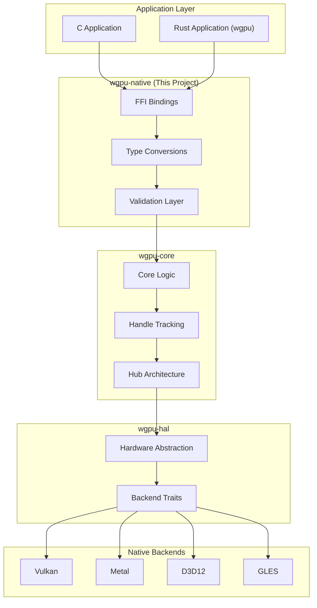
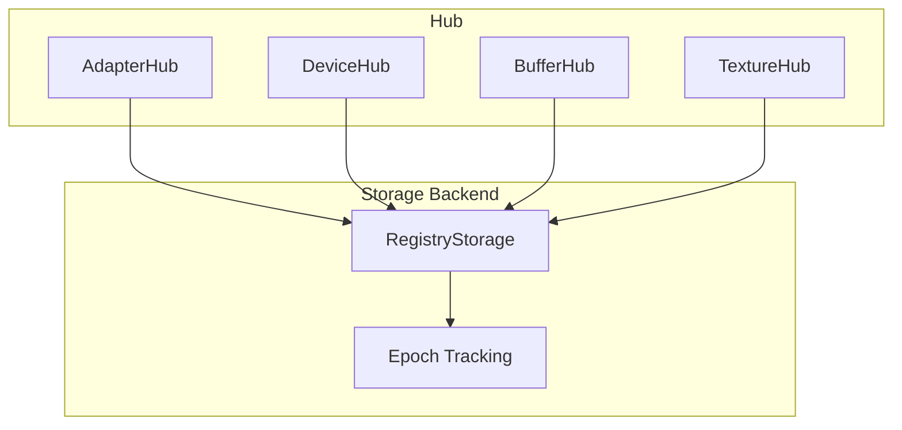
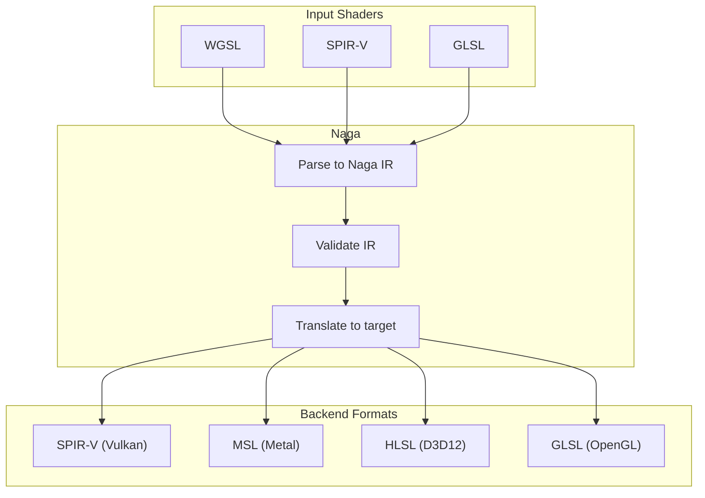

# WebGPU Implementation: WebGPU Spec Implementation in Rust

## 1. Overview

This document examines how wgpu-native implements the WebGPU specification in Rust, including the translation layers to native APIs, handle tracking, validation, and error handling.

## 2. WebGPU Specification Background

### 2.1 What is WebGPU?

WebGPU is a modern graphics API standard from the W3C that provides:

- **Low-level GPU access** comparable to Vulkan/Metal/D3D12
- **Cross-platform abstraction** with consistent behavior
- **Safety by design** with validation and error recovery
- **Web and Native** targets from the same API

### 2.2 WebGPU-native Headers

wgpu-native implements against the WebGPU-native C headers:

```c
// From wgpu-native/ffi/webgpu-headers/webgpu.h (conceptual)
typedef struct WGPUInstance { ... } WGPUInstance;
typedef struct WGPUAdapter { ... } WGPUAdapter;
typedef struct WGPUDevice { ... } WGPUDevice;
typedef struct WGPUBuffer { ... } WGPUBuffer;
// ... 100+ WebGPU types
```

## 3. Architecture Overview

### 3.1 Layered Architecture



### 3.2 Project Dependencies

```toml
# From wgpu-native/Cargo.toml
[workspace.dependencies.wgc]
package = "wgpu-core"
version = "27.0.3"

[workspace.dependencies.wgt]
package = "wgpu-types"
version = "27.0.1"

[workspace.dependencies.hal]
package = "wgpu-hal"
version = "27.0.4"

[workspace.dependencies.naga]
package = "naga"
version = "27.0.3"
```

## 4. FFI Bindings Layer

### 4.1 Core FFI Structure

```rust
// From wgpu-native/src/lib.rs
#![allow(clippy::missing_safety_doc)]

use parking_lot::Mutex;
use smallvec::SmallVec;
use std::{
    borrow::Cow,
    ffi::c_void,
    sync::{atomic, Arc, Weak},
};
use wgc::{
    command::{bundle_ffi, ComputePass, RenderPass},
    id, resource, Label,
};

pub mod conv;
pub mod logging;
pub mod unimplemented;
pub mod utils;
```

### 4.2 Resource Handle Wrappers

```rust
// From wgpu-native/src/lib.rs
pub struct WGPUAdapterImpl {
    context: Arc<Context>,
    id: id::AdapterId,
}

impl Drop for WGPUAdapterImpl {
    fn drop(&mut self) {
        if !thread::panicking() {
            let context = &self.context;
            context.adapter_drop(self.id);
        }
    }
}

pub struct WGPUBufferImpl {
    context: Arc<Context>,
    id: id::BufferId,
    error_sink: ErrorSink,
    data: BufferData,
}

impl Drop for WGPUBufferImpl {
    fn drop(&mut self) {
        if !thread::panicking() {
            let context = &self.context;
            context.buffer_drop(self.id);
        }
    }
}
```

### 4.3 FFI Function Pattern

```rust
// From wgpu-native/src/lib.rs (pattern example)
#[no_mangle]
pub extern "C" fn wgpuDeviceCreateBuffer(
    device: Option<&native::WGPUDevice>,
    descriptor: &native::WGPUBufferDescriptor,
) -> Option<native::WGPUBuffer> {
    let device = device?;

    // Convert WebGPU descriptor to wgpu-core descriptor
    let conv_desc = conv::map_buffer_descriptor(descriptor);

    // Call wgpu-core
    let (buffer_id, error) = unsafe {
        device.context.device_create_buffer(
            device.id,
            &conv_desc,
            device.error_sink.clone(),
        )
    };

    // Return FFI handle
    Some(native::WGPUBuffer { /* opaque handle */)
}
```

## 5. Type Conversions

### 5.1 Descriptor Mapping

```rust
// From wgpu-native/src/conv.rs (conceptual)
pub fn map_device_descriptor(
    desc: &native::WGPUDeviceDescriptor,
) -> wgc::device::DeviceDescriptor {
    wgc::device::DeviceDescriptor {
        required_features: map_features(desc.requiredFeatures),
        required_limits: map_limits(&desc.requiredLimits),
        default_queue: wgt::QueueDescriptor::default(),
        device_lost_callback: None,
        trace: None,
    }
}

pub fn map_buffer_descriptor(
    desc: &native::WGPUBufferDescriptor,
) -> wgc::resource::BufferDescriptor {
    wgc::resource::BufferDescriptor {
        label: desc.label.map(|s| unsafe { CStr::from_ptr(s) })
            .and_then(|cstr| cstr.to_str().ok())
            .map(|s| s.into()),
        size: desc.size,
        usage: map_buffer_usage(desc.usage),
        mapped_at_creation: desc.mappedAtCreation,
    }
}
```

### 5.2 Enum Mapping

```rust
// From wgpu-native/src/conv.rs
pub fn map_texture_format(
    format: native::WGPUTextureFormat,
) -> wgt::TextureFormat {
    match format {
        native::WGPUTextureFormat_R8Unorm => wgt::TextureFormat::R8Unorm,
        native::WGPUTextureFormat_R8Snorm => wgt::TextureFormat::R8Snorm,
        native::WGPUTextureFormat_R8Uint => wgt::TextureFormat::R8Uint,
        native::WGPUTextureFormat_R8Sint => wgt::TextureFormat::R8Sint,
        native::WGPUTextureFormat_Rgba8Unorm => wgt::TextureFormat::Rgba8Unorm,
        native::WGPUTextureFormat_Rgba8Snorm => wgt::TextureFormat::Rgba8Snorm,
        // ... 50+ format mappings
        _ => unreachable!(),
    }
}

pub fn map_shader_stage(
    stage: native::WGPUShaderStageFlags,
) -> wgt::ShaderStages {
    let mut stages = wgt::ShaderStages::empty();
    if stage & native::WGPUShaderStageFlag_Vertex != 0 {
        stages |= wgt::ShaderStages::VERTEX;
    }
    if stage & native::WGPUShaderStageFlag_Fragment != 0 {
        stages |= wgt::ShaderStages::FRAGMENT;
    }
    if stage & native::WGPUShaderStageFlag_Compute != 0 {
        stages |= wgt::ShaderStages::COMPUTE;
    }
    stages
}
```

### 5.3 Backend Type Flags

```rust
// From wgpu-native/src/conv.rs
pub fn map_instance_backend_flags(
    flags: native::WGPUInstanceBackend,
) -> wgt::Backends {
    let mut backends = wgt::Backends::empty();

    if flags & native::WGPUInstanceBackend_Vulkan != 0 {
        backends |= wgt::Backends::VULKAN;
    }
    if flags & native::WGPUInstanceBackend_Metal != 0 {
        backends |= wgt::Backends::METAL;
    }
    if flags & native::WGPUInstanceBackend_Dx12 != 0 {
        backends |= wgt::Backends::DX12;
    }
    if flags & native::WGPUInstanceBackend_Gl != 0 {
        backends |= wgt::Backends::GL;
    }

    backends
}
```

## 6. Handle Tracking and Validation

### 6.1 ID-Based Handle System

```rust
// Conceptual from wgpu-core
pub type AdapterId = Id<Adapter>;
pub type DeviceId = Id<Device>;
pub type BufferId = Id<Buffer>;
pub type TextureId = Id<Texture>;

// IDs encode backend type for runtime dispatch
pub enum Id<T> {
    Vulkan(u64, PhantomData<T>),
    Metal(u64, PhantomData<T>),
    Dx12(u64, PhantomData<T>),
    Gl(u64, PhantomData<T>),
}
```

### 6.2 Hub Architecture



### 6.3 Epoch-Based Validation

```rust
// Conceptual from wgpu-core
pub struct IndexManager {
    // Tracks freed indices for reuse
    free_list: Vec<Index>,
}

pub fn validate_id<T>(id: Id<T>, storage: &Storage<T>) -> Result<&T, InvalidId> {
    let index = id.index();
    let epoch = id.epoch();

    match storage.get(index) {
        Some(entry) if entry.epoch == epoch => Ok(entry),
        _ => Err(InvalidId::InvalidEpoch),
    }
}
```

### 6.4 Resource Lifetime Tracking

```rust
// From wgpu-native/src/lib.rs
pub struct WGPUDeviceImpl {
    context: Arc<Context>,
    id: id::DeviceId,
    queue: Arc<QueueId>,
    error_sink: ErrorSink,
}

impl Drop for WGPUDeviceImpl {
    fn drop(&mut self) {
        if !thread::panicking() {
            let context = &self.context;

            // Wait for GPU to finish before dropping
            match context.device_poll(self.id, wgt::PollType::wait_indefinitely()) {
                Ok(_) => (),
                Err(err) => handle_error_fatal(err, "WGPUDeviceImpl::drop"),
            }

            context.device_drop(self.id);
        }
    }
}
```

## 7. Error Handling and Safety

### 7.1 Error Sink Pattern

```rust
// From wgpu-native/src/lib.rs
struct ErrorSink {
    callback: Mutex<Option<ErrorCallback>>,
}

impl ErrorSink {
    fn handle_error(&self, error: wgc::error::Error) {
        let callback = self.callback.lock();
        if let Some(cb) = callback.as_ref() {
            cb(error);
        } else {
            log::error!("WebGPU Error: {:?}", error);
        }
    }
}
```

### 7.2 Error Types

```rust
// From wgpu-native/src/lib.rs (conceptual)
pub enum Error {
    OutOfMemory,
    InvalidDevice,
    InvalidSurface,
    InvalidAdapter,
    InvalidTexture,
    InvalidBuffer,
    InvalidBindGroup,
    InvalidPipeline,
    InvalidPassEncoder,
    InvalidCommandBuffer,
    DeviceLost,
    ShaderCompilation,
}
```

### 7.3 Validation Layers

```rust
// Conceptual validation flow
pub fn create_texture(
    device: &Device,
    desc: &TextureDescriptor,
) -> Result<Texture, CreateTextureError> {
    // WebGPU spec validation
    if desc.size.width == 0 || desc.size.height == 0 || desc.size.depth == 0 {
        return Err(CreateTextureError::ZeroSize);
    }

    if desc.format.is_depth_stencil() && desc.usage.contains(TextureUsage::RENDER_ATTACHMENT) {
        if !desc.usage.contains(TextureUsage::COPY_DST) {
            return Err(CreateTextureError::InvalidDepthStencilUsage);
        }
    }

    // Feature requirement validation
    if desc.format == TextureFormat::Bc1RgbaUnorm {
        if !device.features.contains(Features::TEXTURE_COMPRESSION_BC) {
            return Err(CreateTextureError::MissingFeature);
        }
    }

    // Call HAL
    unsafe {
        device.raw.create_texture(desc)
    }
}
```

### 7.4 Uncatchable Errors (Fatal)

```rust
// From wgpu-native/src/utils.rs
pub fn handle_error_fatal(err: impl Display, context: &str) -> ! {
    log::error!("FATAL ERROR in {}: {}", context, err);
    std::process::abort();
}
```

## 8. Shader Module Handling

### 8.1 Naga Integration

```rust
// Conceptual from wgpu-core
pub fn create_shader_module(
    device: &Device,
    desc: &ShaderModuleDescriptor,
) -> Result<ShaderModule, CreateShaderModuleError> {
    match desc.source {
        ShaderSource::Wgsl(source) => {
            // Parse WGSL with Naga
            let module = naga::front::wgsl::parse_str(source)?;

            // Validate the module
            let info = naga::valid::Validator::new()
                .validate(&module)?;

            Ok(ShaderModule { module, info })
        }
        ShaderSource::SpirV(source) => {
            // Parse SPIR-V with Naga
            let module = naga::front::spv::parse_u8_slice(source)?;
            let info = naga::valid::Validator::new().validate(&module)?;
            Ok(ShaderModule { module, info })
        }
        ShaderSource::Glsl { source, stage } => {
            // Parse GLSL with Naga
            let module = naga::front::glsl::parse_str(source, stage)?;
            let info = naga::valid::Validator::new().validate(&module)?;
            Ok(ShaderModule { module, info })
        }
    }
}
```

### 8.2 Shader Translation Pipeline



## 9. Command Encoding

### 9.1 Command Buffer Recording

```rust
// From wgpu-native/src/lib.rs
pub struct WGPUCommandEncoderImpl {
    context: Arc<Context>,
    id: id::CommandEncoderId,
    error_sink: ErrorSink,
    open: atomic::AtomicBool,
}

impl Drop for WGPUCommandEncoderImpl {
    fn drop(&mut self) {
        if !thread::panicking() {
            let context = &self.context;
            context.command_encoder_drop(self.id);
        }
    }
}
```

### 9.2 Render Pass Encoding

```rust
// From wgpu-native/src/lib.rs
pub struct WGPURenderPassEncoderImpl {
    context: Arc<Context>,
    encoder: *mut RenderPass,
    error_sink: ErrorSink,
}

impl Drop for WGPURenderPassEncoderImpl {
    fn drop(&mut self) {
        if !thread::panicking() {
            drop(unsafe { Box::from_raw(self.encoder) });
        }
    }
}
```

### 9.3 Command Translation

```rust
// Conceptual from wgpu-core command streaming
pub enum RenderCommand {
    SetPipeline(RenderPipelineId),
    SetBindGroup {
        index: u32,
        bind_group: Option<BindGroupId>,
        dynamic_offsets: Vec<DynamicOffset>,
    },
    SetVertexBuffer {
        slot: u32,
        buffer: Option<BufferId>,
        offset: BufferAddress,
        size: Option<BufferAddress>,
    },
    Draw {
        vertex_count: u32,
        instance_count: u32,
        first_vertex: u32,
        first_instance: u32,
    },
    DrawIndexed {
        index_count: u32,
        instance_count: u32,
        first_index: u32,
        base_vertex: i32,
        first_instance: u32,
    },
    // ... 30+ command types
}
```

## 10. Backend Selection and Initialization

### 10.1 Instance Creation

```rust
// From wgpu-native/src/conv.rs
pub fn map_instance_descriptor(
    desc: &native::WGPUInstanceDescriptor,
) -> wgc::InstanceDescriptor {
    wgc::InstanceDescriptor {
        backends: map_instance_backend_flags(desc.backends),
        flags: wgt::InstanceFlags::default(),
        dx12_shader_compiler: map_dx12_compiler(desc.dx12ShaderCompiler),
    }
}
```

### 10.2 Adapter Request

```rust
// Conceptual from wgpu-core
pub fn request_adapter(
    instance: &Instance,
    options: &RequestAdapterOptions,
) -> Option<AdapterId> {
    let mut adapters = instance.enumerate_adapters();

    // Filter by power preference
    if let Some(pref) = options.power_preference {
        adapters.retain(|a| a.info.device_type == pref.to_device_type());
    }

    // Filter by required features
    if let Some(features) = options.required_features {
        adapters.retain(|a| a.features.contains(features));
    }

    // Return best match
    adapters.into_iter().next()
}
```

## 11. Surface and Swapchain

### 11.1 Surface Creation

```rust
// From wgpu-native/src/conv.rs
pub fn map_surface(
    window: *mut c_void,
    // Platform-specific parameters
) -> Result<Surface, SurfaceError> {
    #[cfg(target_os = "windows")]
    {
        use raw_window_handle::Win32WindowHandle;
        // Create DXGI surface
    }

    #[cfg(target_os = "macos")]
    {
        use raw_window_handle::AppKitWindowHandle;
        // Create CAMetalLayer surface
    }

    #[cfg(target_os = "linux")]
    {
        use raw_window_handle::XlibWindowHandle;
        // Create Vulkan/X11 surface
    }
}
```

### 11.2 Swapchain Configuration

```rust
// From wgpu-native/src/conv.rs
pub fn map_surface_configuration(
    config: &native::WGPUConfiguration,
) -> wgt::SurfaceConfiguration {
    wgt::SurfaceConfiguration {
        usage: map_texture_usage(config.usage),
        format: map_texture_format(config.format),
        width: config.width,
        height: config.height,
        present_mode: map_present_mode(config.presentMode),
        alpha_mode: map_alpha_mode(config.alphaMode),
        view_format_count: 0,
        view_formats: &[],
    }
}
```

## 12. Feature Level Handling

### 12.1 Feature Mapping

```rust
// Conceptual feature mapping
const WEBGPU_FEATURES: &[(&str, wgt::Features)] = &[
    ("depth-clip-control", Features::DEPTH_CLIP_CONTROL),
    ("depth32float-stencil8", Features::DEPTH32_FLOAT_STENCIL8),
    ("timestamp-query", Features::TIMESTAMP_QUERY),
    ("pipeline-statistics-query", Features::PIPELINE_STATISTICS_QUERY),
    ("texture-compression-bc", Features::TEXTURE_COMPRESSION_BC),
    ("texture-compression-etc2", Features::TEXTURE_COMPRESSION_ETC2),
    ("texture-compression-astc", Features::TEXTURE_COMPRESSION_ASTC),
    ("indirect-first-instance", Features::INDIRECT_FIRST_INSTANCE),
    ("shader-f16", Features::SHADER_F16),
    ("rg11b10ufloat-renderable", Features::RG11B10FLOAT),
];
```

### 12.2 Limits Handling

```rust
// From wgpu-types (conceptual)
#[derive(Debug, Clone, Copy, PartialEq, Eq)]
pub struct Limits {
    pub max_texture_dimension_1d: u32,
    pub max_texture_dimension_2d: u32,
    pub max_texture_dimension_3d: u32,
    pub max_texture_array_layers: u32,
    pub max_bind_groups: u32,
    pub max_bindings_per_bind_group: u32,
    pub max_dynamic_uniform_buffers_per_pipeline_layout: u32,
    pub max_dynamic_storage_buffers_per_pipeline_layout: u32,
    pub max_sampled_textures_per_shader_stage: u32,
    pub max_samplers_per_shader_stage: u32,
    pub max_storage_buffers_per_shader_stage: u32,
    pub max_storage_textures_per_shader_stage: u32,
    pub max_uniform_buffers_per_shader_stage: u32,
    pub max_uniform_buffer_binding_size: u64,
    pub max_push_constant_size: u32,
    // ... 30+ limits
}
```

## 13. Key Files Reference

| File | Purpose |
|------|---------|
| `wgpu-native/src/lib.rs` | Main FFI bindings, resource impls |
| `wgpu-native/src/conv.rs` | Type conversions (86KB) |
| `wgpu-native/src/utils.rs` | Utility functions |
| `wgpu-native/src/logging.rs` | Logging configuration |
| `wgpu-native/src/unimplemented.rs` | Unimplemented feature stubs |
| `wgpu-native/ffi/wgpu.h` | wgpu-native specific C header |
| `wgpu-native/ffi/webgpu-headers/` | Official WebGPU C headers |

## 14. Summary

wgpu-native provides a complete WebGPU implementation in Rust by:

1. **Translating WebGPU C API** to idiomatic wgpu-core calls
2. **Validating all inputs** per WebGPU specification
3. **Tracking handles with epochs** for safety
4. **Supporting multiple shader formats** via Naga
5. **Abstracting native backends** through wgpu-hal
6. **Providing error recovery** through error sinks

---

*This document analyzed the WebGPU implementation from `/home/darkvoid/Boxxed/@formulas/src.rust/src.webgpu/src.gfx-rs/wgpu-native/`*
