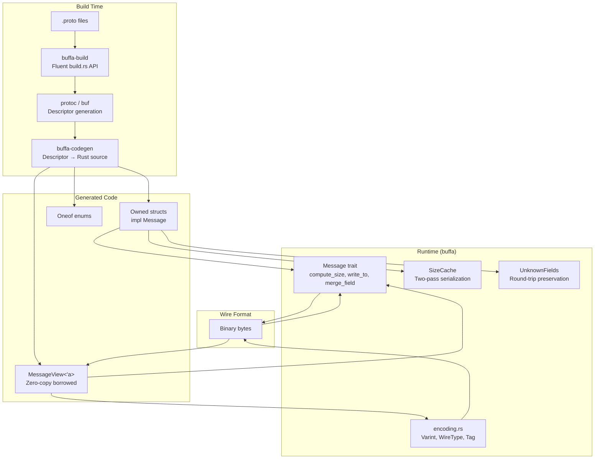
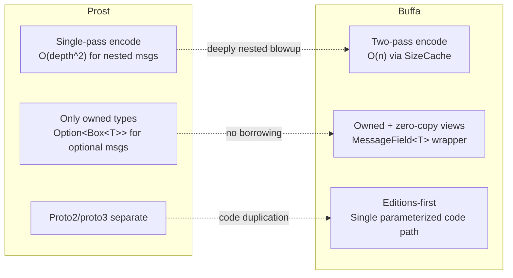

# buffa — Overview

**Source:** 8 workspace crates, 166 Rust files. Pure-Rust Protocol Buffers implementation v0.5.2, MSRV 1.85, full conformance test pass.

`buffa` is a pure-Rust Protocol Buffers implementation designed as an alternative to `prost`. It passes the full protobuf conformance suite and offers zero-copy borrowed views, two-pass serialization with SizeCache, editions-first design, and `no_std + alloc` support.

## Architecture



## Workspace Structure

| Crate | Path | Purpose | LOC |
|-------|------|---------|-----|
| **buffa** | `buffa/src/` | Core runtime: Message trait, encoding, views, SizeCache | ~500 |
| **buffa-types** | `buffa-types/src/` | Well-known types: Timestamp, Duration, Any, Struct | ~300 |
| **buffa-descriptor** | `buffa-descriptor/src/` | Protobuf descriptor types (FileDescriptorProto, etc.) | Generated |
| **buffa-codegen** | `buffa-codegen/src/` | Code generation: descriptors → Rust source | ~1500 |
| **buffa-build** | `buffa-build/src/` | `build.rs` integration: fluent API, invokes protoc/buf | ~750 |
| **protoc-gen-buffa** | `protoc-gen-buffa/` | protoc plugin binary: reads CodeGeneratorRequest from stdin | ~200 |
| **protoc-gen-buffa-packaging** | `protoc-gen-buffa-packaging/` | protoc plugin emitting mod.rs module tree | ~100 |
| **buffa-test** | `buffa-test/` | Test fixtures | Generated |

## Key Advantages Over Prost



**Aha:** Buffa's two-pass serialization solves a real performance problem — prost computes sub-message sizes by re-encoding them each time they appear in a parent message, leading to O(depth^2) complexity for deeply nested structures. Buffa computes sizes once in `compute_size()`, stores them in `SizeCache`, then writes them in `write_to()`. This is O(n) regardless of nesting depth.

## Public API — Core Traits

```rust
// buffa/src/message.rs:78
pub trait Message: Send + Sync + 'static {
    fn compute_size(&self, cache: &mut SizeCache) -> u32;
    fn write_to(&self, cache: &mut SizeCache, buf: &mut impl BufMut);
    fn merge_field(&mut self, tag: Tag, buf: &mut impl Buf, depth: u32) -> Result<(), DecodeError>;
    fn clear(&mut self);
}
```

```rust
// buffa/src/view.rs:112
pub trait MessageView<'a>: Sized {
    fn decode_view(buf: &'a [u8]) -> Result<Self, DecodeError>;
    fn decode_view_with_limit(buf: &'a [u8], limit: u32) -> Result<Self, DecodeError>;
    fn to_owned_message(&self) -> impl Message;
}
```

**Aha:** The `Message` trait requires `Send + Sync + 'static` — all messages are thread-safe and owned. The `MessageView` trait provides the zero-copy alternative: it borrows from the wire bytes, making deserialization allocation-free for strings, bytes, and nested messages.

## Dependencies

| Dependency | Version | Purpose |
|------------|---------|---------|
| `bytes` | 1 | Byte buffer management (Buf, BufMut) |
| `hashbrown` | 0.15 | HashMap for no_std map fields |
| `thiserror` | 2 | Error type derivation |
| `base64` | 0.22 | Base64 encoding for well-known types |
| `serde` | 1 | JSON/text format support (feature-gated) |
| `serde_json` | 1 | JSON parsing (feature-gated) |
| `prettyplease` | 0.2 | Code formatting in codegen |
| `syn` | 2 | Rust AST parsing in codegen |
| `quote` | 1 | TokenStream generation |
| `proc-macro2` | 1 | Span handling in codegen |
| `once_cell` | 1 | Lazy initialization |

## Build Configuration

```toml
# buffa/Cargo.toml
[features]
default = ["std"]
std = []
views = []          # Zero-copy MessageView types
json = []           # JSON serialization
text = []           # Text format (debug)
arbitrary = []      # Arbitrary test data generation

[package]
name = "buffa"
version = "0.5.2"
rust-version = "1.85"  # MSRV
```

## Feature Gates

The codebase uses feature-gated implementations throughout:

- `#[cfg(feature = "views")]` — View types and traits
- `#[cfg(feature = "json")]` — JSON serialization
- `#[cfg(feature = "text")]` — Text format
- `#[cfg(feature = "arbitrary")]` — Arbitrary trait impls
- `#[cfg_attr(not(feature = "std"), no_std)]` — no_std compatibility

## Editions Support

```rust
// buffa/src/editions.rs:17
pub enum Edition {
    Proto2,
    Proto3,
    Edition2023,
    Edition2024,
}
```

**Aha:** Buffa treats proto2 and proto3 as feature presets within the editions model, not as separate code paths. A single `ResolvedFeatures` struct (line 102) captures all six feature fields: presence, enum type, repeated encoding, UTF-8 validation, message encoding, and JSON format. This means there's no duplicated encoding logic between editions.

## Message Types Supported

| Type | Owned | View | Notes |
|------|-------|------|-------|
| Scalars | `i32`, `u32`, `f32`, `bool`, etc. | Direct byte borrows | Varint/Fixed encoding |
| Strings | `String` | `&'a str` | UTF-8 validated |
| Bytes | `Vec<u8>` | `&'a [u8]` | Raw bytes |
| Messages | `T: Message` | `T::View` or `MessageFieldView` | Recursive |
| Repeated | `Vec<T>` | `RepeatedView<'a, T>` | List |
| Map | `HashMap<K, V>` | `MapView<'a, K, V>` | Key-value pairs |
| Oneof | `enum` | `enum` with `&'a` refs | Exclusive choice |
| Extensions | `ExtensionSet` | N/A | Dynamic fields |

## Unknown Fields

```rust
// buffa/src/unknown_fields.rs:12
pub struct UnknownFields {
    fields: Vec<UnknownField>,
}
```

Unknown fields are preserved during decoding and re-encoded on output — critical for proxy/middleware scenarios where new fields are added to schemas and must pass through unchanged.
