# buffa — Core Runtime

**Source:** `buffa/src/` — ~500 LOC. Core traits, wire encoding, unknown fields, editions, enumeration, message fields, and SizeCache.

## Message Trait — The Abstraction Boundary

```rust
// buffa/src/message.rs:78
pub trait Message: Send + Sync + 'static {
    /// Computes the encoded size and populates SizeCache
    fn compute_size(&self, cache: &mut SizeCache) -> u32;

    /// Writes the message to buf, consuming SizeCache entries
    fn write_to(&self, cache: &mut SizeCache, buf: &mut impl BufMut);

    /// Merges a single field from the wire
    fn merge_field(&mut self, tag: Tag, buf: &mut impl Buf, depth: u32) -> Result<(), DecodeError>;

    /// Clears all fields to their default values
    fn clear(&mut self);
}
```

**Aha:** The `Message` trait is designed for two-pass encoding — `compute_size` and `write_to` are separate methods that share a `SizeCache`. This is fundamentally different from single-pass serializers. The `Send + Sync + 'static` bound ensures thread safety, and `clear()` enables message reuse without reallocation.

### MessageName — Compile-Time Constants

```rust
// buffa/src/message.rs:475
pub trait MessageName: Message {
    const PACKAGE: &'static str;
    const NAME: &'static str;
    const FULL_NAME: &'static str;
    const TYPE_URL: &'static str;
}
```

**Aha:** Unlike prost's `Name` trait which uses runtime `format!()` calls to build `FULL_NAME`, buffa uses compile-time `const` strings. This means `FULL_NAME` is resolved at compile time with zero runtime cost — important for reflection and `Any` type resolution.

### Default Implementations for Empty Messages

```rust
// buffa/src/message.rs:33
impl Message for () {
    fn compute_size(&self, _cache: &mut SizeCache) -> u32 { 0 }
    fn write_to(&self, _cache: &mut SizeCache, _buf: &mut impl BufMut) {}
    fn merge_field(&mut self, tag: Tag, _buf: &mut impl Buf, _depth: u32) -> Result<(), DecodeError> {
        Err(DecodeError::new(format!("unknown field tag: {}", tag.number())))
    }
    fn clear(&self) {}
}
```

The unit type `()` implements `Message` — useful for empty messages and generic code that works with any message type.

## Binary Wire Encoding

```rust
// buffa/src/encoding.rs:28
#[derive(Clone, Copy, PartialEq, Eq, Debug)]
pub enum WireType {
    Varint = 0,         // int32, int64, uint32, uint64, bool, enum
    Fixed64 = 1,        // fixed64, sfixed64, double
    LengthDelimited = 2, // string, bytes, embedded messages, packed repeated
    StartGroup = 3,     // deprecated
    EndGroup = 4,       // deprecated
    Fixed32 = 5,        // fixed32, sfixed32, float
}
```

### Tag — Field Number + Wire Type

```rust
// buffa/src/encoding.rs:59
#[derive(Clone, Copy, PartialEq, Eq, Debug)]
pub struct Tag {
    number: u32,
    wire_type: WireType,
}
```

Tag encoding uses a fast single-byte path for common cases:

```rust
// buffa/src/encoding.rs:122-126
impl Tag {
    pub fn decode(buf: &mut impl Buf) -> Result<Self, DecodeError> {
        let tag_bytes = buf.get_u32_le();
        let number = tag_bytes >> 3;
        let wire_type = (tag_bytes & 0x7).try_into()?;
        // ... validation ...
    }
}
```

**Aha:** Tags are decoded as a 4-byte little-endian integer in one shot, then split into field number (top 29 bits) and wire type (bottom 3 bits). This is faster than the naive varint loop for small tags (which cover the vast majority of real-world messages). The maximum field number is `2^29 - 1` (line 17).

### Varint Encoding — Three-Path Strategy

```rust
// buffa/src/encoding.rs:169
pub fn encode_varint(mut value: u64, buf: &mut impl BufMut) {
    // Single byte for small values (< 128)
    if value < 0x80 {
        buf.put_u8(value as u8);
        return;
    }
    // Multi-byte varint encoding
    while value >= 0x80 {
        buf.put_u8((value as u8) | 0x80);
        value >>= 7;
    }
    buf.put_u8(value as u8);
}

// buffa/src/encoding.rs:229
pub fn decode_varint_slice(buf: &mut impl Buf) -> Result<&[u8], DecodeError> {
    // Unrolled into three 32-bit accumulators for speed
}
```

### Skip Field — Forward Compatibility

```rust
// buffa/src/encoding.rs:376
pub fn skip_field(wire_type: WireType, buf: &mut impl Buf, depth: u32) -> Result<(), DecodeError> {
    match wire_type {
        WireType::Varint => { decode_varint(buf)?; Ok(()) }
        WireType::Fixed64 => { buf.advance(8); Ok(()) }
        WireType::Fixed32 => { buf.advance(4); Ok(()) }
        WireType::LengthDelimited => {
            let len = decode_varint(buf)?;
            buf.advance(len as usize);
            Ok(())
        }
        WireType::StartGroup | WireType::EndGroup => {
            // Recursive group skipping with depth limit
        }
    }
}
```

Unknown fields are skipped by reading the tag, determining the wire type, and advancing the buffer by the appropriate amount. This enables forward compatibility — fields unknown to the current schema can be skipped without understanding them.

## SizeCache — Two-Pass Serialization

```rust
// buffa/src/size_cache.rs:54
pub struct SizeCache {
    inline: [u32; Self::INLINE_CAP],
    spill: Vec<u32>,
}

impl SizeCache {
    const INLINE_CAP: usize = 16;

    pub fn reserve(&mut self, count: usize) {
        // Reserve slots in inline or spill
    }

    pub fn set(&mut self, index: usize, size: u32) {
        // Store size at index
    }

    pub fn consume_next(&mut self) -> u32 {
        // Return and consume the next cached size
    }
}
```

**Aha:** The SizeCache is designed for the common case — 16 inline slots cover all official protobuf benchmark messages with zero heap allocation. The spill `Vec` handles larger messages. The `compute_size` / `write_to` pair iterates fields in the same pre-order DFS order, so `consume_next` returns sizes in the exact order they were computed.

### Why Two-Pass Matters

```mermaid
flowchart TD
    subgraph "Prost — Single Pass"
        P1["Encode parent message"]
        P2["Encounter nested sub-message"]
        P3["Re-encode sub-message to get size"]
        P4["Write tag + length + sub-message bytes"]
    end

    subgraph "Buffa — Two Pass"
        B1["Pass 1: compute_size()"]
        B2["Traverse message tree, compute sizes"]
        B3["Store sizes in SizeCache"]
        B4["Pass 2: write_to()"]
        B5["Consume SizeCache entries, write bytes"]
    end

    P1 --> P2 --> P3 --> P4
    B1 --> B2 --> B3 --> B4 --> B5
```



For a message nested 10 levels deep, prost re-encodes the innermost message 10 times (once for each parent). Buffa encodes it once in pass 1 and reads the cached size 10 times in pass 2. This is O(n) vs O(depth^2).

## MessageField — Optional Messages Without Option

```rust
// buffa/src/message_field.rs:80
pub struct MessageField<T: Message + Default> {
    inner: Option<Box<T>>,
}

impl<T> MessageField<T> {
    pub fn get(&self) -> &T {
        self.inner.as_ref().map_or_else(|| &*T::default_instance(), |v| v.as_ref())
    }

    pub fn modify<F>(&mut self, f: F)
    where
        F: FnOnce(&mut T),
    {
        let mut val = self.take();
        f(&mut val);
        self.set(val);
    }
}
```

**Aha:** `MessageField<T>` replaces prost's `Option<Box<T>>` for optional message fields. It implements `Deref` to return a reference to a static default instance when unset — so `field.get()` never returns `None`. The `modify()` method enables ergonomic mutation: it takes the value, calls the closure, and sets it back, all without `Option` unwrapping.

### DefaultInstance Trait

```rust
// buffa/src/message_field.rs:52
pub trait DefaultInstance: Message + Default {
    fn default_instance() -> &'static Self;
}
```

Each generated message type implements `DefaultInstance` with a `static` singleton — the default is computed once and shared across all unset fields.

## EnumValue — Open Enums

```rust
// buffa/src/enumeration.rs:59
#[derive(Clone, Copy, PartialEq, Eq, Debug)]
pub enum EnumValue<E: Enumeration> {
    Known(E),
    Unknown(i32),
}
```

**Aha:** Protocol Buffers allows unknown enum values on the wire (when new enum values are added in newer schema versions). `EnumValue` preserves them: `Known(E)` for recognized values, `Unknown(i32)` for unrecognized ones. It implements `PartialEq<E>` directly so `enum_value == MyEnum::SomeValue` works transparently.

```rust
// buffa/src/enumeration.rs:11
pub trait Enumeration: Sized {
    fn from_i32(value: i32) -> Self;
    fn to_i32(&self) -> i32;
    fn proto_name(&self) -> Option<&'static str>;
    fn from_proto_name(name: &str) -> Option<Self>;
    fn values() -> &'static [(Self, &'static str)];
}
```

## Editions — Feature Configuration

```rust
// buffa/src/editions.rs:17
pub enum Edition {
    Proto2,
    Proto3,
    Edition2023,
    Edition2024,
}
```

Protobuf editions (introduced in 2023) replace the proto2/proto3 binary with granular feature flags:

```rust
// buffa/src/editions.rs:102
pub struct ResolvedFeatures {
    pub field_presence: FieldPresence,
    pub enum_type: EnumType,
    pub repeated_field_encoding: RepeatedFieldEncoding,
    pub utf8_validation: Utf8Validation,
    pub message_encoding: MessageEncoding,
    pub json_format: JsonFormat,
}

impl ResolvedFeatures {
    pub fn edition_2023_defaults() -> Self { ... }
    pub fn proto2_defaults() -> Self { ... }
    pub fn proto3_defaults() -> Self { ... }
}
```

**Aha:** Instead of having separate encoding/decoding logic for proto2 and proto3, buffa has a single parameterized code path controlled by `ResolvedFeatures`. This eliminates code duplication — the same `merge_field` implementation handles both editions, just with different feature flags (e.g., proto2 has explicit presence, proto3 has implicit presence for scalar fields).

## UnknownFields — Round-Trip Preservation

```rust
// buffa/src/unknown_fields.rs:12
pub struct UnknownFields {
    fields: Vec<UnknownField>,
}

// buffa/src/unknown_fields.rs:114
pub struct UnknownField {
    pub number: u32,
    pub data: UnknownFieldData,
}

// buffa/src/unknown_fields.rs:151
pub enum UnknownFieldData {
    Varint(u64),
    Fixed64(u64),
    Fixed32(u32),
    LengthDelimited(Vec<u8>),
    Group(Vec<UnknownField>),
}
```

Unknown fields are preserved during decoding and re-encoded during encoding. This is critical for proxy/middleware that need to pass through fields they don't understand.

## DecodeOptions — Configurable Decoding

```rust
// buffa/src/message.rs:533
pub struct DecodeOptions {
    recursion_limit: u32,
    max_message_size: u32,
}

impl DecodeOptions {
    pub fn builder() -> DecodeOptionsBuilder { ... }
}

// buffa/src/message.rs:25
pub const RECURSION_LIMIT: u32 = 100;
```

**Aha:** The default recursion limit of 100 prevents stack overflow from maliciously crafted deeply nested messages. `max_message_size` provides an additional DoS protection layer — you can reject messages larger than a threshold before allocating.
