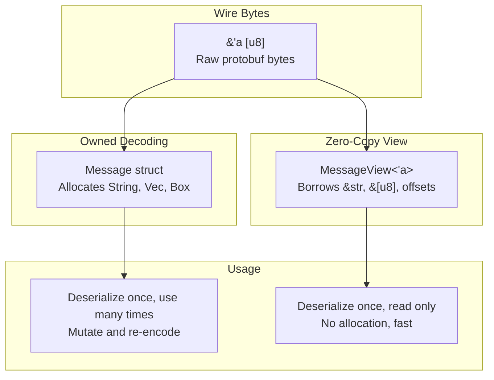

# buffa — Zero-Copy Views

**Source:** `buffa/src/view.rs` — ~900 LOC. Borrowed message types that decode directly from wire bytes without allocation.

## The View Pattern — Borrowed vs Owned



## MessageView Trait

```rust
// buffa/src/view.rs:112
pub trait MessageView<'a>: Sized {
    /// Decode a view from wire bytes (zero-copy)
    fn decode_view(buf: &'a [u8]) -> Result<Self, DecodeError>;

    /// Decode with recursion depth limit
    fn decode_view_with_limit(buf: &'a [u8], limit: u32) -> Result<Self, DecodeError>;

    /// Convert to owned Message
    fn to_owned_message(&self) -> impl Message;
}
```

**Aha:** Views borrow from the wire buffer instead of copying. Strings become `&'a str`, bytes become `&'a [u8]`, nested messages become offsets into the buffer. This means deserialization is allocation-free — the only cost is parsing the tag/length fields. The `to_owned_message()` method provides an escape hatch when you need mutability.

## View Types

### Scalar Fields

Scalar fields in views are direct references into the wire buffer:

| Wire Type | Owned Type | View Type |
|-----------|-----------|-----------|
| `string` | `String` | `&'a str` |
| `bytes` | `Vec<u8>` | `&'a [u8]` |
| `int32`/`uint32` | `i32`/`u32` | `i32`/`u32` (copied) |
| nested message | `T: Message` | `MessageFieldView<'a, V>` |

### MessageFieldView — Optional Messages

```rust
// buffa/src/view.rs:432
pub struct MessageFieldView<V: MessageView<'a>> {
    inner: Option<Box<V>>,
}
```

Mirrors `MessageField<T>` on the owned side — borrows the nested message view from the wire buffer.

### RepeatedView — Lists

```rust
// buffa/src/view.rs:561
pub struct RepeatedView<'a, T> {
    items: Vec<T>,
    _marker: PhantomData<&'a ()>,
}
```

**Aha:** `RepeatedView` still uses a `Vec` — protobuf's wire format stores repeated fields sequentially, so there's no way to borrow a variable-length list as a slice. However, the individual elements within the list can still be borrowed (e.g., `RepeatedView<'a, &'a str>` for repeated strings).

### MapView — Key-Value Pairs

```rust
// buffa/src/view.rs:672
pub struct MapView<'a, K, V> {
    entries: Vec<(K, V)>,
    _marker: PhantomData<&'a ()>,
}
```

Protobuf encodes maps as repeated key-value pair messages, so `MapView` stores them as a `Vec<(K, V)>`. It provides an `iter_unique()` method that deduplicates by key (protobuf allows duplicate keys on the wire, with the last value winning):

```rust
impl<'a, K: Eq + Hash, V> MapView<'a, K, V> {
    pub fn iter_unique(&self) -> impl Iterator<Item = (&K, &V)> {
        // Reverse iteration, keep first occurrence of each key
    }
}
```

**Aha:** `iter_unique()` iterates in reverse order and keeps the first occurrence of each key — this correctly implements protobuf's "last value wins" semantics without building a HashMap.

### UnknownFieldsView — Borrowed Unknown Fields

```rust
// buffa/src/view.rs:834
pub struct UnknownFieldsView<'a> {
    fields: Vec<&'a [u8]>,
}
```

Unknown fields are stored as raw byte slices — no parsing needed. This is the most efficient representation for passthrough scenarios.

## OwnedView — Ergonomic 'static Ownership

```rust
// buffa/src/view.rs:981
pub struct OwnedView<V: MessageView<'static>> {
    view: ManuallyDrop<V>,
    buffer: Bytes,
}
```

**Aha:** `OwnedView` combines a view with its backing `Bytes` buffer for ergonomic `'static` ownership. The `view` field uses `ManuallyDrop` because the view borrows from the `buffer`. When decoding, the code transmute-casts the view's lifetime to `'static` — this is sound because the `Bytes` buffer owns the data and guarantees the memory stays valid. The `Drop` impl drops the buffer first, then the view.

### Soundness of the Transmute

```rust
impl<V> OwnedView<V>
where
    V: MessageView<'static>,
{
    pub fn decode(buf: &[u8]) -> Result<Self, DecodeError> {
        let buffer = Bytes::copy_from_slice(buf);
        // SAFETY: The view borrows from buffer, which is owned by this struct.
        // As long as buffer is not dropped before view, this is sound.
        let view = unsafe { mem::transmute::<V, V>(V::decode_view(&buffer)?) };
        Ok(Self { view: ManuallyDrop::new(view), buffer })
    }
}
```

The transmute extends the borrowed lifetime to `'static` — safe because `Bytes` provides a stable memory guarantee (it won't reallocate or move its data while held).

## ViewEncode — Encoding Borrowed Types

```rust
// buffa/src/view.rs:269
pub trait ViewEncode<'a>: MessageView<'a> {
    fn compute_size(&self, cache: &mut SizeCache) -> u32;
    fn encode(&self, cache: &mut SizeCache, buf: &mut impl BufMut);
}
```

Views can be encoded back to wire format using the same two-pass pattern as owned messages. This enables round-trip encoding without converting to owned types.

**Aha:** The `ViewEncode` trait mirrors the `Message` trait for borrowed types. This means you can:
1. Decode wire bytes → View (zero-copy)
2. Read/inspect the view (no allocation)
3. Encode the view back to wire bytes (still zero-copy, just re-emitting)

This is perfect for proxy/middleware that needs to inspect messages without modifying them.

## ViewReborrow — Safe Lifetime Narrowing

```rust
// buffa/src/view.rs:192
pub trait ViewReborrow<'a>: MessageView<'a> {
    fn reborrow(&self) -> Self;
}
```

**Aha:** `ViewReborrow` solves a subtle lifetime problem. When you have a view borrowed from a larger buffer, you sometimes need to narrow the lifetime (e.g., when passing to a function that only needs a temporary borrow). The `reborrow` method creates a new view with a shorter lifetime, using covariance — the view types are designed so that `MessageView<'a>` is covariant over `'a`, meaning a `MessageView<'static>` can be safely narrowed to `MessageView<'short>`.

## Generated View Code

The codegen generates views alongside owned types:

```rust
// Generated by buffa-codegen for a message "Person"
pub struct PersonView<'a> {
    pub name: Option<&'a str>,
    pub age: Option<i32>,
    pub email: Option<&'a str>,
    pub address: MessageFieldView<'a, AddressView<'a>>,
}

impl<'a> MessageView<'a> for PersonView<'a> {
    fn decode_view(buf: &'a [u8]) -> Result<Self, DecodeError> {
        // Parse tags, borrow strings/bytes, track offsets for nested messages
    }
}

impl<'a> ViewEncode<'a> for PersonView<'a> {
    fn encode(&self, cache: &mut SizeCache, buf: &mut impl BufMut) {
        // Re-encode using two-pass pattern
    }
}
```

For each owned type, the codegen produces:
1. `PersonView<'a>` — borrowed view struct
2. `impl MessageView<'a>` — decoding
3. `impl ViewEncode<'a>` — encoding
4. `impl Serialize/Deserialize` — JSON support (feature-gated)
