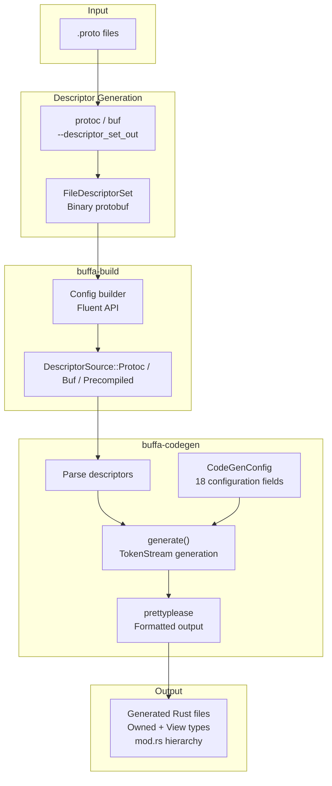

# buffa — Code Generation and Build Integration

**Source:** `buffa-codegen/src/` (~1500 LOC), `buffa-build/src/` (~750 LOC), `protoc-gen-buffa/` (~200 LOC). Code generation from protobuf descriptors to Rust source, with fluent build.rs integration.

## Code Generation Pipeline



## buffa-build — Fluent Build.rs API

```rust
// buffa-build/src/lib.rs:50
pub struct Config {
    // Descriptor source
    // Protoc, Buf, or precompiled
    // Output directory
    // Codegen configuration
    // Plugin parameters
}
```

### Descriptor Sources

```rust
// buffa-build/src/lib.rs:39
pub enum DescriptorSource {
    Protoc { ... },     // Invoke protoc to compile .proto files
    Buf { ... },        // Invoke buf (modern alternative)
    Precompiled { ... }, // Use pre-existing descriptor set
}
```

### Avoiding Timestamp Bumps

```rust
// buffa-build/src/lib.rs:737
fn write_if_changed(path: &Path, content: &str) {
    // Only write if content changed — avoids unnecessary recompilation
    // from timestamp updates in generated files
}
```

**Aha:** Build scripts that regenerate files on every run cause unnecessary recompilation. `write_if_changed` compares the new content with the existing file and only writes if different — this prevents cargo from re-compiling unchanged code.

## buffa-codegen — Descriptor to Rust Source

```rust
// buffa-codegen/src/lib.rs:174
pub struct CodeGenConfig {
    // 18 configuration fields controlling code generation
}

// buffa-codegen/src/lib.rs:102
pub struct GeneratedFile {
    // Generated file content
}

// buffa-codegen/src/lib.rs:136
pub enum GeneratedFileKind {
    Owned,      // Foo — owned message struct
    View,       // FooView<'a> — borrowed view struct
    Oneof,      // Oneof enum
    ViewOneof,  // Oneof enum with borrowed variants
    Ext,        // Extension types
    PackageMod, // mod.rs for package
    Companion,  // Companion module (constants, etc.)
}
```

### Suppressed Lints

```rust
// buffa-codegen/src/lib.rs:49
const ALLOW_LINTS: &[&str] = &[
    // 10 lints suppressed in generated code
];
```

### Main Entry Point

```rust
// buffa-codegen/src/lib.rs:542
pub fn generate(descriptors: &[FileDescriptorProto], config: &CodeGenConfig) -> Result<Vec<GeneratedFile>> {
    // Parse descriptors, generate Rust source
}

// buffa-codegen/src/lib.rs:583
pub fn generate_module_tree(...) -> Result<String> {
    // Build nested pub mod hierarchy from package structure
}
```

## Message Code Generation

For each protobuf message, buffa-codegen generates:

### Owned Struct

```rust
// Generated output
#[derive(Clone, Debug, Default)]
pub struct Person {
    pub name: String,
    pub age: i32,
    pub email: String,
    pub address: MessageField<Address>,  // Optional message field
}

impl Message for Person {
    fn compute_size(&self, cache: &mut SizeCache) -> u32 { ... }
    fn write_to(&self, cache: &mut SizeCache, buf: &mut impl BufMut) { ... }
    fn merge_field(&mut self, tag: Tag, buf: &mut impl Buf, depth: u32) -> Result<(), DecodeError> { ... }
    fn clear(&mut self) { ... }
}

impl MessageName for Person {
    const PACKAGE: &'static str = "example";
    const NAME: &'static str = "Person";
    const FULL_NAME: &'static str = "example.Person";
    const TYPE_URL: &'static str = "type.googleapis.com/example.Person";
}
```

### View Struct

```rust
// Generated output (#[cfg(feature = "views")])
#[derive(Clone, Copy, Debug)]
pub struct PersonView<'a> {
    pub name: Option<&'a str>,
    pub age: Option<i32>,
    pub email: Option<&'a str>,
    pub address: MessageFieldView<'a, AddressView<'a>>,
}

impl<'a> MessageView<'a> for PersonView<'a> {
    fn decode_view(buf: &'a [u8]) -> Result<Self, DecodeError> { ... }
    fn to_owned_message(&self) -> Person { ... }
}

impl<'a> ViewEncode<'a> for PersonView<'a> {
    fn encode(&self, cache: &mut SizeCache, buf: &mut impl BufMut) { ... }
}
```

**Aha:** The codegen produces both owned and view types from the same descriptor. The view types are feature-gated (`#[cfg(feature = "views")]`), so users who don't need zero-copy can skip the compilation cost.

### Oneof Code Generation

```rust
// Generated output
#[derive(Clone, Debug)]
pub enum PersonKind {
    Name(String),
    Age(i32),
}

impl Default for PersonKind {
    fn default() -> Self { PersonKind::Name(String::new()) }
}

// With views (feature-gated)
#[derive(Clone, Copy, Debug)]
pub enum PersonKindView<'a> {
    Name(&'a str),
    Age(i32),
}
```

### Proto2 Default Values

For proto2 `[default = X]` fields, the codegen generates a custom `Default` impl:

```rust
impl Default for Person {
    fn default() -> Self {
        Self {
            name: String::new(),
            age: 42,  // From [default = 42]
            email: String::new(),
        }
    }
}
```

### Custom Serde for Oneofs

```rust
// Generated output (feature-gated)
mod __serde_oneofs {
    // Custom serialization/deserialization for oneof enums
}
```

## protoc-gen-buffa — Protoc Plugin

```rust
// protoc-gen-buffa/src/main.rs
fn main() {
    // Read CodeGeneratorRequest from stdin (protobuf binary)
    let req = CodeGeneratorRequest::decode_from_slice(&stdin_bytes);

    // Generate code using buffa-codegen
    let files = buffa_codegen::generate(&req.proto_file, &config);

    // Write CodeGeneratorResponse to stdout (protobuf binary)
    let resp = CodeGeneratorResponse { file: files };
    resp.encode(&mut stdout);
}
```

### Feature Flags

```rust
// protoc-gen-buffa supports:
// FEATURE_PROTO3_OPTIONAL (1)
// FEATURE_SUPPORTS_EDITIONS (2)
// Supported editions: Proto2 through Edition2024
```

### Plugin Parameters

```
views              — Generate View types
unknown_fields     — Preserve unknown fields
json               — JSON serialization support
text               — Text format support
arbitrary          — Arbitrary test data generation
allow_message_set  — Allow MessageSet wire format
strict_utf8        — Strict UTF-8 validation
register_types     — Register types for reflection
with_setters       — Generate setter methods
file_per_package   — One file per package (default: one file per message)
extern_path        — External path mappings
```

## Module Tree Generation

```rust
// buffa-codegen/src/lib.rs:583
pub fn generate_module_tree(descriptors: &[FileDescriptorProto], config: &CodeGenConfig) -> Result<String> {
    // Build nested pub mod hierarchy:
    // pub mod example {
    //     pub mod person {
    //         pub use person_impl::*;
    //     }
    // }
}
```

**Aha:** The module tree generator creates a hierarchical `mod` structure mirroring the protobuf package hierarchy. Each package gets a `mod.rs`, and each message gets its own module with a re-export (`pub use person_impl::*`). This allows importing as `example::Person` while keeping the implementation details (`person_impl`) hidden.

## Well-Known Types (buffa-types)

```rust
// buffa-types/src/lib.rs
// Re-exports:
pub use any::Any;
pub use duration::Duration;
pub use empty::Empty;
pub use field_mask::FieldMask;
pub use list_value::ListValue;
pub use null_value::NullValue;
pub use r#struct::Struct;
pub use timestamp::Timestamp;
pub use value::Value;

// Extension modules:
pub mod any_ext;           // Any type operations
pub mod duration_ext;      // Duration conversions
pub mod timestamp_ext;     // Timestamp conversions
pub mod value_ext;         // Value operations
pub mod wrapper_ext;       // Wrapper types (StringValue, etc.)
```

**Aha:** Well-known types are generated from protobuf descriptors (like regular types) but with additional extension methods for conversions (`Duration::from_secs`, `Timestamp::to_system_time`, etc.). They live in a separate crate so users who don't need them can skip the dependency.
