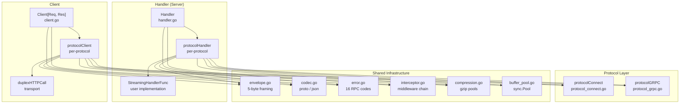

# connect-go — ConnectRPC Go Reference Implementation

## Source

- **Package:** `connect` (connectrpc.com/connect)
- **Language:** Go
- **License:** Apache 2.0
- **20 core `.go` source files**

## What It Is

The reference Go implementation of ConnectRPC — a protocol-agnostic RPC framework supporting three wire protocols (Connect, gRPC, gRPC-Web) over HTTP/1.1 and HTTP/2. It provides typed generic server handlers and clients, envelope-based message streaming, an interceptor middleware architecture, and compression support — all built on top of Go's standard `net/http`.

## Architecture at a Glance



## Three Protocols, One Interface

The entire framework hinges on a single `protocol` interface (`protocol.go:66`):

```go
// protocol.go:66
type protocol interface {
    NewHandler(*protocolHandlerParams) protocolHandler
    NewClient(*protocolClientParams) (protocolClient, error)
}
```

Each protocol — Connect, gRPC, gRPC-Web — is a separate struct implementing this interface. This means adding a new protocol requires implementing just two methods. The server-side `Handler` (`handler.go:28`) holds a `map[string][]protocolHandler` indexed by HTTP method, dispatching incoming requests to the first handler whose `CanHandlePayload()` matches the request's content type.

**Aha:** The protocol abstraction is the key design decision — instead of a monolithic service that switches on protocol type, each protocol is a self-contained type (`protocolConnect`, `protocolGRPC{web: true/false}`) that owns its own content-type negotiation, timeout parsing, message framing, and error serialization. This makes the codebase extensible: adding a fourth protocol means writing one new file, not modifying existing ones.

## Protocol Comparison

| Feature | Connect | gRPC (HTTP/2) | gRPC-Web (HTTP/1.1) |
|---------|---------|---------------|---------------------|
| **Transport** | HTTP/1.1 + HTTP/2 | HTTP/2 only | HTTP/1.1 + HTTP/2 |
| **Unary Content-Type** | `application/proto` or `application/json` | `application/grpc` or `application/grpc+proto` | `application/grpc-web` or `application/grpc-web+proto` |
| **Streaming Content-Type** | `application/connect+proto` or `application/connect+json` | Same as unary | Same as unary |
| **Timeout Header** | `Connect-Timeout-Ms` (milliseconds) | `Grpc-Timeout` (digits + unit: H/M/S/m/u/n) | Same as gRPC |
| **Error Format (unary)** | JSON body with HTTP status code | gRPC trailers (HTTP/2 trailers) | gRPC trailers (body envelope with 0x80 flag) |
| **Error Format (streaming)** | End-stream envelope (flag 0x02) with JSON | gRPC trailers | Same as gRPC-Web |
| **Trailers** | `Trailer-` prefixed HTTP headers | HTTP/2 trailers | Body envelope (flag 0x80) |
| **GET Support** | Yes (idempotent unary, base64-encoded query params) | No | No |
| **Protocol Version Header** | `Connect-Protocol-Version: 1` | None | None |
| **User-Agent** | `connect-go/{version} ({goVersion})` | `grpc-go-connect/{version} ({goVersion})` | Same as gRPC + `X-User-Agent` |

## Four RPC Kinds

The `Spec.StreamType` field determines the RPC pattern:

| StreamType | Pattern | Messages Flow |
|------------|---------|---------------|
| `StreamTypeUnary` | Request → Response | 1 request, 1 response |
| `StreamTypeClient` | Stream → Response | N requests, 1 response |
| `StreamTypeServer` | Request → Stream | 1 request, N responses |
| `StreamTypeBidi` | Stream ↔ Stream | N requests, N responses (interleaved) |

## Error Codes

The framework uses 16 RPC status codes (`code.go:34-108`), matching gRPC:

| Code | Value | Meaning |
|------|-------|---------|
| `CodeCanceled` | 1 | Operation canceled |
| `CodeUnknown` | 2 | Unknown error |
| `CodeInvalidArgument` | 3 | Invalid client argument |
| `CodeDeadlineExceeded` | 4 | Timeout |
| `CodeNotFound` | 5 | Entity not found |
| `CodeAlreadyExists` | 6 | Entity already exists |
| `CodePermissionDenied` | 7 | Insufficient permissions |
| `CodeResourceExhausted` | 8 | Resource quota exceeded |
| `CodeFailedPrecondition` | 9 | System not in required state |
| `CodeAborted` | 10 | Operation aborted (concurrency) |
| `CodeOutOfRange` | 11 | Attempted past valid range |
| `CodeUnimplemented` | 12 | Not implemented/supported |
| `CodeInternal` | 13 | Internal invariant broken |
| `CodeUnavailable` | 14 | Service temporarily unavailable |
| `CodeDataLoss` | 15 | Unrecoverable data loss |
| `CodeUnauthenticated` | 16 | Missing/invalid authentication |

## Key Files

| File | Purpose |
|------|---------|
| `handler.go` | Server-side `Handler` type, 4 RPC kind constructors, `ServeHTTP` dispatch |
| `client.go` | Generic `Client[Req, Res]` with 5 call methods |
| `protocol.go` | `protocol` interface, handler/client params, compression negotiation |
| `protocol_connect.go` | Connect protocol implementation (~1450 lines) |
| `protocol_grpc.go` | gRPC/gRPC-Web protocol implementation (~1010 lines) |
| `envelope.go` | 5-byte envelope framing, `envelopeWriter`, `envelopeReader` |
| `codec.go` | `Codec` interface, `protoBinaryCodec`, `protoJSONCodec` |
| `error.go` | `Error` struct, error wrapping chain, RST_STREAM mapping |
| `interceptor.go` | `Interceptor` interface, `chain` composition, sentinel checks |
| `compression.go` | `compressionPool`, `Decompressor`/`Compressor` interfaces |
| `buffer_pool.go` | `sync.Pool`-based `bytes.Buffer` reuse |
| `duplex_http_call.go` | Full-duplex HTTP request/response transport |
| `code.go` | 16 RPC codes, string/text marshaling |
| `header.go` | Binary header encoding, header merging utilities |

## Next

[01-protocol-abstraction.md](01-protocol-abstraction.md) — Deep dive into the `protocol` interface and the handler/client dispatch pattern.
