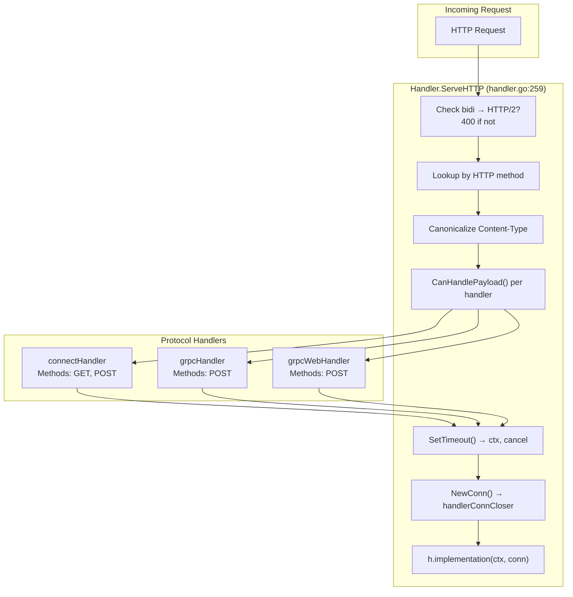

# connect-go — Protocol Abstraction and Dispatch

**Source:** `protocol.go` (400 LOC), `handler.go` (428 LOC). The `protocol` interface is the central abstraction — each wire protocol (Connect, gRPC, gRPC-Web) is a separate type implementing `NewHandler()` and `NewClient()`.

## The Protocol Interface

```go
// protocol.go:66
type protocol interface {
    NewHandler(*protocolHandlerParams) protocolHandler
    NewClient(*protocolClientParams) (protocolClient, error)
}
```

This interface takes parameters and returns protocol-specific handler and client types. The concrete implementations are:

- `&protocolConnect{}` — Connect protocol (`protocol_connect.go:67`)
- `&protocolGRPC{web: false}` — Standard gRPC over HTTP/2 (`protocol_grpc.go:75`)
- `&protocolGRPC{web: true}` — gRPC-Web over HTTP/1.1 (`protocol_grpc.go:75`)

## Handler Dispatch Architecture



## Server Dispatch: `Handler.ServeHTTP`

```go
// handler.go:259
func (h *Handler) ServeHTTP(responseWriter http.ResponseWriter, request *http.Request) {
    // 1. Reject bidi streaming on HTTP/1.x
    isBidi := (h.spec.StreamType & StreamTypeBidi) == StreamTypeBidi
    if isBidi && request.ProtoMajor < 2 {
        responseWriter.Header().Set("Connection", "close")
        responseWriter.WriteHeader(http.StatusHTTPVersionNotSupported)
        return
    }

    // 2. Look up protocol handlers by HTTP method
    protocolHandlers := h.protocolHandlers[request.Method]

    // 3. Canonicalize content-type (fast path + slow path)
    contentType := canonicalizeContentType(getHeaderCanonical(request.Header, headerContentType))

    // 4. Find matching handler via CanHandlePayload()
    var protocolHandler protocolHandler
    for _, handler := range protocolHandlers {
        if handler.CanHandlePayload(request, contentType) {
            protocolHandler = handler
            break
        }
    }

    // 5. Parse timeout from protocol-specific header
    ctx, cancel, timeoutErr := protocolHandler.SetTimeout(request)

    // 6. Create connection and run implementation
    connCloser, ok := protocolHandler.NewConn(responseWriter, request.WithContext(ctx))
    _ = connCloser.Close(h.implementation(ctx, connCloser))
}
```

The dispatch flow:
1. **Bidi check**: If the RPC is bidirectional and the connection is HTTP/1.x, reject immediately (bidi requires HTTP/2 multiplexing).
2. **Method lookup**: `h.protocolHandlers` is a `map[string][]protocolHandler` — keyed by HTTP method (`GET`, `POST`).
3. **Content-type canonicalization**: `canonicalizeContentType()` uses a fast path (single slash, lowercase letters, `.`, `+`, `-`) before falling back to `mime.ParseMediaType`.
4. **Handler selection**: First handler whose `CanHandlePayload()` returns `true` wins.
5. **Timeout parsing**: Each protocol parses its own timeout format. Connect reads `Connect-Timeout-Ms` (milliseconds). gRPC reads `Grpc-Timeout` (digits + unit).
6. **Connection creation**: `NewConn()` creates the protocol-specific `handlerConnCloser` that wraps the `http.ResponseWriter` and `*http.Request`.

**Aha:** The dispatch uses content-type to select the protocol, not a separate routing layer. This means a single HTTP endpoint can serve Connect, gRPC, and gRPC-Web clients simultaneously — the protocol is chosen based on what the client sends in `Content-Type`. The `Accept-Post` response header advertises all supported content types.

## Protocol Handler Interface

```go
// protocol.go:90
type protocolHandler interface {
    // Methods returns the HTTP methods this protocol handles (GET, POST)
    Methods() map[string]struct{}

    // ContentTypes returns the Content-Types this protocol accepts
    ContentTypes() map[string]struct{}

    // SetTimeout parses the protocol's timeout header and returns a context
    SetTimeout(*http.Request) (context.Context, context.CancelFunc, error)

    // CanHandlePayload checks if this protocol can handle the given Content-Type
    CanHandlePayload(*http.Request, string) bool

    // NewConn creates the streaming connection
    NewConn(http.ResponseWriter, *http.Request) (handlerConnCloser, bool)
}
```

## Protocol Client Interface

```go
// protocol.go:139
type protocolClient interface {
    // Peer describes the server
    Peer() Peer

    // WriteRequestHeader writes protocol-specific headers (User-Agent, etc.)
    WriteRequestHeader(StreamType, http.Header)

    // NewConn creates the streaming client connection
    NewConn(context.Context, Spec, http.Header) streamingClientConn
}
```

## Handler Registration

```go
// handler.go:384
func (c *handlerConfig) newProtocolHandlers() []protocolHandler {
    protocols := []protocol{
        &protocolConnect{},
        &protocolGRPC{web: false},
        &protocolGRPC{web: true},
    }
    handlers := make([]protocolHandler, 0, len(protocols))
    codecs := newReadOnlyCodecs(c.Codecs)
    compressors := newReadOnlyCompressionPools(c.CompressionPools, c.CompressionNames)
    for _, protocol := range protocols {
        handlers = append(handlers, protocol.NewHandler(&protocolHandlerParams{
            Spec:             c.newSpec(),
            Codecs:           codecs,
            CompressionPools: compressors,
            CompressMinBytes: c.CompressMinBytes,
            BufferPool:       c.BufferPool,
            ReadMaxBytes:     c.ReadMaxBytes,
            SendMaxBytes:     c.SendMaxBytes,
            RequireConnectProtocolHeader: c.RequireConnectProtocolHeader,
            IdempotencyLevel: c.IdempotencyLevel,
        }))
    }
    return handlers
}
```

Three protocols are always instantiated. Each receives the same codecs, compression pools, and buffer pool — but each interprets them differently per its wire format.

## Handler Type Constructors

The `Handler` is created via one of four constructors:

```go
// handler.go:37
NewUnaryHandler[Req, Res](procedure, unaryFunc, options...) *Handler

// handler.go:138
NewClientStreamHandler[Req, Res](procedure, impl, options...) *Handler

// handler.go:194
NewServerStreamHandler[Req, Res](procedure, impl, options...) *Handler

// handler.go:235
NewBidiStreamHandler[Req, Res](procedure, impl, options...) *Handler
```

Each wraps the user's typed implementation in a `StreamingHandlerFunc` and applies interceptors.

## Error Translation Wrappers

```go
// protocol.go:168
type errorTranslatingHandlerConnCloser struct {
    handlerConnCloser
    toWire   func(error) error     // wrapIfContextError
    fromWire func(error) error     // wrapIfUncoded
}
```

Every `handlerConnCloser` is wrapped with `wrapHandlerConnWithCodedErrors()` (`protocol.go:228`). This ensures:
- **`toWire`**: `wrapIfContextError()` — converts `context.Canceled` → `CodeCanceled`, `context.DeadlineExceeded` → `CodeDeadlineExceeded` before writing to the wire.
- **`fromWire`**: `wrapIfUncoded()` — ensures all errors returned to user code are `*Error` with a status code.

## Next

[02-envelope-framing.md](02-envelope-framing.md) — The 5-byte envelope framing used for all streaming RPCs.
