# connect-go — Error Handling

**Source:** `error.go` (472 LOC), `code.go` (227 LOC). ConnectRPC uses a single `*Error` type that carries an RPC status code, an underlying Go error, metadata headers, and optional protobuf error details. The error system has a sophisticated wrapping chain that maps Go context errors, HTTP/2 RST_STREAM codes, and `http.MaxBytesError` into the correct RPC codes.

## Error Structure

```go
// error.go:124
type Error struct {
    code    Code            // RPC status code (1-16)
    err     error           // Underlying Go error
    details []*ErrorDetail  // Protobuf error details
    meta    http.Header     // Additional HTTP headers/trailers
    wireErr bool            // Was this error sent by the server?
}
```

```go
// error.go:52
type ErrorDetail struct {
    pbAny    *anypb.Any      // Protobuf Any wrapper
    pbInner  proto.Message   // Pre-unmarshaled inner message (if available)
    wireJSON string          // Preserved human-readable JSON from wire
}
```

**Aha:** The `ErrorDetail` stores both the raw protobuf `Any` and the pre-unmarshaled inner message (`pbInner`). When the server has the descriptor for the detail type, it can return a strongly-typed `proto.Message` via `Value()`. When it doesn't (e.g., a proxy without descriptors), it falls back to `pbAny.UnmarshalNew()`. The `wireJSON` field preserves the original JSON representation so proxies can forward human-readable details without protobuf descriptors.

## Error Creation

```go
// error.go:133 — standard error
func NewError(c Code, underlying error) *Error

// error.go:150 — wire error (came from server)
func NewWireError(c Code, underlying error) *Error

// error.go:184 — 304 Not Modified for GET requests
func NewNotModifiedError(headers http.Header) *Error

// error.go:264 — convenient format
func errorf(c Code, template string, args ...any) *Error
```

`NewWireError()` marks the error with `wireErr = true`, distinguishing server-sent errors from client-synthesized ones. This matters because:
- Handlers strip `Meta` headers from wire errors to avoid leaking response headers.
- An RPC-to-HTTP proxy might expose a server-sent `CodeUnknown` as HTTP 500 but a client-synthesized one as 503.

## The Error Wrapping Chain

```mermaid
flowchart TD
    ERR["Any Go error"]

    subgraph "wrapIfContextError"
        C1["context.Canceled → CodeCanceled"]
        C2["context.DeadlineExceeded → CodeDeadlineExceeded"]
        C3["os.ErrDeadlineExceeded → CodeDeadlineExceeded"]
    end

    subgraph "wrapIfContextDone"
        D1["Checks ctx.Err() after operation"]
        D2["Same mappings as above"]
    end

    subgraph "wrapIfRSTError"
        R1["NO_ERROR/PROTOCOL_ERROR → CodeInternal"]
        R2["REFUSED_STREAM → CodeUnavailable"]
        R3["CANCEL → CodeCanceled or CodeDeadlineExceeded"]
        R4["ENHANCE_YOUR_CALM → CodeResourceExhausted"]
        R5["INADEQUATE_SECURITY → CodePermissionDenied"]
    end

    subgraph "wrapIfUncoded"
        U["Everything else → CodeUnknown"]
    end

    subgraph "wrapIfMaxBytesError"
        M["http.MaxBytesError → CodeResourceExhausted"]
    end

    ERR --> C1
    ERR --> C2
    ERR --> C3
    ERR --> D1
    ERR --> R1
    ERR --> R2
    ERR --> R3
    ERR --> R4
    ERR --> R5
    ERR --> U
    ERR --> M
```



## Context Error Mapping

```go
// error.go:293
func wrapIfContextError(err error) error {
    if _, ok := asError(err); ok { return err }  // already coded
    if errors.Is(err, context.Canceled) {
        return NewError(CodeCanceled, err)
    }
    if errors.Is(err, context.DeadlineExceeded) {
        return NewError(CodeDeadlineExceeded, err)
    }
    // Go bug: some dial errors return os.ErrDeadlineExceeded
    // https://github.com/golang/go/issues/64449
    if errors.Is(err, os.ErrDeadlineExceeded) {
        return NewError(CodeDeadlineExceeded, err)
    }
    return err  // not a context error
}
```

The chain first checks if the error is already a `*Error` (already coded). If not, it checks for the three context-related Go errors. The `os.ErrDeadlineExceeded` case is a workaround for a known Go bug.

## wrapIfContextDone — Post-Operation Check

```go
// error.go:317
func wrapIfContextDone(ctx context.Context, err error) error {
    err = wrapIfContextError(err)
    if _, ok := asError(err); ok { return err }  // already coded
    ctxErr := ctx.Err()
    if errors.Is(ctxErr, context.Canceled) {
        return NewError(CodeCanceled, err)
    }
    if errors.Is(ctxErr, context.DeadlineExceeded) {
        return NewError(CodeDeadlineExceeded, err)
    }
    return err
}
```

Used after I/O operations. Even if the I/O error itself isn't a context error (e.g., a connection reset), if the context is already canceled, the error gets the appropriate code. This handles the case where a timeout fires concurrently with an I/O operation.

## HTTP/2 RST_STREAM Mapping

```go
// error.go:393
func wrapIfRSTError(ctx context.Context, err error) error {
    // Parse HTTP/2 stream error from string (net/http hides the types)
    // Format: "stream error: ... ; CODE received from peer"
    switch msg {
    case "NO_ERROR", "PROTOCOL_ERROR", "INTERNAL_ERROR", "FLOW_CONTROL_ERROR",
         "SETTINGS_TIMEOUT", "FRAME_SIZE_ERROR", "COMPRESSION_ERROR", "CONNECT_ERROR":
        return NewError(CodeInternal, err)
    case "REFUSED_STREAM":
        return NewError(CodeUnavailable, err)
    case "CANCEL":
        if deadline, ok := ctx.Deadline(); ok && time.Now().After(deadline) {
            return NewError(CodeDeadlineExceeded, err)
        }
        return NewError(CodeCanceled, err)
    case "ENHANCE_YOUR_CALM":
        return NewError(CodeResourceExhausted, fmt.Errorf("bandwidth exhausted: %w", err))
    case "INADEQUATE_SECURITY":
        return NewError(CodePermissionDenied, fmt.Errorf("transport protocol insecure: %w", err))
    }
}
```

**Aha:** Because `net/http` vends all HTTP/2 error types as unexported, Connect parses the error string to extract the RST_STREAM code. The `CANCEL` case is special: it checks `time.Now().After(deadline)` to distinguish between a client-initiated cancel (`CodeCanceled`) and a server-initiated timeout cancellation (`CodeDeadlineExceeded`). This race-safety check avoids depending on `ctx.Err()` which might not have been set yet by the timer goroutine.

## HTTP Status → RPC Code Mapping

```go
// protocol.go:401
func httpToCode(httpCode int) Code {
    switch httpCode {
    case 400: return CodeInternal        // Malformed request
    case 401: return CodeUnauthenticated  // No auth
    case 403: return CodePermissionDenied // Forbidden
    case 404: return CodeUnimplemented    // Unknown endpoint
    case 429: return CodeUnavailable      // Rate limited
    case 502, 503, 504: return CodeUnavailable  // Server issues
    default: return CodeUnknown
    }
}
```

**Important:** Per the gRPC HTTP status mapping specification, HTTP 400 maps to `CodeInternal`, not `CodeInvalidArgument`. This is because a 400 from an HTTP intermediary (not the gRPC server) indicates a proxy issue, not a client error.

## wrapIfMaxBytesError

```go
// error.go:454
func wrapIfMaxBytesError(err error, tmpl string, args ...any) error {
    var maxBytesErr *http.MaxBytesError
    if ok := errors.As(err, &maxBytesErr); !ok {
        return err
    }
    return errorf(CodeResourceExhausted, "%s: exceeded %d byte http.MaxBytesReader limit", tmpl, maxBytesErr.Limit)
}
```

Wraps `http.MaxBytesError` from `http.MaxBytesHandler` as `CodeResourceExhausted`.

## AsError and CodeOf

```go
// error.go:269
func asError(err error) (*Error, bool) {
    var connectErr *Error
    ok := errors.As(err, &connectErr)
    return connectErr, ok
}

// code.go:221
func CodeOf(err error) Code {
    if connectErr, ok := asError(err); ok {
        return connectErr.Code()
    }
    return CodeUnknown
}
```

`asError()` is the internal helper used throughout the error wrapping chain. `CodeOf()` is the public API for extracting the code from any error.

## Error Details via Protobuf Any

```go
// error.go:61
func NewErrorDetail(msg proto.Message) (*ErrorDetail, error) {
    if pb, ok := msg.(*anypb.Any); ok {
        return &ErrorDetail{pbAny: pb}, nil  // already wrapped
    }
    pb, err := anypb.New(msg)
    return &ErrorDetail{pbAny: pb, pbInner: msg}, err
}

// error.go:97
func (d *ErrorDetail) Value() (proto.Message, error) {
    if d.pbInner != nil {
        return proto.Clone(d.pbInner), nil  // clone to prevent mutation
    }
    return d.pbAny.UnmarshalNew()  // dynamic unmarshal
}
```

Error details are serialized as `google.protobuf.Any` messages. The `Type()` method extracts the type name by trimming the `type.googleapis.com/` prefix from the `type_url` field.

## Next

[05-connect-protocol.md](05-connect-protocol.md) — The Connect protocol: unary GET support, end-stream envelopes, and JSON error bodies.
