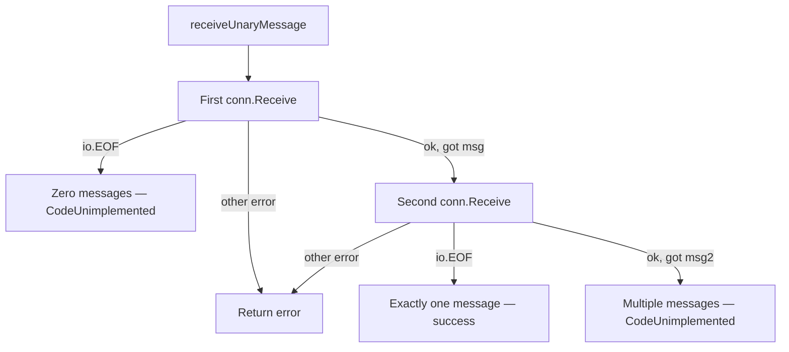

# connect-go — Connect Protocol

**Source:** `protocol_connect.go` (~1450 LOC). The Connect protocol is connectrpc's own protocol — designed to be simple, debuggable, and browser-friendly. It uses standard HTTP methods (GET for idempotent reads, POST for everything else), JSON for error bodies, and envelope-based framing for streaming.

## Connect Protocol Constants

```go
// protocol_connect.go:37
const (
    // Unary headers
    connectUnaryHeaderCompression       = "Content-Encoding"
    connectUnaryHeaderAcceptCompression = "Accept-Encoding"
    connectUnaryTrailerPrefix           = "Trailer-"
    // Streaming headers
    connectStreamingHeaderCompression       = "Connect-Content-Encoding"
    connectStreamingHeaderAcceptCompression = "Connect-Accept-Encoding"
    // Control
    connectHeaderTimeout         = "Connect-Timeout-Ms"
    connectHeaderProtocolVersion = "Connect-Protocol-Version"
    connectProtocolVersion       = "1"
    // End-stream flag
    connectFlagEnvelopeEndStream = 0b00000010
    // Content-Type prefixes
    connectUnaryContentTypePrefix     = "application/"
    connectStreamingContentTypePrefix = "application/connect+"
    // GET query parameters
    connectUnaryEncodingQueryParameter    = "encoding"
    connectUnaryMessageQueryParameter     = "message"
    connectUnaryBase64QueryParameter      = "base64"
    connectUnaryCompressionQueryParameter = "compression"
    connectUnaryConnectQueryParameter     = "connect"
    connectUnaryConnectQueryValue         = "v1"
)
```

## Content-Type Matrix

| StreamType | Codec | Content-Type |
|------------|-------|-------------|
| Unary | proto | `application/proto` |
| Unary | json | `application/json` |
| Streaming | proto | `application/connect+proto` |
| Streaming | json | `application/connect+json` |

## Supported HTTP Methods

```go
// protocol_connect.go:71
methods := make(map[string]struct{})
methods[http.MethodPost] = struct{}{}

// GET only for idempotent unary RPCs
if params.Spec.StreamType == StreamTypeUnary && params.IdempotencyLevel == IdempotencyNoSideEffects {
    methods[http.MethodGet] = struct{}{}
}
```

The Connect protocol supports both GET and POST for unary RPCs, but GET is only enabled when `IdempotencyLevel` is set to `IdempotencyNoSideEffects`.

## Timeout Parsing

```go
// protocol_connect.go:117
func (*connectHandler) SetTimeout(request *http.Request) (context.Context, context.CancelFunc, error) {
    timeout := getHeaderCanonical(request.Header, connectHeaderTimeout)
    if timeout == "" { return request.Context(), nil, nil }
    if len(timeout) > 10 {
        return nil, nil, errorf(CodeInvalidArgument, "parse timeout: %q has >10 digits", timeout)
    }
    millis, err := strconv.ParseInt(timeout, 10, 64)
    ctx, cancel := context.WithTimeout(request.Context(), time.Duration(millis)*time.Millisecond)
    return ctx, cancel, nil
}
```

The Connect timeout is a plain integer representing milliseconds, with a maximum of 10 digits. This contrasts with gRPC's `<digits><unit>` format (max 8 digits).

## Unary Connection Types

### Handler Side: `connectUnaryHandlerConn`

```go
// protocol_connect.go:683
type connectUnaryHandlerConn struct {
    spec            Spec
    peer            Peer
    request         *http.Request
    responseWriter  http.ResponseWriter
    marshaler       connectUnaryMarshaler
    unmarshaler     connectUnaryUnmarshaler
    responseTrailer http.Header
}
```

**Send()** (`protocol_connect.go:712`): Merges response headers (including `Trailer-`-prefixed trailers), then marshals the response message.

**Close()** (`protocol_connect.go:728`):
1. If no header written yet and error is `NotModified`, returns HTTP 304.
2. On error: sets `Content-Type: application/json`, writes HTTP status code via `connectCodeToHTTP()`, writes JSON error body.
3. On success: just closes the request body.

### Client Side: `connectUnaryClientConn`

```go
// protocol_connect.go:443
type connectUnaryClientConn struct {
    spec             Spec
    peer             Peer
    duplexCall       *duplexHTTPCall
    marshaler        connectUnaryRequestMarshaler  // extends with GET support
    unmarshaler      connectUnaryUnmarshaler
    responseHeader   http.Header
    responseTrailer  http.Header
}
```

**validateResponse()** (`protocol_connect.go:506`):
1. Extracts trailers by stripping `Trailer-` prefix from headers.
2. Validates content-type matches the request codec.
3. On non-200: JSON-decodes the error body into `connectWireError`.
4. On 304 (GET): returns `errNotModifiedClient`.

## GET Request Support

**Aha:** The Connect protocol's most distinctive feature is GET support for idempotent unary RPCs. The request message is serialized into URL query parameters, enabling CDN caching, browser bookmarking, and firewall friendliness for read-only operations.

```go
// protocol_connect.go:987
func (m *connectUnaryRequestMarshaler) Marshal(message any) *Error {
    if m.enableGet {
        if m.stableCodec == nil && !m.getUseFallback {
            return errorf(CodeInternal, "codec %s doesn't support stable marshal; can't use get", m.codec.Name())
        }
        if m.stableCodec != nil {
            return m.marshalWithGet(message)
        }
    }
    return m.connectUnaryMarshaler.Marshal(message)  // fall back to POST
}
```

### GET URL Construction

```go
// protocol_connect.go:1058
func (m *connectUnaryRequestMarshaler) buildGetURL(data []byte, compressed bool) *url.URL {
    url := *m.duplexCall.URL()
    query := url.Query()
    query.Set("connect", "v1")
    query.Set("encoding", m.codec.Name())
    if m.stableCodec.IsBinary() || compressed {
        query.Set("message", base64.RawURLEncoding.EncodeToString(data))
        query.Set("base64", "1")
    } else {
        query.Set("message", string(data))  // JSON goes as plain text
    }
    if compressed {
        query.Set("compression", m.compressionName)
    }
    url.RawQuery = query.Encode()
    return &url
}
```

Query parameters:
- `connect=v1` — protocol version
- `encoding=proto` or `encoding=json` — codec name
- `message=<base64-or-text>` — serialized request message
- `base64=1` — present when message is base64-encoded
- `compression=gzip` — present when compressed

### GET Fallback Logic

The `marshalWithGet()` method (`protocol_connect.go:999`) follows this decision tree:
1. Marshal via `stableCodec.MarshalStable()`.
2. If message fits in `getURLMaxBytes`, build GET URL and switch method to GET.
3. If too large but compression is available, compress and retry building URL.
4. If still too large and `getUseFallback` is true, fall back to POST.
5. Otherwise return `CodeResourceExhausted`.

## Streaming: End-Stream Envelope

```go
// protocol_connect.go:850
func (m *connectStreamingMarshaler) MarshalEndStream(err error, trailer http.Header) *Error {
    end := &connectEndStreamMessage{Trailer: trailer}
    if err != nil {
        end.Error = newConnectWireError(err)
    }
    data, _ := json.Marshal(end)
    raw := bytes.NewBuffer(data)
    return m.Write(&envelope{
        Data:  raw,
        Flags: connectFlagEnvelopeEndStream,  // 0x02
    })
}
```

The Connect streaming protocol ends with a special envelope flagged with `0x02`. The payload is a JSON object:

```json
{
  "error": {
    "code": "not_found",
    "message": "user not found",
    "details": [...]
  },
  "metadata": {
    "X-Custom-Header": ["value"]
  }
}
```

### Parsing End-Stream on Client Side

```go
// protocol_connect.go:877
func (u *connectStreamingUnmarshaler) Unmarshal(message any) *Error {
    err := u.envelopeReader.Unmarshal(message)
    if !errors.Is(err, errSpecialEnvelope) { return err }
    if !env.IsSet(connectFlagEnvelopeEndStream) {
        return errorf(CodeInternal, "protocol error: invalid envelope flags %d", env.Flags)
    }
    var end connectEndStreamMessage
    json.Unmarshal(data.Bytes(), &end)
    // Canonicalize trailer header keys
    for name, value := range end.Trailer {
        canonical := http.CanonicalHeaderKey(name)
        if name != canonical {
            delHeaderCanonical(end.Trailer, name)
            end.Trailer[canonical] = append(end.Trailer[canonical], value...)
        }
    }
    u.trailer = end.Trailer
    u.endStreamErr = end.Error.asError()
    return errSpecialEnvelope
}
```

## Connect Wire Error Format

```go
// protocol_connect.go:1203
type connectWireError struct {
    Code    Code                 `json:"code"`
    Message string               `json:"message,omitempty"`
    Details []*connectWireDetail `json:"details,omitempty"`
}

type connectWireDetail struct {
    Type  string          `json:"type"`
    Value string          `json:"value"`    // base64-encoded protobuf Any
    Debug json.RawMessage `json:"debug,omitempty"`  // human-readable JSON
}
```

Error details include a `debug` field — a human-readable JSON representation of the protobuf message, produced via `protoJSONCodec.Marshal()`. This allows debugging without protobuf descriptors.

## Connect-to-HTTP Code Mapping

```go
// protocol_connect.go:1269
func connectCodeToHTTP(code Code) int {
    switch code {
    case CodeCanceled:         return 499  // Client closed request
    case CodeUnknown:          return 500
    case CodeInvalidArgument:  return 400
    case CodeDeadlineExceeded: return 504  // Gateway timeout
    case CodeNotFound:         return 404
    case CodeAlreadyExists:    return 409
    case CodePermissionDenied: return 403
    case CodeResourceExhausted:return 429  // Too many requests
    case CodeFailedPrecondition: return 400
    case CodeAborted:          return 409
    case CodeOutOfRange:       return 400
    case CodeUnimplemented:    return 501
    case CodeInternal:         return 500
    case CodeUnavailable:      return 503
    case CodeDataLoss:         return 500
    case CodeUnauthenticated:  return 401
    default:                   return 500
    }
}
```

**Aha:** `CodeCanceled` maps to HTTP 499 (nginx's "Client Closed Request"), not a standard IANA code. `CodeResourceExhausted` maps to 429 (Too Many Requests), not 503. These mappings are intentional — they communicate whether the failure originated from the client (499) or the server (429 rate limit).

## Response Content-Type Validation

```go
// protocol_connect.go:1350
func connectValidateUnaryResponseContentType(requestCodecName, httpMethod string,
    statusCode int, statusMsg string, responseContentType string) *Error {
    // Error responses must be JSON-encoded
    if statusCode != http.StatusOK {
        if statusCode == http.StatusNotModified && httpMethod == http.MethodGet {
            return NewWireError(CodeUnknown, errNotModifiedClient)
        }
        // Accept application/json or application/json; charset=utf-8
        return nil
    }
    // Normal responses must match request codec
    responseCodecName := connectCodecForContentType(StreamTypeUnary, responseContentType)
    if responseCodecName != requestCodecName {
        // Special case: json vs json; charset=utf-8 are equivalent
        if (responseCodecName == codecNameJSON && requestCodecName == codecNameJSONCharsetUTF8) ||
           (responseCodecName == codecNameJSONCharsetUTF8 && requestCodecName == codecNameJSON) {
            return nil
        }
        return errorf(CodeInternal, "invalid content-type: %q; expecting %q", ...)
    }
}
```

## Unary Cardinality Validation

**Source:** `connect.go:449-499`. The Connect protocol enforces strict cardinality on unary streams — exactly one message, no more, no less. This validation prevents subtle bugs where a client accidentally sends zero or multiple messages to a unary endpoint.

### The `receiveUnaryMessage` Function

```go
// connect.go:467
func receiveUnaryMessage[T any](conn receiveConn, initializer maybeInitializer, what string) (*T, error) {
    var msg T
    if err := initializer.maybe(conn.Spec(), &msg); err != nil {
        return nil, err
    }
    // First Receive: expect exactly one message
    if err := conn.Receive(&msg); err != nil {
        if errors.Is(err, io.EOF) {
            err = NewError(CodeUnimplemented, fmt.Errorf("unary %s has zero messages", what))
        }
        return nil, err
    }
    // Second Receive: verify no additional messages (cardinality check)
    var msg2 T
    if err := initializer.maybe(conn.Spec(), &msg2); err != nil {
        return nil, err
    }
    if err := conn.Receive(&msg2); !errors.Is(err, io.EOF) {
        if err == nil {
            err = NewError(CodeUnimplemented, fmt.Errorf("unary %s has multiple messages", what))
        }
        return nil, err
    }
    return &msg, nil
}
```

The function follows a two-phase receive protocol:

| Phase | Operation | Outcome | Error |
|-------|-----------|---------|-------|
| **First Receive** | `conn.Receive(&msg)` | Reads first message | `io.EOF` → `"unary request has zero messages"` (CodeUnimplemented) |
| **Second Receive** | `conn.Receive(&msg2)` | Verifies no more messages | `nil` (got another message) → `"unary request has multiple messages"` (CodeUnimplemented) |

### How It Works



1. **First Receive** (line 477): Attempts to read a message. If `io.EOF` is returned immediately, the stream had zero messages — a protocol violation. Returns `CodeUnimplemented` with `"unary request has zero messages"`.

2. **Second Receive** (line 492): After successfully reading one message, the function reads again to verify the stream is truly done. If `io.EOF` is returned, the stream contained exactly one message — valid unary. If the second receive succeeds (returns `nil`), the stream contained multiple messages — also a protocol violation. Returns `CodeUnimplemented` with `"unary request has multiple messages"`.

3. **Loop continues consuming** (implied by `StreamingHandlerConn`): The `receiveConn` interface may continue consuming remaining messages to fully drain the stream and detect any further cardinality violations.

### The `receiveUnaryRequest` Wrapper

```go
// connect.go:449
func receiveUnaryRequest[T any](conn StreamingHandlerConn, initializer maybeInitializer) (*Request[T], error) {
    msg, err := receiveUnaryMessage[T](conn, initializer, "request")
    if err != nil {
        return nil, err
    }
    method := http.MethodPost
    if hasRequestMethod, ok := conn.(hasHTTPMethod); ok {
        method = hasRequestMethod.getHTTPMethod()
    }
    return &Request[T]{
        Msg:    msg,
        spec:   conn.Spec(),
        peer:   conn.Peer(),
        header: conn.RequestHeader(),
        method: method,
    }, nil
}
```

This wrapper adds request metadata extraction (HTTP method via type assertion on `hasHTTPMethod`, spec, peer, and headers) on top of the cardinality-validated message.

**Aha:** The function doesn't just check for "at least one" message — it actively scans for a second message to enforce "exactly one." The comment on line 483-487 even acknowledges this is counter-intuitive and includes a TODO noting the second receive could be optimized to avoid allocation and full unmarshaling. Without this validation, a server would silently process only the first message and ignore the rest — leading to data loss that's extremely hard to debug. The gRPC spec explicitly mandates `CodeUnimplemented` for cardinality violations (see `grpc.github.io/grpc/core/md_doc_statuscodes.html`).

## Next

[06-grpc-protocols.md](06-grpc-protocols.md) — gRPC over HTTP/2 and gRPC-Web over HTTP/1.1, including trailer handling, timeout encoding, and percent encoding.
