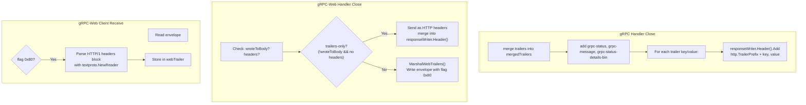

# connect-go — gRPC and gRPC-Web Protocols

**Source:** `protocol_grpc.go` (1011 LOC). A single `protocolGRPC` struct handles both gRPC over HTTP/2 and gRPC-Web over HTTP/1.1, distinguished by the `web bool` field. The key difference: gRPC uses HTTP/2 trailers for metadata, while gRPC-Web encodes trailers as the final envelope in the response body.

## gRPC Protocol Constants

```go
// protocol_grpc.go:34
const (
    grpcHeaderCompression       = "Grpc-Encoding"
    grpcHeaderAcceptCompression = "Grpc-Accept-Encoding"
    grpcHeaderTimeout           = "Grpc-Timeout"
    grpcHeaderStatus            = "Grpc-Status"
    grpcHeaderMessage           = "Grpc-Message"
    grpcHeaderDetails           = "Grpc-Status-Details-Bin"

    grpcFlagEnvelopeTrailer = 0b10000000  // gRPC-Web trailer flag

    grpcContentTypeDefault    = "application/grpc"
    grpcWebContentTypeDefault = "application/grpc-web"
    grpcContentTypePrefix     = grpcContentTypeDefault + "+"     // "application/grpc+"
    grpcWebContentTypePrefix  = grpcWebContentTypeDefault + "+"  // "application/grpc-web+"
)
```

## Content-Type Matrix

| Protocol | Codec | Content-Type |
|----------|-------|-------------|
| gRPC | proto | `application/grpc` (bare) or `application/grpc+proto` |
| gRPC | json | `application/grpc+json` |
| gRPC-Web | proto | `application/grpc-web` (bare) or `application/grpc-web+proto` |
| gRPC-Web | json | `application/grpc-web+json` |
| gRPC-Web | text | `application/grpc-web-text` (base64-encoded body) |

**Aha:** gRPC uses a "bare" content type for proto (`application/grpc` without a subtype), while other codecs require the `+codec` suffix. The `grpcCodecForContentType()` function (`protocol_grpc.go:815`) handles this: when the content type is exactly `application/grpc` or `application/grpc-web`, it returns `"proto"` implicitly.

## Timeout Encoding: gRPC Format

### Parsing

```go
// protocol_grpc.go:739
func grpcParseTimeout(timeout string) (time.Duration, error) {
    if timeout == "" { return 0, errNoTimeout }
    unit, err := grpcTimeoutUnitLookup(timeout[len(timeout)-1])
    if err != nil { return 0, err }
    num, err := strconv.ParseInt(timeout[:len(timeout)-1], 10, 64)
    if err != nil || num < 0 { return 0, fmt.Errorf("protocol error: invalid timeout %q", timeout) }
    if num > 99999999 { // max 8 digits
        return 0, fmt.Errorf("protocol error: timeout %q is too long", timeout)
    }
    // Check for time.Duration overflow with hours
    const grpcTimeoutMaxHours = math.MaxInt64 / int64(time.Hour)
    if unit == time.Hour && num > grpcTimeoutMaxHours {
        return 0, errNoTimeout
    }
    return time.Duration(num) * unit, nil
}
```

The gRPC timeout format is `<digits><unit>` where:
- Digits: ASCII string of at most 8 characters (0-99999999)
- Units: `H` (hours), `M` (minutes), `S` (seconds), `m` (milliseconds), `u` (microseconds), `n` (nanoseconds)

### Encoding

```go
// protocol_grpc.go:763
func grpcEncodeTimeout(timeout time.Duration) string {
    if timeout <= 0 { return "0n" }
    const grpcTimeoutMaxValue = 1e8  // 8 digits max
    switch {
    case timeout < time.Nanosecond*grpcTimeoutMaxValue:
        size, unit = time.Nanosecond, 'n'
    case timeout < time.Microsecond*grpcTimeoutMaxValue:
        size, unit = time.Microsecond, 'u'
    case timeout < time.Millisecond*grpcTimeoutMaxValue:
        size, unit = time.Millisecond, 'm'
    case timeout < time.Second*grpcTimeoutMaxValue:
        size, unit = time.Second, 'S'
    case timeout < time.Minute*grpcTimeoutMaxValue:
        size, unit = time.Minute, 'M'
    default:
        size, unit = time.Hour, 'H'
    }
    buf := strconv.AppendInt(buf, int64(timeout/size), 10)
    buf = append(buf, unit)
    return string(buf)
}
```

**Aha:** gRPC timeout encoding finds the **largest unit** that fits the value within 8 digits. A 90-second timeout becomes `"90S"` (not `"90000m"` or `"90000000000n"`). This minimizes precision loss while respecting the digit limit. The algorithm cascades from smallest to largest unit, picking the first one where `value < 1e8`.

## Percent Encoding for gRPC-Message

```go
// protocol_grpc.go:895
func grpcPercentEncode(msg string) string {
    // Characters that need escaping: control chars (< ' ' or > '~') and '%'
    func grpcShouldEscape(char byte) bool {
        return char < ' ' || char > '~' || char == '%'
    }
    // Two-pass: count escapes first, then encode with uppercase hex
    for i := range len(msg) {
        if grpcShouldEscape(msg[i]) { hexCount++ }
    }
    // Encode with uppercase hex (A-F, not a-f)
    out.WriteByte('%')
    out.WriteByte(upperhex[char>>4])  // "0123456789ABCDEF"
    out.WriteByte(upperhex[char&15])
}
```

**Aha:** gRPC uses a **custom percent-encoding** that differs from standard URL encoding. Only control characters (ASCII < 32 or > 126) and `%` itself are escaped. Letters, digits, spaces, and punctuation pass through unchanged. This maximizes human readability of error messages on the wire. Hex digits use **uppercase** (`%2F` not `%2f`).

## Trailer Handling: gRPC vs gRPC-Web



### gRPC: HTTP/2 Trailers

Standard gRPC uses HTTP/2 trailers — a special HTTP/2 feature that sends headers after the response body. In Go's `net/http`, this is exposed via the `http.TrailerPrefix` mechanism:

```go
// protocol_grpc.go:565
for key, values := range mergedTrailers {
    for _, value := range values {
        hc.responseWriter.Header().Add(http.TrailerPrefix+key, value)
    }
}
```

The `http.TrailerPrefix` is the string `"Trailer:"` — setting headers with this prefix signals to `net/http` that they should be sent as HTTP trailers.

### gRPC-Web: Body-Encoded Trailers

gRPC-Web can't use HTTP trailers (HTTP/1.1 doesn't support them), so it encodes trailers as the final envelope:

```go
// protocol_grpc.go:579
func (m *grpcMarshaler) MarshalWebTrailers(trailer http.Header) *Error {
    // Lowercase all header keys (gRPC-Web spec requires lowercase keys)
    for key, values := range trailer {
        lower := strings.ToLower(key)
        if key != lower {
            delete(trailer, key)
            trailer[lower] = values
        }
    }
    // Write as HTTP/1 headers block (without terminating newline)
    trailer.Write(raw)
    return m.Write(&envelope{
        Data:  raw,
        Flags: grpcFlagEnvelopeTrailer,  // 0x80
    })
}
```

The client parses this back using `textproto.NewReader`:

```go
// protocol_grpc.go:609
func (u *grpcUnmarshaler) Unmarshal(message any) *Error {
    if !u.web || !env.IsSet(grpcFlagEnvelopeTrailer) {
        return errorf(CodeInternal, "protocol error: invalid envelope flags %d", env.Flags)
    }
    // Add newline to make it parseable by textproto
    data.WriteByte('\n')
    mimeHeader, _ := textproto.NewReader(bufio.NewReader(data)).ReadMIMEHeader()
    u.webTrailer = http.Header(mimeHeader)
}
```

**Aha:** The gRPC-Web trailer encoding adds a `'\n'` byte because `textproto.Reader.ReadMIMEHeader()` expects a blank line terminating the header block. The original trailer data doesn't include the terminating newline (per the gRPC-Web spec), so the reader must add it.

## Trailers-Only Optimization

Both gRPC and gRPC-Web support a "trailers-only" response when there are no response headers and no body:

```go
// protocol_grpc.go:537
if hc.web && !hc.wroteToBody && len(hc.responseHeader) == 0 {
    // gRPC-Web: send trailers as HTTP headers instead of body
    mergeHeaders(hc.responseWriter.Header(), mergedTrailers)
    return nil
}
```

For gRPC-Web, if no body has been written and there are no custom response headers, trailers are sent as regular HTTP headers. For standard gRPC, trailers are **always** sent as HTTP trailers (even for trailers-only), because `net/http` doesn't support sending a HEADER frame without DATA frames at the HTTP/2 level.

## Error Serialization in Trailers

```go
// protocol_grpc.go:841
func grpcErrorToTrailer(trailer http.Header, protobuf Codec, err error) {
    if err == nil {
        setHeaderCanonical(trailer, grpcHeaderStatus, "0")  // OK
        return
    }
    // Merge custom metadata (unless wire error)
    if connectErr, ok := asError(err); ok && !connectErr.wireErr {
        mergeNonProtocolHeaders(trailer, connectErr.meta)
    }
    status := grpcStatusForError(err)
    code := status.GetCode()
    message := status.GetMessage()

    // Serialize details as protobuf Status
    if len(status.Details) > 0 {
        bin, _ := protobuf.Marshal(status)
        setHeaderCanonical(trailer, grpcHeaderDetails, EncodeBinaryHeader(bin))
    }
    setHeaderCanonical(trailer, grpcHeaderStatus, strconv.Itoa(int(code)))
    setHeaderCanonical(trailer, grpcHeaderMessage, grpcPercentEncode(message))
}
```

Error details are serialized as a `statusv1.Status` protobuf message and base64-encoded into the `grpc-status-details-bin` header:

```go
// protocol_grpc.go:870
func grpcStatusForError(err error) *statusv1.Status {
    status := &statusv1.Status{Code: int32(CodeUnknown), Message: err.Error()}
    if connectErr, ok := asError(err); ok {
        status.Code = int32(connectErr.Code())
        status.Message = connectErr.Message()
        status.Details = connectErr.detailsAsAny()
    }
    return status
}
```

**Why:** In Go, an interface value is a `(type, value)` pair. A typed nil like `(*Error)(nil)` is NOT equal to `nil` when assigned to an interface type — it becomes `(type=*Error, value=nil)` which is not nil. Many functions in connect-go return `error` interface. If a function returns `(*Error)(nil)`, the caller's `if err != nil` check will be TRUE — treating a nil error as an error. The codebase uses `var result *Error` (which starts as an untyped nil) rather than `result := &Error{}` followed by clearing fields, to ensure the nil case is truly nil when returned through an `error` interface. This is a subtle Go gotcha that causes bugs in custom implementations: returning a nil pointer as an interface value always triggers the error path, even though the pointer itself is nil. The `grpcErrorToTrailer` function guards against this by checking `if err == nil` first and returning early with only `grpc-status: "0"`, never constructing an `*Error` at all for the success case.

## Error Parsing from Trailers

```go
// protocol_grpc.go:692
func grpcErrorForTrailer(protobuf Codec, trailer http.Header) *Error {
    codeHeader := getHeaderCanonical(trailer, grpcHeaderStatus)
    if codeHeader == "" {
        code := CodeInternal
        if len(trailer) == 0 { code = CodeUnknown }
        return NewError(code, errTrailersWithoutGRPCStatus)
    }
    if codeHeader == "0" { return nil }  // OK

    code, _ := strconv.ParseUint(codeHeader, 10, 32)
    message, _ := grpcPercentDecode(getHeaderCanonical(trailer, grpcHeaderMessage))
    retErr := NewWireError(Code(code), errors.New(message))

    // Parse protobuf error details from grpc-status-details-bin
    detailsBinaryEncoded := getHeaderCanonical(trailer, grpcHeaderDetails)
    if len(detailsBinaryEncoded) > 0 {
        detailsBinary, _ := DecodeBinaryHeader(detailsBinaryEncoded)
        var status statusv1.Status
        protobuf.Unmarshal(detailsBinary, &status)
        for _, d := range status.GetDetails() {
            retErr.details = append(retErr.details, &ErrorDetail{pbAny: d})
        }
        // Prefer protobuf data over header values
        retErr.code = Code(status.GetCode())
        retErr.err = errors.New(status.GetMessage())
    }
}
```

## gRPC Client Request Headers

```go
// protocol_grpc.go:237
func (g *grpcClient) WriteRequestHeader(_ StreamType, header http.Header) {
    if getHeaderCanonical(header, headerUserAgent) == "" {
        header[headerUserAgent] = []string{defaultGrpcUserAgent}
    }
    // gRPC-Web: also set X-User-Agent
    if g.web && getHeaderCanonical(header, headerXUserAgent) == "" {
        header[headerXUserAgent] = []string{defaultGrpcUserAgent}
    }
    header[headerContentType] = []string{grpcContentTypeForCodecName(g.web, g.Codec.Name())}
    // Don't let http.Client compress the whole stream
    header["Accept-Encoding"] = []string{compressionIdentity}
    if g.CompressionName != "" {
        header[grpcHeaderCompression] = []string{g.CompressionName}
    }
    header[grpcHeaderAcceptCompression] = []string{acceptCompression}
    // gRPC-HTTP2: require trailer support
    if !g.web {
        header["Te"] = []string{"trailers"}
    }
}
```

**Aha:** The `Te: trailers` header is required for gRPC over HTTP/2. It tells the server that the client understands HTTP trailers. Without it, some gRPC servers won't send trailers, breaking error handling. gRPC-Web doesn't need it because trailers go in the body.

## Response Validation

```go
// protocol_grpc.go:649
func grpcValidateResponse(response *http.Response, header http.Header,
    availableCompressors readOnlyCompressionPools, web bool, codecName string) *Error {
    if response.StatusCode != http.StatusOK {
        return errorf(httpToCode(response.StatusCode), "HTTP status %v", response.Status)
    }
    // Validate content-type matches request codec
    if err := grpcValidateResponseContentType(web, codecName, contentType); err != nil {
        return err
    }
    // Validate compression
    if compression != "" && compression != compressionIdentity &&
        !availableCompressors.Contains(compression) {
        return errorf(CodeInternal, "unknown encoding %q: accepted encodings are %v", compression, ...)
    }
}
```

gRPC expects HTTP 200 for all responses. Errors are communicated via `grpc-status` trailers, not HTTP status codes. This is a key difference from Connect, where errors use HTTP status codes directly.

### grpcHandlerConn — Server-Side Connection

The server-side `grpcHandlerConn` (`protocol_grpc.go:456`) manages the gRPC/gRPC-Web response lifecycle:

```go
// protocol_grpc.go:456
type grpcHandlerConn struct {
    spec            Spec
    peer            Peer
    web             bool
    bufferPool      *bufferPool
    protobuf        Codec          // for error serialization
    marshaler       grpcMarshaler
    responseWriter  http.ResponseWriter
    responseHeader  http.Header
    responseTrailer http.Header
    wroteToBody     bool           // tracks if any body data sent
    request         *http.Request
    unmarshaler     grpcUnmarshaler
}
```

**Send()** (`protocol_grpc.go:490`):
```go
func (hc *grpcHandlerConn) Send(msg any) error {
    defer flushResponseWriter(hc.responseWriter)
    if !hc.wroteToBody {
        mergeHeaders(hc.responseWriter.Header(), hc.responseHeader)
        hc.wroteToBody = true
    }
    return hc.marshaler.Marshal(msg)
}
```

**Aha:** The `wroteToBody` flag is critical — it tracks whether any response body has been written. On the first `Send()`, response headers are merged into the HTTP response. This flag also determines whether the "trailers-only" optimization is available in `Close()`: if `wroteToBody` is false and there are no custom response headers, gRPC-Web can send trailers as HTTP headers instead of a body envelope.

**Close()** (`protocol_grpc.go:510`):
```go
func (hc *grpcHandlerConn) Close(err error) (retErr error) {
    defer func() {
        closeErr := hc.request.Body.Close()
        if retErr == nil { retErr = closeErr }
    }()
    defer flushResponseWriter(hc.responseWriter)

    if !hc.wroteToBody {
        mergeHeaders(hc.responseWriter.Header(), hc.responseHeader)
    }

    mergedTrailers := make(http.Header, len(hc.responseTrailer)+2)
    mergeHeaders(mergedTrailers, hc.responseTrailer)
    grpcErrorToTrailer(mergedTrailers, hc.protobuf, err)

    if hc.web && !hc.wroteToBody && len(hc.responseHeader) == 0 {
        // Trailers-only: send as HTTP headers
        mergeHeaders(hc.responseWriter.Header(), mergedTrailers)
        return nil
    }
    if hc.web {
        // gRPC-Web: write trailers as body envelope
        hc.marshaler.MarshalWebTrailers(mergedTrailers)
    } else {
        // gRPC: write as HTTP/2 trailers
        for key, values := range mergedTrailers {
            for _, value := range values {
                hc.responseWriter.Header().Add(http.TrailerPrefix+key, value)
            }
        }
    }
}
```

The Close() flow is the most complex part of the gRPC protocol:
1. Always closes the request body (even if handler errored mid-stream).
2. Merges response headers if not yet written.
3. Builds `mergedTrailers` from user trailers + error status/message/details.
4. For gRPC-Web trailers-only: sends as HTTP headers (no body needed).
5. For gRPC-Web with body: writes trailer envelope (flag `0x80`).
6. For standard gRPC: writes as HTTP/2 trailers via `http.TrailerPrefix`.

**Important:** For standard gRPC, even "trailers-only" responses must use HTTP/2 trailers (not headers), because `net/http` doesn't support sending a HEADER frame without DATA frames at the HTTP/2 level. The code comments note: "Breaking this logic breaks Envoy's gRPC-Web translation."

**Why:** The `wroteToBody` flag is the branching decision point in `Close()` — without it, the server would either send trailers as headers after body data (breaking HTTP semantics) or fail to send trailers at all for empty responses. HTTP/1.1 and HTTP/2 trailers behave differently: HTTP/1.1 trailers are sent after the body but some intermediaries (proxies, load balancers) may strip them or convert them to body content. For gRPC-Web specifically, when no body messages have been written (`!wroteToBody`), trailers MUST be sent as HTTP headers (the trailers-only optimization) because there is no body envelope to attach them to. Once `wroteToBody` is true, trailers must be sent in the appropriate format for the protocol: HTTP/2 native trailers for standard gRPC (via `http.TrailerPrefix`), or body-encoded trailers with the `0x80` flag for gRPC-Web. This flag is what enables the `Close()` method to handle all four code paths correctly: trailers-only for empty gRPC-Web responses, body-encoded trailers for gRPC-Web with data, HTTP/2 trailers for standard gRPC, and header merging for any response that hasn't written headers yet.

### grpcClientConn — Client-Side Connection

The client-side `grpcClientConn` (`protocol_grpc.go:260`) wraps `duplexHTTPCall` with gRPC-specific receive logic:

```go
// protocol_grpc.go:368
func (cc *grpcClientConn) Receive(msg any) error {
    if err := cc.duplexCall.BlockUntilResponseReady(); err != nil {
        return err
    }
    err := cc.unmarshaler.Unmarshal(msg)
    if err == nil { return nil }

    // Merge trailers from readTrailers
    mergeHeaders(cc.responseTrailer, cc.readTrailers(&cc.unmarshaler, cc.duplexCall))

    // Check for trailers-only response
    if errors.Is(err, io.EOF) && cc.unmarshaler.bytesRead == 0 && len(cc.responseTrailer) == 0 {
        mergeHeaders(cc.responseTrailer, cc.responseHeader)
        delHeaderCanonical(cc.responseTrailer, headerContentType)
        serverErr := grpcErrorForTrailer(cc.protobuf, cc.responseHeader)
        if serverErr == nil { return err }  // Status says "OK"
        serverErr.meta = cc.responseHeader.Clone()
        return serverErr
    }

    // Check for explicit error in trailers
    serverErr := grpcErrorForTrailer(cc.protobuf, cc.responseTrailer)
    if serverErr != nil {
        serverErr.meta = cc.responseHeader.Clone()
        mergeHeaders(serverErr.meta, cc.responseTrailer)
        _ = cc.duplexCall.CloseWrite()
        return serverErr
    }

    _ = cc.duplexCall.CloseWrite()
    return err
}
```

**Key flow:**
1. Wait for response via `BlockUntilResponseReady()`.
2. Try to unmarshal the next message.
3. If unmarshal returns `errSpecialEnvelope` or `io.EOF`, read trailers.
4. If `bytesRead == 0` and no trailers → check HTTP headers for trailers-only response.
5. If trailers present → parse error from `grpc-status`/`grpc-message`/`grpc-status-details-bin`.
6. When `grpc-status-details-bin` is present, it overrides `grpc-status` and `grpc-message` header values.

**Why:** gRPC allows status details in both HTTP/2 headers (`grpc-status`, `grpc-message`) and trailers (`grpc-status-details-bin`). Trailers always override header values because: (a) trailers are sent last and represent the definitive final status, (b) headers may contain intermediate/early values in streaming scenarios, and (c) the binary protobuf `Status` message in `grpc-status-details-bin` supports rich error details via the `google.rpc.Status` protobuf type with typed `Detail` entries, while headers only support plain text. This dual-channel design allows servers to send a quick status in headers for proxies and intermediaries to read immediately, then send the full typed error in trailers for the actual client. The client code in `grpcErrorForTrailer` implements this explicitly — it first parses `grpc-status`/`grpc-message` from plain headers, then checks for `grpc-status-details-bin` and overwrites `retErr.code` and `retErr.err` with the protobuf data if present.

### readTrailers — Extracting Trailers

```go
// protocol_grpc.go:692 (simplified)
func (hc *grpcHandler) readTrailers(u *grpcUnmarshaler, duplex *duplexHTTPCall) http.Header {
    if u.web {
        return u.WebTrailer()  // from body envelope (flag 0x80)
    }
    return duplex.ResponseTrailer()  // from HTTP/2 trailers
}
```

For gRPC-Web, trailers come from the `webTrailer` field populated by parsing the `0x80` envelope. For standard gRPC, trailers come from HTTP/2 native trailers.

### grpcValidateResponseContentType

```go
// protocol_grpc.go:683
func grpcValidateResponseContentType(web bool, codecName, contentType string) *Error {
    actualCodec := grpcCodecForContentType(web, contentType)
    if actualCodec != codecName {
        return errorf(CodeInternal, "invalid content-type: %q; expecting %q", contentType, ...)
    }
}
```

The content-type must match the codec used in the request. This prevents a server from silently switching codecs mid-stream.

## Next

[07-interceptor-architecture.md](07-interceptor-architecture.md) — The `Interceptor` interface, chain composition, and sentinel context checks.
