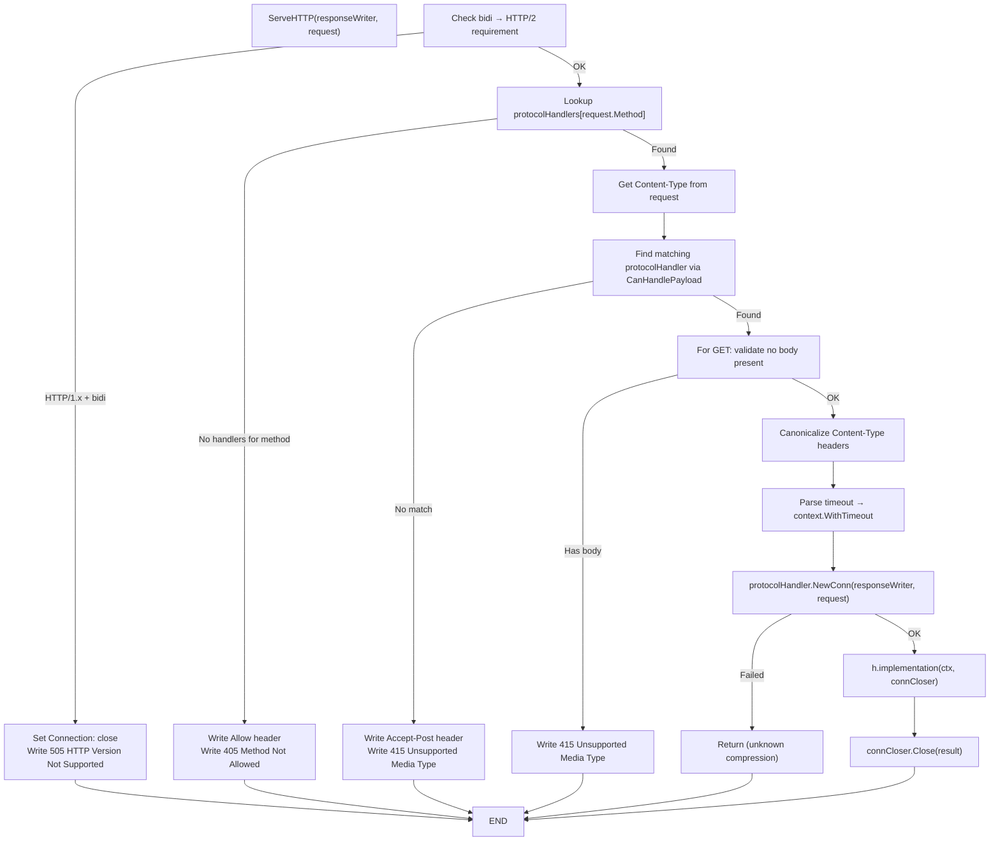

# connect-go — Handler Lifecycle

**Source:** `handler.go` (428 LOC), `protocol.go` (400 LOC), `connect.go` (500 LOC). The `Handler` struct is the server-side implementation of a single RPC. It implements `http.Handler`, dispatches requests to protocol-specific handlers, and wraps the user's implementation with interceptors and error handling.

## Handler Structure

```go
// handler.go:28
type Handler struct {
    spec             Spec
    implementation   StreamingHandlerFunc
    protocolHandlers map[string][]protocolHandler  // HTTP method → handlers
    allowMethod      string                        // Allow header value
    acceptPost       string                        // Accept-Post header value
}
```

The `protocolHandlers` map is keyed by HTTP method (`"POST"`, `"GET"`). Each value is a slice of `protocolHandler` — one per protocol (Connect, gRPC, gRPC-Web). This allows a single `Handler` to serve all three protocols on the same endpoint.

## Handler Constructors

### Unary Handler

```go
// handler.go:37
func NewUnaryHandler[Req, Res any](
    procedure string,
    unary func(context.Context, *Request[Req]) (*Response[Res], error),
    options ...HandlerOption,
) *Handler
```

Wraps the typed unary function in a `UnaryFunc` thunk that:
1. Checks context error before execution.
2. Validates request type matches expected type.
3. Panics with procedure name if both response and error are nil.
4. Avoids returning typed nil `(*Response[Res])` as `AnyResponse` interface.

The implementation (`handler.go:68`) creates a `StreamingHandlerConn` wrapper:

```go
implementation := func(ctx context.Context, conn StreamingHandlerConn) error {
    request, err := receiveUnaryRequest[Req](conn, config.Initializer)
    if err != nil { return err }

    info := &handlerCallInfo{
        peer:          request.Peer(),
        spec:          request.Spec(),
        method:        request.HTTPMethod(),
        requestHeader: request.Header(),
    }
    ctx = newHandlerContext(ctx, info)
    response, err := untyped(ctx, request)

    // Merge response headers/trailers from context callInfo
    if info.responseHeader != nil {
        mergeNonProtocolHeaders(conn.ResponseHeader(), info.responseHeader)
    }
    if info.responseTrailer != nil {
        mergeNonProtocolHeaders(conn.ResponseTrailer(), info.responseTrailer)
    }
    // Merge response headers/trailers from response wrapper
    if len(response.Header()) != 0 {
        mergeNonProtocolHeaders(conn.ResponseHeader(), response.Header())
    }
    if len(response.Trailer()) != 0 {
        mergeNonProtocolHeaders(conn.ResponseTrailer(), response.Trailer())
    }
    return conn.Send(response.Any())
}
```

### Unary Handler (Simple)

```go
// handler.go:119
func NewUnaryHandlerSimple[Req, Res any](
    procedure string,
    unary func(context.Context, *Req) (*Res, error),
    options ...HandlerOption,
) *Handler
```

Eliminates `Request` and `Response` wrappers. The handler receives a raw `*Req` and returns a raw `*Res`. Headers are propagated via `context.Context` using `CallInfo`. This is the "simple" generation option for code generators.

### Client Stream Handler

```go
// handler.go:138
func NewClientStreamHandler[Req, Res any](
    procedure string,
    implementation func(context.Context, *ClientStream[Req]) (*Response[Res], error),
    options ...HandlerOption,
) *Handler
```

The handler receives a `ClientStream[Req]` that wraps `StreamingHandlerConn`. The handler reads all messages from the stream, then returns a single response. Panics if both response and error are nil.

### Server Stream Handler

```go
// handler.go:194
func NewServerStreamHandler[Req, Res any](
    procedure string,
    implementation func(context.Context, *Request[Req], *ServerStream[Res]) error,
    options ...HandlerOption,
) *Handler
```

Receives a single unary request, then sends multiple response messages via `ServerStream[Res]`. The implementation calls `receiveUnaryRequest[Req]` to extract the first message.

### Bidi Stream Handler

```go
// handler.go:235
func NewBidiStreamHandler[Req, Res any](
    procedure string,
    implementation func(context.Context, *BidiStream[Req, Res]) error,
    options ...HandlerOption,
) *Handler
```

Receives a `BidiStream[Req, Res]` that wraps `StreamingHandlerConn` with bidirectional send/receive. No unary request is pre-read — the handler controls the full stream.

## ServeHTTP Dispatch Flow



### Key Dispatch Steps

**1. HTTP/2 Check for Bidi** (`handler.go:264`):
```go
isBidi := (h.spec.StreamType & StreamTypeBidi) == StreamTypeBidi
if isBidi && request.ProtoMajor < 2 {
    responseWriter.Header().Set("Connection", "close")
    responseWriter.WriteHeader(http.StatusHTTPVersionNotSupported)
    return
}
```

**2. Method Lookup** (`handler.go:274`):
```go
protocolHandlers := h.protocolHandlers[request.Method]
if len(protocolHandlers) == 0 {
    responseWriter.Header().Set("Allow", h.allowMethod)
    responseWriter.WriteHeader(http.StatusMethodNotAllowed)
    return
}
```

**3. Protocol Content-Type Match** (`handler.go:281-295`):
```go
contentType := canonicalizeContentType(getHeaderCanonical(request.Header, headerContentType))
var protocolHandler protocolHandler
for _, handler := range protocolHandlers {
    if handler.CanHandlePayload(request, contentType) {
        protocolHandler = handler
        break
    }
}
if protocolHandler == nil {
    responseWriter.Header().Set("Accept-Post", h.acceptPost)
    responseWriter.WriteHeader(http.StatusUnsupportedMediaType)
    return
}
```

The order matters: Connect handlers are registered first (default), then gRPC, then gRPC-Web. The first matching content-type wins.

**4. GET Body Validation** (`handler.go:297`):
```go
if request.Method == http.MethodGet {
    hasBody := request.ContentLength > 0
    if request.ContentLength < 0 {
        var b [1]byte
        n, _ := request.Body.Read(b[:])
        hasBody = n > 0
    }
    if hasBody {
        responseWriter.WriteHeader(http.StatusUnsupportedMediaType)
        return
    }
    _ = request.Body.Close()
}
```

**5. Timeout Parsing** (`handler.go:317`):
```go
ctx, cancel, timeoutErr := protocolHandler.SetTimeout(request)
if timeoutErr != nil {
    ctx = request.Context()  // fallback to original context
}
if cancel != nil {
    defer cancel()
}
```

If timeout parsing fails, the handler falls back to the original request context. The `timeoutErr` is later passed to `connCloser.Close(timeoutErr)` to send the error to the client.

**6. Connection Creation** (`handler.go:324`):
```go
connCloser, ok := protocolHandler.NewConn(responseWriter, request.WithContext(ctx))
if !ok {
    return  // unknown compression, error already written
}
```

If `NewConn` returns `ok = false`, the error has already been written to the response (e.g., unknown compression algorithm). No further action needed.

**7. Handler Execution** (`handler.go:337`):
```go
_ = connCloser.Close(h.implementation(ctx, connCloser))
```

The implementation (user's handler logic wrapped with interceptors) is executed, and its result is passed to `Close()` which handles cleanup and response finalization.

## Protocol Handler Registration

```go
// handler.go:384
func (c *handlerConfig) newProtocolHandlers() []protocolHandler {
    protocols := []protocol{
        &protocolConnect{},
        &protocolGRPC{web: false},
        &protocolGRPC{web: true},
    }
    handlers := make([]protocolHandler, 0, len(protocols))
    codecs := newReadOnlyCodecs(c.Codecs)
    compressors := newReadOnlyCompressionPools(c.CompressionPools, c.CompressionNames)
    for _, protocol := range protocols {
        handlers = append(handlers, protocol.NewHandler(&protocolHandlerParams{
            Spec:             c.newSpec(),
            Codecs:           codecs,
            CompressionPools: compressors,
            CompressMinBytes: c.CompressMinBytes,
            BufferPool:       c.BufferPool,
            ReadMaxBytes:     c.ReadMaxBytes,
            SendMaxBytes:     c.SendMaxBytes,
            RequireConnectProtocolHeader: c.RequireConnectProtocolHeader,
            IdempotencyLevel: c.IdempotencyLevel,
        }))
    }
    return handlers
}
```

Every handler supports all three protocols by default. The protocols are instantiated in order: Connect, gRPC, gRPC-Web. This order determines content-type priority when multiple protocols could match.

## Handler Configuration

```go
// handler.go:340
type handlerConfig struct {
    CompressionPools             map[string]*compressionPool
    CompressionNames             []string
    Codecs                       map[string]Codec
    CompressMinBytes             int
    Interceptor                  Interceptor
    Procedure                    string
    Schema                       any
    Initializer                  maybeInitializer
    RequireConnectProtocolHeader bool
    IdempotencyLevel             IdempotencyLevel
    BufferPool                   *bufferPool
    ReadMaxBytes                 int
    SendMaxBytes                 int
    StreamType                   StreamType
}
```

Default configuration (`handler.go:357`):
- Proto binary codec registered
- Proto JSON codec registered (both `"json"` and `"json; charset=utf-8"`)
- Gzip compression registered
- Buffer pool created with 512-byte initial, 8MiB max recycle

## Response Header and Trailer Merging

The handler implementation supports two mechanisms for setting response headers and trailers:

1. **Via `Request`/`Response` wrappers**: Headers set on the `Response` object are merged into the connection's response headers/trailers.

2. **Via `CallInfo` in context**: For "simple" handlers that don't use `Response` wrappers, headers can be set via `CallInfo` stored in context:
   ```go
   ctx = newHandlerContext(ctx, &handlerCallInfo{...})
   // Later, handler sets response headers via the callInfo
   info.responseHeader.Set("X-Custom", "value")
   ```

**Aha:** The handler merges headers from BOTH sources — the context `CallInfo` and the response wrapper. This allows interceptors to set headers via context even when the user's handler returns a simple response. The `mergeNonProtocolHeaders` function strips protocol-specific headers (like `Content-Type`, `Grpc-Status`) to prevent user code from accidentally overwriting protocol headers.

## Handler Spec

```go
// handler.go:375
func (c *handlerConfig) newSpec() Spec {
    return Spec{
        Procedure:        c.Procedure,
        Schema:           c.Schema,
        StreamType:       c.StreamType,
        IdempotencyLevel: c.IdempotencyLevel,
    }
}
```

The handler `Spec` does NOT have `IsClient: true` — only the client spec does. This distinction allows interceptors to determine whether they're running on the client or server side.

## Next

[10-client-lifecycle.md](10-client-lifecycle.md) — The `Client` generic, `NewClient` initialization, unary/stream call methods, and `duplexHTTPCall` transport.
