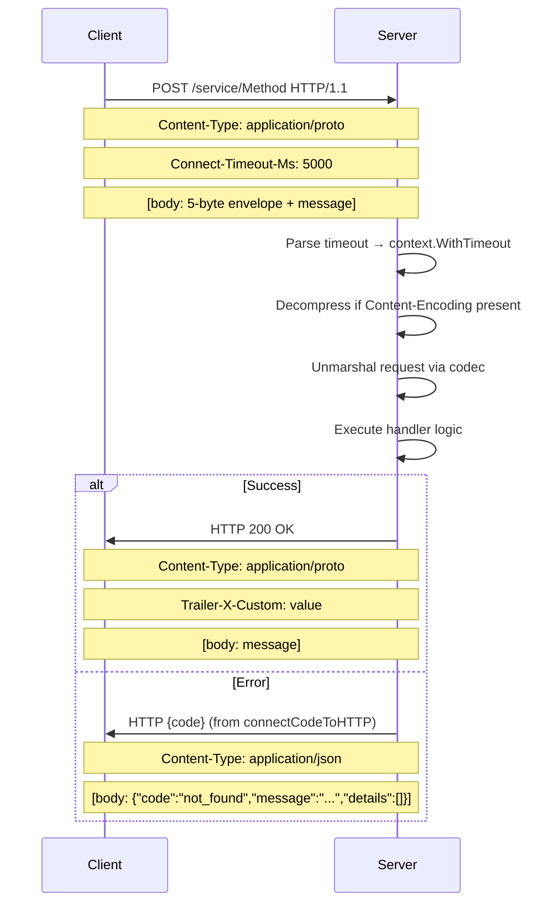
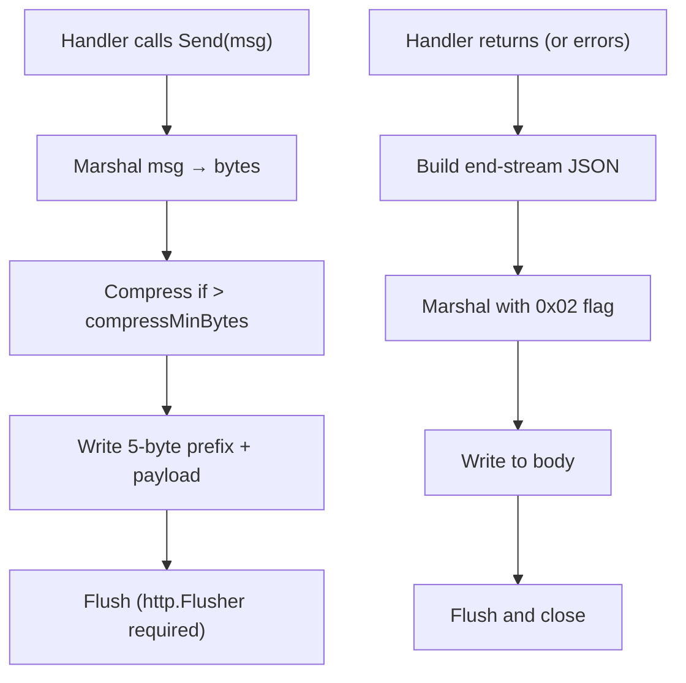

# Implementing the ConnectRPC Protocol

**Reference:** `connect-go/protocol_connect.go` (~1450 LOC), `connect-go/envelope.go` (388 LOC), `connect-go/codec.go` (260 LOC), `connect-go/error.go` (472 LOC). This document provides a complete blueprint for implementing the Connect protocol from scratch, based on the Go reference implementation.

## Protocol Philosophy

The Connect protocol is connectrpc's own design — simpler than gRPC, more debuggable than gRPC-Web, and usable directly from browsers and `curl` without any translation proxies. It uses standard HTTP methods (GET for idempotent reads, POST for everything else), JSON for error bodies, and envelope-based framing for streaming.

## Content-Type Routing

```
Unary:       application/{codec}        e.g., application/proto, application/json
Streaming:   application/connect+{codec} e.g., application/connect+proto, application/connect+json
```

The server derives the codec name from the content type:
- Unary: `strings.TrimPrefix(contentType, "application/")`
- Streaming: `strings.TrimPrefix(contentType, "application/connect+")`

**Validation:** The server must validate that the response content-type matches the request codec. For JSON, both `json` and `json; charset=utf-8` are treated as equivalent (`03-codec-system.md`).

## HTTP Methods

| RPC Kind | Methods Allowed | Condition |
|----------|----------------|-----------|
| Unary | POST | Always |
| Unary | GET | `IdempotencyLevel == IdempotencyNoSideEffects` AND `EnableGet == true` |
| Client Stream | POST | Always |
| Server Stream | POST | Always |
| Bidi Stream | POST | Always (requires HTTP/2) |

**Key consideration:** GET support is optional. The server must not enable GET unless the procedure is declared idempotent. The `Connect-Protocol-Version` header requirement is also optional (controlled by `WithRequireConnectProtocolHeader()`), but recommended for production to help HTTP proxies identify Connect requests.

## Required Headers

### Client → Server (Unary POST)

| Header | Value | Source |
|--------|-------|--------|
| `Content-Type` | `application/{codec}` | Derived from codec name |
| `User-Agent` | `connect-go/{version} ({goVersion})` | `protocol_connect.go:65` |
| `Connect-Protocol-Version` | `1` | `protocol_connect.go:45` |
| `Connect-Timeout-Ms` | `<milliseconds>` | Optional, max 10 digits |
| `Accept-Encoding` | Comma-separated compression names | From registered pools |
| `Content-Encoding` | Compression name | Only if request is compressed |

### Client → Server (Unary GET)

| Query Param | Value |
|-------------|-------|
| `connect` | `v1` |
| `encoding` | Codec name (`proto` or `json`) |
| `message` | Serialized message (base64 or plain text) |
| `base64` | `1` (present only if message is base64-encoded) |
| `compression` | Compression name (only if compressed) |

GET requests must NOT have a `Content-Type` header or a request body. The protocol version is in the query string (`connect=v1`), not a header.

### Server → Client (Unary)

| Header | Value | Condition |
|--------|-------|-----------|
| `Content-Type` | `application/{codec}` on success, `application/json` on error | Always |
| `Content-Encoding` | Compression name | Only if response compressed |
| `Accept-Encoding` | Comma-separated names | Always |
| `Trailer-{name}` | Trailer value | For each trailer header |
| `Vary` | `Accept-Encoding` | Only for GET requests |

### Client → Server (Streaming)

| Header | Value |
|--------|-------|
| `Content-Type` | `application/connect+{codec}` |
| `User-Agent` | `connect-go/{version} ({goVersion})` |
| `Connect-Protocol-Version` | `1` |
| `Connect-Timeout-Ms` | `<milliseconds>` |
| `Connect-Content-Encoding` | Compression name |
| `Connect-Accept-Encoding` | Comma-separated names |

**Aha:** Streaming uses different header names from unary. Unary uses `Content-Encoding`/`Accept-Encoding` (standard HTTP), while streaming uses `Connect-Content-Encoding`/`Connect-Accept-Encoding`. This prevents HTTP intermediaries from confusing per-message compression with whole-body compression. Streaming also requires `Connect-Protocol-Version: 1` on all requests, not just when `RequireConnectProtocolHeader` is set.

## Timeout Encoding

```
Connect-Timeout-Ms: <integer>  // milliseconds, max 10 digits
```

```go
// protocol_connect.go:117
func (*connectHandler) SetTimeout(request *http.Request) (context.Context, context.CancelFunc, error) {
    timeout := getHeaderCanonical(request.Header, connectHeaderTimeout)
    if timeout == "" { return request.Context(), nil, nil }
    if len(timeout) > 10 {
        return nil, nil, errorf(CodeInvalidArgument, "parse timeout: %q has >10 digits", timeout)
    }
    millis, err := strconv.ParseInt(timeout, 10 /* base */, 64 /* bitsize */)
    ctx, cancel := context.WithTimeout(request.Context(), time.Duration(millis)*time.Millisecond)
    return ctx, cancel, nil
}
```

**Key considerations:**
- Timeout is always in milliseconds — no unit suffix needed.
- Maximum 10 digits (9,999,999,999 ms ≈ 115 days).
- Invalid timeout (non-numeric, >10 digits) → `CodeInvalidArgument`.
- Missing timeout → no timeout applied.

## Unary Request/Response Flow



## Envelope Framing for Streaming

Every streaming message uses the 5-byte envelope format:

```
+--------+--------+--------+--------+--------+
| Flags  |         Length (uint32, BE)       |
| 1 byte |           4 bytes                 |
+--------+--------+--------+--------+--------+
|              Payload (Length bytes)         |
+---------------------------------------------+
```

### Flags

| Flag | Value | Meaning |
|------|-------|---------|
| Compressed | `0x01` | Payload is compressed |
| EndStream | `0x02` | Final message containing error + trailers |

The stream ends with a special envelope flagged `0x02`. Its payload is a JSON object:

```json
{
  "error": {
    "code": "not_found",
    "message": "user not found",
    "details": [
      {
        "type": "google.rpc.BadRequest",
        "value": "<base64-encoded protobuf Any>",
        "debug": {"fieldViolations": [...]}
      }
    ]
  },
  "metadata": {
    "X-Custom-Trailer": ["value"]
  }
}
```

**Aha:** The end-stream envelope carries BOTH the error (if any) AND the trailers in a single JSON object. This is fundamentally different from gRPC, where trailers and errors are separate. The `metadata` field contains canonicalized HTTP header keys — the server must canonicalize keys before writing (`http.CanonicalHeaderKey`).

### Streaming Server → Client Flow



**Critical:** After each `Send()`, the server MUST flush the response writer. The Go implementation checks `http.Flusher` is implemented (`protocol.go:347`):

```go
// protocol.go:347
func checkServerStreamsCanFlush(spec Spec, responseWriter http.ResponseWriter) *Error {
    requiresFlusher := (spec.StreamType & StreamTypeServer) == StreamTypeServer
    if _, flushable := responseWriter.(http.Flusher); requiresFlusher && !flushable {
        return NewError(CodeInternal, fmt.Errorf("%T does not implement http.Flusher", responseWriter))
    }
}
```

## Unary Error Response Format

On error, the server returns:
1. HTTP status code from `connectCodeToHTTP()` (`protocol_connect.go:1269`)
2. `Content-Type: application/json`
3. JSON body with the wire error structure

### Code → HTTP Mapping

| RPC Code | HTTP Status | Rationale |
|----------|-------------|-----------|
| `CodeCanceled` (1) | 499 | Client closed request |
| `CodeUnknown` (2) | 500 | Server error |
| `CodeInvalidArgument` (3) | 400 | Bad request |
| `CodeDeadlineExceeded` (4) | 504 | Gateway timeout |
| `CodeNotFound` (5) | 404 | Not found |
| `CodeAlreadyExists` (6) | 409 | Conflict |
| `CodePermissionDenied` (7) | 403 | Forbidden |
| `CodeResourceExhausted` (8) | 429 | Rate limited |
| `CodeFailedPrecondition` (9) | 400 | Bad request |
| `CodeAborted` (10) | 409 | Conflict |
| `CodeOutOfRange` (11) | 400 | Bad request |
| `CodeUnimplemented` (12) | 501 | Not implemented |
| `CodeInternal` (13) | 500 | Server error |
| `CodeUnavailable` (14) | 503 | Service unavailable |
| `CodeDataLoss` (15) | 500 | Server error |
| `CodeUnauthenticated` (16) | 401 | Unauthorized |

**Validation:** When the client receives a non-200 response, it must:
1. Verify content-type is `application/json` or `application/json; charset=utf-8`.
2. Parse the JSON error body.
3. If the JSON `code` field is 0, use `httpToCode(httpStatusCode)` as fallback.

## GET Request Implementation Details

### Server-Side GET Handling

```go
// handler.go:297
if request.Method == http.MethodGet {
    // Body must not be present
    hasBody := request.ContentLength > 0
    if request.ContentLength < 0 {
        // No content-length header — test if body is empty
        var b [1]byte
        n, _ := request.Body.Read(b[:])
        hasBody = n > 0
    }
    if hasBody {
        responseWriter.WriteHeader(http.StatusUnsupportedMediaType)
        return
    }
}
```

The server reads the message from query parameters:

```go
// protocol_connect.go:190
msg := query.Get(connectUnaryMessageQueryParameter)
msgReader := queryValueReader(msg, query.Get(connectUnaryBase64QueryParameter) == "1")
requestBody = io.NopCloser(msgReader)
```

**Key consideration:** The `queryValueReader` (`protocol_connect.go:1343`) handles both padded and unpadded base64:

```go
func binaryQueryValueReader(data string) io.Reader {
    if len(data)%4 != 0 {
        // Unpadded — use RawURLEncoding
        return base64.NewDecoder(base64.RawURLEncoding, strings.NewReader(data))
    }
    // Padded or no padding needed
    return base64.NewDecoder(base64.URLEncoding, strings.NewReader(data))
}
```

### 304 Not Modified

```go
// error.go:184
func NewNotModifiedError(headers http.Header) *Error {
    err := NewError(CodeUnknown, errNotModified)
    err.meta = headers
    return err
}
```

When a handler returns `NewNotModifiedError(headers)`, the Connect server responds with HTTP 304. This is ONLY valid for GET requests. For all other cases, it's treated as `CodeUnknown`.

## Compression Negotiation

The server performs compression negotiation (`protocol.go:302`):

```go
func negotiateCompression(availableCompressors, sent, accept string) (reqComp, respComp string, err *Error) {
    // Request compression: use what the client sent (if supported)
    requestCompression = sent  // or identity if not supported → error
    
    // Response compression: prefer same as request (asymmetric support)
    responseCompression = requestCompression
    if responseCompression == identity && accept != "" {
        // Find first mutually supported algorithm from client's Accept-Encoding
        for _, name := range strings.FieldsFunc(accept, isCommaOrSpace) {
            if availableCompressors.Contains(name) {
                responseCompression = name
                break
            }
        }
    }
}
```

**Aha:** Compression is asymmetric by design. The client may send compressed requests even if it doesn't accept compressed responses, and vice versa. The server defaults response compression to match the request compression (if the client compressed its request, the server compresses its response with the same algorithm). If the client didn't compress but listed accepted algorithms, the server picks the first mutually supported one.

## Protocol Version Validation

```go
// protocol_connect.go:1429
func connectCheckProtocolVersion(request *http.Request, required bool) *Error {
    switch request.Method {
    case http.MethodGet:
        version := request.URL.Query().Get("connect")
        if version == "" && required {
            return errorf(CodeInvalidArgument, "missing required query parameter: set connect to \"v1\"")
        } else if version != "" && version != "v1" {
            return errorf(CodeInvalidArgument, "connect must be \"v1\": got %q", version)
        }
    case http.MethodPost:
        version := getHeaderCanonical(request.Header, "Connect-Protocol-Version")
        if version == "" && required {
            return errorf(CodeInvalidArgument, "missing required header: set Connect-Protocol-Version to \"1\"")
        } else if version != "" && version != "1" {
            return errorf(CodeInvalidArgument, "Connect-Protocol-Version must be \"1\": got %q", version)
        }
    }
}
```

**Key consideration:** When `RequireConnectProtocolHeader` is `false` (default), the server accepts requests without the version header/query param. When `true`, it rejects them with `CodeInvalidArgument`. Streaming requests always require the version header regardless of this setting.

## Trailer Handling

Connect transmits trailers via `Trailer-` prefixed HTTP headers:

```go
// protocol_connect.go:773
for k, v := range hc.responseTrailer {
    header["Trailer-"+k] = v
}
```

Client-side, the client strips the prefix to extract trailers:

```go
// protocol_connect.go:507
for k, v := range response.Header {
    if !strings.HasPrefix(k, "Trailer-") {
        cc.responseHeader[k] = v
        continue
    }
    cc.responseTrailer[k[len("Trailer-"):]] = v
}
```

**Key consideration:** Trailers are sent as regular HTTP headers (not HTTP trailers). This means they must fit within the HTTP response header block — no trailers can be added after the response body starts being written. This is a fundamental difference from gRPC.

## Error Details Serialization

The Connect wire error format (`protocol_connect.go:1142-1262`):

```json
{
  "code": "invalid_argument",
  "message": "field 'email' is required",
  "details": [
    {
      "type": "google.rpc.BadRequest.FieldViolation",
      "value": "<base64-raw-std-encoded protobuf Any>",
      "debug": {"field": "email", "description": "is required"}
    }
  ]
}
```

**Key details:**
- `code` is the string representation (e.g., `"invalid_argument"`, not `3`).
- `value` is base64-raw-std encoded (no padding).
- `debug` is optional — human-readable JSON representation, only present when the server has protobuf descriptors.
- When a proxy without descriptors forwards the error, it preserves the original `wireJSON` string.

## Compatibility Validation Checklist

1. **Content-Type**: Server must return `application/{codec}` on success, `application/json` on error.
2. **HTTP Status Code**: Error responses must use the correct `connectCodeToHTTP()` mapping.
3. **Connect-Protocol-Version**: Must be `1` if required. GET uses query param, POST uses header.
4. **Timeout Parsing**: Must reject >10 digit values with `CodeInvalidArgument`.
5. **GET Body Rejection**: GET requests with bodies must return 415 Unsupported Media Type.
6. **Trailers**: Must use `Trailer-` prefix on HTTP headers.
7. **End-Stream Envelope**: Streaming must end with flag `0x02` containing JSON error + metadata.
8. **Compression**: Unknown compression → `CodeUnimplemented` with acceptable encodings in response.
9. **Cardinality**: Unary RPCs must return `CodeUnimplemented` if zero or multiple messages in stream.
10. **Flush**: Server must flush after each streaming message (`http.Flusher`).

## Conformance Testing

The Go implementation includes a conformance test harness (`conformance/` directory) that exercises:
- All three protocols (Connect, gRPC, gRPC-Web)
- All four RPC kinds (unary, client stream, server stream, bidi)
- All error codes
- Compression (gzip)
- Timeout/deadline semantics
- Cancellation
- GET requests for idempotent unary

An implementation should pass the connectrpc/conformance test suite to claim compatibility.
