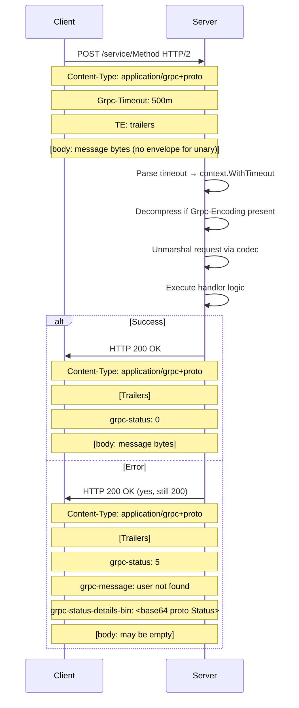
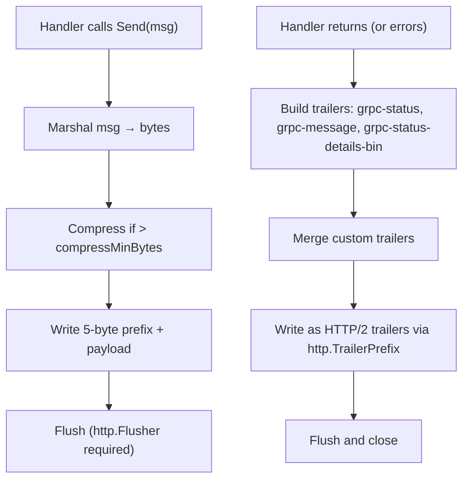

# Implementing the gRPC Protocol (Native, Over HTTP/2)

**Reference:** `connect-go/protocol_grpc.go` (~1010 LOC), `connect-go/envelope.go` (388 LOC), `connect-go/codec.go` (260 LOC), `connect-go/error.go` (472 LOC). This document provides a complete blueprint for implementing gRPC over HTTP/2 natively — not via a proxy or translation layer — following the connect-go reference implementation's approach.

## Protocol Philosophy

gRPC over HTTP/2 is the original RPC protocol that Connect was designed to improve upon. It leverages HTTP/2's multiplexing, header compression (HPACK), and native trailer support. The protocol uses HTTP/2 frames directly — trailers are sent as proper HTTP/2 trailer headers, errors are encoded in `grpc-status`/`grpc-message` headers, and timeouts use a compact `<digits><unit>` format. Unlike Connect, gRPC always returns HTTP 200 for successful and failed RPCs alike — the actual status lives in trailers.

## Content-Type Routing

```
Bare proto:  application/grpc
Named codec: application/grpc+{codec}   e.g., application/grpc+proto, application/grpc+json
```

The server derives the codec name from the content type:
- If content-type is exactly `application/grpc` → codec is `"proto"` (implicit bare mapping)
- If content-type starts with `application/grpc+` → codec is `strings.TrimPrefix(contentType, "application/grpc+")`

**Aha:** gRPC's "bare" content type for proto is unique among the three protocols. `application/grpc` without a subtype means proto. This is a historical artifact — the gRPC spec was written before the `application/vnd.+codec` convention was widely adopted. Implementations must treat `application/grpc` and `application/grpc+proto` as equivalent.

## HTTP Method and Version Requirements

| RPC Kind | Method | HTTP Version |
|----------|--------|-------------|
| Unary | POST | HTTP/2 (HTTP/1.1 fallback possible but non-standard) |
| Client Stream | POST | HTTP/2 |
| Server Stream | POST | HTTP/2 |
| Bidi Stream | POST | HTTP/2 (required for true bidirectional streaming) |

**Key requirement:** gRPC requires HTTP/2. All four RPC kinds work over HTTP/2 POST requests. While some implementations accept HTTP/1.1, this is non-standard and loses HTTP/2 multiplexing and trailer support.

## Required Headers

### Client → Server

| Header | Value | Source |
|--------|-------|--------|
| `Content-Type` | `application/grpc` or `application/grpc+{codec}` | Derived from codec name |
| `User-Agent` | `connect-go/{version} ({goVersion})` or custom | `protocol_grpc.go:237` |
| `Grpc-Timeout` | `<digits><unit>` | Optional — e.g., `500m`, `30S`, `1H` |
| `Grpc-Encoding` | Compression name | Only if request is compressed |
| `Grpc-Accept-Encoding` | Comma-separated compression names | From registered pools |
| `TE` | `trailers` | Required for standard gRPC (not gRPC-Web) |

**Aha:** The `TE: trailers` header is mandatory for gRPC over HTTP/2. It tells the server that the client supports HTTP trailers. Without it, some gRPC servers won't send trailers, breaking error handling since gRPC communicates errors via trailers, not HTTP status codes. This is a common source of interoperability bugs.

### Server → Client

| Header | Value | Condition |
|--------|-------|-----------|
| `Content-Type` | `application/grpc` or `application/grpc+{codec}` | Always |
| `Grpc-Status` | `"0"` on success, error code string on failure | Always (in trailers) |
| `Grpc-Message` | Human-readable error message | Only on error |
| `Grpc-Status-Details-Bin` | Base64-encoded protobuf `Status` message | Only if error has details |
| `Grpc-Encoding` | Compression name | Only if response compressed |
| `Grpc-Accept-Encoding` | Comma-separated names | Always |

## Timeout Encoding: gRPC Format

```
Grpc-Timeout: <digits><unit>  // max 8 digits, units: H/M/S/m/u/n
```

### Parsing

```go
// protocol_grpc.go:739
func grpcParseTimeout(timeout string) (time.Duration, error) {
    if timeout == "" { return 0, errNoTimeout }
    unit, err := grpcTimeoutUnitLookup(timeout[len(timeout)-1])
    if err != nil { return 0, err }
    num, err := strconv.ParseInt(timeout[:len(timeout)-1], 10, 64)
    if err != nil || num < 0 { return 0, fmt.Errorf("protocol error: invalid timeout %q", timeout) }
    if num > 99999999 { // max 8 digits
        return 0, fmt.Errorf("protocol error: timeout %q is too long", timeout)
    }
    return time.Duration(num) * unit, nil
}
```

### Timeout Unit Lookup

| Character | Unit |
|-----------|------|
| `H` | hours |
| `M` | minutes |
| `S` | seconds |
| `m` | milliseconds |
| `u` | microseconds |
| `n` | nanoseconds |

### Encoding (Largest-Unit-Fits Algorithm)

```go
// protocol_grpc.go:763
func grpcEncodeTimeout(timeout time.Duration) string {
    if timeout <= 0 { return "0n" }
    const grpcTimeoutMaxValue = 1e8  // 8 digits max
    switch {
    case timeout < time.Nanosecond*grpcTimeoutMaxValue:
        size, unit = time.Nanosecond, 'n'
    case timeout < time.Microsecond*grpcTimeoutMaxValue:
        size, unit = time.Microsecond, 'u'
    case timeout < time.Millisecond*grpcTimeoutMaxValue:
        size, unit = time.Millisecond, 'm'
    case timeout < time.Second*grpcTimeoutMaxValue:
        size, unit = time.Second, 'S'
    case timeout < time.Minute*grpcTimeoutMaxValue:
        size, unit = time.Minute, 'M'
    default:
        size, unit = time.Hour, 'H'
    }
    buf := strconv.AppendInt(buf, int64(timeout/size), 10)
    buf = append(buf, unit)
    return string(buf)
}
```

**Aha:** gRPC timeout encoding finds the **largest unit** that fits the value within 8 digits. A 90-second timeout becomes `"90S"` (not `"90000m"` or `"90000000000n"`). This minimizes precision loss while respecting the digit limit. The algorithm cascades from smallest to largest unit, picking the first one where `value < 1e8`. This is fundamentally different from Connect's plain millisecond format.

## Unary Request/Response Flow



**Critical difference from Connect:** gRPC always returns HTTP 200, even on errors. The actual RPC status code lives in the `grpc-status` trailer. This means HTTP-level retries, load balancers, and proxies cannot distinguish success from failure without parsing gRPC trailers.

## Streaming: Envelope Framing

Streaming RPCs (client stream, server stream, bidi stream) use the same 5-byte envelope format as Connect:

```
+--------+--------+--------+--------+--------+
| Flags  |         Length (uint32, BE)       |
| 1 byte |           4 bytes                 |
+--------+--------+--------+--------+--------+
|              Payload (Length bytes)         |
+---------------------------------------------+
```

### Flags

| Flag | Value | Meaning |
|------|-------|---------|
| Compressed | `0x01` | Payload is compressed |

Unlike Connect, gRPC does NOT use an end-stream envelope flag. Instead, the stream ends naturally when the handler returns, and trailers are sent as separate HTTP/2 trailer headers.

### Streaming Server → Client Flow



## Trailer Handling: HTTP/2 Native

gRPC uses HTTP/2 trailers — a native HTTP/2 feature that sends headers after the response body. In Go's `net/http`, this is exposed via the `http.TrailerPrefix` mechanism:

```go
// protocol_grpc.go:565
for key, values := range mergedTrailers {
    for _, value := range values {
        hc.responseWriter.Header().Add(http.TrailerPrefix+key, value)
    }
}
```

The `http.TrailerPrefix` is the string `"Trailer:"` — setting headers with this prefix signals to `net/http` that they should be sent as HTTP trailers. This is fundamentally different from Connect, which sends trailers as `Trailer-`-prefixed regular headers.

### Server-Side Trailer Declaration

The server must pre-declare trailer keys before writing the response body:

```go
// Declare trailer keys upfront (Go net/http requirement)
responseWriter.Header()["Trailer"] = []string{"Grpc-Status", "Grpc-Message", "Grpc-Status-Details-Bin"}
```

Without pre-declaration, HTTP/2 trailers may be dropped or sent as regular headers, breaking client parsing.

## Error Serialization in Trailers

```go
// protocol_grpc.go:841
func grpcErrorToTrailer(trailer http.Header, protobuf Codec, err error) {
    if err == nil {
        setHeaderCanonical(trailer, grpcHeaderStatus, "0")  // OK
        return
    }
    // Merge custom metadata (unless wire error)
    if connectErr, ok := asError(err); ok && !connectErr.wireErr {
        mergeNonProtocolHeaders(trailer, connectErr.meta)
    }
    status := grpcStatusForError(err)
    code := status.GetCode()
    message := status.GetMessage()

    // Serialize details as protobuf Status
    if len(status.Details) > 0 {
        bin, _ := protobuf.Marshal(status)
        setHeaderCanonical(trailer, grpcHeaderDetails, EncodeBinaryHeader(bin))
    }
    setHeaderCanonical(trailer, grpcHeaderStatus, strconv.Itoa(int(code)))
    setHeaderCanonical(trailer, grpcHeaderMessage, grpcPercentEncode(message))
}
```

### Protobuf Status Message

Error details are serialized as a `google.rpc.Status` protobuf message:

```go
// protocol_grpc.go:870
func grpcStatusForError(err error) *statusv1.Status {
    status := &statusv1.Status{Code: int32(CodeUnknown), Message: err.Error()}
    if connectErr, ok := asError(err); ok {
        status.Code = int32(connectErr.Code())
        status.Message = connectErr.Message()
        status.Details = connectErr.detailsAsAny()
    }
    return status
}
```

The `grpc-status-details-bin` header contains a base64-encoded protobuf `Status` message with `code`, `message`, and `details` fields.

## Error Parsing from Trailers (Client Side)

```go
// protocol_grpc.go:692
func grpcErrorForTrailer(protobuf Codec, trailer http.Header) *Error {
    codeHeader := getHeaderCanonical(trailer, grpcHeaderStatus)
    if codeHeader == "" {
        code := CodeInternal
        if len(trailer) == 0 { code = CodeUnknown }
        return NewError(code, errTrailersWithoutGRPCStatus)
    }
    if codeHeader == "0" { return nil }  // OK

    code, _ := strconv.ParseUint(codeHeader, 10, 32)
    message, _ := grpcPercentDecode(getHeaderCanonical(trailer, grpcHeaderMessage))
    retErr := NewWireError(Code(code), errors.New(message))

    // Parse protobuf error details from grpc-status-details-bin
    detailsBinaryEncoded := getHeaderCanonical(trailer, grpcHeaderDetails)
    if len(detailsBinaryEncoded) > 0 {
        detailsBinary, _ := DecodeBinaryHeader(detailsBinaryEncoded)
        var status statusv1.Status
        protobuf.Unmarshal(detailsBinary, &status)
        for _, d := range status.GetDetails() {
            retErr.details = append(retErr.details, &ErrorDetail{pbAny: d})
        }
        // Prefer protobuf data over header values
        retErr.code = Code(status.GetCode())
        retErr.err = errors.New(status.GetMessage())
    }
    return retErr
}
```

**Key considerations:**
- Missing `grpc-status` → `CodeInternal` (malformed response) or `CodeUnknown` (empty trailers).
- `grpc-status: "0"` → no error (OK).
- When `grpc-status-details-bin` is present, it overrides `grpc-status` and `grpc-message` header values.
- Error details are stored as `ErrorDetail{pbAny: d}` — the inner message is lazily unmarshaled on demand.

## Percent Encoding for Grpc-Message

```go
// protocol_grpc.go:895
func grpcPercentEncode(msg string) string {
    // Characters that need escaping: control chars (< ' ' or > '~') and '%'
    func grpcShouldEscape(char byte) bool {
        return char < ' ' || char > '~' || char == '%'
    }
    // Two-pass: count escapes first, then encode with uppercase hex
    for i := range len(msg) {
        if grpcShouldEscape(msg[i]) { hexCount++ }
    }
    // Encode with uppercase hex (A-F, not a-f)
    out.WriteByte('%')
    out.WriteByte(upperhex[char>>4])  // "0123456789ABCDEF"
    out.WriteByte(upperhex[char&15])
}
```

**Aha:** gRPC uses a **custom percent-encoding** that differs from standard URL encoding. Only control characters (ASCII < 32 or > 126) and `%` itself are escaped. Letters, digits, spaces, and punctuation pass through unchanged. This maximizes human readability of error messages on the wire. Hex digits use **uppercase** (`%2F` not `%2f`). This is critical for compatibility — a client expecting standard URL encoding will misdecode gRPC messages.

## Compression Negotiation

The server performs compression negotiation (`protocol.go:302`):

```go
func negotiateCompression(availableCompressors, sent, accept string) (reqComp, respComp string, err *Error) {
    // Request compression: use what the client sent (if supported)
    requestCompression = sent  // or identity if not supported → error

    // Response compression: prefer same as request (asymmetric support)
    responseCompression = requestCompression
    if responseCompression == identity && accept != "" {
        // Find first mutually supported algorithm from client's Accept-Encoding
        for _, name := range strings.FieldsFunc(accept, isCommaOrSpace) {
            if availableCompressors.Contains(name) {
                responseCompression = name
                break
            }
        }
    }
}
```

gRPC uses `Grpc-Encoding` and `Grpc-Accept-Encoding` headers — not the standard HTTP `Content-Encoding`/`Accept-Encoding`. This avoids confusion with HTTP-level compression.

**Why:** The client announces its accepted compression algorithms in `Grpc-Accept-Encoding`, but the server picks ONE (last registered = most preferred). The server announces what it used in `Grpc-Encoding`. Asymmetric means: the client can compress requests with algorithm A while the server decompresses with A; the server compresses responses with algorithm B while the client decompresses with B — A and B don't need to be the same. This is different from symmetric TLS cipher negotiation where both sides must agree on the same algorithm for both directions. The benefit is that each side can use its most efficient algorithm independently. The cost is that both sides need implementations for all algorithms in the intersection of their capabilities. The `negotiateCompression` function implements this by first checking the request compression the client used, then iterating through the client's `Accept-Encoding` list to find the first mutually supported response compression.

## Response Validation

```go
// protocol_grpc.go:649
func grpcValidateResponse(response *http.Response, header http.Header,
    availableCompressors readOnlyCompressionPools, web bool, codecName string) *Error {
    if response.StatusCode != http.StatusOK {
        return errorf(httpToCode(response.StatusCode), "HTTP status %v", response.Status)
    }
    // Validate content-type matches request codec
    if err := grpcValidateResponseContentType(web, codecName, contentType); err != nil {
        return err
    }
    // Validate compression
    if compression != "" && compression != compressionIdentity &&
        !availableCompressors.Contains(compression) {
        return errorf(CodeInternal, "unknown encoding %q: accepted encodings are %v", compression, ...)
    }
}
```

gRPC expects HTTP 200 for all responses. Errors are communicated via `grpc-status` trailers, not HTTP status codes. If a non-200 HTTP status is received, it indicates a transport-level failure (proxy error, authentication failure, etc.), not an RPC-level error.

## HTTP Status → RPC Code Fallback Mapping

When the HTTP status is non-200 (transport-level error):

```go
// protocol.go:401
func httpToCode(httpCode int) Code {
    switch httpCode {
    case 400: return CodeInternal        // Malformed request
    case 401: return CodeUnauthenticated  // No auth
    case 403: return CodePermissionDenied // Forbidden
    case 404: return CodeUnimplemented    // Unknown endpoint
    case 429: return CodeUnavailable      // Rate limited
    case 502, 503, 504: return CodeUnavailable  // Server issues
    default: return CodeUnknown
    }
}
```

**Important:** Per the gRPC HTTP status mapping specification, HTTP 400 maps to `CodeInternal`, not `CodeInvalidArgument`. This is because a 400 from an HTTP intermediary (not the gRPC server) indicates a proxy issue, not a client error.

## Compatibility Validation Checklist

1. **Content-Type**: Server must return `application/grpc` or `application/grpc+{codec}` matching the request codec. Bare `application/grpc` maps to proto.
2. **HTTP Status**: All responses must be HTTP 200. Non-200 indicates transport-level failure.
3. **Trailers**: `grpc-status` must always be present in trailers. Missing → `CodeInternal`.
4. **grpc-status format**: Must be a decimal string (`"0"`, `"5"`, `"14"`), not hex.
5. **grpc-message encoding**: Must use custom percent-encoding (control chars + `%`, uppercase hex).
6. **grpc-status-details-bin**: Must be base64-encoded protobuf `google.rpc.Status` message.
7. **TE: trailers**: Client must send `TE: trailers` header for HTTP/2 trailer support.
8. **Timeout format**: Must be `<digits><unit>` with max 8 digits. Units: H/M/S/m/u/n.
9. **Compression headers**: Must use `Grpc-Encoding`/`Grpc-Accept-Encoding`, not standard HTTP headers.
10. **Flush**: Server must flush after each streaming message (`http.Flusher`).
11. **HTTP/2 required**: HTTP/1.1 responses are non-standard — clients may reject them.
12. **Trailer pre-declaration**: Server must pre-declare trailer keys before writing body.

## Conformance Testing

The Go implementation includes a conformance test harness (`conformance/` directory) that exercises:
- All three protocols (Connect, gRPC, gRPC-Web)
- All four RPC kinds (unary, client stream, server stream, bidi)
- All error codes
- Compression (gzip)
- Timeout/deadline semantics
- Cancellation
- GET requests for idempotent unary (Connect only)

An implementation should pass the connectrpc/conformance test suite to claim compatibility.
