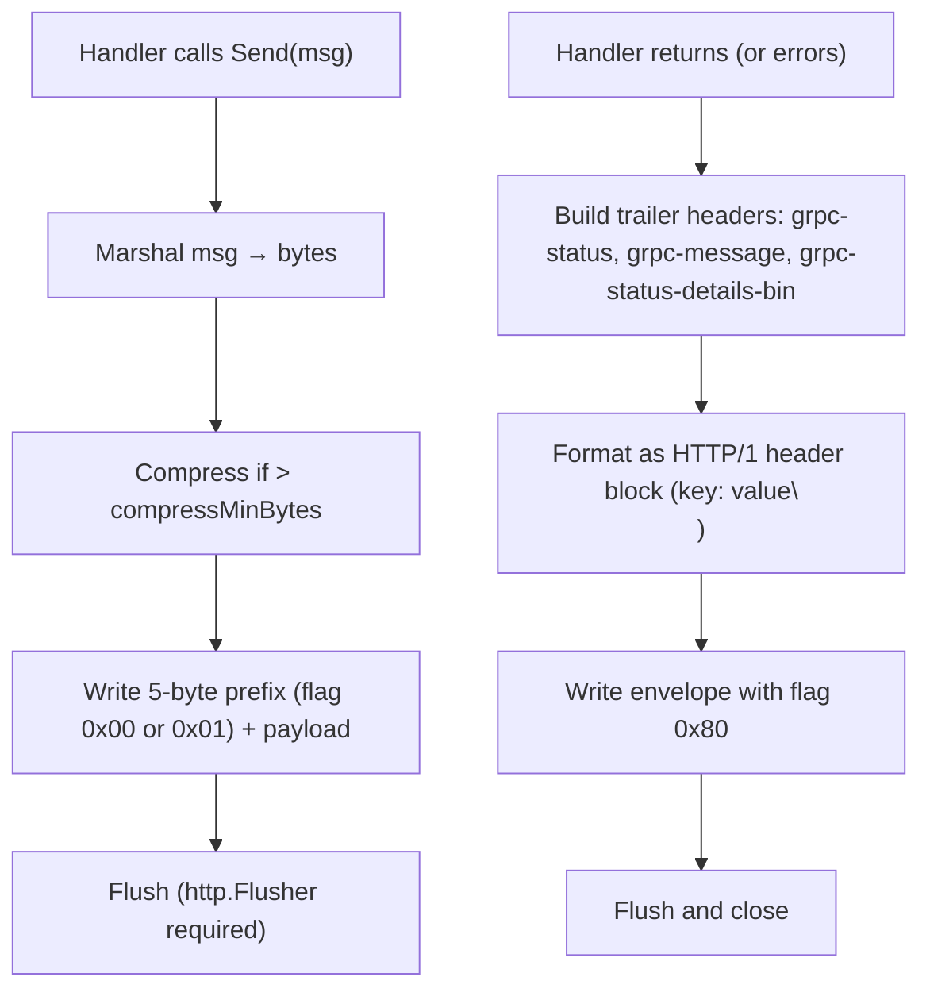
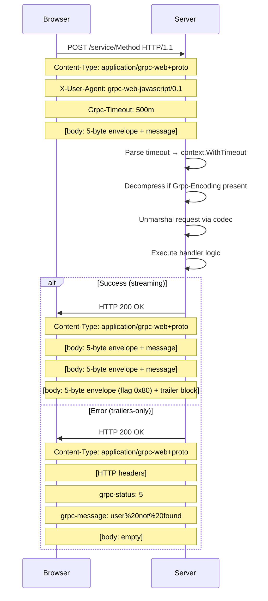

# Implementing the gRPC-Web Protocol (Native, Over HTTP/1.1)

**Reference:** `connect-go/protocol_grpc.go` (~1010 LOC), `connect-go/envelope.go` (388 LOC), `connect-go/codec.go` (260 LOC), `connect-go/error.go` (472 LOC). This document provides a complete blueprint for implementing gRPC-Web natively — not via a proxy or Envoy translation layer — following the connect-go reference implementation's approach. The key insight: gRPC-Web encodes trailers as the final envelope in the response body because HTTP/1.1 lacks native trailer support.

## Protocol Philosophy

gRPC-Web was designed to bring gRPC to browsers and HTTP/1.1 environments. Since HTTP/1.1 doesn't support native trailers, gRPC-Web encodes trailers as the final message envelope in the response body — flagged with `0x80` and containing an HTTP/1-style header block. All messages (including data and trailers) use the same 5-byte envelope framing. This makes gRPC-Web compatible with any HTTP/1.1 proxy, CDN, or load balancer, at the cost of requiring the client to parse the full response body before accessing trailers.

## Content-Type Routing

```
gRPC-Web proto:  application/grpc-web
gRPC-Web codec:  application/grpc-web+{codec}   e.g., application/grpc-web+proto, application/grpc-web+json
gRPC-Web text:   application/grpc-web-text       (base64-encoded entire body)
```

The server derives the codec name from the content type:
- If content-type is exactly `application/grpc-web` → codec is `"proto"` (implicit bare mapping)
- If content-type starts with `application/grpc-web+` → codec is `strings.TrimPrefix(contentType, "application/grpc-web+")`
- If content-type is `application/grpc-web-text` → codec is `"proto"`, body is base64-encoded

**Aha:** The `application/grpc-web-text` content type is unique to gRPC-Web. It base64-encodes the entire response body (including the trailer envelope), enabling gRPC-Web to work with HTTP/1.1 intermediaries that might corrupt binary data. The client must base64-decode the entire body before parsing envelopes.

## HTTP Method and Version

| RPC Kind | Method | HTTP Version |
|----------|--------|-------------|
| Unary | POST | HTTP/1.1 or HTTP/2 |
| Client Stream | POST | HTTP/1.1 or HTTP/2 |
| Server Stream | POST | HTTP/1.1 or HTTP/2 (requires chunked transfer or streaming) |
| Bidi Stream | POST | HTTP/2 recommended (HTTP/1.1 half-duplex limits true bidi) |

**Key advantage over gRPC:** gRPC-Web works over HTTP/1.1, making it compatible with browsers, older proxies, and CDNs that don't support HTTP/2. However, true bidirectional streaming is limited on HTTP/1.1 due to half-duplex constraints.

## Required Headers

### Client → Server

| Header | Value | Source |
|--------|-------|--------|
| `Content-Type` | `application/grpc-web` or `application/grpc-web+{codec}` | Derived from codec name |
| `User-Agent` | `connect-go/{version} ({goVersion})` or custom | `protocol_grpc.go:237` |
| `X-User-Agent` | Same as User-Agent | Only for gRPC-Web (`protocol_grpc.go:300`) |
| `Grpc-Timeout` | `<digits><unit>` | Optional — same format as gRPC |
| `Grpc-Encoding` | Compression name | Only if request is compressed |
| `Grpc-Accept-Encoding` | Comma-separated compression names | From registered pools |

**Aha:** gRPC-Web sets both `User-Agent` and `X-User-Agent` headers. The `X-User-Agent` is a legacy requirement from the original gRPC-Web spec — some gRPC-Web proxies (like Envoy) inspect this header. Even when implementing natively without a proxy, setting both headers ensures compatibility with the broader gRPC-Web ecosystem.

### Server → Client

| Header | Value | Condition |
|--------|-------|-----------|
| `Content-Type` | `application/grpc-web` or `application/grpc-web+{codec}` | Always |
| `Grpc-Encoding` | Compression name | Only if response compressed |
| `Grpc-Accept-Encoding` | Comma-separated names | Always |

Unlike gRPC over HTTP/2, gRPC-Web does NOT send trailers as HTTP headers. All trailers go in the response body.

## Envelope Framing

Every gRPC-Web message (data and trailers) uses the 5-byte envelope format:

```
+--------+--------+--------+--------+--------+
| Flags  |         Length (uint32, BE)       |
| 1 byte |           4 bytes                 |
+--------+--------+--------+--------+--------+
|              Payload (Length bytes)         |
+---------------------------------------------+
```

### Flags

| Flag | Value | Meaning |
|------|-------|---------|
| Compressed | `0x01` | Payload is compressed |
| Trailer | `0x80` | Final message containing trailers (gRPC-Web specific) |

**Aha:** The gRPC-Web trailer flag (`0x80`) is completely different from Connect's end-stream flag (`0x02`). Connect's `0x02` envelope carries a JSON object with both error and metadata. gRPC-Web's `0x80` envelope carries a raw HTTP/1-style header block (key: value lines) that must be parsed with a MIME header reader. This is the single most important difference between the two protocols.

## Streaming Server → Client Flow



## Trailer Handling: Body-Encoded

gRPC-Web encodes trailers as the final envelope in the response body:

```go
// protocol_grpc.go:579
func (m *grpcMarshaler) MarshalWebTrailers(trailer http.Header) *Error {
    // Lowercase all header keys (gRPC-Web spec requires lowercase keys)
    for key, values := range trailer {
        lower := strings.ToLower(key)
        if key != lower {
            delete(trailer, key)
            trailer[lower] = values
        }
    }
    // Write as HTTP/1 headers block (without terminating newline)
    trailer.Write(raw)
    return m.Write(&envelope{
        Data:  raw,
        Flags: grpcFlagEnvelopeTrailer,  // 0x80
    })
}
```

**Key considerations:**
1. All trailer header keys must be lowercased. This differs from gRPC over HTTP/2 which preserves canonical case.
2. The header block is written without a terminating newline (per the gRPC-Web spec).
3. The header block format is `key: value\r\n` per line, like HTTP/1 headers.

### Client-Side Parsing

```go
// protocol_grpc.go:609
func (u *grpcUnmarshaler) Unmarshal(message any) *Error {
    if !u.web || !env.IsSet(grpcFlagEnvelopeTrailer) {
        return errorf(CodeInternal, "protocol error: invalid envelope flags %d", env.Flags)
    }
    // Add newline to make it parseable by textproto
    data.WriteByte('\n')
    mimeHeader, _ := textproto.NewReader(bufio.NewReader(data)).ReadMIMEHeader()
    u.webTrailer = http.Header(mimeHeader)
}
```

**Aha:** The gRPC-Web trailer encoding adds a `'\n'` byte because `textproto.Reader.ReadMIMEHeader()` expects a blank line terminating the header block. The original trailer data doesn't include the terminating newline (per the gRPC-Web spec), so the reader must add it. Without this newline, the MIME header parser hangs waiting for the terminator.

## Trailers-Only Optimization

```go
// protocol_grpc.go:537
if hc.web && !hc.wroteToBody && len(hc.responseHeader) == 0 {
    // gRPC-Web: send trailers as HTTP headers instead of body
    mergeHeaders(hc.responseWriter.Header(), mergedTrailers)
    return nil
}
```

For gRPC-Web, if no body has been written and there are no custom response headers, trailers are sent as regular HTTP headers instead of a body envelope. This is the "trailers-only" response — useful for unary RPCs that return an error without any response body.

**Aha:** This optimization means a client must check both HTTP headers (for trailers-only) AND the response body (for body-encoded trailers) to find the `grpc-status`. A robust client implementation checks headers first, then falls back to parsing the body envelope if no status header is found.

## Error Serialization in Trailers

```go
// protocol_grpc.go:841
func grpcErrorToTrailer(trailer http.Header, protobuf Codec, err error) {
    if err == nil {
        setHeaderCanonical(trailer, grpcHeaderStatus, "0")  // OK
        return
    }
    // Merge custom metadata (unless wire error)
    if connectErr, ok := asError(err); ok && !connectErr.wireErr {
        mergeNonProtocolHeaders(trailer, connectErr.meta)
    }
    status := grpcStatusForError(err)
    code := status.GetCode()
    message := status.GetMessage()

    // Serialize details as protobuf Status
    if len(status.Details) > 0 {
        bin, _ := protobuf.Marshal(status)
        setHeaderCanonical(trailer, grpcHeaderDetails, EncodeBinaryHeader(bin))
    }
    setHeaderCanonical(trailer, grpcHeaderStatus, strconv.Itoa(int(code)))
    setHeaderCanonical(trailer, grpcHeaderMessage, grpcPercentEncode(message))
}
```

The error serialization is identical to gRPC over HTTP/2 — the same `grpc-status`, `grpc-message`, and `grpc-status-details-bin` headers are built, then encoded into the body envelope via `MarshalWebTrailers`.

## Error Parsing from Trailers (Client Side)

```go
// protocol_grpc.go:692
func grpcErrorForTrailer(protobuf Codec, trailer http.Header) *Error {
    codeHeader := getHeaderCanonical(trailer, grpcHeaderStatus)
    if codeHeader == "" {
        code := CodeInternal
        if len(trailer) == 0 { code = CodeUnknown }
        return NewError(code, errTrailersWithoutGRPCStatus)
    }
    if codeHeader == "0" { return nil }  // OK

    code, _ := strconv.ParseUint(codeHeader, 10, 32)
    message, _ := grpcPercentDecode(getHeaderCanonical(trailer, grpcHeaderMessage))
    retErr := NewWireError(Code(code), errors.New(message))

    // Parse protobuf error details from grpc-status-details-bin
    detailsBinaryEncoded := getHeaderCanonical(trailer, grpcHeaderDetails)
    if len(detailsBinaryEncoded) > 0 {
        detailsBinary, _ := DecodeBinaryHeader(detailsBinaryEncoded)
        var status statusv1.Status
        protobuf.Unmarshal(detailsBinary, &status)
        for _, d := range status.GetDetails() {
            retErr.details = append(retErr.details, &ErrorDetail{pbAny: d})
        }
        // Prefer protobuf data over header values
        retErr.code = Code(status.GetCode())
        retErr.err = errors.New(status.GetMessage())
    }
    return retErr
}
```

## Percent Encoding for Grpc-Message

```go
// protocol_grpc.go:895
func grpcPercentEncode(msg string) string {
    // Characters that need escaping: control chars (< ' ' or > '~') and '%'
    func grpcShouldEscape(char byte) bool {
        return char < ' ' || char > '~' || char == '%'
    }
    // Two-pass: count escapes first, then encode with uppercase hex
    for i := range len(msg) {
        if grpcShouldEscape(msg[i]) { hexCount++ }
    }
    // Encode with uppercase hex (A-F, not a-f)
    out.WriteByte('%')
    out.WriteByte(upperhex[char>>4])  // "0123456789ABCDEF"
    out.WriteByte(upperhex[char&15])
}
```

**Aha:** gRPC-Web uses the same custom percent-encoding as gRPC over HTTP/2. Only control characters (ASCII < 32 or > 126) and `%` itself are escaped. Hex digits use uppercase. This is shared code between the two protocols — implementing one means you already have the encoding for the other.

## Timeout Encoding

gRPC-Web uses the same timeout format as gRPC:

```
Grpc-Timeout: <digits><unit>  // max 8 digits, units: H/M/S/m/u/n
```

See the gRPC protocol implementation guide for the full parsing and encoding logic. The key difference from Connect: gRPC-Web uses the unit-suffixed format (max 8 digits), not plain milliseconds (max 10 digits).

## Compression Negotiation

gRPC-Web uses the same compression negotiation as gRPC over HTTP/2:

```go
func negotiateCompression(availableCompressors, sent, accept string) (reqComp, respComp string, err *Error) {
    requestCompression = sent
    responseCompression = requestCompression
    if responseCompression == identity && accept != "" {
        for _, name := range strings.FieldsFunc(accept, isCommaOrSpace) {
            if availableCompressors.Contains(name) {
                responseCompression = name
                break
            }
        }
    }
}
```

Both gRPC and gRPC-Web use `Grpc-Encoding` and `Grpc-Accept-Encoding` headers — not the standard HTTP `Content-Encoding`/`Accept-Encoding`.

## Response Validation

```go
// protocol_grpc.go:649
func grpcValidateResponse(response *http.Response, header http.Header,
    availableCompressors readOnlyCompressionPools, web bool, codecName string) *Error {
    if response.StatusCode != http.StatusOK {
        return errorf(httpToCode(response.StatusCode), "HTTP status %v", response.Status)
    }
    // Validate content-type matches request codec
    if err := grpcValidateResponseContentType(web, codecName, contentType); err != nil {
        return err
    }
    // Validate compression
    if compression != "" && compression != compressionIdentity &&
        !availableCompressors.Contains(compression) {
        return errorf(CodeInternal, "unknown encoding %q: accepted encodings are %v", compression, ...)
    }
}
```

gRPC-Web expects HTTP 200 for all responses, just like gRPC over HTTP/2. Non-200 indicates a transport-level failure.

## Text Mode — Base64 Body Encoding

gRPC-Web defines two content-types for the protocol: `application/grpc-web` (binary mode) and `application/grpc-web-text` (text mode). Text mode base64-encodes the **entire** response body — all data envelopes plus the final trailer envelope — so that the payload survives HTTP/1.1 intermediaries and browser character-encoding pipelines that would otherwise corrupt arbitrary binary bytes.

### When Text Mode Is Used

Text mode is selected when the client sets the request `Content-Type` to `application/grpc-web-text` (or `application/grpc-web-text+proto` for explicit proto codec). The server detects this during content-type routing and responds in the same mode:

```go
// protocol_grpc.go:44-47 — content-type constants
const (
    grpcWebContentTypeDefault = "application/grpc-web"
    grpcWebContentTypePrefix  = grpcWebContentTypeDefault + "+"
    // application/grpc-web-text is handled by the Marshaler wrapper layer
)
```

The server derives the codec name from the content-type. For `application/grpc-web-text`, the codec is `"proto"` (implicit), and a flag signals that the body must be base64-encoded on write and base64-decoded on read.

**Content-type matching matrix:**

| Request Content-Type | Codec | Body Encoding |
|---|---|---|
| `application/grpc-web` | proto (implicit) | Binary |
| `application/grpc-web+proto` | proto | Binary |
| `application/grpc-web+json` | json | Binary |
| `application/grpc-web-text` | proto | Base64 (text mode) |
| `application/grpc-web-text+proto` | proto | Base64 (text mode) |

**Aha:** Text mode is **only** valid with the proto codec. `application/grpc-web-text+json` is rejected because JSON messages are already ASCII-safe — there is no scenario where base64-encoding JSON inside gRPC-Web text mode is necessary. The content-type itself carries the encoding directive, eliminating the need for a separate header flag like `Transfer-Encoding: base64`. This is a deliberate design choice: the content-type is the single source of truth for how to interpret the body, and HTTP/1.1 intermediaries already route based on content-type.

### How It Works

In text mode, the encoding pipeline is:

1. **Marshal** each message to binary bytes (via the proto codec).
2. **Frame** each message into a 5-byte envelope (`[flags][length:4][payload]`).
3. **Concatenate** all envelope frames (data + final trailer frame with `0x80` flag) into a single binary body.
4. **Base64-encode** the entire binary body using standard base64 (`RFC 4648`), **without padding**.
5. Write the resulting ASCII string as the HTTP response body.

The decoding pipeline reverses this:

1. Read the HTTP response body as a text string (not binary).
2. **Base64-decode** the string back into binary bytes.
3. Parse the binary envelope frames normally (5-byte prefix + payload).
4. The final envelope with flag `0x80` contains the trailer header block.

```
Binary body (before base64):
+--------+--------+--------+--------+--------+   +--------+--------+---+
| 0x00   |  L1    |  msg1 payload (L1 bytes)  |...| 0x80   |  Lt   | trailers |
+--------+--------+--------+--------+--------+   +--------+--------+---+
  data envelope(s)                                trailer envelope

Text mode body (after base64, written to HTTP):
AAAA...base64 of all envelopes above...XYZ=    (standard base64, no padding)
```

### Marshaler / Unmarshaler Architecture

In the connect-go reference implementation, the `grpcMarshaler` and `grpcUnmarshaler` types wrap the base64 encoder/decoder around the binary envelope reader/writer:

```go
// protocol_grpc.go:575-600 — grpcMarshaler wraps envelopeWriter
type grpcMarshaler struct {
    envelopeWriter
}

func (m *grpcMarshaler) MarshalWebTrailers(trailer http.Header) *Error {
    raw := m.bufferPool.Get()
    defer m.bufferPool.Put(raw)
    // Lowercase all header keys (gRPC-Web spec requires lowercase keys)
    for key, values := range trailer {
        lower := strings.ToLower(key)
        if key != lower {
            delete(trailer, key)
            trailer[lower] = values
        }
    }
    // Write as HTTP/1 headers block (without terminating newline)
    trailer.Write(raw)
    return m.Write(&envelope{
        Data:  raw,
        Flags: grpcFlagEnvelopeTrailer,  // 0x80
    })
}
```

For text mode, the `grpcMarshaler`'s underlying `envelopeWriter` is wrapped so that its `sender` (the `io.Writer` that writes to the HTTP response) is itself wrapped in a `base64.NewEncoder(base64.StdEncoding, underlyingWriter)`. Every call to `m.Write(env)` writes binary envelope bytes into the base64 encoder, which emits ASCII characters to the underlying response writer. The encoder is flushed and closed when the stream ends.

```go
// Conceptual: text mode marshaler construction (from reference impl)
textWriter := base64.NewEncoder(base64.StdEncoding, responseWriter)
marshaler := grpcMarshaler{
    envelopeWriter: envelopeWriter{
        sender: writeSender{writer: textWriter},
        // ... codec, compression, etc.
    },
}
// When stream ends: textWriter.Close() to flush final base64 chunk
```

Similarly, on the read path, the `grpcUnmarshaler`'s underlying reader is wrapped in a `base64.NewDecoder(base64.StdEncoding, responseBody)`:

```go
// Conceptual: text mode unmarshaler construction (from reference impl)
textReader := base64.NewDecoder(base64.StdEncoding, responseBody)
unmarshaler := grpcUnmarshaler{
    envelopeReader: envelopeReader{
        reader: textReader,
        // ... codec, buffer pool, etc.
    },
    web: true,
}
// EnvelopeReader.Read() reads binary frames from textReader,
// which transparently decodes base64 on each read.
```

**Aha:** The base64 encoding is transparent to the envelope framing layer. The `envelopeWriter` and `envelopeReader` operate on binary bytes exactly the same way regardless of text mode. The only difference is that the `io.Writer`/`io.Reader` passed to them happens to be a base64 encoder/decoder. This is a clean separation of concerns: envelope framing, message serialization, and transport encoding are three independent layers.

### Base64 Encoding Details

The gRPC-Web text mode uses **standard base64** (`RFC 4648 Section 4`), not URL-safe base64:

```go
// header.go:48-54 — binary headers use RawStdEncoding (no padding)
func EncodeBinaryHeader(data []byte) string {
    return base64.RawStdEncoding.EncodeToString(data)  // unpadded
}

// header.go:64-71 — DecodeBinaryHeader handles both padded and unpadded
func DecodeBinaryHeader(data string) ([]byte, error) {
    if len(data)%4 != 0 {
        return base64.RawStdEncoding.DecodeString(data)  // unpadded
    }
    return base64.StdEncoding.DecodeString(data)  // padded
}
```

Key properties:
- **Alphabet**: `ABCDEFGHIJKLMNOPQRSTUVWXYZabcdefghijklmnopqrstuvwxyz0123456789+/` (standard, not URL-safe)
- **Padding**: By default, gRPC-Web text mode omits padding (`=` characters). This is consistent with the gRPC convention that binary headers use `RawStdEncoding` (no padding). However, decoders should accept both padded and unpadded input for interoperability.
- **Line breaks**: No line breaks are inserted. The entire body is one continuous base64 string. This differs from MIME base64 which inserts `\r\n` every 76 characters.
- **Streaming**: The base64 encoder processes bytes incrementally. Each `Write(env)` call pushes binary envelope bytes through the encoder, which emits base64 characters immediately. This enables streaming responses — the client can begin decoding and parsing envelopes before the full response arrives.

### Server-Side Text Mode Detection

The server detects text mode from the request content-type. In the Rust reference implementation:

```rust
// protocol.rs:101-112 — text mode detection in Rust
if let Some(rest) = content_type.strip_prefix("application/grpc-web-text") {
    // Text mode is only meaningful for binary proto — reject +json
    let codec_format = match rest {
        "" | "+proto" => CodecFormat::Proto,
        _ => return None,  // application/grpc-web-text+json is invalid
    };
    return Some(RequestProtocol {
        protocol: Protocol::GrpcWeb,
        codec_format,
        is_streaming: true,
        is_text_mode: true,
    });
}
```

The server then configures its response writer to base64-encode the body. If the server does not support text mode, it should return a clear error (e.g., `CodeUnimplemented`) rather than attempting to process garbage envelope frames.

```rust
// service.rs:1382-1397 — server rejects unsupported text mode
if rp.is_text_mode {
    let err = ConnectError::unimplemented(
        "gRPC-Web text mode (application/grpc-web-text) is not supported",
    );
    // Drain the body to preserve HTTP/1.1 keep-alive for the error response.
    let (_parts, body) = req.into_parts();
    let limited = http_body_util::Limited::new(body, limits.max_request_body_size);
    let _ = limited.collect().await;
    let response = grpc_error_response(&err, Protocol::GrpcWeb, rp.codec_format);
    return Ok(response.map(ConnectRpcBody::Streaming));
}
```

**Key rule**: The server responds in the same mode the client requested. If the client sends `application/grpc-web-text`, the server responds with `application/grpc-web-text` (or `application/grpc-web-text+proto`) and base64-encodes the body. The response content-type echoes the request's content-type to signal the encoding mode back to the client.

### Browser Compatibility

Text mode exists to solve a specific browser limitation. In browsers, the `XMLHttpRequest` API (XHR) is the traditional way to make HTTP requests. XHR supports two response types:

| `responseType` | Behavior | Problem for gRPC-Web |
|---|---|---|
| `"arraybuffer"` / `"blob"` | Returns raw bytes | Not available in older browsers; some proxies strip `Content-Type` on binary responses |
| `"text"` | Returns a string decoded as the response charset | Binary bytes may be corrupted during character encoding |

When `responseType = "text"`, the browser interprets the response body as text in the response's character encoding (typically UTF-8 or ISO-8859-1). Arbitrary binary bytes — like the 5-byte envelope prefix `0x00 0x00 0x00 0x00 0x05` — may be:

- **Mangled** by character encoding conversion (e.g., UTF-8 interpretation of high bytes).
- **Stripped** as invalid sequences.
- **Normalized** by intermediate proxies that treat the body as text.

Base64 encoding ensures every byte in the body is an ASCII character that survives any character encoding pipeline intact. The client receives a valid ASCII string, base64-decodes it, and recovers the original binary envelopes.

**Aha:** Text mode exists because browser XHR cannot reliably handle binary responses with arbitrary content-types. Modern browsers support `responseType = "arraybuffer"` via the `fetch` API, which eliminates the need for text mode. However, the `application/grpc-web-text` content-type persists for backward compatibility with legacy gRPC-Web clients (like the original `grpc/grpc-web` JavaScript library) and environments where XHR is still the primary HTTP transport. New implementations using `fetch` with `responseType = "arraybuffer"` should prefer `application/grpc-web` (binary mode) to avoid the 33% overhead.

### Performance Trade-Off

Base64 encoding adds approximately **33% overhead** to the body size. For a 100 KB binary response, the text-mode body is approximately 133 KB of ASCII text. This overhead manifests in three ways:

1. **Network transfer**: 33% more bytes on the wire, increasing latency and bandwidth usage.
2. **CPU**: Base64 encoding and decoding require CPU cycles proportional to the body size.
3. **Memory**: The client must hold the entire base64 string in memory before decoding (for non-streaming XHR), whereas binary mode can stream envelope frames incrementally.

| Mode | Content-Type | Overhead | Use Case |
|---|---|---|---|
| Binary | `application/grpc-web` | 0% | Non-browser clients, `fetch` with `arraybuffer`, server-to-server over HTTP/1.1 |
| Text | `application/grpc-web-text` | ~33% | Legacy XHR-based browser clients, environments where binary bodies are corrupted |

**Recommendation**: Use binary mode (`application/grpc-web`) for all new implementations. Text mode is a legacy compatibility feature. Modern browsers (Chrome, Firefox, Safari, Edge) all support `fetch` with binary response types, making text mode unnecessary for new browser clients. For server-to-server communication over HTTP/1.1, binary mode is always preferred since there is no character encoding pipeline to corrupt the data.

## Client Request Flow (Browser Compatible)



## Compatibility Validation Checklist

1. **Content-Type**: Server must return `application/grpc-web` or `application/grpc-web+{codec}` matching the request codec. Bare `application/grpc-web` maps to proto.
2. **HTTP Status**: All responses must be HTTP 200. Non-200 indicates transport-level failure.
3. **Trailers in body**: Response must end with an envelope flagged `0x80` containing the trailer header block. Exception: trailers-only responses send trailers as HTTP headers.
4. **Trailer header keys**: Must be lowercased in the body envelope (gRPC-Web spec requirement).
5. **Trailer parsing**: Client must add `'\n'` before parsing with `textproto.Reader.ReadMIMEHeader()`.
6. **grpc-status**: Must always be present (either in HTTP headers for trailers-only, or in body envelope). Missing → `CodeInternal`.
7. **grpc-message encoding**: Must use custom percent-encoding (control chars + `%`, uppercase hex).
8. **grpc-status-details-bin**: Must be base64-encoded protobuf `google.rpc.Status` message.
9. **X-User-Agent**: Client should set both `User-Agent` and `X-User-Agent` for ecosystem compatibility.
10. **Timeout format**: Must be `<digits><unit>` with max 8 digits. Units: H/M/S/m/u/n.
11. **Compression headers**: Must use `Grpc-Encoding`/`Grpc-Accept-Encoding`, not standard HTTP headers.
12. **Flush**: Server must flush after each streaming message (`http.Flusher`).
13. **Text mode**: When content-type is `application/grpc-web-text`, the entire body must be base64-encoded.
14. **HTTP/1.1 compatibility**: Must work without HTTP/2 features (no native trailers, no multiplexing).

## Conformance Testing

The Go implementation includes a conformance test harness (`conformance/` directory) that exercises:
- All three protocols (Connect, gRPC, gRPC-Web)
- All four RPC kinds (unary, client stream, server stream, bidi)
- All error codes
- Compression (gzip)
- Timeout/deadline semantics
- Cancellation

An implementation should pass the connectrpc/conformance test suite to claim compatibility.
