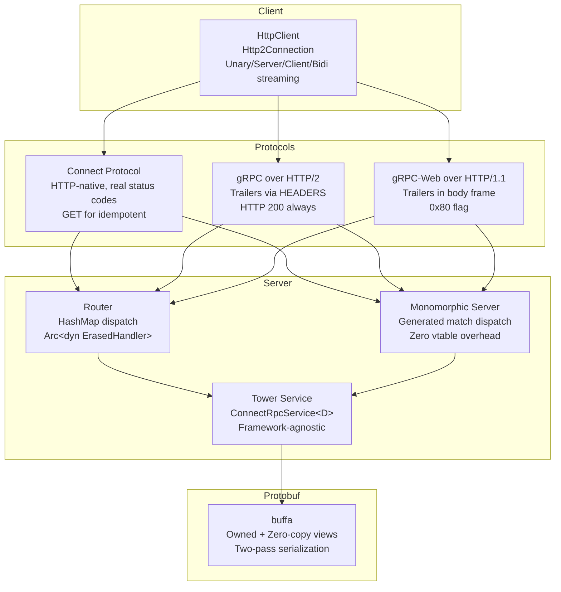
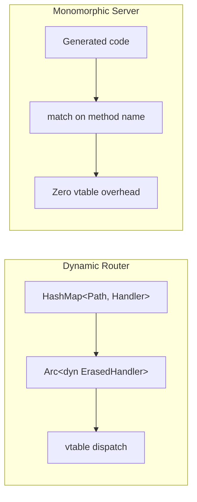

# connect-rust — Overview

**Source:** 4 workspace crates, 182 Rust files. Tower-based ConnectRPC implementation, MSRV 1.88 (2024 edition).

`connectrpc` is a Tower-based ConnectRPC implementation for Rust that supports three wire protocols: Connect (HTTP-native), gRPC over HTTP/2, and gRPC-Web over HTTP/1.1+. It uses the `buffa` protobuf library for zero-copy message views and the `quote` crate for code generation.

## Architecture



## Workspace Structure

| Crate | Path | Purpose | LOC |
|-------|------|---------|-----|
| **connectrpc** | `connectrpc/` | Main runtime: server, client, codec, compression, protocol | ~5000 |
| **connectrpc-build** | `connectrpc-build/` | `build.rs` integration, protoc/buf invocation | ~945 |
| **connectrpc-codegen** | `connectrpc-codegen/` | Code generation: service traits, servers, clients | ~3038 |
| **conformance** | `conformance/` | Protocol conformance test harness | ~3000 |

## Three Wire Protocols

```rust
// connectrpc/src/protocol.rs
pub enum Protocol {
    Connect,     // HTTP-native with real status codes
    Grpc,        // gRPC over HTTP/2 (trailers via HEADERS)
    GrpcWeb,     // gRPC-Web over HTTP/1.1+ (trailers in body)
}
```

**Aha:** All three protocols share the same handler code — only the request parsing and response formatting differ. This is the key abstraction: handlers work with typed request/response types, and the protocol layer handles wire format differences.

### Protocol Detection

```rust
// connectrpc/src/protocol.rs
pub enum RequestProtocol {
    Connect,
    Grpc,
    GrpcWeb,
}

// Detected from Content-Type header:
// "application/{package}.{Service}/Method" → Connect
// "application/grpc" → gRPC
// "application/grpc-web" → gRPC-Web
```

## Dual Dispatch Strategy



- **Dynamic `Router`**: HashMap lookup with `Arc<dyn ErasedHandler>` vtable dispatch. Flexible, composable, used for multi-service routing.
- **Monomorphic `FooServiceServer<T>`**: Generated code with compile-time `match` on method name. No vtable/hash overhead.

## Key Dependencies

| Dependency | Purpose |
|------------|---------|
| `tokio` | Async runtime |
| `tower` / `tower-http` | Service abstraction, middleware |
| `axum` / `hyper` / `hyper-util` | HTTP server framework |
| `http` / `http-body` / `http-body-util` | HTTP types |
| `buffa` | Protocol Buffers (zero-copy views) |
| `flate2` / `zstd` / `async-compression` | Compression (gzip, zstd) |
| `hyper-rustls` | HTTPS client |
| `rustls` | TLS support |
| `tracing` | Logging/tracing |
| `pin-project` | Pin projections |
| `serde` / `serde_json` | JSON codec |

## Features

| Feature | Purpose |
|---------|---------|
| `server` | Standalone hyper server |
| `axum` | Axum integration |
| `json` | JSON codec support |
| `compression` | Gzip/Zstd compression |
| `tls` | TLS support |

## Response Design — Zero-Copy Handlers

```rust
// Handlers receive OwnedView<RequestView<'static>>
// String fields are &str pointing into the request buffer
// Response types implement Encodable trait:
// - Owned messages (alloc)
// - Borrowed views (zero-copy)
// - MaybeBorrowed (conditional)
// - PreEncoded (pre-encoded bytes for streaming)
```

**Aha:** Handlers receive `OwnedView<RequestView<'static>>` — the request's string fields are `&str` pointing directly into the request buffer, not allocated `String`s. This means deserialization of the request body is zero-copy for string fields. The `Encodable` trait allows handlers to return various types: owned messages, borrowing views, or pre-encoded bytes for streaming (skipping per-message encoding).
