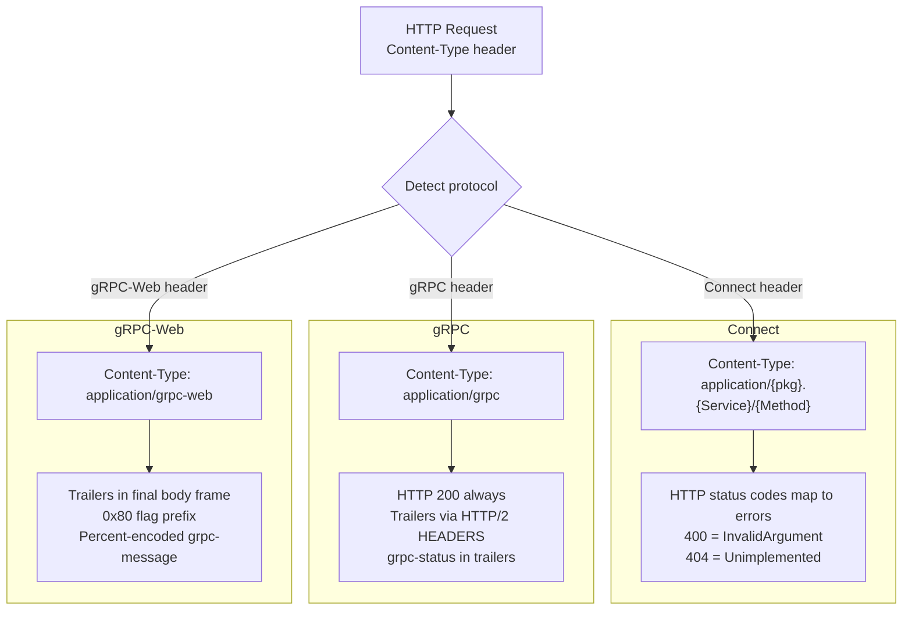

# connect-rust — Server and Dispatch

**Source:** `connectrpc/src/service.rs` (~3000 LOC), `connectrpc/src/router.rs` (498 LOC), `connectrpc/src/handler.rs`, `connectrpc/src/dispatcher.rs`. Tower service architecture with dynamic and monomorphic dispatch.

## Tower Service — Framework Agnostic

```rust
// connectrpc/src/service.rs
pub struct ConnectRpcService<D> {
    dispatcher: D,
}

impl<D> Service<Request<Incoming>> for ConnectRpcService<D> {
    type Response = Response<BoxBody<Bytes, ConnectError>>;
    type Error = Infallible;
    type Future = ...;

    fn call(&self, req: Request<Incoming>) -> Self::Future {
        // 1. Detect protocol from Content-Type
        // 2. Parse request body per protocol
        // 3. Dispatch to handler
        // 4. Format response per protocol
    }
}
```

**Aha:** `ConnectRpcService<D>` implements `tower::Service<Request<Incoming>>`, making it framework-agnostic. It works with Axum, Hyper, or any Tower-compatible framework. Any Tower layer composes on top: `TraceLayer`, auth middleware, `TimeoutLayer`. The dispatcher `D` can be either the dynamic `Router` or a monomorphic generated server.

## Protocol Detection



## Dynamic Router — HashMap Dispatch

```rust
// connectrpc/src/router.rs:498
pub struct Router {
    routes: HashMap<String, Arc<dyn ErasedHandler>>,
}

impl Router {
    pub fn add<H: Handler>(self, path: impl Into<String>, handler: H) -> Self {
        self.routes.insert(path.into(), Arc::new(handler));
        self
    }

    pub fn merge_routers(self, other: Router) -> Self {
        // Combine route maps from multiple routers
    }
}
```

### ErasedHandler — Type Erasure

```rust
// connectrpc/src/dispatcher.rs
pub trait ErasedHandler: Send + Sync + 'static {
    fn handle(
        &self,
        method_name: &str,
        protocol: Protocol,
        request: Request<Incoming>,
    ) -> impl Future<Output = Response<BoxBody<Bytes, ConnectError>>>;
}
```

**Aha:** The `ErasedHandler` trait erases the concrete handler type, allowing multiple handlers for different services to coexist in a single `HashMap`. The tradeoff is vtable dispatch — every call goes through a dynamic dispatch. For multi-service servers, this is negligible. For latency-sensitive single-service deployments, the monomorphic dispatcher is better.

## Monomorphic Server — Generated Code

```rust
// Generated by connectrpc-codegen for a service "Greeter"
pub struct GreeterServiceServer<T: GreeterService> {
    inner: T,
}

impl<T: GreeterService> ConnectRpcService<...> for GreeterServiceServer<T> {
    fn handle(&self, method: &str, request: Request) -> Response {
        match method {
            "SayHello" => self.inner.say_hello(request),
            "StreamGreet" => self.inner.stream_greet(request),
            _ => Err(ConnectError::unimplemented()),
        }
    }
}
```

**Aha:** The generated monomorphic server uses a `match` on method name instead of a HashMap lookup. This eliminates both the hash computation and the vtable dispatch — the compiler can inline the handler directly. For hot-path services, this can save microseconds per request.

## Handler Traits

```rust
// connectrpc/src/handler.rs
// Traits for all 4 RPC kinds:
// - UnaryHandler
// - ServerStreamHandler
// - ClientStreamHandler
// - BidiStreamHandler
//
// Plus view variants:
// - UnaryViewHandler
// - ServerStreamViewHandler
// - etc.
```

Each RPC kind has its own handler trait with the appropriate input/output types:

| Handler | Input | Output |
|---------|-------|--------|
| `UnaryHandler` | `OwnedView<RequestView>` | `impl Encodable<Res>` |
| `ServerStreamHandler` | `OwnedView<RequestView>` | `ServerStream<impl Encodable<Res>>` |
| `ClientStreamHandler` | `ClientStream<ReqView>` | `impl Encodable<Res>` |
| `BidiStreamHandler` | `BidiStream<ReqView>` | `BidiStream<impl Encodable<Res>>` |

## RequestContext — Extension Data

```rust
// connectrpc/src/response.rs
pub struct RequestContext {
    extensions: Extensions,  // http::Extensions
    // Protocol-specific context
}
```

**Aha:** `RequestContext::extensions` uses `http::Extensions` — the same mechanism Axum uses for middleware-to-handler data passthrough. A Tower layer can insert auth info, tracing spans, or request IDs into extensions, and handlers can extract them. This is how auth middleware passes user identity to handlers without changing the handler signature.

## Error Handling

```rust
// connectrpc/src/error.rs
pub struct ConnectError {
    code: ErrorCode,
    message: String,
    metadata: Metadata,
}

// connectrpc/src/error.rs:16 canonical error codes
pub enum ErrorCode {
    Cancelled,
    Unknown,
    InvalidArgument,
    DeadlineExceeded,
    NotFound,
    AlreadyExists,
    PermissionDenied,
    ResourceExhausted,
    FailedPrecondition,
    Aborted,
    OutOfRange,
    Unimplemented,
    Internal,
    Unavailable,
    DataLoss,
    Unauthenticated,
}
```

HTTP status codes are mapped to Connect error codes:

| HTTP Status | Connect Error |
|-------------|--------------|
| 400 | InvalidArgument |
| 401 | Unauthenticated |
| 403 | PermissionDenied |
| 404 | NotFound |
| 409 | Aborted |
| 429 | Unavailable |
| 500 | Internal |
| 501 | Unimplemented |
| 503 | Unavailable |

## HTTP/1.1 Body Draining

```rust
// connectrpc/src/service.rs
const MAX_DRAIN_BYTES: usize = 1_048_576; // 1 MiB

// Background spawn_body_reader tasks continue consuming body bytes
// after the decoder finishes, essential for HTTP/1.1 connection reuse.
```

**Aha:** On HTTP/1.1, if a handler doesn't consume the full request body (e.g., it errors early), the connection can't be reused because unread bytes would be interpreted as the next request. `spawn_body_reader` spawns a background task that drains up to 1 MiB of remaining body bytes, enabling connection reuse even when handlers error early.

## Protocol Encoding — Envelope Framing

```rust
// connectrpc/src/envelope.rs
// 5-byte envelope framing:
// Byte 0: flags (0x00 = message, 0x01 = compressed)
// Bytes 1-4: big-endian message length

// For gRPC-Web, trailers are encoded as a final frame with flag 0x80
```
