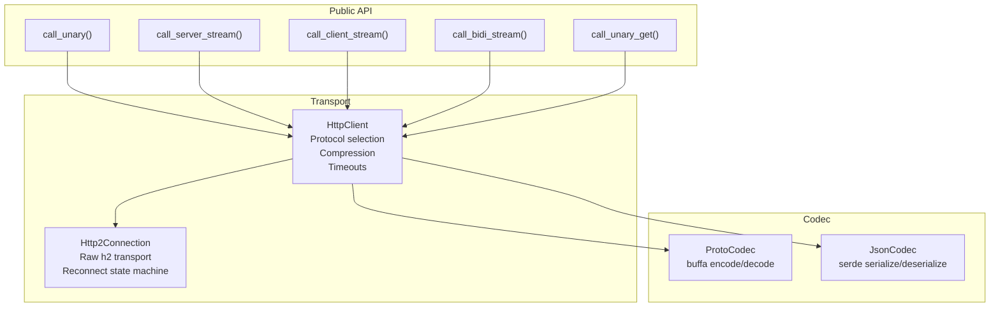

# connect-rust — Client and Streaming

**Source:** `connectrpc/src/client/mod.rs` (~2400 LOC), `connectrpc/src/client/http2.rs` (1103 LOC). HTTP client with honest `poll_ready`, reconnection, and all four streaming RPC kinds.

## Client Architecture



## HttpClient — High-Level Client

```rust
// connectrpc/src/client/mod.rs
pub struct HttpClient {
    config: ClientConfig,
    // Connection pool
    // Protocol preference
    // Compression settings
}

impl HttpClient {
    pub fn unary<Req, Res>(
        &self,
        url: &str,
        request: Req,
        options: Option<CallOptions>,
    ) -> impl Future<Output = Result<Response<Res>>>;

    pub fn server_stream<Req, Res>(...) -> ServerStream<Res>;
    pub fn client_stream<Req, Res>(...) -> ...;
    pub fn bidi_stream<Req, Res>(...) -> BidiStream<Req, Res>;
}
```

### CallOptions — Per-Request Configuration

```rust
pub struct CallOptions {
    headers: HeaderMap,        // Additional headers
    timeout: Option<Duration>, // Request timeout
    compression: Option<CompressionProvider>,
}
```

## Http2Connection — Honest poll_ready

```rust
// connectrpc/src/client/http2.rs:1103
pub struct Http2Connection {
    // Raw h2 connection
    // Stream management
}

// Reconnect state machine
enum ReconnectState {
    Idle,
    Connecting,
    Connected,
}
```

**Aha:** `Http2Connection` wraps a `Reconnect` state machine (`Idle` → `Connecting` → `Connected`) so `poll_ready` reflects real connection state, unlike hyper's pool which is always `Ready`. This enables proper load balancing via `tower::balance::p2c::Balance` — the balancer can query readiness and route to healthy connections.

### SharedHttp2Connection

```rust
// connectrpc/src/client/http2.rs
pub struct SharedHttp2Connection {
    // Arc<Mutex<Http2Connection>>
    // Shared across multiple streams
}
```

For scenarios where multiple RPC calls should share a single HTTP/2 connection (multiplexing), `SharedHttp2Connection` wraps the connection in shared state.

## Streaming Types

### ServerStream — Server Sends Multiple

```rust
// connectrpc/src/client/mod.rs
pub struct ServerStream<T> {
    // Decoded messages from response body
    // Implements Stream<Item = Result<T>>
}
```

Usage:
```rust
let mut stream = client.call_server_stream("...", request, None).await?;
while let Some(message) = stream.next().await {
    println!("Got: {:?}", message?);
}
```

### ClientStream — Client Sends Multiple

```rust
pub struct ClientStream<T> {
    // Send messages to server
    send: Sender<T>,
    // Response received after closing send side
    response: ResponseFuture<Res>,
}
```

Usage:
```rust
let mut stream = client.call_client_stream("...", None).await?;
stream.send(message1).await?;
stream.send(message2).await?;
stream.close().await?;  // Must close to get response
let response = stream.into_response().await?;
```

### BidiStream — Bidirectional

```rust
pub struct BidiStream<Req, Res> {
    // Send and receive concurrently
    send: Sender<Req>,
    recv: Receiver<Result<Res>>,
}
```

Usage:
```rust
let mut stream = client.call_bidi_stream("...", None).await?;
// Send and receive concurrently
tokio::select! {
    _ = stream.send(req) => {},
    Some(res) = stream.next() => { println!("Got: {:?}", res?); },
}
```

## call_unary_get — GET for Idempotent Requests

```rust
// connectrpc/src/client/mod.rs
pub fn call_unary_get<Res>(...) -> impl Future<Output = Result<Response<Res>>>;
```

**Aha:** The Connect protocol supports GET requests for idempotent operations — the request message is serialized and passed as URL query parameters (base64-encoded). This enables CDN caching, browser bookmarking, and firewall friendliness for read-only RPCs. The `call_unary_get` method automatically serializes the request into a GET query string.

## Codec System

```rust
// connectrpc/src/codec/
pub enum CodecFormat {
    Proto,  // Protobuf binary
    Json,   // JSON serialization
}

pub trait Codec {
    fn encode<T: Message>(&self, message: &T) -> Result<Bytes>;
    fn decode<T: Message>(&self, bytes: Bytes) -> Result<T>;
}

pub struct ProtoCodec;  // Uses buffa encode/decode
pub struct JsonCodec;   // Uses serde_json
```

## Compression

```rust
// connectrpc/src/compression/
pub trait CompressionProvider {
    fn name(&self) -> &'static str;
    fn compress(&self, data: Bytes) -> Result<Bytes>;
    fn decompress(&self, data: Bytes) -> Result<Bytes>;
}

pub struct GzipProvider;
pub struct ZstdProvider;
```

Streaming compression via `async-compression` — data is compressed/decompressed as it flows through the stream, not buffered entirely in memory.

## TLS Support

```rust
// connectrpc/src/axum/
pub async fn serve_tls(listener: TcpListener, service: S, cert: Cert, key: Key) -> Result<()>;
```

**Aha:** The `connectrpc::axum::serve_tls` function is a drop-in replacement for `axum::serve` that adds TLS support. It uses `rustls` for the TLS handshake and `hyper-rustls` for the HTTPS client. Certificate SAN (Subject Alternative Name) identity is extracted and made available to handlers for mTLS authentication.

## Half-Duplex Deadlock Prevention

**Aha:** The client implementation handles the half-duplex deadlock regression — a case where 40 sends happen before the first read. The client uses separate sender/receiver channels and spawns a background body reader to prevent deadlocks when the sender fills the HTTP/2 flow control window before the receiver starts draining.

## Conformance Testing

```rust
// conformance/src/bin/client.rs (1726 lines)
// Exercises all library call functions:
// - call_unary
// - call_server_stream
// - call_client_stream
// - call_bidi_stream
// - Cancel/timeout semantics
// - All three protocols

// conformance/src/bin/server.rs (1227 lines)
// Implements ConformanceService with all RPC kinds
// Tested against connectrpc/conformance test suite
```

The conformance test harness verifies protocol compliance across all three wire protocols and all four RPC kinds, including edge cases like cancellation, deadline exceeded, and compression mismatches.
