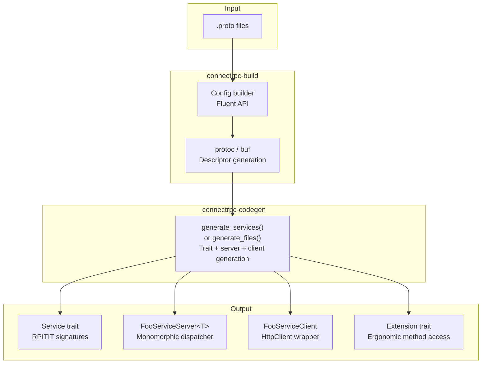

# connect-rust — Code Generation and Build Integration

**Source:** `connectrpc-codegen/src/` (~3038 LOC), `connectrpc-build/src/` (945 LOC). Code generation from protobuf descriptors to Rust service traits, servers, and clients.

## Code Generation Pipeline



## connectrpc-build — Build Integration

```rust
// connectrpc-build/src/lib.rs:945
pub struct Config {
    // Service codegen mode (unified vs split)
    // file_per_package layout
    // strict_utf8_mapping
    // emit_register_fn
    // External path mappings
    // Buffa integration config
}

impl Config {
    pub fn new() -> Self;
    pub fn file_per_package(mut self) -> Self;
    pub fn strict_utf8_mapping(mut self, enabled: bool) -> Self;
    pub fn emit_register_fn(mut self, enabled: bool) -> Self;
    pub fn extern_path(mut self, proto_path: &str, rust_path: &str) -> Self;

    pub fn compile(&self, protos: &[impl AsRef<Path>], includes: &[impl AsRef<Path>]) -> Result<()>;
}
```

### Code Generation Modes

1. **Unified** (`generate_files`): Messages + services in same module tree, `super::`-relative paths, `buffa_codegen::apply_companions()` wiring `.__connect.rs` files.
2. **Split** (`generate_services`): Services only, absolute paths via `extern_path`.
3. **`file_per_package`**: Collapses per-proto split into single `<dotted.pkg>.rs` per package (BSR/tonic convention). In `connectrpc-build`, inlines service stubs into buffa's output.

**Aha:** The `file_per_package` mode matches the BSR/tonic convention — one Rust file per protobuf package, not one per `.proto` file. This reduces file count and makes imports cleaner (`mod my_package` instead of `mod my_package::{service1, service2, ...}`).

## connectrpc-codegen — Service Generation

```rust
// connectrpc-codegen/src/codegen.rs:3038
pub fn generate_files(...) -> Result<Vec<GeneratedFile>>;
pub fn generate_services(...) -> Result<Vec<GeneratedFile>>;
```

### Generated Service Trait

```rust
// Generated output
#[trait_variant::make(Send)]
pub trait GreeterService {
    async fn say_hello(
        &self,
        request: OwnedView<SayHelloRequestView<'static>>,
    ) -> Result<SayHelloResponse, ConnectError>;

    async fn stream_greet(
        &self,
        request: OwnedView<StreamGreetRequestView<'static>>,
    ) -> Result<ServerStream<StreamGreetResponse>, ConnectError>;
}
```

**Aha:** Service traits use `#[trait_variant::make(Send)]` — the RPITIT (Return Position Impl Trait In Trait) pattern. This allows async methods in traits without boxing, using the `trait_variant` crate to generate both `Send` and non-`Send` variants.

### Generated Server

```rust
// Generated output
pub struct GreeterServiceServer<T: GreeterService> {
    inner: T,
}

impl<T: GreeterService> GreeterServiceServer<T> {
    pub fn new(inner: T) -> Self { ... }
}

impl<D> ConnectRpcService<D> for GreeterServiceServer<T> {
    // match-based dispatch on method name
}
```

### Generated Client

```rust
// Generated output
pub struct GreeterServiceClient {
    client: HttpClient,
    base_url: String,
}

impl GreeterServiceClient {
    pub fn new(client: HttpClient, base_url: String) -> Self { ... }

    pub async fn say_hello(
        &self,
        request: impl Into<SayHelloRequest>,
        options: Option<CallOptions>,
    ) -> Result<Response<SayHelloResponse>> {
        self.client.unary(
            &format!("{}/example.Greeter/SayHello", self.base_url),
            request.into(),
            options,
        ).await
    }
}
```

### Extension Trait

```rust
// Generated output — ergonomic method access on Server/Client types
pub trait GreeterServiceExt {
    fn say_hello(&self, ...) -> ...;
    fn stream_greet(&self, ...) -> ...;
}
```

## Alias Collision Detection

```rust
// connectrpc-codegen/src/codegen.rs
// Issue #75: detects when generated type names would collide
// e.g., two messages named "Status" in different packages
// Generates unique names with package prefixes
```

**Aha:** The codegen detects alias collisions at build time rather than producing compile errors. When two proto messages share the same name across packages, it generates unique names with package prefixes (e.g., `example_Status` vs `admin_Status`).

## Keyword Escaping

Proto field names that match Rust keywords are escaped with `r#`:

```protobuf
// Input
message Config {
    int32 type = 1;
}
```

```rust
// Generated output
pub struct Config {
    pub r#type: i32,
}
```

## Doc Comment Extraction

```rust
// connectrpc-codegen/src/codegen.rs
// Extracts doc comments from protobuf SourceCodeInfo
// Generated Rust types include /// comments from .proto files
```

Proto comments become Rust doc comments:

```protobuf
// Input
message Person {
    // The person's name
    string name = 1;
}
```

```rust
// Generated output
pub struct Person {
    /// The person's name
    pub name: String,
}
```

## Method Collision Checking

The codegen validates that service method names don't collide:

```rust
// connectrpc-codegen/src/codegen.rs
// Checks for duplicate method names within a service
// Reports error at build time instead of generating invalid code
```

## protoc-gen-connect-rust — Protoc Plugin

```rust
// connectrpc-codegen/src/bin/protoc-gen-connect-rust.rs:71
fn main() {
    // Read CodeGeneratorRequest from stdin
    let req = CodeGeneratorRequest::decode(&mut stdin);

    // Generate service code using connectrpc-codegen
    let files = generate_services(&req.proto_file, &config);

    // Write CodeGeneratorResponse to stdout
    let resp = CodeGeneratorResponse { file: files };
    resp.encode(&mut stdout);
}
```

## Integration with Buffa

```rust
// connectrpc-build integrates with buffa-build:
// 1. buffa-build generates message types (owned + views)
// 2. connectrpc-build generates service code
// 3. Services reference buffa-generated types
// 4. Unified mode wires companions via buffa_codegen::apply_companions()
```

**Aha:** The codegen leverages buffa's zero-copy views — service handlers receive `OwnedView<RequestView<'static>>`, not `Request`. This means string fields in the request body are `&str` pointing into the buffer, not allocated `String`s. The codegen generates both the view-based handler signatures and the owned type constructors.

## Example: build.rs

```rust
// build.rs
use connectrpc_build;

fn main() {
    connectrpc_build::Config::new()
        .file_per_package()
        .compile(&["proto/hello.proto"], &["proto/"])
        .expect("Failed to generate code");
}
```

This produces:
```
OUT_DIR/
├── example.rs          // Message types (from buffa)
├── example.__connect.rs  // Service code (from connectrpc)
└── mod.rs              // Module tree
```
