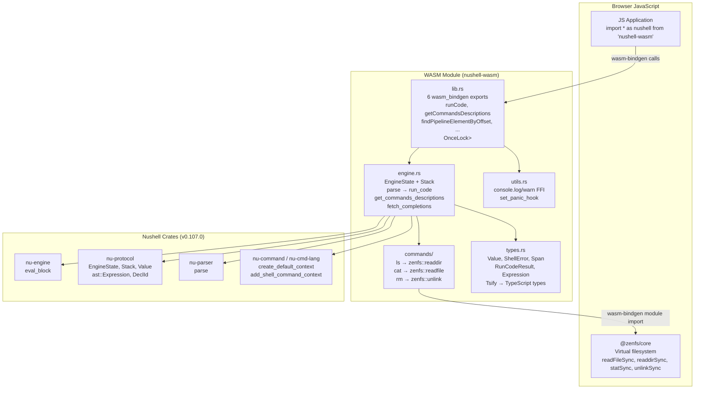

# nu-on-web — Overview

**Source:** `src/` — 10 Rust files, ~400 LOC. WASM-compiled Nushell with ZenFS filesystem bridge for browser execution.

`nu-on-web` (package name `nushell-wasm`) runs Nushell inside the browser by compiling to WASM32. It provides 6 JavaScript-callable functions via `wasm-bindgen`, wrapping the Nushell engine with a persistent state, and bridges 3 custom commands (`ls`, `cat`, `rm`) to the browser's ZenFS virtual filesystem. TypeScript types are generated via `tsify` for seamless JS integration.

## Architecture



## Public WASM API — 6 Functions

```rust
// lib.rs:29-67
#[wasm_bindgen(js_name = "runCode")]
pub fn run_code(code: &str) -> RunCodeResult

#[wasm_bindgen(js_name = "getCommandsDescriptions")]
pub fn get_commands_descriptions(code: &str) -> Vec<GetCommandDescriptionResult>

#[wasm_bindgen(js_name = "findPipelineElementByOffset")]
pub fn find_pipeline_element_by_offset(code: &str, offset: usize) -> Option<Expression>

#[wasm_bindgen(js_name = "getDeclarationNameFromId")]
pub fn get_declaration_name_from_id(decl_id: usize) -> String

#[wasm_bindgen(js_name = "getNextSpanStart")]
pub fn get_next_span_start() -> Result<usize, Error>

#[wasm_bindgen(js_name = "fetchCompletions")]
pub fn fetch_completions(code: &str, pos: usize) -> FetchCompletionResult
```

## WASM Initialization

```rust
// lib.rs:24-27
#[wasm_bindgen(start)]
pub fn init() {
    set_panic_hook();  // console_error_panic_hook for better WASM error messages
}
```

**Aha:** The `#[wasm_bindgen(start)]` attribute means this function runs automatically when the WASM module loads — no explicit JavaScript initialization call needed. The engine itself is lazy-initialized via `OnceLock<Mutex<Engine>>`, so the first `run_code` call triggers the Nushell context creation.

## Engine Singleton Pattern

```rust
// lib.rs:18-22
static ENGINE: OnceLock<Mutex<Engine>> = OnceLock::new();

fn get_engine() -> &'static Mutex<Engine> {
    ENGINE.get_or_init(|| Mutex::new(Engine::new()))
}
```

**Aha:** Single global engine with `Mutex` — all 6 exported functions share the same `EngineState` and `Stack`, meaning variables persist across `run_code` calls. Running `let x = 5` then `$x` in a subsequent call will return `5`. This is intentional — it creates a persistent REPL session in the browser.

## Dependencies

| Dependency | Version | Purpose |
|------------|---------|---------|
| `wasm-bindgen` | 0.2.104 | Rust ↔ JavaScript FFI |
| `nu-protocol` | 0.107.0 | Nushell types (Value, EngineState, Stack, ast) |
| `nu-engine` | 0.107.0 | `eval_block` — execute parsed Nushell blocks |
| `nu-parser` | 0.107.0 | Parse Nushell source code into AST |
| `nu-command` | 0.107.0 | Built-in Nushell commands |
| `nu-cmd-lang` | 0.107.0 | Language constructs (if, for, etc.) |
| `nu-cmd-extra` | 0.107.0 | Extra commands |
| `tsify` | 0.5.5 | Generate TypeScript types from Rust enums/structs |
| `js-sys` | 0.3.81 | JS built-in types (Error, Object, Reflect) |
| `console_error_panic_hook` | 0.1.7 | Better panic messages in browser console |

The WASM release profile uses `opt-level = "s"` (optimize for size), not the default `opt-level = "z"`.

## Build Configuration

```toml
[lib]
crate-type = ["cdylib", "rlib"]  # cdylib for WASM, rlib for testing

[profile.release]
opt-level = "s"  # optimize for code size
```

## Key Design Constraints

The project only converts a subset of Nushell `Value` types for the JS boundary:

- `Bool`, `Int`, `Float`, `String`, `Nothing`, `Error` — converted directly
- `Html` — used for rich display of complex types (lists, records)
- All other types (List, Record, Binary, Date, etc.) — converted to HTML via `to html --dark --partial`

This is a deliberate simplification — instead of serializing every Nushell value to a flat JS representation, complex values are rendered as HTML for display in the browser.

```mermaid
flowchart TD
    INPUT["Nushell code string\n'ls | where type == file'"]
    PARSE["parse → Arc<Block>\nAST + IR generated"]
    CHECK{"Parse/compile errors?"}
    EVAL["eval_block → Value\nNushell pipeline execution"]
    CONVERT{"Can convert to JS value?\nBool/Int/Float/String/Nothing/Error"}
    JS_VALUE["Value::Bool / Int / Float / String / Nothing"]
    HTML["to html --dark --partial\nRender as HTML for display"]
    WRAP["RunCodeResult::Success\nIndexedValue { n, value }"]
    ERR_PARSE["RunCodeResult::ParseErrors"]
    ERR_COMPILE["RunCodeResult::CompileErrors"]
    ERR_EXEC["RunCodeResult::Error\nShellError"]

    INPUT --> PARSE
    PARSE --> CHECK
    CHECK -->|yes| ERR_PARSE
    CHECK -->|compile errors| ERR_COMPILE
    CHECK -->|no| EVAL
    EVAL -->|runtime error| ERR_EXEC
    EVAL -->|success| CONVERT
    CONVERT -->|yes| JS_VALUE
    CONVERT -->|no (List, Record, etc.)| HTML
    JS_VALUE --> WRAP
    HTML --> WRAP
```

## TypeScript Type Generation

Every public type uses `#[derive(Tsify)]` with `#[tsify(into_wasm_abi)]`, meaning the Rust types are automatically serializable to their TypeScript equivalents when crossing the WASM boundary:

```rust
#[derive(Serialize, Debug, Tsify)]
#[tsify(into_wasm_abi)]
#[serde(rename_all = "camelCase")]
pub struct FetchCompletionResult {
    pub span: Option<Span>,
    pub completions: Vec<String>,
}
```

This generates a TypeScript interface:
```typescript
interface FetchCompletionResult {
    span?: Span;
    completions: string[];
}
```
